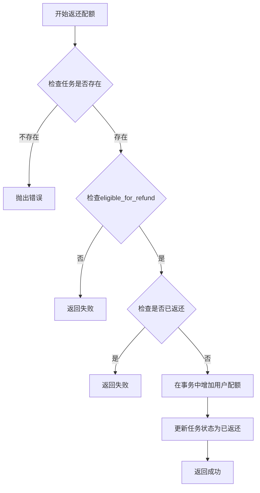
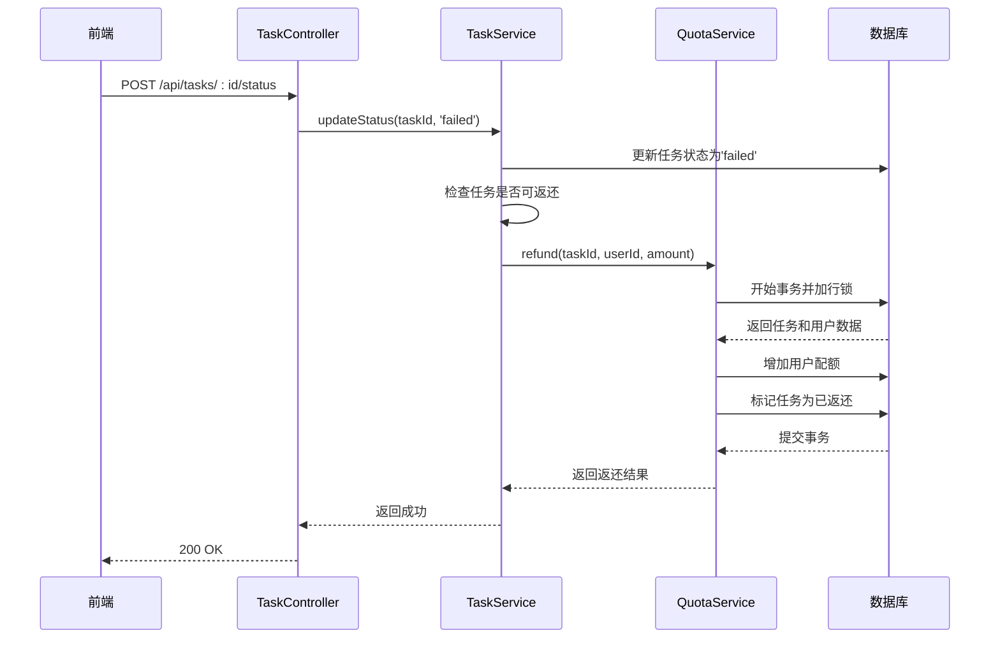
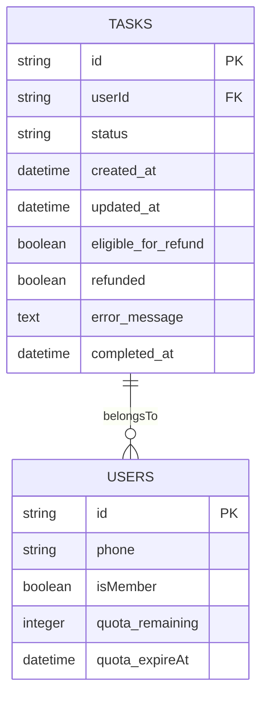
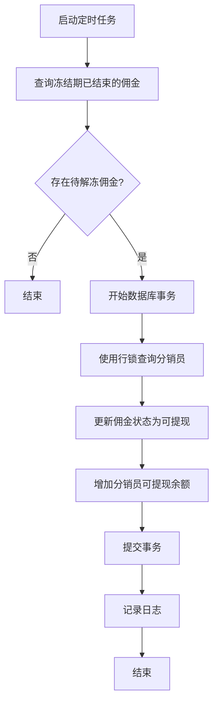

# 配额返还逻辑增强

<cite>
**本文档引用文件**  
- [quota.service.js](file://backend/src/services/quota.service.js)
- [task.service.js](file://backend/src/services/task.service.js)
- [task.controller.js](file://backend/src/controllers/task.controller.js)
- [20251029000004_extend_tasks_table.js](file://backend/src/db/migrations/20251029000004_extend_tasks_table.js)
- [commission.service.js](file://backend/src/services/commission.service.js)
- [unfreeze-commissions.js](file://backend/cron/unfreeze-commissions.js)
- [distribution.controller.js](file://backend/src/controllers/distribution.controller.js)
</cite>

## 目录
1. [引言](#引言)
2. [配额返还机制](#配额返还机制)
3. [任务状态与配额管理](#任务状态与配额管理)
4. [数据库结构变更](#数据库结构变更)
5. [佣金冻结与解冻机制](#佣金冻结与解冻机制)
6. [并发安全与事务控制](#并发安全与事务控制)
7. [错误处理与日志记录](#错误处理与日志记录)
8. [API接口设计](#api接口设计)
9. [总结](#总结)

## 引言

本项目中的配额系统是核心计费机制的重要组成部分。用户通过购买会员获得一定数量的配额，用于执行AI处理任务。当任务执行失败时，系统需要安全、可靠地返还已扣除的配额，确保用户体验和财务准确性。本文档详细分析了配额返还逻辑的实现机制，包括其与任务状态的关联、数据库设计、并发控制以及与其他系统（如分销佣金）的集成。

## 配额返还机制

配额返还是一个关键的安全性操作，必须在事务中执行，并使用行级锁来防止并发问题。返还逻辑的核心是`quota.service.js`中的`refund`方法。

**Diagram sources**  
- [quota.service.js](file://backend/src/services/quota.service.js#L55-L100)

**Section sources**  
- [quota.service.js](file://backend/src/services/quota.service.js#L55-L100)

## 任务状态与配额管理

任务的生命周期与配额管理紧密相关。任务创建时预扣配额，任务成功完成则不返还，任务失败则触发配额返还。`task.service.js`中的`updateStatus`方法是这一流程的核心。

**Diagram sources**  
- [task.service.js](file://backend/src/services/task.service.js#L300-L350)
- [task.controller.js](file://backend/src/controllers/task.controller.js#L200-L250)

**Section sources**  
- [task.service.js](file://backend/src/services/task.service.js#L300-L350)
- [task.controller.js](file://backend/src/controllers/task.controller.js#L200-L250)

## 数据库结构变更

为了支持更复杂的配额返还逻辑，`tasks`表被扩展了两个关键字段：`eligible_for_refund`和`refunded`。这些字段在迁移脚本`20251029000004_extend_tasks_table.js`中定义。

**Diagram sources**  
- [20251029000004_extend_tasks_table.js](file://backend/src/db/migrations/20251029000004_extend_tasks_table.js#L1-L45)

**Section sources**  
- [20251029000004_extend_tasks_table.js](file://backend/src/db/migrations/20251029000004_extend_tasks_table.js#L1-L45)

## 佣金冻结与解冻机制

除了配额返还，系统还实现了分销佣金的冻结与解冻机制。当用户首次购买时，其推荐人获得的佣金会被冻结一段时间（默认7天），之后由定时任务`unfreeze-commissions.js`解冻。

**Diagram sources**  
- [commission.service.js](file://backend/src/services/commission.service.js#L100-L150)
- [unfreeze-commissions.js](file://backend/cron/unfreeze-commissions.js#L1-L47)

**Section sources**  
- [commission.service.js](file://backend/src/services/commission.service.js#L100-L150)
- [unfreeze-commissions.js](file://backend/cron/unfreeze-commissions.js#L1-L47)

## 并发安全与事务控制

整个配额系统的设计都强调并发安全。无论是扣减还是返还配额，都使用了数据库事务和行级锁（`forUpdate()`）来保证操作的原子性和一致性。`quota.service.test.js`中的测试用例验证了在高并发场景下，配额操作的正确性。

**Section sources**  
- [quota.service.js](file://backend/src/services/quota.service.js#L1-L152)
- [quota.service.test.js](file://backend/tests/unit/quota.service.test.js#L168-L206)

## 错误处理与日志记录

系统在关键操作中都包含了详细的错误处理和日志记录。例如，在`quota.service.js`中，当用户不存在或配额不足时，会抛出带有明确错误码和消息的异常。所有关键操作，如配额扣减、返还、佣金计算等，都会记录INFO级别的日志，便于问题追踪和审计。

**Section sources**  
- [quota.service.js](file://backend/src/services/quota.service.js#L1-L152)
- [commission.service.js](file://backend/src/services/commission.service.js#L1-L191)

## API接口设计

配额和分销相关的API接口设计清晰，遵循RESTful原则。用户端通过`/api/distribution`前缀的接口管理分销和提现，管理员通过`/api/admin/distribution`前缀的接口进行审核和配置。

**Table of API Endpoints**

| 接口 | 方法 | 描述 | 认证 |
| :--- | :--- | :--- | :--- |
| `/api/distribution/apply` | POST | 申请成为分销员 | 是 |
| `/api/distribution/withdraw` | POST | 申请提现 | 是 |
| `/api/distribution/withdrawals` | GET | 获取提现记录 | 是 |
| `/api/admin/withdrawals` | GET | 获取所有提现申请 | 管理员 |
| `/api/admin/withdrawals/:id/approve` | PATCH | 审核通过提现 | 管理员 |
| `/api/admin/withdrawals/:id/reject` | PATCH | 拒绝提现申请 | 管理员 |
| `/api/admin/distribution/settings` | PUT | 更新分销设置 | 管理员 |

**Section sources**  
- [distribution.controller.js](file://backend/src/controllers/distribution.controller.js#L1-L220)
- [admin.controller.js](file://backend/src/controllers/admin.controller.js#L1-L1260)

## 总结

配额返还逻辑是系统稳定性和用户信任的基石。通过引入`eligible_for_refund`和`refunded`字段，结合数据库事务和行级锁，系统实现了安全、可靠的配额返还机制。同时，佣金的冻结与解冻机制也确保了分销系统的财务安全。这些设计共同构成了一个健壮、可审计的计费与结算体系。