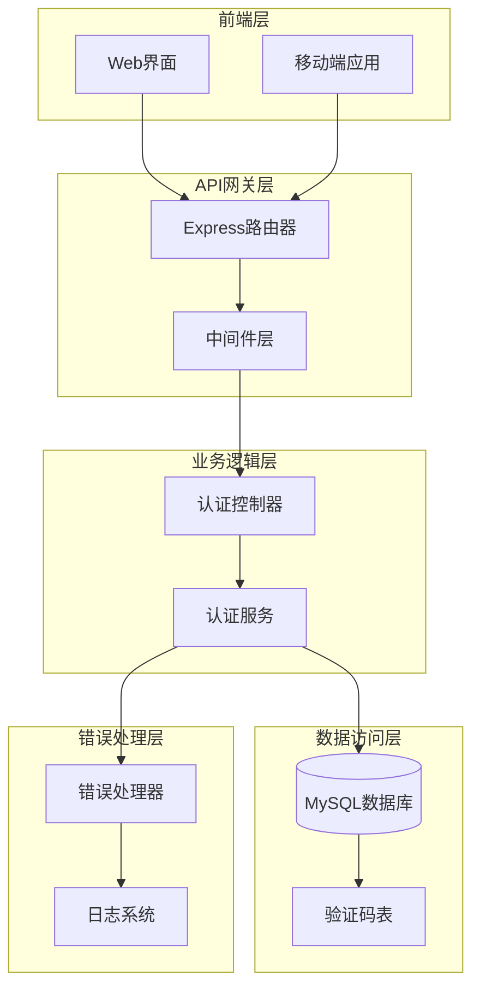
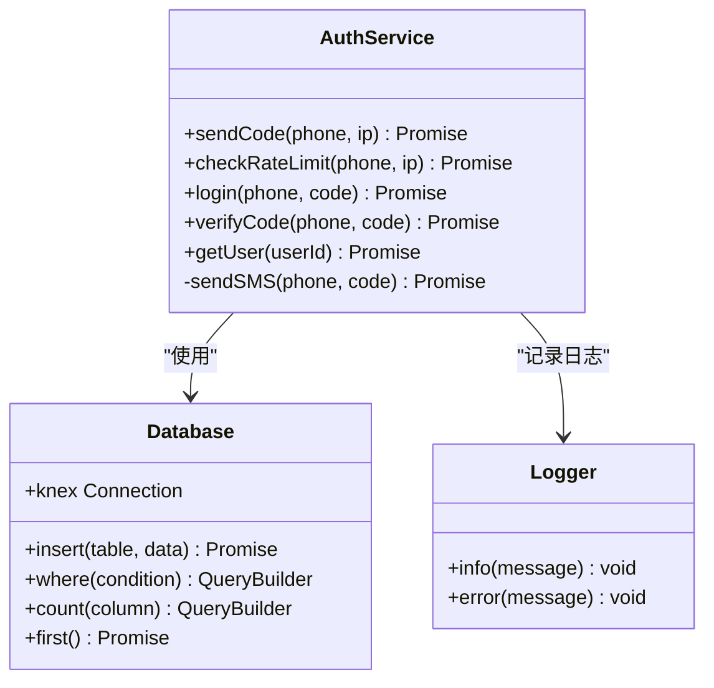
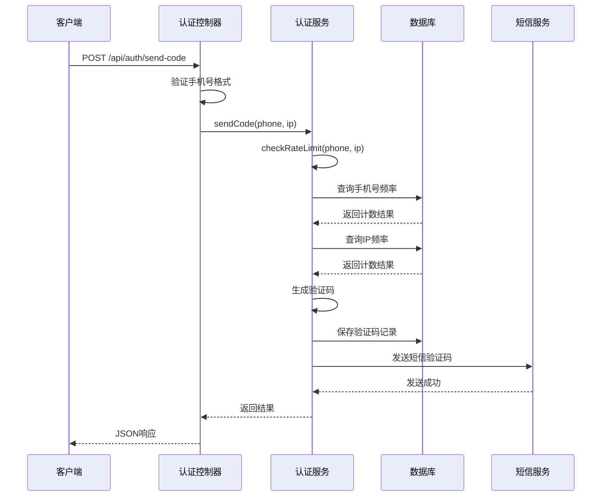
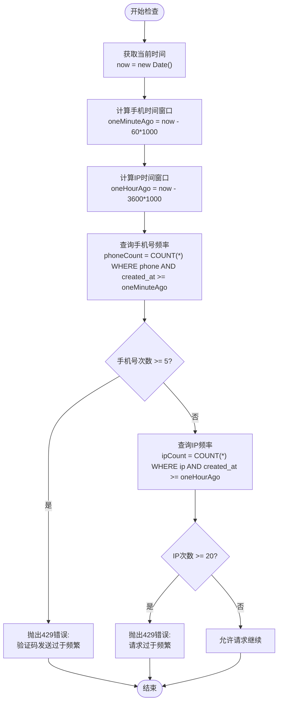
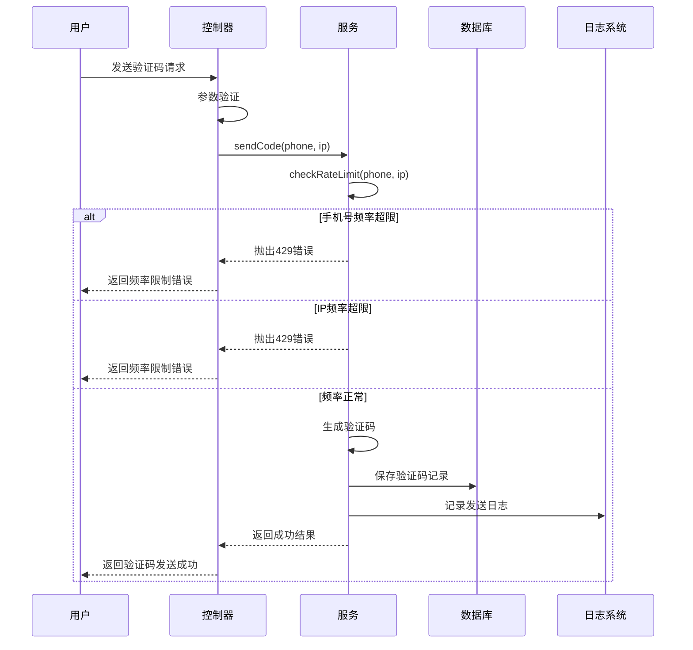
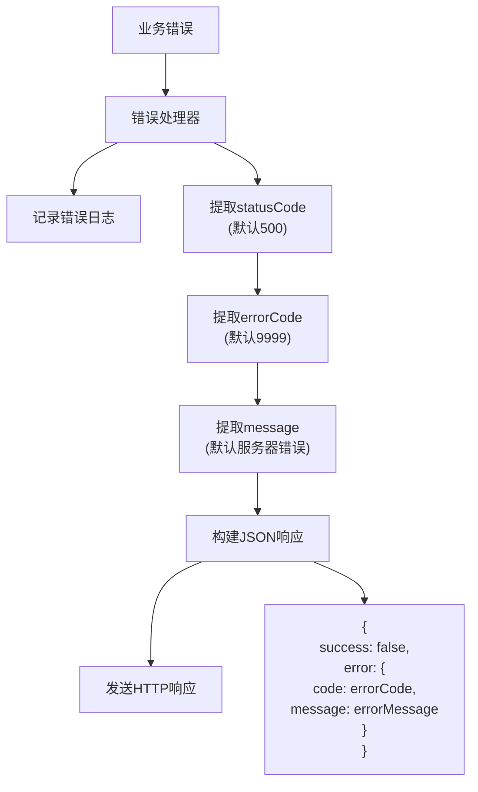
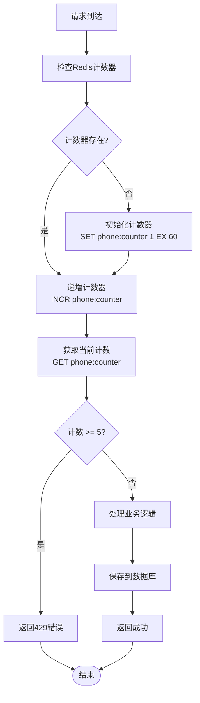

# 防刷限流策略

<cite>
**本文档中引用的文件**
- [auth.service.js](file://backend/src/services/auth.service.js)
- [auth.controller.js](file://backend/src/controllers/auth.controller.js)
- [auth.routes.js](file://backend/src/routes/auth.routes.js)
- [errorHandler.middleware.js](file://backend/src/middlewares/errorHandler.middleware.js)
- [20251028000004_create_verification_codes_table.js](file://backend/src/db/migrations/20251028000004_create_verification_codes_table.js)
- [database.js](file://backend/src/config/database.js)
- [knexfile.js](file://backend/knexfile.js)
</cite>

## 目录
1. [概述](#概述)
2. [系统架构](#系统架构)
3. [核心组件分析](#核心组件分析)
4. [防刷机制详解](#防刷机制详解)
5. [数据库设计](#数据库设计)
6. [错误处理机制](#错误处理机制)
7. [性能考虑](#性能考虑)
8. [监控与扩展建议](#监控与扩展建议)
9. [总结](#总结)

## 概述

本文档详细描述了一个基于IP和手机号的双重防刷限流机制的实现。该系统通过限制同一手机号在1分钟内最多发送5次验证码，以及同一IP地址在1小时内最多发送20次请求，有效防止恶意刷取行为，保护系统资源不被滥用。

该防刷机制的核心特点包括：
- **双重维度限制**：同时基于手机号和IP地址进行频率控制
- **时间窗口计算**：精确的时间范围查询（1分钟和1小时）
- **数据库驱动的计数**：通过查询verification_codes表的历史记录进行频率控制
- **HTTP 429状态码**：当超过阈值时返回适当的错误响应
- **完善的错误处理**：统一的错误响应格式和日志记录

## 系统架构



**图表来源**
- [auth.routes.js](file://backend/src/routes/auth.routes.js#L1-L28)
- [auth.controller.js](file://backend/src/controllers/auth.controller.js#L1-L100)
- [auth.service.js](file://backend/src/services/auth.service.js#L1-L220)

## 核心组件分析

### 认证服务 (AuthService)

认证服务是防刷机制的核心实现，包含以下关键功能：

#### 主要职责
- 验证码发送控制
- 用户登录/注册处理  
- 验证码有效性校验
- 用户信息管理

#### 核心方法关系图



**图表来源**
- [auth.service.js](file://backend/src/services/auth.service.js#L8-L220)

**章节来源**
- [auth.service.js](file://backend/src/services/auth.service.js#L1-L220)

### 认证控制器 (AuthController)

控制器负责接收HTTP请求并调用相应的服务方法：

#### 请求处理流程



**图表来源**
- [auth.controller.js](file://backend/src/controllers/auth.controller.js#L8-L40)
- [auth.service.js](file://backend/src/services/auth.service.js#L12-L40)

**章节来源**
- [auth.controller.js](file://backend/src/controllers/auth.controller.js#L1-L100)

## 防刷机制详解

### checkRateLimit方法实现

防刷机制的核心实现在`AuthService.checkRateLimit`方法中，该方法执行双重频率检查：

#### 时间窗口计算



**图表来源**
- [auth.service.js](file://backend/src/services/auth.service.js#L42-L70)

#### 关键实现细节

1. **时间窗口定义**：
   - 手机号限制：1分钟内最多5次（`oneMinuteAgo = now - 60 * 1000`）
   - IP地址限制：1小时内最多20次（`oneHourAgo = now - 3600 * 1000`）

2. **数据库查询策略**：
   - 使用`COUNT(*)`进行高效计数
   - 通过`WHERE`条件精确限定时间范围
   - 返回单条记录的`count`字段

3. **错误响应结构**：
   ```javascript
   {
     statusCode: 429,
     errorCode: 2004/2005,
     message: "错误提示信息"
   }
   ```

**章节来源**
- [auth.service.js](file://backend/src/services/auth.service.js#L42-L70)

### 验证码发送流程

验证码发送过程中的防刷检查：



**图表来源**
- [auth.service.js](file://backend/src/services/auth.service.js#L12-L40)
- [auth.controller.js](file://backend/src/controllers/auth.controller.js#L8-L40)

## 数据库设计

### 验证码表结构

verification_codes表的设计支持高效的频率控制查询：

| 字段名 | 类型 | 约束 | 说明 |
|--------|------|------|------|
| id | int | PRIMARY KEY, AUTO_INCREMENT | 自增主键 |
| phone | varchar(11) | NOT NULL | 手机号 |
| code | varchar(6) | NOT NULL | 验证码 |
| ip | varchar(45) | NULLABLE | 请求IP地址 |
| expireAt | datetime | NOT NULL | 验证码过期时间 |
| used | boolean | DEFAULT false | 是否已使用 |
| created_at | datetime | NOT NULL | 创建时间 |
| updated_at | datetime | NOT NULL | 更新时间 |

### 索引设计

为了支持高效的频率控制查询，表上建立了以下索引：

1. **phone索引**：支持按手机号查询
2. **phone_created_at组合索引**：支持手机号+时间范围查询
3. **ip索引**：支持按IP地址查询

**章节来源**
- [20251028000004_create_verification_codes_table.js](file://backend/src/db/migrations/20251028000004_create_verification_codes_table.js#L1-L27)

## 错误处理机制

### 统一错误响应格式

系统采用统一的错误处理机制，确保错误信息的一致性和可读性：



**图表来源**
- [errorHandler.middleware.js](file://backend/src/middlewares/errorHandler.middleware.js#L5-L25)

### 错误类型分类

| 错误类型 | HTTP状态码 | 错误代码 | 描述 |
|----------|------------|----------|------|
| 频率限制 | 429 | 2004 | 手机号验证码发送过于频繁 |
| 频率限制 | 429 | 2005 | IP请求过于频繁 |
| 参数错误 | 400 | 2000 | 手机号格式错误 |
| 参数错误 | 400 | 2002 | 验证码格式错误 |
| 验证失败 | 400 | 2001 | 验证码错误或已过期 |

**章节来源**
- [errorHandler.middleware.js](file://backend/src/middlewares/errorHandler.middleware.js#L1-L46)

## 性能考虑

### 数据库连接池配置

系统使用Knex.js作为ORM，配置了合理的数据库连接池：

```javascript
// 开发环境配置
pool: {
  min: 2,
  max: 10
}

// 生产环境配置  
pool: {
  min: 5,
  max: 20
}
```

### 查询优化策略

1. **索引利用**：通过组合索引优化查询性能
2. **时间范围限定**：精确的时间范围减少扫描数据量
3. **计数查询**：使用`COUNT(*)`而非`SELECT *`提高效率

### 并发处理能力

- **数据库连接池**：支持多并发查询
- **无锁设计**：查询操作不会阻塞其他操作
- **快速失败**：超限时立即返回错误

## 监控与扩展建议

### 当前系统的局限性

1. **单机限制**：基于数据库的计数无法跨服务器共享
2. **内存占用**：大量查询可能增加数据库负载
3. **扩展性限制**：难以支持更大规模的并发请求

### 可扩展的限流方案

#### Redis计数器方案



#### 实现建议

1. **Redis计数器**：
   - 使用`SET key value EX seconds`设置过期时间
   - 使用`INCR`原子操作递增计数
   - 使用`EXISTS`检查计数器是否存在

2. **混合策略**：
   - 内存计数器用于高频检查
   - 数据库存储用于持久化和审计
   - 双重验证确保可靠性

3. **监控指标**：
   - 请求频率统计
   - 错误率监控
   - Redis命中率
   - 数据库查询延迟

### 异常请求模式检测

建议实施以下监控机制：

1. **异常频率检测**：
   - 监控手机号/IP的异常增长
   - 检测短时间内大量请求

2. **行为模式分析**：
   - 分析请求的时间分布
   - 检测异常的请求模式

3. **自动告警机制**：
   - 设置阈值告警
   - 自动触发防护措施

## 总结

该防刷限流策略通过以下关键特性实现了有效的防护：

### 核心优势

1. **双重维度保护**：同时限制手机号和IP地址的请求频率
2. **精确的时间控制**：1分钟和1小时的时间窗口设置合理
3. **数据库驱动的可靠性**：基于真实的历史记录进行频率控制
4. **标准化的错误处理**：统一的429状态码和错误信息格式
5. **完善的日志记录**：详细的操作日志便于问题排查

### 技术亮点

- **时间窗口计算**：精确的时间范围查询算法
- **数据库索引优化**：合理的索引设计支持高效查询
- **错误处理机制**：统一的错误响应格式和日志记录
- **并发安全设计**：无锁查询设计支持高并发

### 改进建议

虽然当前实现已经非常完善，但在大规模应用场景下可以考虑：
- 引入Redis缓存提升查询性能
- 实施更智能的异常检测机制
- 建立更完善的监控和告警体系
- 考虑分布式限流解决方案

该防刷机制为系统提供了坚实的安全保障，有效防止了恶意刷取行为，同时保持了良好的用户体验。