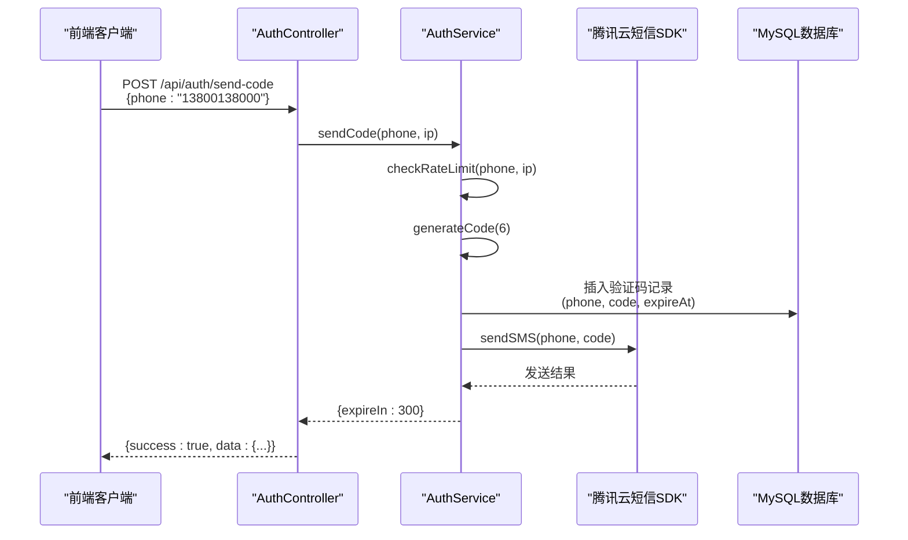

# 技术栈与依赖

<cite>
**本文档引用的文件**  
- [backend/package.json](file://backend/package.json)
- [frontend/package.json](file://frontend/package.json)
- [backend/knexfile.js](file://backend/knexfile.js)
- [backend/ecosystem.config.js](file://backend/ecosystem.config.js)
- [backend/src/config/database.js](file://backend/src/config/database.js)
- [backend/src/config/cos.js](file://backend/src/config/cos.js)
- [backend/src/app.js](file://backend/src/app.js)
- [backend/src/utils/logger.js](file://backend/src/utils/logger.js)
- [backend/src/services/auth.service.js](file://backend/src/services/auth.service.js)
- [backend/src/controllers/auth.controller.js](file://backend/src/controllers/auth.controller.js)
- [backend/src/middlewares/auth.middleware.js](file://backend/src/middlewares/auth.middleware.js)
- [frontend/src/store/authStore.ts](file://frontend/src/store/authStore.ts)
- [frontend/src/lib/api.ts](file://frontend/src/lib/api.ts)
- [frontend/next.config.js](file://frontend/next.config.js)
- [frontend/tsconfig.json](file://frontend/tsconfig.json)
</cite>

## 目录

1. [引言](#引言)
2. [后端技术栈](#后端技术栈)
3. [前端技术栈](#前端技术栈)
4. [生产环境进程管理](#生产环境进程管理)
5. [版本兼容性分析](#版本兼容性分析)
6. [关键依赖交互机制](#关键依赖交互机制)
7. [总结](#总结)

## 引言

本项目为一个面向服装行业的AI图像处理SaaS平台，采用前后端分离架构。后端基于Node.js生态系统构建，前端采用现代React技术栈。系统设计注重安全性、可扩展性和可维护性，通过合理的技术选型实现了高并发处理能力、稳定的身份认证机制和高效的媒体资源管理。本文档详细阐述项目所使用的技术栈及其选型理由，涵盖后端框架、数据库、任务队列、身份验证、日志系统、缓存机制以及腾讯云服务集成等核心组件。

## 后端技术栈

### Express框架
作为Node.js最流行的Web应用框架，Express提供了轻量级、高性能的HTTP服务器基础。其模块化中间件架构允许灵活集成安全、日志、CORS等功能。项目中通过`app.js`文件配置了helmet安全头、CORS跨域策略、请求解析和全局错误处理，构建了健壮的API服务入口。

### Knex.js ORM与MySQL数据库
Knex.js作为SQL查询构建器，提供了数据库迁移、连接池管理和链式查询API，有效提升了数据库操作的可维护性。结合MySQL 2驱动，实现了对关系型数据的高效访问。项目通过`knexfile.js`配置了开发与生产环境的数据库连接参数，并利用Knex的迁移功能管理用户、订单、任务等表结构的演进。

### Bull任务队列
Bull基于Redis实现的高性能任务队列，用于异步处理耗时的AI模型推理任务。通过将任务创建与执行解耦，系统能够快速响应用户请求并保证后台任务的可靠执行。任务状态通过数据库持久化，支持失败重试和进度查询。

### JWT身份验证
采用JSON Web Token（JWT）实现无状态认证机制。用户登录后服务端签发包含用户ID和手机号的JWT令牌，客户端在后续请求中通过Authorization头携带该令牌。`auth.middleware.js`中间件负责验证令牌有效性，并将用户信息注入请求上下文，确保接口访问的安全性。

### Winston日志系统
Winston作为多传输日志库，支持文件滚动、错误级别过滤和结构化日志输出。项目配置了error和combined两个日志文件，分别记录错误信息和所有请求日志。同时在非生产环境启用控制台彩色输出，便于开发调试。Morgan中间件与Winston集成，实现了HTTP访问日志的自动记录。

### Redis缓存
通过ioredis客户端集成Redis，主要用于Bull任务队列的底层存储和潜在的会话缓存扩展。Redis的高性能读写能力保障了任务队列的低延迟处理，同时也为未来实现API响应缓存、限流计数器等场景提供了基础设施支持。

### 腾讯云SDK集成
#### COS对象存储
`cos-nodejs-sdk-v5`用于管理用户上传的原始图片和AI处理后的结果图像。通过`config/cos.js`封装了COS客户端实例和存储桶配置，实现了文件的上传、下载和URL生成功能，确保媒体资源的安全存储和高效分发。

#### 短信服务
`tencentcloud-sdk-nodejs`中的短信服务模块用于发送登录验证码。`auth.service.js`中的`sendSMS`方法调用腾讯云API向用户手机发送六位数字验证码，配合数据库中的验证码记录表实现安全的手机号认证流程。

#### 微信支付API v3
`wechatpay-node-v3`库集成微信支付功能，支持会员订阅服务的在线支付。通过安全的API签名机制和回调通知处理，确保支付交易的完整性和可靠性，为平台商业化提供支付能力支撑。

**Section sources**
- [backend/package.json](file://backend/package.json)
- [backend/knexfile.js](file://backend/knexfile.js)
- [backend/src/config/database.js](file://backend/src/config/database.js)
- [backend/src/config/cos.js](file://backend/src/config/cos.js)
- [backend/src/app.js](file://backend/src/app.js)
- [backend/src/utils/logger.js](file://backend/src/utils/logger.js)
- [backend/src/services/auth.service.js](file://backend/src/services/auth.service.js)
- [backend/src/controllers/auth.controller.js](file://backend/src/controllers/auth.controller.js)
- [backend/src/middlewares/auth.middleware.js](file://backend/src/middlewares/auth.middleware.js)

## 前端技术栈

### Next.js App Router
采用Next.js 14的App Router架构，基于React Server Components实现服务端渲染和静态生成。通过`app`目录下的文件系统路由，实现了登录、会员、任务等页面的高效导航和数据预加载。`next.config.js`配置了API代理和图片域名白名单，确保前后端通信和资源加载的顺畅。

### React 18
基于React 18的并发特性构建用户界面，利用Suspense和Transitions优化用户体验。函数式组件结合Hooks实现状态逻辑的复用和管理，确保UI的响应性和可测试性。严格的TypeScript类型检查提升了代码质量和开发效率。

### TypeScript
全栈采用TypeScript进行类型定义，从前端`types/index.ts`到后端服务接口，建立了统一的类型契约。通过`tsconfig.json`配置了ES2017目标和模块解析规则，确保类型安全的同时兼容现代JavaScript特性。

### Ant Design组件库
Ant Design提供了一套高质量的React UI组件，包括表单、表格、模态框、上传组件等。项目中`ImageUploader.tsx`等自定义组件基于Ant Design的Upload组件封装，实现了拖拽上传、预览和进度显示功能，提升了开发效率和用户体验一致性。

### Zustand状态管理
采用Zustand作为轻量级状态管理方案，替代传统的Redux。`authStore.ts`中定义了用户认证状态的store，通过`persist`中间件实现localStorage持久化。相比Redux，Zustand具有更简洁的API和更小的包体积，适合本项目的状态管理需求。

### 其他前端依赖
- `@tanstack/react-query`：用于管理服务器状态，实现数据获取、缓存和同步
- `cos-js-sdk-v5`：前端直传COS的JavaScript SDK，减少服务器中转压力
- `dayjs`：轻量级日期处理库，用于格式化任务创建时间等时间戳

**Section sources**
- [frontend/package.json](file://frontend/package.json)
- [frontend/next.config.js](file://frontend/next.config.js)
- [frontend/tsconfig.json](file://frontend/tsconfig.json)
- [frontend/src/store/authStore.ts](file://frontend/src/store/authStore.ts)
- [frontend/src/lib/api.ts](file://frontend/src/lib/api.ts)

## 生产环境进程管理

### PM2配置
通过`ecosystem.config.js`配置PM2进程管理器，实现生产环境下的高可用部署。配置包括：
- **集群模式**：`exec_mode: 'cluster'`启用多进程工作模式，充分利用多核CPU资源
- **实例数量**：`instances: 2`运行两个应用实例，提升并发处理能力
- **自动重启**：`autorestart: true`确保进程崩溃后自动恢复
- **内存监控**：`max_memory_restart: '500M'`防止内存泄漏导致的服务不可用
- **日志管理**：集中输出错误和正常日志到指定文件，便于问题排查

该配置确保了API服务在生产环境中的稳定运行和故障自愈能力。

**Section sources**
- [backend/ecosystem.config.js](file://backend/ecosystem.config.js)

## 版本兼容性分析

### Node.js与NPM
后端`package.json`中通过`engines`字段明确要求Node.js >=18.0.0和NPM >=9.0.0，确保使用现代JavaScript特性和安全的包管理功能。Express 4.18.2、Knex 3.0.1等依赖均与Node.js 18+版本完全兼容。

### 前端框架版本
Next.js 14.0.4与React 18.2.0深度集成，充分利用Server Components和Streaming等新特性。TypeScript ^5版本提供最新的类型系统功能，与React 18的类型定义完美匹配。

### 数据库驱动兼容性
Knex 3.0.1与mysql2 ^3.6.5驱动协同工作，支持MySQL 5.7+的所有特性。数据库连接池配置在开发和生产环境分别设置合理的最小和最大连接数，避免资源浪费和连接耗尽。

### SDK版本稳定性
腾讯云相关SDK均采用最新稳定版本：
- `cos-nodejs-sdk-v5` ^2.12.4：支持COS所有API功能
- `tencentcloud-sdk-nodejs` ^4.0.674：包含最新的短信服务API
- `wechatpay-node-v3` ^3.2.3：符合微信支付最新安全规范

这些版本选择确保了系统在功能、性能和安全性方面的最佳平衡。

**Section sources**
- [backend/package.json](file://backend/package.json)
- [frontend/package.json](file://frontend/package.json)
- [backend/knexfile.js](file://backend/knexfile.js)

## 关键依赖交互机制

### AuthService与腾讯云短信SDK的交互流程

**Diagram sources**
- [backend/src/services/auth.service.js](file://backend/src/services/auth.service.js)
- [backend/src/controllers/auth.controller.js](file://backend/src/controllers/auth.controller.js)

#### 交互步骤详解：
1. **请求接收**：前端通过`api.auth.sendCode()`调用API，`AuthController`接收请求并验证手机号格式
2. **防刷检查**：`AuthService`执行`checkRateLimit`方法，查询数据库中该手机号和IP的近期请求频率
3. **验证码生成**：调用`generator.js`生成6位随机数字验证码，并计算5分钟后过期时间
4. **持久化存储**：将手机号、验证码哈希、过期时间等信息写入`verification_codes`表
5. **短信发送**：调用`tencentcloud-sdk-nodejs`的短信服务API，向用户手机发送验证码
6. **响应返回**：向前端返回成功响应，包含验证码有效期信息

该流程通过数据库记录实现发送频率控制，利用腾讯云高到达率的短信通道确保用户及时收到验证码，形成了安全可靠的认证闭环。

## 总结

本项目的技术栈选型体现了现代Web应用开发的最佳实践。后端采用Express + Knex + MySQL的稳定组合，结合Bull任务队列处理异步任务，通过JWT实现安全认证，Winston保障日志可追溯性，并深度集成腾讯云COS、短信和支付服务。前端基于Next.js App Router构建SSR应用，使用TypeScript和Zustand提升开发体验与代码质量。PM2的集群模式部署确保了生产环境的高可用性。各组件版本经过精心选择，保证了系统的稳定性、安全性和可维护性，为AI图像处理SaaS平台的长期发展奠定了坚实的技术基础。