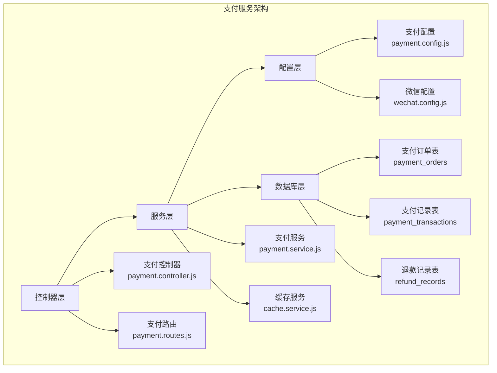
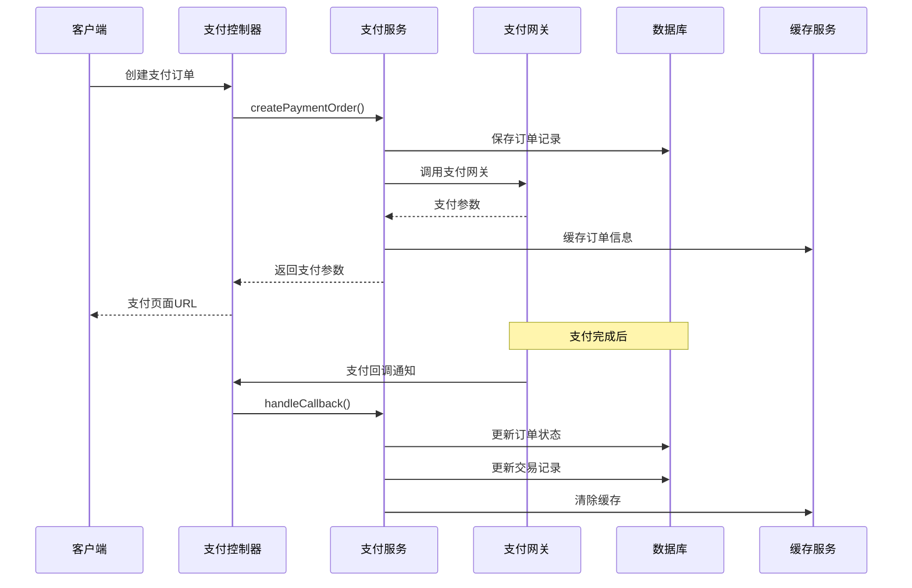
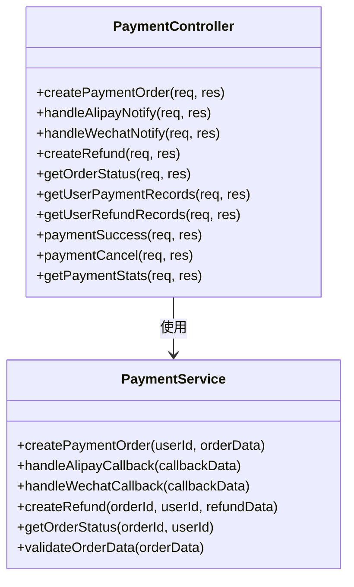
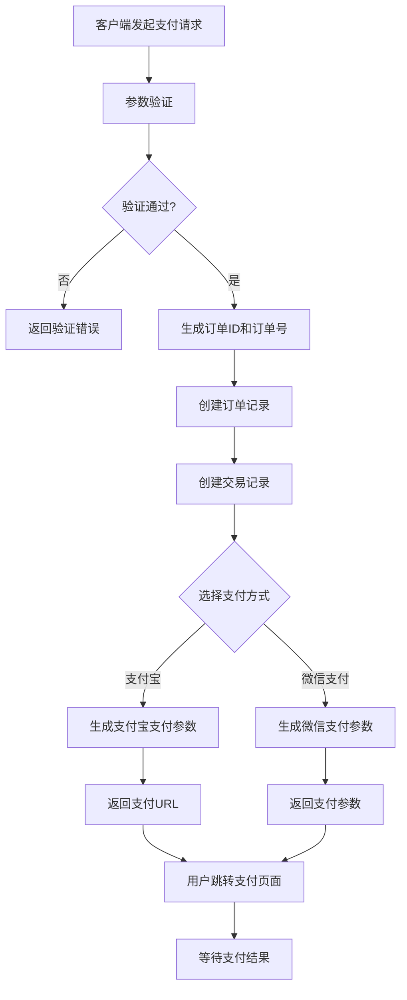
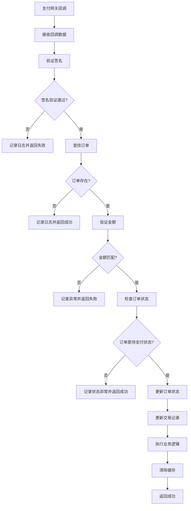
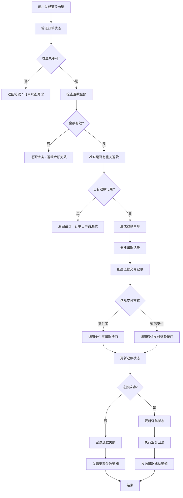

# 支付服务

<cite>
**本文档引用的文件**
- [payment.controller.js](file://backend/src/controllers/payment.controller.js)
- [payment.routes.js](file://backend/src/routes/payment.routes.js)
- [payment.service.js](file://backend/src/services/payment.service.js)
- [payment.service.ts](file://backend/src/services/payment.service.ts)
- [payment.config.js](file://backend/src/config/payment.config.js)
- [wechat.config.js](file://backend/src/config/wechat.config.js)
- [create_payment_tables.js](file://backend/src/db/migrations/20250104000001_create_payment_tables.js)
- [errors.js](file://backend/src/utils/errors.js)
- [logger.js](file://backend/src/utils/logger.js)
- [cache.service.js](file://backend/src/services/cache.service.js)
</cite>

## 目录
1. [简介](#简介)
2. [项目结构](#项目结构)
3. [核心组件](#核心组件)
4. [架构概览](#架构概览)
5. [详细组件分析](#详细组件分析)
6. [支付流程](#支付流程)
7. [安全机制](#安全机制)
8. [监控与日志](#监控与日志)
9. [性能考虑](#性能考虑)
10. [故障排除指南](#故障排除指南)
11. [结论](#结论)

## 简介

支付服务是一个完整的支付解决方案，支持支付宝和微信支付两种主流支付方式。该服务提供了从订单创建到支付完成的全流程支付处理能力，包括支付回调处理、退款管理、订单查询等功能。系统采用微服务架构设计，具有高可用性、可扩展性和安全性。

## 项目结构

支付服务的核心文件组织结构如下：



**图表来源**
- [payment.controller.js](file://backend/src/controllers/payment.controller.js#L1-L50)
- [payment.service.js](file://backend/src/services/payment.service.js#L1-L50)
- [payment.config.js](file://backend/src/config/payment.config.js#L1-L50)

**章节来源**
- [payment.controller.js](file://backend/src/controllers/payment.controller.js#L1-L493)
- [payment.routes.js](file://backend/src/routes/payment.routes.js#L1-L584)
- [payment.service.js](file://backend/src/services/payment.service.js#L1-L925)

## 核心组件

支付服务包含以下核心组件：

### 1. 控制器层
负责HTTP请求处理和响应格式化，提供RESTful API接口。

### 2. 服务层
核心业务逻辑处理，包括支付订单创建、回调处理、退款管理等。

### 3. 配置层
管理支付相关的配置信息，支持多环境配置。

### 4. 数据库层
存储支付相关的所有数据，包括订单、交易记录和退款信息。

**章节来源**
- [payment.controller.js](file://backend/src/controllers/payment.controller.js#L10-L50)
- [payment.service.js](file://backend/src/services/payment.service.js#L15-L60)

## 架构概览

支付服务采用分层架构设计，确保了良好的可维护性和扩展性：



**图表来源**
- [payment.controller.js](file://backend/src/controllers/payment.controller.js#L15-L60)
- [payment.service.js](file://backend/src/services/payment.service.js#L80-L150)

## 详细组件分析

### 支付控制器 (PaymentController)

支付控制器负责处理所有的HTTP请求，提供以下主要功能：

#### 主要功能
- 支付订单创建
- 支付回调处理（支付宝和微信）
- 退款申请
- 订单状态查询
- 支付记录管理

#### 核心方法分析



**图表来源**
- [payment.controller.js](file://backend/src/controllers/payment.controller.js#L10-L50)
- [payment.service.js](file://backend/src/services/payment.service.js#L15-L60)

**章节来源**
- [payment.controller.js](file://backend/src/controllers/payment.controller.js#L10-L493)

### 支付服务 (PaymentService)

支付服务是核心业务逻辑层，实现了复杂的支付处理逻辑：

#### 支付流程处理
- 订单创建和验证
- 支付参数生成
- 回调签名验证
- 状态更新和业务逻辑执行

#### 退款处理
- 退款申请验证
- 第三方支付平台退款调用
- 退款状态同步

**章节来源**
- [payment.service.js](file://backend/src/services/payment.service.js#L15-L925)

### 配置管理

#### 支付配置 (payment.config.js)
支持支付宝和微信支付的完整配置管理：

| 配置项 | 描述 | 必需 |
|--------|------|------|
| appId | 应用ID | 是 |
| privateKey | 私钥 | 是 |
| publicKey | 公钥 | 是 |
| gateway | 支付网关地址 | 是 |
| callbacks.notify | 回调地址 | 是 |
| callbacks.return | 返回地址 | 否 |

#### 微信支付配置 (wechat.config.js)
专门针对微信支付的配置管理，包括：

| 配置项 | 描述 | 用途 |
|--------|------|------|
| mchId | 商户号 | 微信支付商户标识 |
| apiV3Key | API v3密钥 | V3接口签名验证 |
| merchantSerialNumber | 商户证书序列号 | 证书验证 |
| certPath | 证书路径 | SSL证书文件 |

**章节来源**
- [payment.config.js](file://backend/src/config/payment.config.js#L1-L155)
- [wechat.config.js](file://backend/src/config/wechat.config.js#L1-L204)

### 数据库设计

支付服务使用三个核心表来存储支付相关信息：

#### 支付订单表 (payment_orders)
存储支付订单的基本信息和状态：

| 字段名 | 类型 | 描述 |
|--------|------|------|
| id | string(32) | 订单ID |
| user_id | string(32) | 用户ID |
| order_no | string(64) | 订单号 |
| product_type | string(32) | 商品类型 |
| amount | decimal(10,2) | 支付金额 |
| payment_method | string(20) | 支付方式 |
| status | string(20) | 订单状态 |
| trade_no | string(64) | 第三方交易号 |
| created_at | datetime | 创建时间 |
| updated_at | datetime | 更新时间 |

#### 支付记录表 (payment_transactions)
记录支付过程中的所有交易详情：

| 字段名 | 类型 | 描述 |
|--------|------|------|
| id | string(32) | 交易记录ID |
| order_id | string(32) | 关联订单ID |
| transaction_no | string(64) | 交易流水号 |
| payment_method | string(20) | 支付方式 |
| action_type | string(20) | 操作类型 |
| amount | decimal(10,2) | 金额 |
| status | string(20) | 状态 |
| created_at | datetime | 创建时间 |

#### 退款记录表 (refund_records)
管理退款相关的所有信息：

| 字段名 | 类型 | 描述 |
|--------|------|------|
| id | string(32) | 退款记录ID |
| order_id | string(32) | 原订单ID |
| refund_no | string(64) | 退款单号 |
| refund_amount | decimal(10,2) | 退款金额 |
| status | string(20) | 退款状态 |
| refund_reason | string(200) | 退款原因 |
| created_at | datetime | 创建时间 |

**章节来源**
- [create_payment_tables.js](file://backend/src/db/migrations/20250104000001_create_payment_tables.js#L1-L112)

## 支付流程

### 支付订单创建流程



**图表来源**
- [payment.service.js](file://backend/src/services/payment.service.js#L80-L180)

### 支付回调处理流程



**图表来源**
- [payment.service.js](file://backend/src/services/payment.service.js#L200-L300)

### 退款处理流程



**图表来源**
- [payment.service.js](file://backend/src/services/payment.service.js#L350-L450)

**章节来源**
- [payment.service.js](file://backend/src/services/payment.service.js#L80-L500)

## 安全机制

支付服务实现了多层次的安全防护机制：

### 1. 签名验证
- **支付宝签名验证**：使用RSA2算法验证回调数据的完整性
- **微信支付签名验证**：使用V3 API签名机制验证回调数据

### 2. 金额验证
- 支付前验证订单金额
- 支付回调时二次验证金额一致性
- 退款金额不超过订单总金额

### 3. 订单状态验证
- 检查订单是否处于待支付状态
- 防止重复支付处理
- 防止重复退款处理

### 4. IP白名单验证
- 验证支付网关回调来源IP
- 防止恶意请求伪造

### 5. 幂等性保证
- 使用订单号和退款号作为唯一标识
- 防止重复处理同一笔交易

**章节来源**
- [payment.service.js](file://backend/src/services/payment.service.js#L200-L350)

## 监控与日志

### 日志记录

支付服务使用Winston日志框架，提供结构化的日志记录：

#### 日志级别
- **error**: 错误信息，影响功能正常运行
- **warn**: 警告信息，潜在问题但不影响功能
- **info**: 一般信息，关键操作记录
- **debug**: 调试信息，开发阶段使用

#### 日志格式
```javascript
{
  level: 'info',
  message: '[Payment] 支付订单创建成功',
  timestamp: '2024-12-01 10:30:00',
  service: 'ai-photo-api',
  orderId: 'ORDER123456789',
  userId: 'USER987654321'
}
```

### 监控指标

#### 支付成功率
- 成功支付订单数 / 总支付订单数
- 实时监控支付服务健康状态

#### 回调处理效率
- 支付回调平均处理时间
- 回调失败率统计

#### 退款成功率
- 成功退款数 / 总退款申请数
- 退款处理时间分布

### 缓存策略

#### 订单信息缓存
- TTL: 1小时
- 缓存键: `payment_order:{orderId}`
- 作用：减少数据库查询，提高订单查询性能

#### 配置信息缓存
- TTL: 24小时
- 缓存键: `payment_config`
- 作用：减少配置读取开销

**章节来源**
- [logger.js](file://backend/src/utils/logger.js#L1-L42)
- [payment.service.js](file://backend/src/services/payment.service.js#L30-L40)

## 性能考虑

### 1. 数据库优化
- **索引设计**：为常用查询字段建立索引
- **事务管理**：使用数据库事务保证数据一致性
- **连接池**：使用连接池管理数据库连接

### 2. 缓存优化
- **多级缓存**：内存缓存 + Redis缓存
- **缓存预热**：热点数据提前加载到缓存
- **缓存失效**：及时清理过期缓存

### 3. 异步处理
- **回调异步处理**：支付回调异步处理，避免阻塞主线程
- **业务逻辑解耦**：支付成功后异步执行业务逻辑

### 4. 并发控制
- **分布式锁**：防止并发操作导致的数据不一致
- **限流机制**：防止恶意请求和攻击

## 故障排除指南

### 常见问题及解决方案

#### 1. 支付回调失败
**症状**：支付成功但订单状态未更新
**原因**：回调签名验证失败或网络问题
**解决**：
- 检查支付网关配置
- 验证回调地址可访问性
- 查看回调日志确认处理结果

#### 2. 订单状态异常
**症状**：订单状态显示为"待支付"但实际已支付
**原因**：回调处理失败或缓存问题
**解决**：
- 检查回调处理逻辑
- 清理相关缓存
- 手动同步订单状态

#### 3. 退款失败
**症状**：退款申请成功但资金未退回
**原因**：第三方支付平台问题或参数错误
**解决**：
- 检查退款参数
- 联系支付平台技术支持
- 手动处理退款

#### 4. 签名验证失败
**症状**：支付回调被拒绝
**原因**：密钥配置错误或数据被篡改
**解决**：
- 验证支付配置
- 检查密钥格式
- 确认回调数据完整性

### 监控告警

#### 关键指标监控
- 支付成功率低于95%
- 回调处理延迟超过30秒
- 退款成功率低于90%
- 异常错误率超过1%

#### 告警机制
- 邮件通知：严重错误即时通知
- 短信告警：关键业务异常通知
- 仪表板：实时监控面板展示

**章节来源**
- [errors.js](file://backend/src/utils/errors.js#L1-L68)

## 结论

支付服务是一个功能完整、安全可靠的支付解决方案。通过支付宝和微信支付的双重支持，满足了不同用户群体的需求。系统采用了先进的架构设计，实现了高可用性、高性能和高安全性。

### 主要优势
1. **双支付渠道支持**：同时支持支付宝和微信支付
2. **完整的业务流程**：涵盖从订单创建到退款的全流程
3. **强大的安全机制**：多重签名验证和状态检查
4. **完善的监控体系**：实时监控和告警机制
5. **良好的扩展性**：模块化设计便于功能扩展

### 最佳实践
1. **配置管理**：使用环境变量管理敏感配置
2. **错误处理**：完善的错误捕获和处理机制
3. **日志记录**：结构化日志便于问题排查
4. **性能优化**：缓存策略和异步处理提升性能
5. **安全防护**：多层次安全机制保障交易安全

该支付服务为构建现代化的支付系统提供了坚实的基础，能够满足各种规模应用的支付需求。