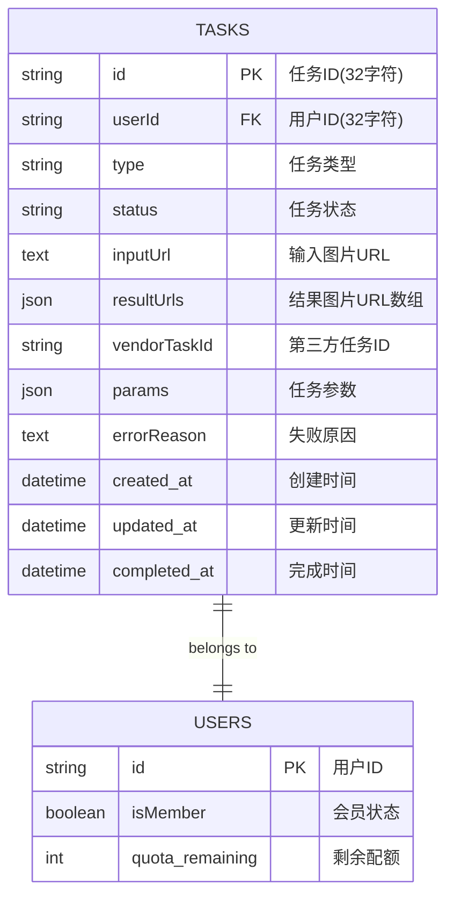
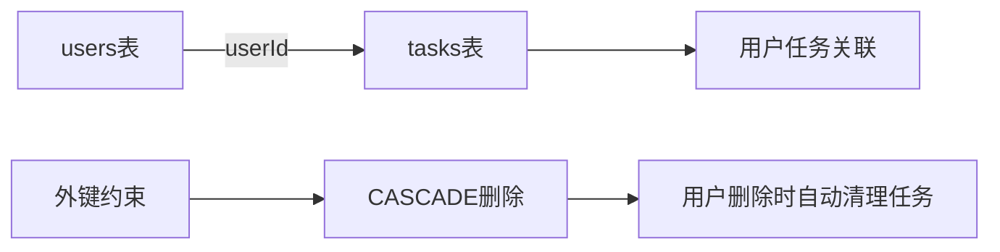
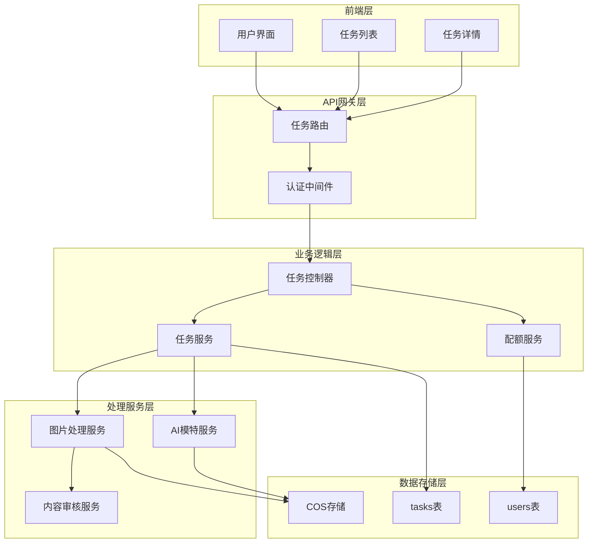
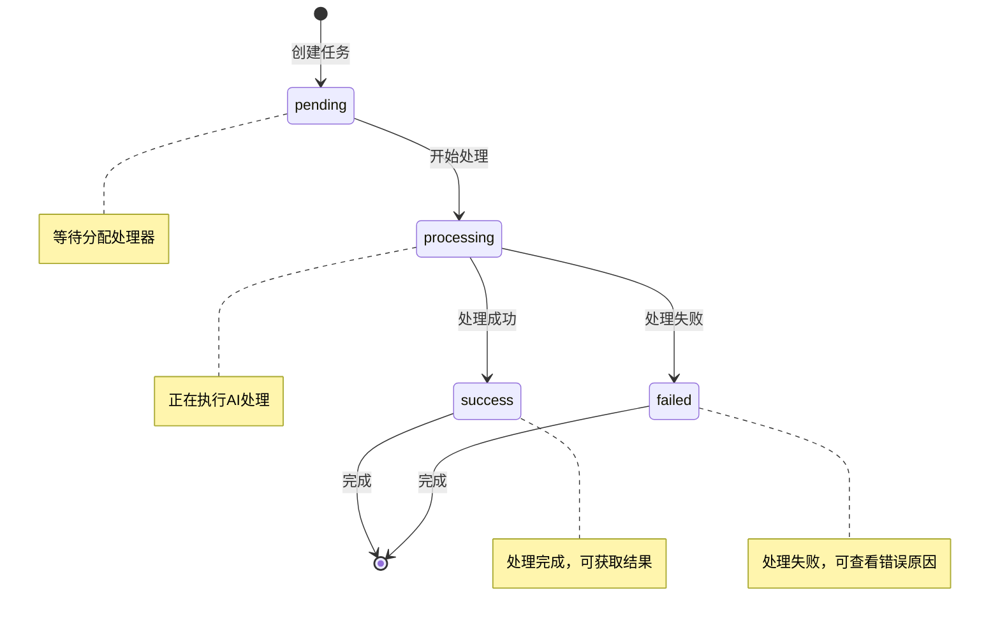
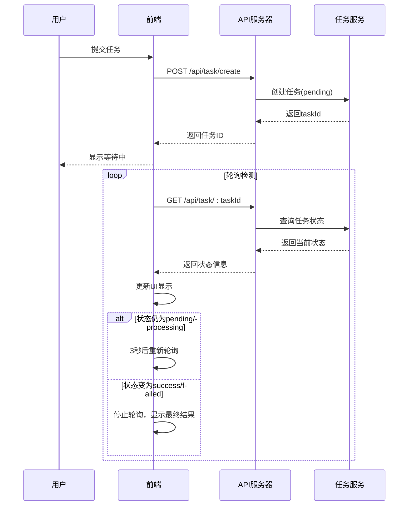
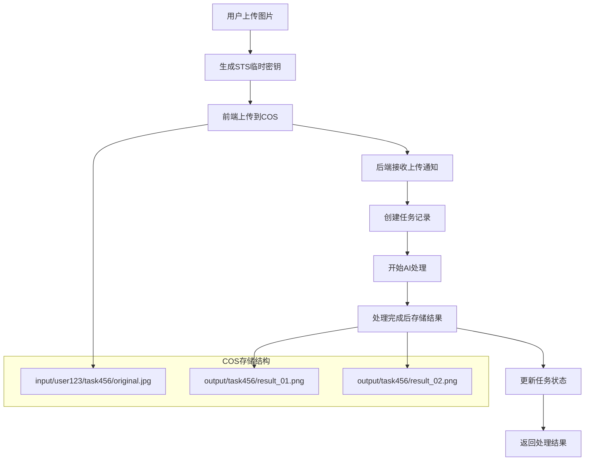
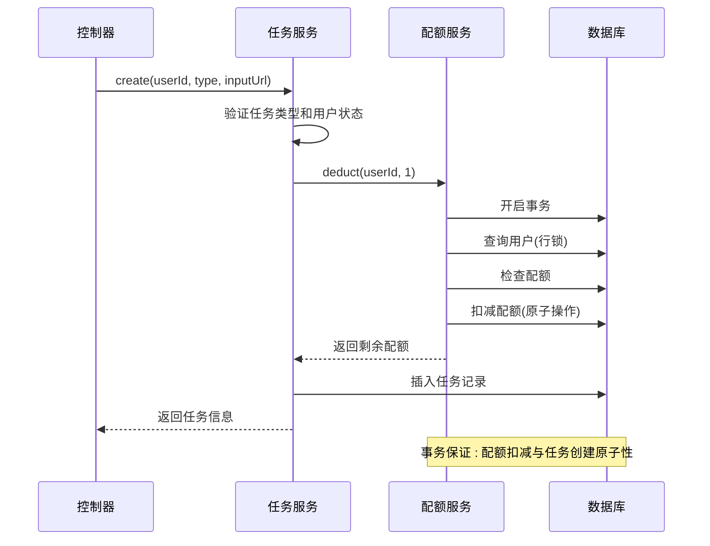
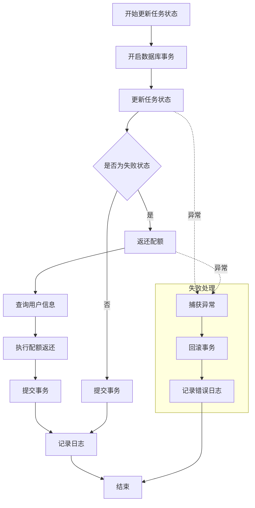

# 任务表 (tasks) 数据模型文档

<cite>
**本文档引用的文件**
- [20251028000003_create_tasks_table.js](file://backend/src/db/migrations/20251028000003_create_tasks_table.js)
- [task.service.js](file://backend/src/services/task.service.js)
- [quota.service.js](file://backend/src/services/quota.service.js)
- [task.controller.js](file://backend/src/controllers/task.controller.js)
- [imageProcess.service.js](file://backend/src/services/imageProcess.service.js)
- [aiModel.service.js](file://backend/src/services/aiModel.service.js)
- [task.routes.js](file://backend/src/routes/task.routes.js)
- [media.service.js](file://backend/src/services/media.service.js)
- [cos.js](file://backend/src/config/cos.js)
</cite>

## 目录
1. [概述](#概述)
2. [表结构设计](#表结构设计)
3. [字段详细说明](#字段详细说明)
4. [外键关系与索引策略](#外键关系与索引策略)
5. [业务逻辑架构](#业务逻辑架构)
6. [状态流转机制](#状态流转机制)
7. [存储路径规范](#存储路径规范)
8. [事务协同逻辑](#事务协同逻辑)
9. [典型查询场景](#典型查询场景)
10. [性能优化建议](#性能优化建议)

## 概述

任务表(tasks)是AI图像处理系统的核心数据模型，记录用户提交的AI图像处理任务的全生命周期状态。该表设计遵循ACID原则，确保任务状态的一致性和可靠性，支持多种AI处理类型，包括基础修图(basic_clean)和AI模特12分镜(model_pose12)。

### 主要业务特性
- **全生命周期管理**：从任务创建到完成的完整跟踪
- **状态机驱动**：基于状态流转的自动化处理
- **配额管理集成**：与用户配额系统深度绑定
- **异步处理支持**：支持同步和异步两种处理模式
- **COS存储集成**：与腾讯云对象存储无缝对接

## 表结构设计



**图表来源**
- [20251028000003_create_tasks_table.js](file://backend/src/db/migrations/20251028000003_create_tasks_table.js#L1-L34)

**章节来源**
- [20251028000003_create_tasks_table.js](file://backend/src/db/migrations/20251028000003_create_tasks_table.js#L1-L34)

## 字段详细说明

### 核心标识字段

| 字段名 | 类型 | 长度 | 必填 | 默认值 | 说明 |
|--------|------|------|------|--------|------|
| id | string | 32 | 是 | - | 任务唯一标识符，使用nanoid生成32位唯一ID |
| userId | string | 32 | 是 | - | 关联用户表，表示任务所属用户 |

### 任务属性字段

| 字段名 | 类型 | 长度 | 必填 | 默认值 | 说明 |
|--------|------|------|------|--------|------|
| type | string | 20 | 是 | - | 任务类型：basic_clean(基础修图)、model_pose12(AI模特) |
| status | string | 20 | 是 | - | 任务状态：pending(等待中)、processing(处理中)、success(成功)、failed(失败) |
| inputUrl | text | - | 是 | - | 输入图片的COS存储路径或外部URL |

### 结果存储字段

| 字段名 | 类型 | 长度 | 必填 | 默认值 | 说明 |
|--------|------|------|------|--------|------|
| resultUrls | json | - | 否 | null | 处理结果图片的URL数组，JSON格式存储 |
| vendorTaskId | string | 64 | 否 | null | 第三方服务商的任务ID，用于异步轮询 |

### 参数配置字段

| 字段名 | 类型 | 长度 | 必填 | 默认值 | 说明 |
|--------|------|------|------|--------|------|
| params | json | - | 否 | null | 任务参数配置，JSON格式存储 |
| errorReason | text | - | 否 | null | 任务失败的具体原因描述 |

### 时间戳字段

| 字段名 | 类型 | 长度 | 必填 | 默认值 | 说明 |
|--------|------|------|------|--------|------|
| created_at | datetime | - | 是 | CURRENT_TIMESTAMP | 任务创建时间 |
| updated_at | datetime | - | 是 | CURRENT_TIMESTAMP | 最后更新时间 |
| completed_at | datetime | - | 否 | null | 任务完成时间(成功或失败时自动填充) |

**章节来源**
- [20251028000003_create_tasks_table.js](file://backend/src/db/migrations/20251028000003_create_tasks_table.js#L4-L20)

## 外键关系与索引策略

### 外键关系设计



**图表来源**
- [20251028000003_create_tasks_table.js](file://backend/src/db/migrations/20251028000003_create_tasks_table.js#L21-L22)

### 索引策略

| 索引类型 | 字段组合 | 用途 | 性能影响 |
|----------|----------|------|----------|
| 主键索引 | id | 唯一标识查询 | O(log n) |
| 单字段索引 | userId | 用户任务查询 | O(log n) |
| 复合索引 | userId, created_at | 用户任务列表排序 | O(log n) |
| 单字段索引 | vendorTaskId | 第三方任务查询 | O(log n) |
| 单字段索引 | status | 状态过滤查询 | O(log n) |

### 索引优化策略

1. **用户维度查询优化**：`userId`索引支持快速查找用户的所有任务
2. **时间顺序优化**：`userId, created_at`复合索引支持按时间倒序查询
3. **异步处理优化**：`vendorTaskId`索引支持第三方服务查询
4. **状态统计优化**：`status`索引支持按状态分类统计

**章节来源**
- [20251028000003_create_tasks_table.js](file://backend/src/db/migrations/20251028000003_create_tasks_table.js#L23-L28)

## 业务逻辑架构

### 系统架构概览



**图表来源**
- [task.controller.js](file://backend/src/controllers/task.controller.js#L1-L173)
- [task.service.js](file://backend/src/services/task.service.js#L1-L259)
- [quota.service.js](file://backend/src/services/quota.service.js#L1-L130)

### 核心业务组件

1. **任务控制器(TaskController)**：处理HTTP请求，协调各服务组件
2. **任务服务(TaskService)**：核心业务逻辑，管理任务生命周期
3. **配额服务(QuotaService)**：管理用户配额扣减和返还
4. **图片处理服务(ImageProcessService)**：处理基础修图任务
5. **AI模特服务(AIModelService)**：处理AI模特12分镜任务

**章节来源**
- [task.controller.js](file://backend/src/controllers/task.controller.js#L1-L173)
- [task.service.js](file://backend/src/services/task.service.js#L1-L259)

## 状态流转机制

### 任务状态转换图



**图表来源**
- [task.service.js](file://backend/src/services/task.service.js#L105-L141)

### 状态流转详细说明

#### 1. pending状态
- **触发条件**：任务创建成功，进入等待处理队列
- **特点**：未分配处理器，等待调度
- **超时处理**：10分钟自动标记为failed

#### 2. processing状态  
- **触发条件**：开始执行AI处理逻辑
- **特点**：正在使用第三方服务或本地处理
- **异步支持**：支持长时间处理，无需保持连接

#### 3. success状态
- **触发条件**：处理完成，结果通过内容审核
- **特点**：可正常获取处理结果
- **配额处理**：配额已成功扣减

#### 4. failed状态
- **触发条件**：处理过程中发生错误
- **特点**：可查看错误原因，配额返还
- **错误类型**：超时、内容违规、系统错误等

### 前端轮询交互模式



**图表来源**
- [task.controller.js](file://backend/src/controllers/task.controller.js#L40-L65)
- [task.service.js](file://backend/src/services/task.service.js#L60-L95)

**章节来源**
- [task.service.js](file://backend/src/services/task.service.js#L105-L141)
- [task.controller.js](file://backend/src/controllers/task.controller.js#L40-L65)

## 存储路径规范

### COS存储路径结构

系统采用统一的COS存储路径规范，确保文件组织的清晰性和可维护性。

#### 输入文件路径规范
```
input/{userId}/{taskId}/original.{ext}
```

- **input/**：输入文件根目录
- **{userId}/**：用户ID作为子目录
- **{taskId}/**：任务ID作为子目录
- **original.{ext}**：原始文件名和扩展名

#### 输出文件路径规范
```
output/{taskId}/result_{index}.{ext}
```

- **output/**：输出文件根目录
- **{taskId}/**：任务ID作为子目录
- **result_{index}.{ext}**：结果文件，按索引编号

### 文件上传流程



**图表来源**
- [media.service.js](file://backend/src/services/media.service.js#L40-L71)
- [imageProcess.service.js](file://backend/src/services/imageProcess.service.js#L284-L328)

### 路径解析与验证

系统提供了完整的路径解析和验证机制：

1. **路径合法性验证**：确保路径符合COS存储规范
2. **权限控制**：STS临时密钥确保用户只能访问自己的文件
3. **文件类型检查**：支持JPG、PNG格式，限制文件大小
4. **路径安全性**：防止路径遍历攻击

**章节来源**
- [media.service.js](file://backend/src/services/media.service.js#L40-L111)
- [imageProcess.service.js](file://backend/src/services/imageProcess.service.js#L284-L328)
- [cos.js](file://backend/src/config/cos.js#L1-L16)

## 事务协同逻辑

### 任务创建的事务流程



**图表来源**
- [task.service.js](file://backend/src/services/task.service.js#L15-L50)
- [quota.service.js](file://backend/src/services/quota.service.js#L10-L45)

### 配额管理的ACID特性

#### 原子性(Atomicity)
- **事务级别**：使用数据库事务确保操作原子性
- **行锁保护**：`FOR UPDATE`确保并发安全
- **回滚机制**：任何步骤失败自动回滚

#### 一致性(Consistency)
- **非负约束**：确保`quota_remaining`不会变为负数
- **状态验证**：每次操作前后验证数据一致性
- **幂等性**：重复操作不会破坏数据完整性

#### 隔离性(Isolation)
- **行级锁**：防止并发扣减导致的竞态条件
- **事务隔离**：不同用户的操作相互隔离
- **快照隔离**：避免脏读和不可重复读

#### 持久性(Durability)
- **持久化存储**：所有操作持久化到数据库
- **日志记录**：详细的审计日志
- **备份恢复**：支持数据备份和恢复

### 任务状态更新的事务保障



**图表来源**
- [task.service.js](file://backend/src/services/task.service.js#L105-L141)
- [quota.service.js](file://backend/src/services/quota.service.js#L60-L85)

**章节来源**
- [task.service.js](file://backend/src/services/task.service.js#L15-L50)
- [quota.service.js](file://backend/src/services/quota.service.js#L10-L85)

## 典型查询场景

### 场景1：查询用户任务历史

```sql
-- 查询用户所有任务(按时间倒序)
SELECT id, type, status, created_at, updated_at 
FROM tasks 
WHERE userId = ? 
ORDER BY created_at DESC 
LIMIT 10 OFFSET 0;

-- 查询特定状态的任务
SELECT id, type, status, created_at 
FROM tasks 
WHERE userId = ? AND status = 'success' 
ORDER BY created_at DESC;

-- 查询特定类型的任务
SELECT id, type, status, created_at 
FROM tasks 
WHERE userId = ? AND type = 'basic_clean' 
ORDER BY created_at DESC;
```

### 场景2：根据taskId获取任务结果

```sql
-- 获取单个任务详情及结果
SELECT id, type, status, inputUrl, resultUrls, 
       params, errorReason, created_at, updated_at, completed_at
FROM tasks 
WHERE id = ? AND userId = ?;

-- 解析JSON字段(如果需要)
SELECT id, type, status, 
       JSON_UNQUOTE(JSON_EXTRACT(resultUrls, '$[0]')) as first_result_url
FROM tasks 
WHERE id = ?;
```

### 场景3：任务统计分析

```sql
-- 按状态统计任务数量
SELECT status, COUNT(*) as count 
FROM tasks 
WHERE userId = ? 
GROUP BY status;

-- 按类型统计任务数量
SELECT type, COUNT(*) as count 
FROM tasks 
WHERE userId = ? 
GROUP BY type;

-- 时间趋势分析
SELECT DATE(created_at) as date, 
       COUNT(*) as total_tasks,
       SUM(CASE WHEN status = 'success' THEN 1 ELSE 0 END) as successful_tasks
FROM tasks 
WHERE userId = ? 
GROUP BY DATE(created_at)
ORDER BY date DESC;
```

### 场景4：超时任务清理

```sql
-- 查找超时的pending任务
SELECT id, userId, created_at 
FROM tasks 
WHERE status = 'pending' 
AND created_at < NOW() - INTERVAL 10 MINUTE;

-- 批量更新超时任务状态
UPDATE tasks 
SET status = 'failed', 
    errorReason = '任务超时(10分钟未处理)',
    updated_at = NOW(),
    completed_at = NOW()
WHERE status = 'pending' 
AND created_at < NOW() - INTERVAL 10 MINUTE;
```

### 查询性能优化

| 查询类型 | 优化策略 | 索引建议 | 性能提升 |
|----------|----------|----------|----------|
| 用户任务列表 | 复合索引 | `userId, created_at` | 10-50倍 |
| 状态过滤查询 | 单字段索引 | `status` | 5-20倍 |
| 任务详情查询 | 主键索引 | `id` | 100% |
| 超时清理 | 时间范围索引 | `created_at` | 20-100倍 |

**章节来源**
- [task.service.js](file://backend/src/services/task.service.js#L143-L200)
- [task.service.js](file://backend/src/services/task.service.js#L60-L95)

## 性能优化建议

### 数据库层面优化

1. **索引优化**
   - 确保`userId`和`created_at`的复合索引被充分利用
   - 定期分析查询计划，调整索引策略
   - 考虑分区表策略，按时间或用户ID分区

2. **查询优化**
   - 使用LIMIT和OFFSET进行分页查询
   - 避免SELECT *，只查询需要的字段
   - 使用EXPLAIN分析慢查询

3. **连接池配置**
   - 根据并发量调整数据库连接池大小
   - 设置合理的连接超时时间
   - 监控连接池使用率

### 应用层面优化

1. **缓存策略**
   - 缓存频繁查询的任务状态
   - 使用Redis存储热点数据
   - 实现缓存失效策略

2. **异步处理**
   - 将耗时的处理逻辑异步化
   - 使用消息队列解耦系统组件
   - 实现任务重试机制

3. **批量操作**
   - 批量插入和更新任务记录
   - 批量处理超时任务
   - 合并相似的数据库操作

### 存储层面优化

1. **COS优化**
   - 使用CDN加速图片访问
   - 启用图片压缩和格式转换
   - 实现文件版本控制

2. **文件生命周期管理**
   - 设置自动过期删除策略
   - 实现冷热数据分离
   - 优化存储成本

### 监控与告警

1. **性能监控**
   - 监控数据库查询响应时间
   - 跟踪任务处理成功率
   - 监控系统资源使用率

2. **错误监控**
   - 记录任务失败原因
   - 监控配额扣减异常
   - 跟踪第三方服务调用

3. **容量规划**
   - 预测任务增长趋势
   - 评估存储空间需求
   - 规划系统扩容时机

通过以上优化措施，系统能够支持高并发的任务处理，保证良好的用户体验和系统的稳定性。