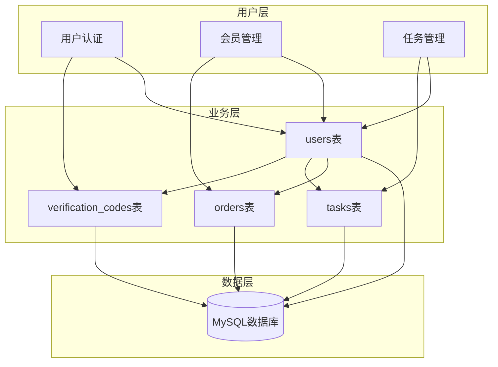
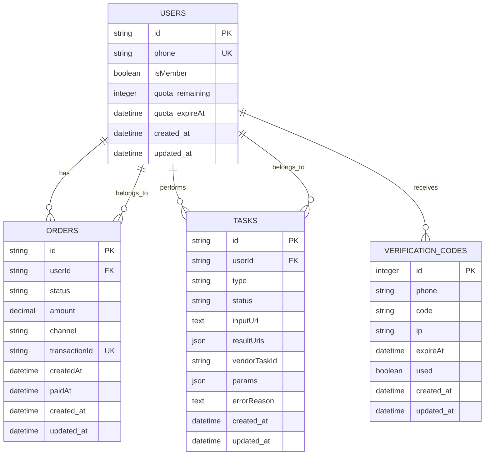
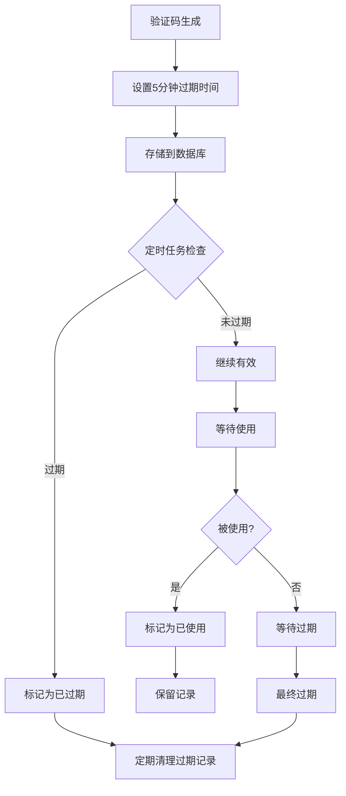
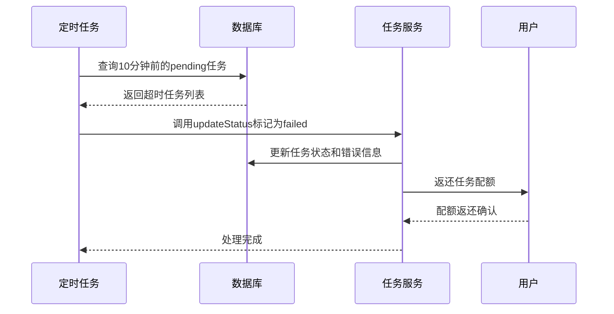
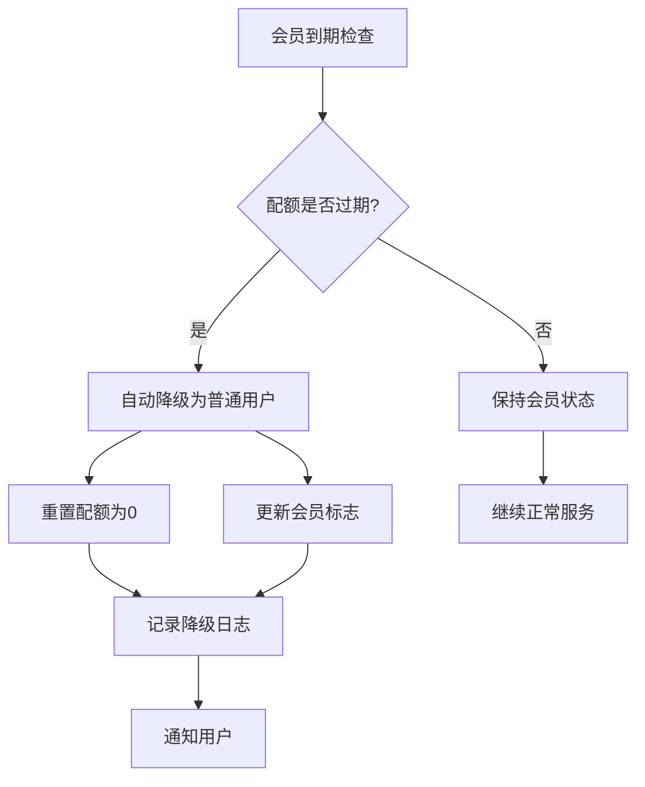
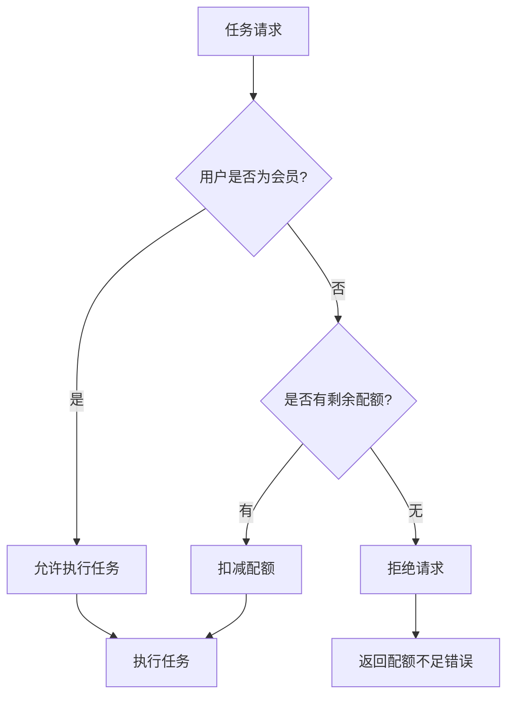
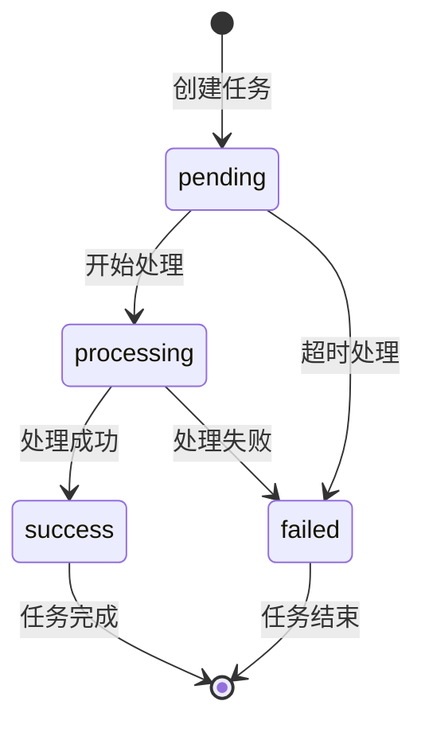

# 数据库设计

<cite>
**本文档中引用的文件**
- [20251028000001_create_users_table.js](file://backend/src/db/migrations/20251028000001_create_users_table.js)
- [20251028000002_create_orders_table.js](file://backend/src/db/migrations/20251028000002_create_orders_table.js)
- [20251028000003_create_tasks_table.js](file://backend/src/db/migrations/20251028000003_create_tasks_table.js)
- [20251028000004_create_verification_codes_table.js](file://backend/src/db/migrations/20251028000004_create_verification_codes_table.js)
- [knexfile.js](file://backend/knexfile.js)
- [database.js](file://backend/src/config/database.js)
- [auth.service.js](file://backend/src/services/auth.service.js)
- [task.service.js](file://backend/src/services/task.service.js)
- [quota.service.js](file://backend/src/services/quota.service.js)
- [membership.service.js](file://backend/src/services/membership.service.js)
- [admin.controller.js](file://backend/src/controllers/admin.controller.js)
- [task.controller.js](file://backend/src/controllers/task.controller.js)
- [auth.controller.js](file://backend/src/controllers/auth.controller.js)
</cite>

## 目录
1. [项目概述](#项目概述)
2. [数据库架构总览](#数据库架构总览)
3. [核心表结构详解](#核心表结构详解)
4. [实体关系图](#实体关系图)
5. [索引策略与性能优化](#索引策略与性能优化)
6. [数据生命周期管理](#数据生命周期管理)
7. [典型查询场景](#典型查询场景)
8. [约束条件与业务规则](#约束条件与业务规则)
9. [总结](#总结)

## 项目概述

本项目是一个基于AI图像处理服务的应用程序，采用MySQL数据库存储核心业务数据。系统包含四个核心业务表：`users`（用户表）、`orders`（订单表）、`tasks`（任务表）和`verification_codes`（验证码表），形成了完整的用户认证、会员管理、任务处理和安全验证体系。

数据库设计遵循以下核心原则：
- **用户中心化**：所有业务围绕用户展开，通过用户ID建立关联
- **会员制模式**：支持免费用户和付费会员两种模式
- **配额管理**：为非会员用户提供有限的免费配额
- **任务驱动**：AI任务作为核心业务流程
- **安全优先**：严格的验证码管理和防刷机制

## 数据库架构总览

系统采用关系型数据库设计，通过外键约束确保数据完整性，支持复杂的业务查询和统计分析。



**图表来源**
- [20251028000001_create_users_table.js](file://backend/src/db/migrations/20251028000001_create_users_table.js#L1-L24)
- [20251028000002_create_orders_table.js](file://backend/src/db/migrations/20251028000002_create_orders_table.js#L1-L31)
- [20251028000003_create_tasks_table.js](file://backend/src/db/migrations/20251028000003_create_tasks_table.js#L1-L34)
- [20251028000004_create_verification_codes_table.js](file://backend/src/db/migrations/20251028000004_create_verification_codes_table.js#L1-L27)

## 核心表结构详解

### users表 - 用户基本信息表

`users`表存储用户的核心信息，是整个系统的基础表。

| 字段名 | 数据类型 | 长度 | 约束 | 默认值 | 注释 |
|--------|----------|------|------|--------|------|
| id | string | 32 | PRIMARY KEY | - | 用户唯一标识符，UUID格式 |
| phone | string | 11 | UNIQUE, NOT NULL | - | 手机号码，用于登录认证 |
| isMember | boolean | - | DEFAULT false | false | 是否为会员用户 |
| quota_remaining | integer | - | UNSIGNED, DEFAULT 0 | 0 | 剩余可用配额数量 |
| quota_expireAt | datetime | - | NULLABLE | NULL | 配额到期时间 |
| created_at | datetime | - | NOT NULL | CURRENT_TIMESTAMP | 记录创建时间 |
| updated_at | datetime | - | NOT NULL | CURRENT_TIMESTAMP | 记录最后更新时间 |

**业务含义**：
- **用户身份**：每个用户通过唯一的`id`进行标识
- **认证凭据**：手机号作为主要的登录凭据
- **会员状态**：`isMember`字段区分免费用户和付费会员
- **配额管理**：非会员用户通过配额系统控制使用频率
- **时间追踪**：自动记录创建和更新时间

**关键特性**：
- 使用32字符的字符串作为主键，便于分布式系统中的UUID管理
- 手机号字段建立唯一索引，确保用户身份的唯一性
- 配额系统支持非会员用户的有限访问

**节来源**
- [20251028000001_create_users_table.js](file://backend/src/db/migrations/20251028000001_create_users_table.js#L1-L24)

### orders表 - 订单记录表

`orders`表记录用户的会员购买订单，支持完整的支付流程跟踪。

| 字段名 | 数据类型 | 长度 | 约束 | 默认值 | 注释 |
|--------|----------|------|------|--------|------|
| id | string | 32 | PRIMARY KEY | - | 订单唯一标识符 |
| userId | string | 32 | NOT NULL | - | 关联的用户ID |
| status | string | 20 | NOT NULL | - | 订单状态：pending/paid/cancelled |
| amount | decimal | 10,2 | NOT NULL | - | 支付金额，单位为分 |
| channel | string | 20 | NOT NULL | - | 支付渠道：wechat/alipay |
| transactionId | string | 64 | UNIQUE, NULLABLE | NULL | 第三方支付平台的交易号 |
| createdAt | datetime | - | NOT NULL | - | 订单创建时间 |
| paidAt | datetime | - | NULLABLE | NULL | 支付完成时间 |

**业务含义**：
- **订单生命周期**：从创建到支付完成的完整流程
- **支付集成**：支持多种支付渠道的集成
- **状态管理**：清晰的订单状态流转
- **审计追踪**：完整的支付时间和交易记录

**外键关系**：
- `userId`字段与`users.id`建立外键关系，级联删除确保数据一致性

**索引策略**：
- 主键索引：`PRIMARY KEY (id)`
- 用户索引：`INDEX (userId)`
- 复合索引：`INDEX (userId, status)`用于高效查询用户订单
- 时间索引：`INDEX (createdAt)`支持按时间排序查询

**节来源**
- [20251028000002_create_orders_table.js](file://backend/src/db/migrations/20251028000002_create_orders_table.js#L1-L31)

### tasks表 - AI任务执行表

`tasks`表记录用户发起的所有AI图像处理任务，是系统的核心业务表。

| 字段名 | 数据类型 | 长度 | 约束 | 默认值 | 注释 |
|--------|----------|------|------|--------|------|
| id | string | 32 | PRIMARY KEY | - | 任务唯一标识符 |
| userId | string | 32 | NOT NULL | - | 关联的用户ID |
| type | string | 20 | NOT NULL | - | 任务类型：basic_clean/model_pose12等 |
| status | string | 20 | NOT NULL | - | 任务状态：pending/processing/success/failed |
| inputUrl | text | - | NOT NULL | - | 输入图片的URL地址 |
| resultUrls | json | - | NULLABLE | NULL | 结果图片URL数组 |
| vendorTaskId | string | 64 | NULLABLE | NULL | 第三方服务商的任务ID |
| params | json | - | NULLABLE | NULL | 任务参数配置 |
| errorReason | text | - | NULLABLE | NULL | 任务失败的原因说明 |
| created_at | datetime | - | NOT NULL | - | 任务创建时间 |
| updated_at | datetime | - | NOT NULL | - | 任务最后更新时间 |

**业务含义**：
- **任务类型**：支持多种AI图像处理功能
- **状态追踪**：完整的任务生命周期管理
- **结果存储**：JSON格式存储多个处理结果
- **第三方集成**：支持外部AI服务提供商
- **参数配置**：灵活的任务参数传递

**外键关系**：
- `userId`字段与`users.id`建立外键关系，级联删除确保任务跟随用户删除

**索引策略**：
- 主键索引：`PRIMARY KEY (id)`
- 用户索引：`INDEX (userId)`
- 复合索引：`INDEX (userId, created_at)`支持用户任务历史查询
- 单字段索引：`INDEX (vendorTaskId)`用于第三方任务查询
- 状态索引：`INDEX (status)`支持任务状态统计

**节来源**
- [20251028000003_create_tasks_table.js](file://backend/src/db/migrations/20251028000003_create_tasks_table.js#L1-L34)

### verification_codes表 - 验证码管理表

`verification_codes`表专门管理登录验证码的生命周期，确保系统的安全性。

| 字段名 | 数据类型 | 长度 | 约束 | 默认值 | 注释 |
|--------|----------|------|------|--------|------|
| id | integer | - | AUTO_INCREMENT, PRIMARY KEY | - | 自增主键 |
| phone | string | 11 | NOT NULL | - | 接收验证码的手机号 |
| code | string | 6 | NOT NULL | - | 6位数字验证码 |
| ip | string | 45 | NULLABLE | NULL | 请求验证码的客户端IP |
| expireAt | datetime | - | NOT NULL | - | 验证码过期时间 |
| used | boolean | - | DEFAULT false | false | 验证码是否已被使用 |
| created_at | datetime | - | NOT NULL | - | 验证码生成时间 |
| updated_at | datetime | - | NOT NULL | - | 最后更新时间 |

**业务含义**：
- **安全验证**：为登录过程提供二次验证
- **防刷保护**：通过IP和手机号限制防止恶意攻击
- **时效性**：5分钟的有效期确保安全性
- **使用追踪**：记录验证码的使用状态

**防刷机制**：
- **手机号限制**：1分钟内最多5次发送请求
- **IP限制**：1小时内最多20次发送请求
- **过期清理**：自动清理过期的验证码记录

**索引策略**：
- 主键索引：`PRIMARY KEY (id)`
- 手机号索引：`INDEX (phone)`支持快速查找用户验证码
- 复合索引：`INDEX (phone, created_at)`优化时间范围查询
- IP索引：`INDEX (ip)`支持IP级别的防刷控制

**节来源**
- [20251028000004_create_verification_codes_table.js](file://backend/src/db/migrations/20251028000004_create_verification_codes_table.js#L1-L27)

## 实体关系图



**图表来源**
- [20251028000001_create_users_table.js](file://backend/src/db/migrations/20251028000001_create_users_table.js#L1-L24)
- [20251028000002_create_orders_table.js](file://backend/src/db/migrations/20251028000002_create_orders_table.js#L1-L31)
- [20251028000003_create_tasks_table.js](file://backend/src/db/migrations/20251028000003_create_tasks_table.js#L1-L34)
- [20251028000004_create_verification_codes_table.js](file://backend/src/db/migrations/20251028000004_create_verification_codes_table.js#L1-L27)

## 索引策略与性能优化

### 主键设计原则

所有表均采用字符串类型的自定义主键（长度32字符），而非传统的自增整数主键：

- **优势**：
  - 支持分布式系统中的UUID生成
  - 避免了自增主键的安全风险
  - 更好的跨系统数据合并能力
- **实现**：通过`generateId()`函数生成全局唯一标识符

### 复合索引策略

#### users表
- **phone索引**：支持手机号登录查询
- **timestamps索引**：支持时间范围查询和排序

#### orders表
- **userId索引**：支持用户订单查询
- **userId_status复合索引**：优化用户特定状态订单查询
- **createdAt索引**：支持订单时间排序

#### tasks表
- **userId索引**：支持用户任务查询
- **userId_createdAt复合索引**：优化用户任务历史查询
- **vendorTaskId索引**：支持第三方任务查询
- **status索引**：支持任务状态统计

#### verification_codes表
- **phone索引**：支持手机号验证码查询
- **phone_createdAt复合索引**：优化验证码时间范围查询
- **ip索引**：支持IP级别防刷查询

### 性能优化建议

1. **查询优化**：
   - 使用EXPLAIN分析查询计划
   - 避免SELECT *，明确指定需要的字段
   - 合理使用LIMIT避免全表扫描

2. **缓存策略**：
   - 缓存热点用户信息
   - 缓存任务状态统计
   - 缓存验证码发送频率限制

3. **分区策略**：
   - 按时间分区orders表
   - 按用户ID范围分区tasks表
   - 按手机号前缀分区verification_codes表

## 数据生命周期管理

### 验证码过期清理

系统实现了完善的验证码生命周期管理：



**图表来源**
- [auth.service.js](file://backend/src/services/auth.service.js#L25-L35)

**清理策略**：
- **实时验证**：每次验证码使用时检查过期状态
- **批量清理**：定期清理已过期且已使用的记录
- **空间回收**：自动回收过期验证码占用的空间

### 任务超时处理



**图表来源**
- [task.service.js](file://backend/src/services/task.service.js#L234-L257)

**超时处理机制**：
- **自动检测**：每分钟检查是否有超时任务
- **状态更新**：将超时任务标记为失败状态
- **配额返还**：自动返还因超时而消耗的配额
- **错误记录**：记录详细的超时原因

### 会员到期管理

系统实现了自动的会员到期处理：



**图表来源**
- [membership.service.js](file://backend/src/services/membership.service.js#L129-L189)

**节来源**
- [task.service.js](file://backend/src/services/task.service.js#L234-L257)
- [membership.service.js](file://backend/src/services/membership.service.js#L129-L189)

## 典型查询场景

### 用户认证场景

**场景描述**：用户通过手机号和验证码登录系统

**查询序列**：
1. **验证码验证**：检查验证码是否存在且未使用且未过期
2. **用户查询**：根据手机号查询用户信息
3. **用户创建**：如果用户不存在则创建新用户
4. **令牌生成**：生成JWT访问令牌

**SQL模式**：
```sql
-- 验证码检查
SELECT * FROM verification_codes 
WHERE phone = ? AND code = ? AND used = FALSE AND expireAt > NOW()

-- 用户查询
SELECT * FROM users WHERE phone = ?

-- 用户创建
INSERT INTO users (id, phone, isMember, quota_remaining, quota_expireAt) 
VALUES (?, ?, FALSE, 0, NULL)
```

**节来源**
- [auth.service.js](file://backend/src/services/auth.service.js#L106-L154)

### 任务处理场景

**场景描述**：用户提交AI图像处理任务

**查询序列**：
1. **配额检查**：验证用户是否有足够的配额
2. **任务创建**：创建新的任务记录
3. **状态监控**：查询任务处理状态
4. **结果获取**：获取任务处理结果

**SQL模式**：
```sql
-- 配额检查
SELECT quota_remaining, isMember FROM users WHERE id = ?

-- 任务创建
INSERT INTO tasks (id, userId, type, status, inputUrl, params) 
VALUES (?, ?, ?, 'pending', ?, ?)

-- 任务查询
SELECT * FROM tasks WHERE userId = ? AND id = ?
```

**节来源**
- [task.service.js](file://backend/src/services/task.service.js#L188-L236)
- [quota.service.js](file://backend/src/services/quota.service.js#L104-L128)

### 订单管理场景

**场景描述**：用户购买会员服务

**查询序列**：
1. **订单创建**：创建新的订单记录
2. **支付回调**：处理支付成功回调
3. **会员激活**：激活用户会员状态
4. **配额分配**：分配相应的配额

**SQL模式**：
```sql
-- 订单创建
INSERT INTO orders (id, userId, status, amount, channel) 
VALUES (?, ?, 'pending', ?, ?)

-- 订单支付
UPDATE orders SET status = 'paid', paidAt = NOW(), transactionId = ? 
WHERE id = ? AND status = 'pending'

-- 会员激活
UPDATE users SET isMember = TRUE, quota_remaining = ?, quota_expireAt = ? 
WHERE id = ?
```

**节来源**
- [membership.service.js](file://backend/src/services/membership.service.js#L129-L189)

### 管理员统计场景

**场景描述**：管理员查看系统统计数据

**查询序列**：
1. **用户统计**：统计总用户数、会员数、活跃会员数
2. **任务统计**：统计任务总数、成功率、失败率
3. **订单统计**：统计订单总数、支付数、收入统计
4. **趋势分析**：分析新增用户和任务的趋势

**SQL模式**：
```sql
-- 用户统计
SELECT COUNT(*) as total, 
       SUM(CASE WHEN isMember THEN 1 ELSE 0 END) as members,
       SUM(CASE WHEN isMember AND quota_expireAt > NOW() THEN 1 ELSE 0 END) as active_members
FROM users

-- 任务统计
SELECT COUNT(*) as total,
       SUM(CASE WHEN status = 'success' THEN 1 ELSE 0 END) as successes,
       SUM(CASE WHEN status = 'failed' THEN 1 ELSE 0 END) as failures
FROM tasks

-- 订单统计
SELECT COUNT(*) as total, 
       SUM(CASE WHEN status = 'paid' THEN 1 ELSE 0 END) as paid,
       SUM(amount) as revenue
FROM orders
```

**节来源**
- [admin.controller.js](file://backend/src/controllers/admin.controller.js#L55-L96)

## 约束条件与业务规则

### 数据完整性约束

#### 外键约束
- **orders.userId → users.id**：级联删除确保订单跟随用户删除
- **tasks.userId → users.id**：级联删除确保任务跟随用户删除

#### 唯一性约束
- **orders.transactionId**：确保第三方交易号的唯一性
- **verification_codes.phone**：限制每个手机号同时只能有一个有效的验证码

#### 检查约束
- **users.quota_remaining ≥ 0**：保证配额不能为负数
- **orders.amount > 0**：确保订单金额为正数
- **verification_codes.code**：6位数字验证码格式

### 业务规则约束

#### 配额管理规则


**图表来源**
- [quota.service.js](file://backend/src/services/quota.service.js#L10-L55)

#### 验证码防刷规则
1. **手机号频率限制**：1分钟内最多5次发送请求
2. **IP频率限制**：1小时内最多20次发送请求
3. **验证码有效期**：5分钟内有效，过期自动失效
4. **验证码使用限制**：每个验证码只能使用一次

#### 任务状态流转


**图表来源**
- [task.service.js](file://backend/src/services/task.service.js#L141-L189)

### 并发控制机制

#### 配额扣减的并发安全
系统使用数据库事务和行锁确保配额扣减的原子性：

```sql
BEGIN TRANSACTION;
SELECT * FROM users WHERE id = ? FOR UPDATE;
-- 检查配额和会员状态
UPDATE users SET quota_remaining = quota_remaining - 1 WHERE id = ?;
COMMIT;
```

这种设计确保：
- **原子性**：配额扣减操作不可分割
- **隔离性**：防止并发扣减导致负配额
- **一致性**：始终保持数据的一致状态

**节来源**
- [quota.service.js](file://backend/src/services/quota.service.js#L10-L55)

## 总结

本数据库设计方案体现了现代Web应用的最佳实践，具有以下特点：

### 设计优势

1. **业务完整性**：四个核心表完整覆盖了用户认证、会员管理、任务处理和安全验证的全部业务需求
2. **数据一致性**：通过外键约束和事务机制确保数据的完整性和一致性
3. **性能优化**：合理的索引策略和查询优化确保了良好的查询性能
4. **安全考虑**：完善的防刷机制和验证码管理确保了系统的安全性
5. **可扩展性**：模块化的表结构设计支持未来的功能扩展

### 技术特色

1. **分布式友好**：使用字符串主键支持分布式部署
2. **配额系统**：创新的非会员配额机制平衡了用户体验和商业利益
3. **自动化管理**：定时任务自动处理过期数据和超时任务
4. **状态管理**：完善的状态机设计支持复杂的业务流程

### 应用价值

该数据库设计不仅满足了当前的业务需求，还为未来的功能扩展奠定了坚实的基础。通过合理的数据模型设计和完善的约束机制，系统能够稳定、安全、高效地运行，为用户提供优质的AI图像处理服务。