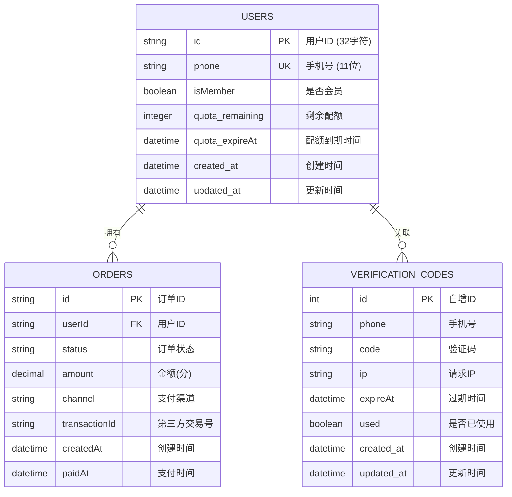
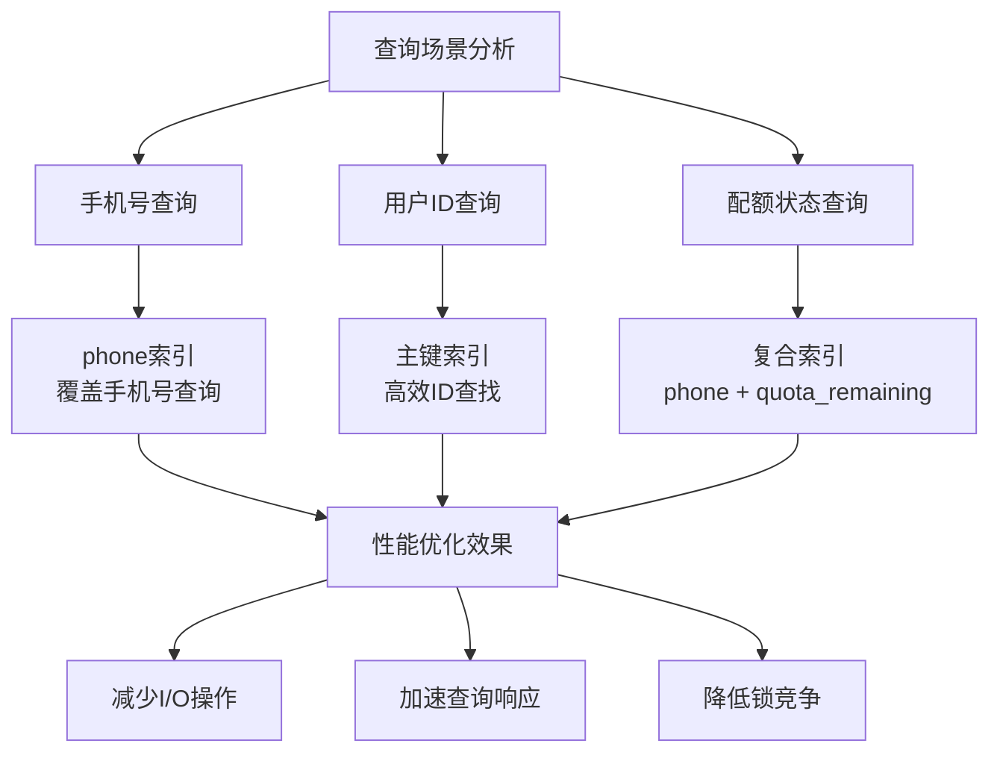
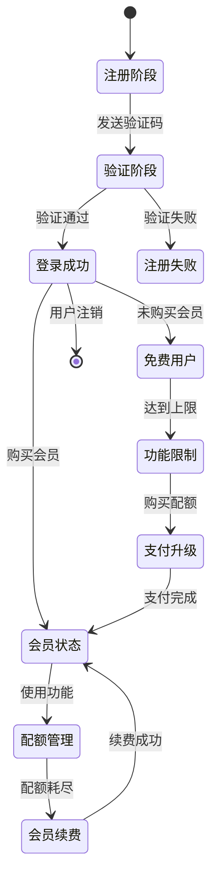
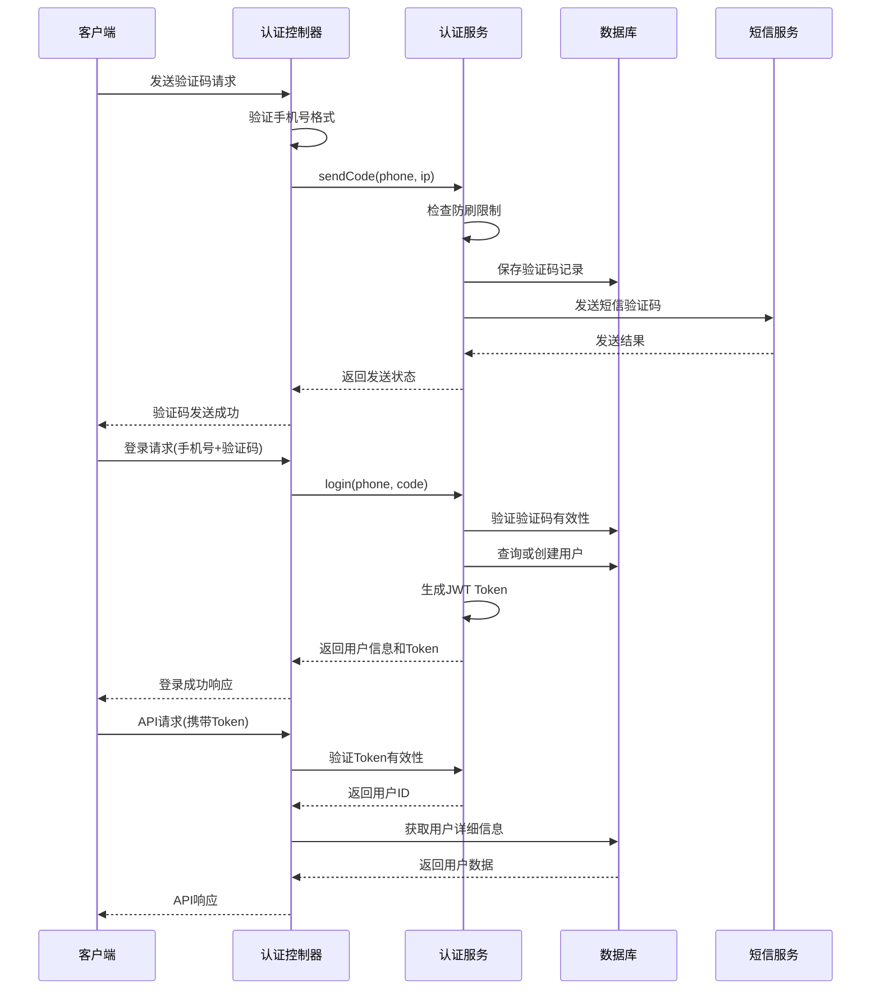

# 用户表 (users) 数据模型文档

<cite>
**本文档中引用的文件**
- [20251028000001_create_users_table.js](file://backend/src/db/migrations/20251028000001_create_users_table.js)
- [auth.service.js](file://backend/src/services/auth.service.js)
- [auth.controller.js](file://backend/src/controllers/auth.controller.js)
- [auth.middleware.js](file://backend/src/middlewares/auth.middleware.js)
- [database.js](file://backend/src/config/database.js)
- [knexfile.js](file://backend/knexfile.js)
- [authStore.ts](file://frontend/src/store/authStore.ts)
- [api.ts](file://frontend/src/lib/api.ts)
- [index.ts](file://frontend/src/types/index.ts)
</cite>

## 目录
1. [简介](#简介)
2. [表结构设计](#表结构设计)
3. [字段详细说明](#字段详细说明)
4. [索引与约束](#索引与约束)
5. [业务逻辑分析](#业务逻辑分析)
6. [典型查询场景](#典型查询场景)
7. [认证流程集成](#认证流程集成)
8. [性能优化建议](#性能优化建议)
9. [总结](#总结)

## 简介

用户表(users)是AI照片处理平台的核心数据表，负责存储平台注册用户的基本信息和认证相关数据。该表采用手机号作为主要身份标识，支持基于手机号的快速用户识别和认证流程，为整个系统的用户管理体系提供基础支撑。

## 表结构设计



**图表来源**
- [20251028000001_create_users_table.js](file://backend/src/db/migrations/20251028000001_create_users_table.js#L4-L14)
- [20251028000002_create_orders_table.js](file://backend/src/db/migrations/20251028000002_create_orders_table.js#L4-L15)
- [20251028000004_create_verification_codes_table.js](file://backend/src/db/migrations/20251028000004_create_verification_codes_table.js#L4-L13)

**节来源**
- [20251028000001_create_users_table.js](file://backend/src/db/migrations/20251028000001_create_users_table.js#L1-L24)

## 字段详细说明

### 主键字段

| 字段名 | 数据类型 | 长度 | 是否必填 | 默认值 | 描述 |
|--------|----------|------|----------|--------|------|
| id | string | 32 | 是 | - | 用户唯一标识符，采用32字符长度的字符串格式 |

### 核心业务字段

| 字段名 | 数据类型 | 长度 | 是否必填 | 默认值 | 描述 |
|--------|----------|------|----------|--------|------|
| phone | string | 11 | 是 | - | 手机号码，作为用户的主要身份标识，具有唯一性约束 |
| isMember | boolean | - | 否 | false | 用户会员状态标识，true表示会员用户 |
| quota_remaining | integer | - | 否 | 0 | 用户剩余可用配额数量，用于控制免费功能使用次数 |
| quota_expireAt | datetime | - | 否 | null | 配额有效期截止时间，null表示无限制 |

### 时间戳字段

| 字段名 | 数据类型 | 长度 | 是否必填 | 默认值 | 描述 |
|--------|----------|------|----------|--------|------|
| created_at | datetime | - | 是 | CURRENT_TIMESTAMP | 记录创建时间，自动设置为当前时间 |
| updated_at | datetime | - | 是 | CURRENT_TIMESTAMP ON UPDATE CURRENT_TIMESTAMP | 记录最后更新时间，自动更新 |

**节来源**
- [20251028000001_create_users_table.js](file://backend/src/db/migrations/20251028000001_create_users_table.js#L4-L14)

## 索引与约束

### 主键约束
- **PRIMARY KEY (id)**: 使用id字段作为主键，确保每条记录的唯一性

### 唯一性约束
- **UNIQUE (phone)**: 手机号字段具有唯一性约束，防止重复注册同一手机号

### 索引优化策略



**图表来源**
- [20251028000001_create_users_table.js](file://backend/src/db/migrations/20251028000001_create_users_table.js#L12-L13)

### 自动时间戳机制

系统采用MySQL的`timestamps()`方法实现自动时间戳管理：
- **created_at**: 记录创建时自动设置为当前时间
- **updated_at**: 记录更新时自动更新为当前时间

**节来源**
- [20251028000001_create_users_table.js](file://backend/src/db/migrations/20251028000001_create_users_table.js#L12-L13)

## 业务逻辑分析

### 用户生命周期管理



### 核心业务特性

1. **手机号唯一性**: 每个手机号只能注册一次，确保用户身份的唯一性
2. **会员体系**: 支持普通用户和会员用户的差异化功能权限
3. **配额管理**: 提供免费和付费两种使用模式，通过配额系统控制资源使用
4. **自动状态更新**: 用户状态随业务操作自动更新，无需手动维护

**节来源**
- [auth.service.js](file://backend/src/services/auth.service.js#L95-L120)
- [auth.service.js](file://backend/src/services/auth.service.js#L140-L170)

## 典型查询场景

### 场景1：根据手机号查询用户信息

```sql
-- 查询用户基本信息
SELECT id, phone, isMember, quota_remaining, quota_expireAt, created_at
FROM users 
WHERE phone = ? AND deleted_at IS NULL
LIMIT 1;
```

**适用场景**: 用户登录验证、用户信息展示

### 场景2：检查用户会员状态

```sql
-- 检查用户是否为会员
SELECT id, isMember, quota_remaining, quota_expireAt
FROM users 
WHERE id = ? AND isMember = true;
```

**适用场景**: 权限验证、功能访问控制

### 场景3：查询用户配额状态

```sql
-- 查询用户剩余配额
SELECT id, quota_remaining, quota_expireAt
FROM users 
WHERE id = ? AND quota_remaining > 0 
AND (quota_expireAt IS NULL OR quota_expireAt > NOW());
```

**适用场景**: 功能使用前的配额检查

### 场景4：批量用户状态查询

```sql
-- 查询多个用户的会员状态
SELECT id, phone, isMember, quota_remaining
FROM users 
WHERE id IN (?, ?, ?);
```

**适用场景**: 批量用户信息获取

**节来源**
- [auth.service.js](file://backend/src/services/auth.service.js#L175-L195)
- [auth.service.js](file://backend/src/services/auth.service.js#L140-L170)

## 认证流程集成

### 完整认证流程架构



**图表来源**
- [auth.controller.js](file://backend/src/controllers/auth.controller.js#L10-L50)
- [auth.service.js](file://backend/src/services/auth.service.js#L10-L90)
- [auth.middleware.js](file://backend/src/middlewares/auth.middleware.js#L8-L40)

### 认证服务核心功能

1. **验证码管理**: 负责验证码的生成、存储和验证
2. **用户注册**: 自动创建新用户账户
3. **Token生成**: 基于JWT标准生成用户认证令牌
4. **权限验证**: 验证用户访问权限和功能限制

**节来源**
- [auth.service.js](file://backend/src/services/auth.service.js#L10-L220)
- [auth.controller.js](file://backend/src/controllers/auth.controller.js#L10-L100)
- [auth.middleware.js](file://backend/src/middlewares/auth.middleware.js#L8-L77)

## 性能优化建议

### 数据库层面优化

1. **索引策略优化**
   - 在高频查询字段上建立适当索引
   - 考虑添加复合索引以支持多字段查询
   - 定期分析查询执行计划，优化索引使用

2. **分区策略**
   - 按照创建时间进行范围分区
   - 支持历史数据的归档和清理
   - 提高大数据量下的查询性能

3. **缓存策略**
   - 对用户基本信息进行缓存
   - 缓存热点用户的认证信息
   - 减少数据库查询压力

### 应用层面优化

1. **连接池配置**
   - 根据并发需求调整数据库连接池大小
   - 实施连接超时和重试机制
   - 监控连接池使用情况

2. **查询优化**
   - 使用预编译语句防止SQL注入
   - 避免N+1查询问题
   - 合理使用JOIN操作

**节来源**
- [knexfile.js](file://backend/knexfile.js#L10-L25)
- [database.js](file://backend/src/config/database.js#L1-L10)

## 总结

用户表(users)作为AI照片处理平台的核心数据表，采用了手机号作为主要身份标识的设计理念，这种设计具有以下优势：

### 设计优势
1. **唯一性保证**: 手机号作为全球唯一的通信标识，确保用户身份的唯一性
2. **用户体验**: 基于手机号的认证方式符合移动互联网用户的使用习惯
3. **业务扩展**: 支持会员体系、配额管理等多种业务模式
4. **性能优化**: 合理的索引设计和约束设置确保查询效率

### 技术特点
1. **自动化管理**: 时间戳字段的自动更新机制减少了开发工作量
2. **安全性**: 唯一性约束和防刷机制保障了数据安全
3. **可扩展性**: 清晰的字段设计为未来功能扩展提供了空间

### 业务价值
用户表不仅承载着用户基本信息，更是整个平台认证体系的基础。通过与验证码系统、订单系统等模块的紧密集成，为平台的商业化运营提供了坚实的数据基础。

该表的设计充分考虑了移动互联网应用的特点，在保证数据完整性的同时，最大化了系统的可用性和扩展性，是整个技术架构中不可或缺的重要组成部分。