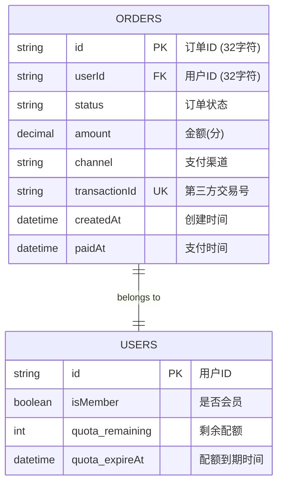
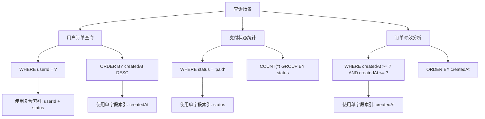
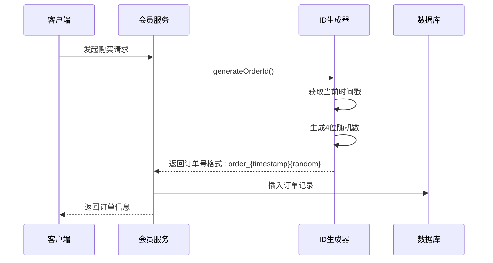
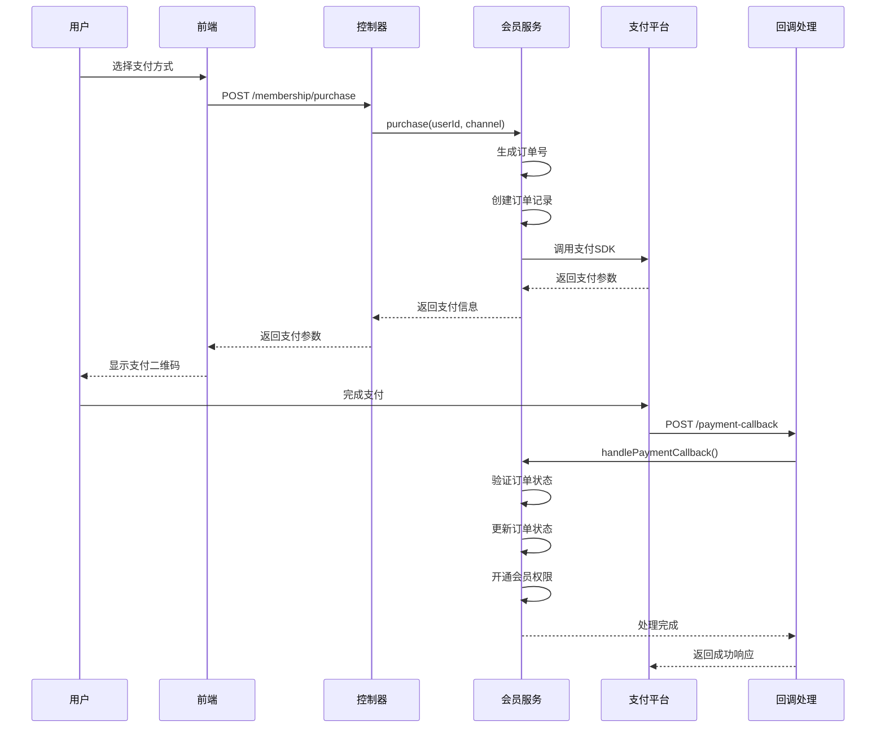
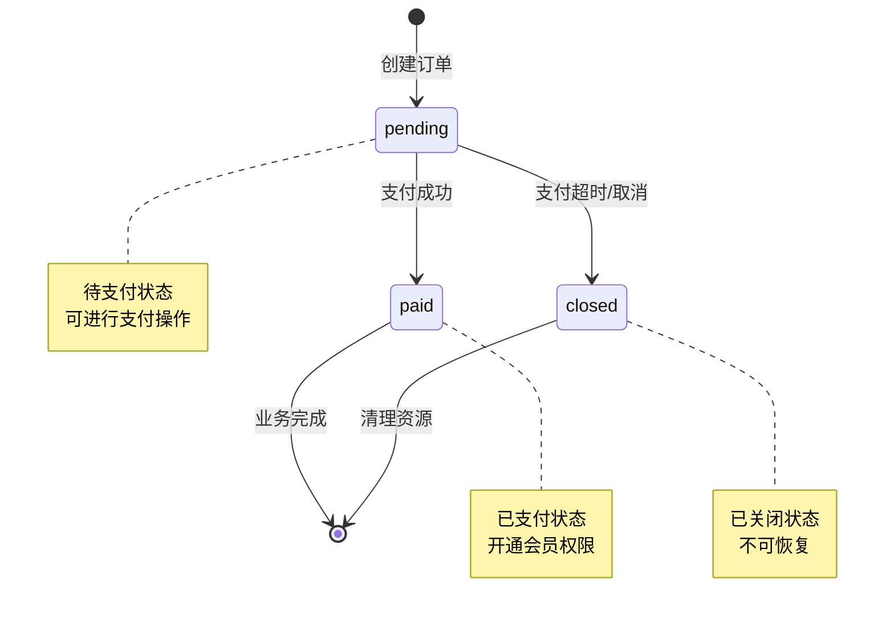
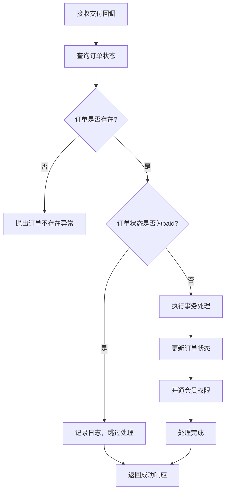

# 订单表 (orders) 数据模型文档

<cite>
**本文档引用的文件**
- [20251028000002_create_orders_table.js](file://backend/src/db/migrations/20251028000002_create_orders_table.js)
- [membership.service.js](file://backend/src/services/membership.service.js)
- [membership.controller.js](file://backend/src/controllers/membership.controller.js)
- [admin.controller.js](file://backend/src/controllers/admin.controller.js)
- [generator.js](file://backend/src/utils/generator.js)
</cite>

## 目录
1. [概述](#概述)
2. [表结构设计](#表结构设计)
3. [字段详细说明](#字段详细说明)
4. [索引策略](#索引策略)
5. [业务逻辑分析](#业务逻辑分析)
6. [状态机管理](#状态机管理)
7. [查询场景示例](#查询场景示例)
8. [性能优化建议](#性能优化建议)
9. [总结](#总结)

## 概述

orders表是系统中记录用户购买会员服务订单信息的核心数据表，采用订单号驱动的支付流程架构。该表支持微信和支付宝两种支付渠道，通过状态机管理订单生命周期，并为会员服务开通提供完整的支付回调处理机制。

### 主要业务场景
- **订单创建**：用户发起会员购买请求时创建订单
- **支付处理**：集成第三方支付平台完成支付流程
- **状态跟踪**：实时监控订单支付状态变化
- **会员开通**：支付成功后自动开通对应会员权限
- **数据统计**：为运营提供订单量和收入统计支持

## 表结构设计



**图表来源**
- [20251028000002_create_orders_table.js](file://backend/src/db/migrations/20251028000002_create_orders_table.js#L4-L20)

**章节来源**
- [20251028000002_create_orders_table.js](file://backend/src/db/migrations/20251028000002_create_orders_table.js#L1-L31)

## 字段详细说明

### 主键字段
| 字段名 | 类型 | 长度 | 必填 | 描述 |
|--------|------|------|------|------|
| id | string | 32 | 是 | 订单唯一标识符，采用自定义生成规则 |

### 外键关联字段
| 字段名 | 类型 | 长度 | 必填 | 外键约束 | 描述 |
|--------|------|------|------|----------|------|
| userId | string | 32 | 是 | users.id | 关联用户表，级联删除 |

### 业务状态字段
| 字段名 | 类型 | 长度 | 必填 | 默认值 | 描述 |
|--------|------|------|------|--------|------|
| status | string | 20 | 是 | - | 订单状态：pending(待支付)、paid(已支付) |
| amount | decimal | 10,2 | 是 | - | 订单金额，单位为分 |
| channel | string | 20 | 是 | - | 支付渠道：wx(微信)、alipay(支付宝) |

### 第三方支付字段
| 字段名 | 类型 | 长度 | 必填 | 约束 | 描述 |
|--------|------|------|------|------|------|
| transactionId | string | 64 | 否 | 唯一 | 第三方支付平台返回的交易号 |

### 时间戳字段
| 字段名 | 类型 | 必填 | 描述 |
|--------|------|------|------|
| createdAt | datetime | 是 | 订单创建时间 |
| paidAt | datetime | 否 | 订单支付完成时间 |

**章节来源**
- [20251028000002_create_orders_table.js](file://backend/src/db/migrations/20251028000002_create_orders_table.js#L4-L20)

## 索引策略

### 单字段索引
```sql
CREATE INDEX orders_user_id_idx ON orders (userId);
CREATE INDEX orders_created_at_idx ON orders (createdAt);
```

### 复合索引
```sql
CREATE INDEX orders_user_status_idx ON orders (userId, status);
```

### 索引使用场景分析



**图表来源**
- [20251028000002_create_orders_table.js](file://backend/src/db/migrations/20251028000002_create_orders_table.js#L18-L20)

### 索引优化效果
- **用户订单查询**：复合索引支持高效按用户筛选和状态过滤
- **时间序列分析**：独立索引支持快速的时间范围查询
- **统计报表**：单字段索引支持各类聚合统计操作

**章节来源**
- [20251028000002_create_orders_table.js](file://backend/src/db/migrations/20251028000002_create_orders_table.js#L18-L20)

## 业务逻辑分析

### 订单号生成机制

订单号采用时间戳+随机数的组合策略，确保全局唯一性：



**图表来源**
- [generator.js](file://backend/src/utils/generator.js#L28-L32)
- [membership.service.js](file://backend/src/services/membership.service.js#L15-L30)

### 支付流程集成



**图表来源**
- [membership.controller.js](file://backend/src/controllers/membership.controller.js#L10-L30)
- [membership.service.js](file://backend/src/services/membership.service.js#L15-L90)

**章节来源**
- [membership.service.js](file://backend/src/services/membership.service.js#L15-L90)
- [membership.controller.js](file://backend/src/controllers/membership.controller.js#L10-L30)

## 状态机管理

### 订单状态流转



### 状态转换规则

| 当前状态 | 目标状态 | 触发条件 | 数据变更 |
|----------|----------|----------|----------|
| pending | paid | 支付回调验证通过 | 更新status='paid'，设置paidAt |
| pending | closed | 支付超时或手动取消 | 更新status='closed' |
| paid | - | 不允许状态变更 | 只读状态 |

### 幂等性保障机制

系统通过以下机制确保支付回调的幂等性：



**图表来源**
- [membership.service.js](file://backend/src/services/membership.service.js#L86-L133)

**章节来源**
- [membership.service.js](file://backend/src/services/membership.service.js#L86-L133)

## 查询场景示例

### 典型查询场景

#### 1. 根据用户ID查询订单列表
```sql
SELECT * FROM orders 
WHERE userId = ? 
ORDER BY createdAt DESC 
LIMIT 20 OFFSET 0;
```

**查询特点**：
- 使用复合索引 `userId + status`
- 支持分页查询
- 按创建时间倒序排列

#### 2. 根据订单号查询订单详情
```sql
SELECT * FROM orders 
WHERE id = ? 
FOR UPDATE;
```

**查询特点**：
- 主键查询，性能最优
- 使用排他锁防止并发修改

#### 3. 订单状态统计查询
```sql
-- 总订单数量
SELECT COUNT(*) as total FROM orders;

-- 已支付订单数量  
SELECT COUNT(*) as paid FROM orders WHERE status = 'paid';

-- 按状态分组统计
SELECT status, COUNT(*) as count 
FROM orders 
GROUP BY status;
```

#### 4. 时间范围订单查询
```sql
SELECT * FROM orders 
WHERE createdAt >= ? AND createdAt <= ?
ORDER BY createdAt;
```

**查询特点**：
- 使用单字段索引 `createdAt`
- 支持精确的时间范围筛选

#### 5. 管理员订单概览查询
```sql
-- 系统订单统计
SELECT 
    COUNT(*) as totalOrders,
    SUM(CASE WHEN status = 'paid' THEN 1 ELSE 0 END) as paidOrders,
    SUM(amount) as totalAmount
FROM orders;
```

**章节来源**
- [admin.controller.js](file://backend/src/controllers/admin.controller.js#L209-L215)

## 性能优化建议

### 查询优化策略

#### 1. 索引使用优化
- **复合索引优先**：对于 `userId` 和 `status` 的组合查询，优先使用复合索引
- **覆盖索引**：在频繁查询的场景中，考虑添加覆盖索引减少回表操作
- **索引选择性**：定期分析索引选择性，避免低效索引

#### 2. 分页查询优化
```sql
-- 推荐：使用游标分页
SELECT * FROM orders 
WHERE userId = ? AND createdAt < last_seen_time
ORDER BY createdAt DESC 
LIMIT 20;

-- 避免：OFFSET过大导致性能下降
SELECT * FROM orders 
WHERE userId = ? 
ORDER BY createdAt DESC 
LIMIT 20 OFFSET 10000;
```

#### 3. 批量查询优化
```sql
-- 批量查询多个用户的订单
SELECT * FROM orders 
WHERE userId IN (?, ?, ?, ?)
ORDER BY createdAt DESC;
```

### 数据库设计优化

#### 1. 字段类型优化
- **ID字段**：使用字符串类型存储，便于阅读和调试
- **金额字段**：使用decimal类型，避免浮点数精度问题
- **时间戳**：使用datetime类型，支持时区处理

#### 2. 约束设计优化
- **外键约束**：启用级联删除，确保数据一致性
- **唯一约束**：transactionId字段的唯一性保证
- **非空约束**：关键业务字段设置NOT NULL

#### 3. 存储优化
- **归档策略**：对历史订单实施归档，减少热数据压力
- **分区表**：按时间维度对订单表进行分区
- **压缩存储**：对历史数据启用压缩存储

## 总结

orders表作为会员服务支付流程的核心数据表，采用了精心设计的架构来支持高并发的支付场景。通过合理的字段设计、索引策略和状态机管理，系统能够高效处理大量的订单创建、支付回调和状态更新操作。

### 关键特性总结

1. **唯一性保障**：订单号采用时间戳+随机数策略，确保全局唯一
2. **状态机管理**：清晰的订单状态流转，支持完整的业务生命周期
3. **幂等性保障**：完善的支付回调处理机制，防止重复处理
4. **性能优化**：合理的索引设计，支持高效的查询操作
5. **扩展性设计**：模块化的服务架构，便于功能扩展

### 最佳实践建议

1. **监控告警**：建立订单状态监控体系，及时发现异常情况
2. **备份恢复**：制定完善的数据库备份策略，确保数据安全
3. **容量规划**：根据业务增长趋势，合理规划存储容量
4. **安全防护**：加强支付敏感数据的安全保护措施

该orders表设计充分体现了现代电商系统的最佳实践，为会员服务的成功运营提供了坚实的数据基础。