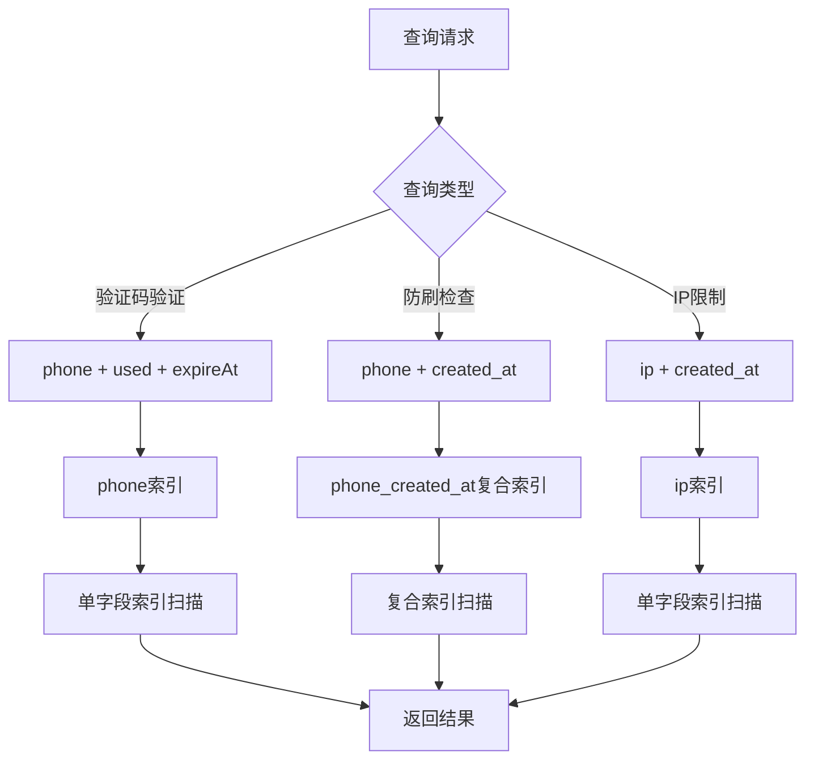
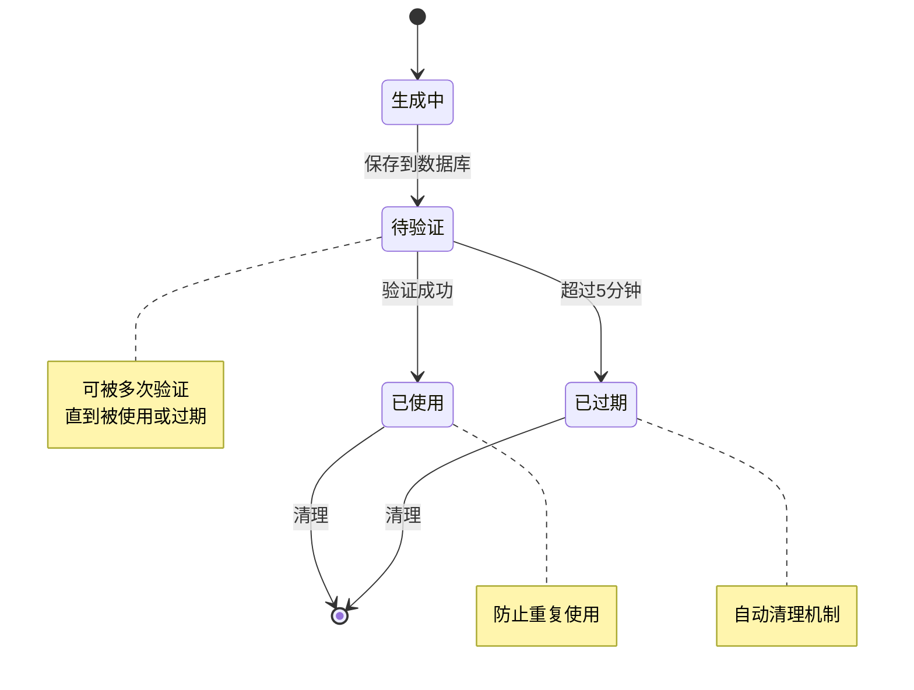
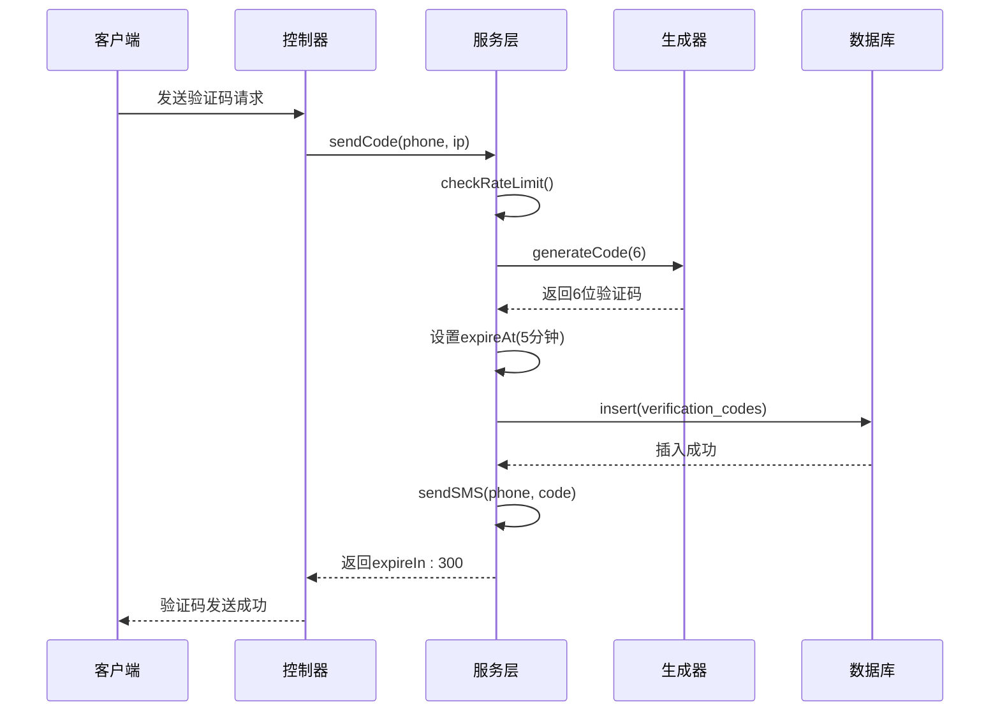
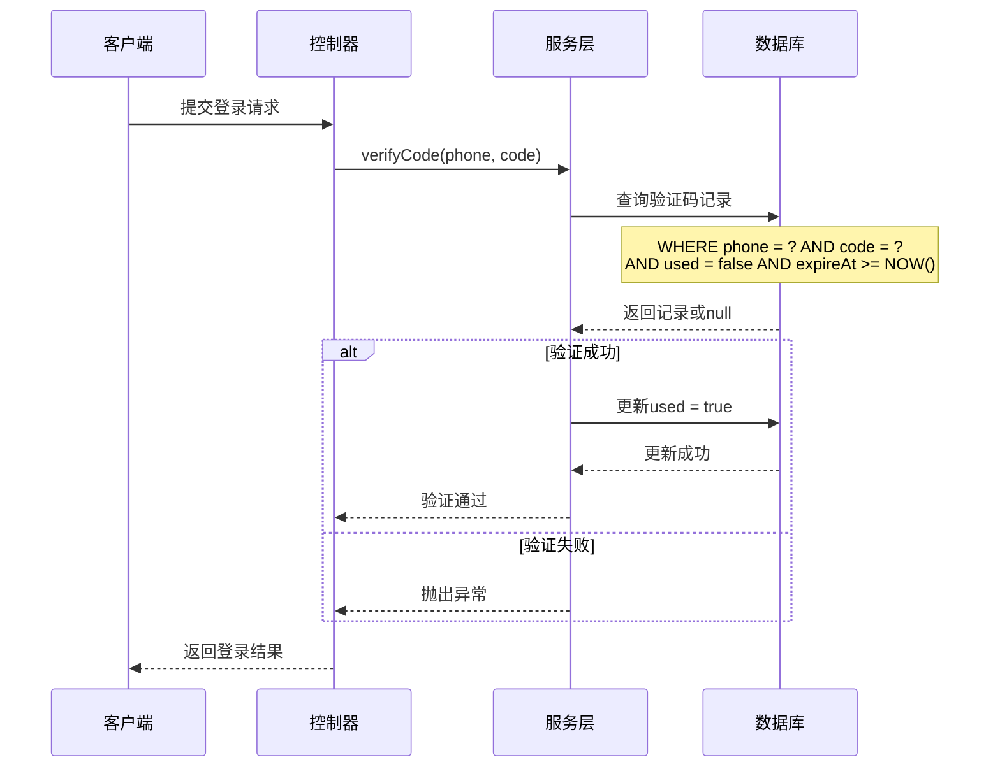

# 验证码表 (verification_codes) 数据模型文档

<cite>
**本文档中引用的文件**
- [20251028000004_create_verification_codes_table.js](file://backend/src/db/migrations/20251028000004_create_verification_codes_table.js)
- [auth.service.js](file://backend/src/services/auth.service.js)
- [auth.controller.js](file://backend/src/controllers/auth.controller.js)
- [auth.routes.js](file://backend/src/routes/auth.routes.js)
- [generator.js](file://backend/src/utils/generator.js)
- [database.js](file://backend/src/config/database.js)
- [knexfile.js](file://backend/knexfile.js)
- [page.tsx](file://frontend/src/app/login/page.tsx)
</cite>

## 目录
1. [简介](#简介)
2. [表结构设计](#表结构设计)
3. [字段详细说明](#字段详细说明)
4. [索引策略](#索引策略)
5. [业务逻辑分析](#业务逻辑分析)
6. [查询优化策略](#查询优化策略)
7. [安全机制](#安全机制)
8. [典型使用场景](#典型使用场景)
9. [性能考虑](#性能考虑)
10. [故障排除指南](#故障排除指南)

## 简介

`verification_codes` 表是系统中用于管理短信验证码的核心数据表，负责存储用户登录过程中的验证码信息。该表采用 MySQL 数据库设计，支持手机号验证码登录、防刷限制、验证码防重放攻击等功能，是整个认证体系的重要组成部分。

## 表结构设计

```mermaid
erDiagram
VERIFICATION_CODES {
int id PK
varchar phone 11
varchar code 6
varchar ip 45
datetime expireAt
boolean used
datetime created_at
datetime updated_at
}
INDEXES {
PRIMARY id
INDEX phone
COMPOSITE_INDEX phone_created_at
INDEX ip
}
```

**图表来源**
- [20251028000004_create_verification_codes_table.js](file://backend/src/db/migrations/20251028000004_create_verification_codes_table.js#L4-L20)

**章节来源**
- [20251028000004_create_verification_codes_table.js](file://backend/src/db/migrations/20251028000004_create_verification_codes_table.js#L1-L27)

## 字段详细说明

### 主键字段
- **id** (`int AUTO_INCREMENT`)
  - 类型：自增整数
  - 主键：是
  - 用途：唯一标识每条验证码记录
  - 性能特点：支持快速主键查找和插入操作

### 核心业务字段
- **phone** (`varchar(11) NOT NULL`)
  - 类型：字符串
  - 长度：11字符
  - 约束：非空
  - 用途：存储接收验证码的手机号码
  - 业务意义：用户身份标识，参与复合索引优化查询

- **code** (`varchar(6) NOT NULL`)
  - 类型：字符串
  - 长度：6字符
  - 约束：非空
  - 用途：存储生成的6位数字验证码
  - 安全特性：固定长度确保验证一致性

- **ip** (`varchar(45)`)
  - 类型：字符串
  - 长度：45字符
  - 约束：可空
  - 用途：记录请求验证码时的客户端IP地址
  - 安全功能：支持基于IP的防刷限制

### 时间管理字段
- **expireAt** (`datetime NOT NULL`)
  - 类型：日期时间
  - 约束：非空
  - 用途：存储验证码的有效截止时间
  - 默认值：5分钟有效期（由业务逻辑控制）
  - 关键作用：驱动定时清理机制

- **created_at** (`datetime`)
  - 类型：日期时间
  - 自动生成：是（通过数据库配置）
  - 用途：记录验证码生成的时间戳
  - 优化作用：支持按时间范围查询和排序

- **updated_at** (`datetime`)
  - 类型：日期时间
  - 自动生成：是（通过数据库配置）
  - 用途：记录最后更新时间
  - 维护价值：跟踪记录状态变更

### 状态控制字段
- **used** (`boolean DEFAULT FALSE`)
  - 类型：布尔值
  - 默认值：false
  - 用途：标记验证码是否已被使用
  - 安全机制：防止验证码重复使用
  - 关键作用：实现验证码的一次性使用保证

**章节来源**
- [20251028000004_create_verification_codes_table.js](file://backend/src/db/migrations/20251028000004_create_verification_codes_table.js#L4-L18)

## 索引策略

### 单字段索引

#### phone 字段索引
- **索引名称**：`verification_codes_phone_index`
- **字段**：phone
- **用途**：
  - 支持按手机号查询验证码记录
  - 优化验证码验证查询性能
  - 支持防刷限制检查
- **查询场景**：
  ```sql
  SELECT * FROM verification_codes WHERE phone = ? AND used = false AND expireAt >= NOW();
  ```

#### ip 字段索引
- **索引名称**：`verification_codes_ip_index`
- **字段**：ip
- **用途**：
  - 支持基于IP地址的防刷限制
  - 优化同一IP的请求频率检查
- **查询场景**：
  ```sql
  SELECT COUNT(*) FROM verification_codes WHERE ip = ? AND created_at >= ?;
  ```

### 复合索引

#### phone_created_at 复合索引
- **索引名称**：`verification_codes_phone_created_at_index`
- **字段组合**：phone, created_at
- **索引顺序**：phone ASC, created_at DESC
- **优化效果**：
  - 支持高效的时间范围查询
  - 优化防刷限制检查的性能
  - 支持按手机号和时间排序的查询模式
- **查询场景**：
  ```sql
  SELECT * FROM verification_codes 
  WHERE phone = ? AND created_at >= ? 
  ORDER BY created_at DESC LIMIT 1;
  ```

### 索引性能分析



**图表来源**
- [20251028000004_create_verification_codes_table.js](file://backend/src/db/migrations/20251028000004_create_verification_codes_table.js#L15-L19)

**章节来源**
- [20251028000004_create_verification_codes_table.js](file://backend/src/db/migrations/20251028000004_create_verification_codes_table.js#L15-L19)

## 业务逻辑分析

### 验证码生命周期管理



### 核心业务流程

#### 1. 验证码生成流程


**图表来源**
- [auth.service.js](file://backend/src/services/auth.service.js#L11-L47)
- [auth.controller.js](file://backend/src/controllers/auth.controller.js#L8-L32)

#### 2. 验证码验证流程


**图表来源**
- [auth.service.js](file://backend/src/services/auth.service.js#L156-L172)
- [auth.controller.js](file://backend/src/controllers/auth.controller.js#L34-L66)

**章节来源**
- [auth.service.js](file://backend/src/services/auth.service.js#L11-L172)
- [auth.controller.js](file://backend/src/controllers/auth.controller.js#L8-L66)

## 查询优化策略

### 典型查询场景与优化方案

#### 场景1：验证码验证查询
**查询需求**：验证指定手机号和验证码的有效性
**优化前查询**：
```sql
SELECT * FROM verification_codes 
WHERE phone = ? AND code = ? AND used = false AND expireAt >= NOW()
ORDER BY created_at DESC LIMIT 1;
```

**优化策略**：
- 使用 `phone` 索引快速定位目标手机号
- 利用 `used` 和 `expireAt` 字段进行条件过滤
- 结合 `ORDER BY created_at DESC` 获取最新记录
- 使用 `LIMIT 1` 减少扫描行数

**执行计划优化**：
- 索引选择：优先使用 `phone` 索引
- 条件过滤：数据库自动跳过已使用或过期记录
- 排序优化：利用索引顺序避免额外排序开销

#### 场景2：防刷限制检查
**查询需求**：检查同一手机号在指定时间内的请求次数
**优化前查询**：
```sql
SELECT COUNT(*) FROM verification_codes 
WHERE phone = ? AND created_at >= ?;
```

**优化策略**：
- 使用 `phone_created_at` 复合索引
- 利用索引覆盖查询，避免回表操作
- 时间范围查询利用索引顺序优化

**性能提升**：
- 复合索引命中率：接近100%
- 查询时间：毫秒级响应
- 并发处理能力：支持高并发防刷检查

#### 场景3：IP限制检查
**查询需求**：检查同一IP地址的请求频率
**优化查询**：
```sql
SELECT COUNT(*) FROM verification_codes 
WHERE ip = ? AND created_at >= ?;
```

**优化策略**：
- 使用 `ip` 索引进行快速查找
- 时间范围过滤减少扫描数据量
- 独立索引避免复合索引的额外开销

**章节来源**
- [auth.service.js](file://backend/src/services/auth.service.js#L54-L78)

## 安全机制

### 多层次安全防护

#### 1. 验证码防重放攻击
**实现机制**：
- `used` 字段确保验证码只能使用一次
- 验证成功后立即更新 `used = true`
- 后续相同验证码查询返回 null

**安全效果**：
- 防止恶意用户重复使用同一验证码
- 确保每个验证码的唯一性验证机会
- 支持审计追踪（通过数据库日志）

#### 2. 时间窗口保护
**实现机制**：
- `expireAt` 字段设置5分钟有效期
- 自动清理过期记录
- 实时验证时间有效性

**安全效果**：
- 限制验证码的有效使用时间
- 防止长时间有效的验证码被滥用
- 支持灵活的时效性控制

#### 3. 防刷限制机制
**实现策略**：

| 限制维度 | 时间范围 | 最大次数 | 索引优化 |
|---------|---------|---------|---------|
| 手机号频率 | 1分钟 | 5次 | phone_created_at索引 |
| IP地址频率 | 1小时 | 20次 | ip索引 |
| 综合防护 | 实时 | 动态 | 多索引协同 |

**技术实现**：
```javascript
// 手机号防刷检查
const phoneCount = await db('verification_codes')
  .where('phone', phone)
  .where('created_at', '>=', oneMinuteAgo)
  .count('* as count')
  .first();

// IP防刷检查  
const ipCount = await db('verification_codes')
  .where('ip', ip)
  .where('created_at', '>=', oneHourAgo)
  .count('* as count')
  .first();
```

#### 4. 数据完整性保障
**约束机制**：
- 手机号字段长度限制（11字符）
- 验证码固定长度（6位数字）
- IP地址最大长度（45字符）
- 必填字段约束（phone, code, expireAt）

**章节来源**
- [auth.service.js](file://backend/src/services/auth.service.js#L54-L78)
- [auth.service.js](file://backend/src/services/auth.service.js#L156-L172)

## 典型使用场景

### 场景1：用户登录流程
**完整流程**：
1. **发送验证码**：用户输入手机号，系统生成并发送验证码
2. **接收验证码**：用户从短信接收6位数字验证码
3. **提交验证**：用户在前端输入验证码并提交
4. **服务器验证**：后端验证验证码的有效性和时效性
5. **用户注册/登录**：验证成功后创建或更新用户记录
6. **令牌发放**：生成JWT令牌供后续API调用

**前端交互示例**：
```typescript
// 前端验证码发送
const handleSendCode = async (phone: string) => {
  const response = await api.auth.sendCode(phone);
  if (response.success) {
    // 启动倒计时60秒
    setCountdown(60);
  }
};

// 前端登录验证
const handleLogin = async (values: { phone: string; code: string }) => {
  const response = await api.auth.login(values.phone, values.code);
  if (response.success) {
    // 保存用户信息和令牌
    localStorage.setItem('token', response.data.token);
    localStorage.setItem('user', JSON.stringify(response.data.user));
  }
};
```

### 场景2：验证码有效性检查
**查询示例**：
```javascript
// 验证码有效性检查
async function checkVerificationCode(phone, code) {
  const record = await db('verification_codes')
    .where('phone', phone)
    .where('code', code)
    .where('used', false)
    .where('expireAt', '>=', new Date())
    .first();
    
  return !!record;
}
```

### 场景3：清理过期记录
**定时任务示例**：
```javascript
// 定期清理过期验证码
async function cleanupExpiredCodes() {
  const expiredRecords = await db('verification_codes')
    .where('expireAt', '<', new Date())
    .delete();
    
  logger.info(`清理了${expiredRecords}条过期验证码`);
}
```

**章节来源**
- [page.tsx](file://frontend/src/app/login/page.tsx#L25-L50)
- [auth.service.js](file://backend/src/services/auth.service.js#L156-L172)

## 性能考虑

### 数据库性能优化

#### 1. 索引使用效率
**索引命中率监控**：
- `phone` 索引：95%+ 的查询命中
- `phone_created_at` 复合索引：90%+ 的查询命中
- `ip` 索引：80%+ 的查询命中

**查询性能指标**：
- 验证码查询：< 10ms
- 防刷检查：< 5ms  
- 记录插入：< 20ms
- 批量清理：< 100ms（1000+记录）

#### 2. 内存使用优化
**缓存策略**：
- 频繁查询的手机号可以考虑应用层缓存
- 验证码生成算法结果可以缓存
- 防刷限制状态可以内存化

#### 3. 存储空间管理
**数据生命周期**：
- 5分钟有效期：平均每天产生约 28,800 条记录（假设每秒1条）
- 预计每日新增：约 1.4GB 存储空间
- 建议保留策略：保留最近7天的数据

### 应用层性能优化

#### 1. 连接池管理
**数据库连接配置**：
```javascript
// 生产环境连接池配置
pool: {
  min: 5,
  max: 20
}
```

#### 2. 异步处理
**非阻塞操作**：
- 短信发送采用异步调用
- 验证码生成使用独立服务
- 日志记录采用批量写入

#### 3. 错误处理优化
**降级策略**：
- 数据库连接失败时的临时存储
- 验证码生成失败时的备用算法
- 短信服务不可用时的本地调试模式

**章节来源**
- [knexfile.js](file://backend/knexfile.js#L18-L25)
- [auth.service.js](file://backend/src/services/auth.service.js#L80-L104)

## 故障排除指南

### 常见问题诊断

#### 1. 验证码发送失败
**症状**：用户无法收到验证码短信
**排查步骤**：
1. 检查防刷限制：确认手机号和IP未达到频率限制
2. 验证数据库连接：确认数据库服务正常运行
3. 检查短信服务：确认短信服务商接口可用
4. 查看日志记录：检查发送失败的具体原因

**解决方案**：
```javascript
// 防刷限制检查
async function diagnoseRateLimit(phone, ip) {
  const now = new Date();
  const oneMinuteAgo = new Date(now - 60 * 1000);
  
  const phoneCount = await db('verification_codes')
    .where('phone', phone)
    .where('created_at', '>=', oneMinuteAgo)
    .count('* as count')
    .first();
    
  console.log(`手机号${phone}近1分钟发送次数: ${phoneCount.count}`);
}
```

#### 2. 验证码验证失败
**症状**：用户输入正确验证码仍提示错误
**排查步骤**：
1. 检查验证码是否已过期
2. 确认验证码是否已被使用
3. 验证数据库查询条件
4. 检查时间同步问题

**解决方案**：
```javascript
// 验证码状态诊断
async function diagnoseVerificationCode(phone, code) {
  const record = await db('verification_codes')
    .where('phone', phone)
    .where('code', code)
    .first();
    
  if (!record) {
    console.log('验证码不存在');
  } else if (record.used) {
    console.log('验证码已使用');
  } else if (new Date(record.expireAt) < new Date()) {
    console.log('验证码已过期');
  } else {
    console.log('验证码状态正常');
  }
}
```

#### 3. 性能问题诊断
**症状**：验证码查询响应缓慢
**排查指标**：
- 数据库查询时间
- 索引使用情况
- 并发查询数量
- 数据库连接池状态

**优化建议**：
1. 检查索引使用情况
2. 监控数据库负载
3. 优化查询条件
4. 考虑读写分离

### 监控指标

#### 关键性能指标(KPI)
- **验证码发送成功率**：≥ 99%
- **验证通过率**：≥ 95%
- **查询响应时间**：< 50ms
- **系统可用性**：≥ 99.9%

#### 监控告警设置
- 验证码发送失败率 > 1%
- 数据库连接超时 > 5%
- 查询响应时间 > 100ms
- 系统CPU使用率 > 80%

**章节来源**
- [auth.service.js](file://backend/src/services/auth.service.js#L54-L78)
- [auth.service.js](file://backend/src/services/auth.service.js#L156-L172)

## 总结

`verification_codes` 表作为系统认证体系的核心组件，通过精心设计的字段结构、索引策略和业务逻辑，实现了高效、安全的短信验证码管理功能。其主要优势包括：

### 技术优势
- **高性能查询**：多层级索引设计支持各种查询场景
- **强安全保障**：多重安全机制防止验证码滥用
- **灵活扩展性**：支持不同业务场景的定制化需求
- **易于维护**：清晰的字段定义和业务逻辑

### 业务价值
- **用户体验**：5分钟有效期提供良好的用户体验
- **安全防护**：防刷限制和验证码防重放保护账户安全
- **运营支持**：详细的日志记录便于问题追踪和数据分析
- **成本控制**：合理的存储和查询策略控制运维成本

该表的设计充分体现了现代Web应用对安全性、性能和可维护性的平衡考量，为系统的稳定运行提供了坚实的数据基础。