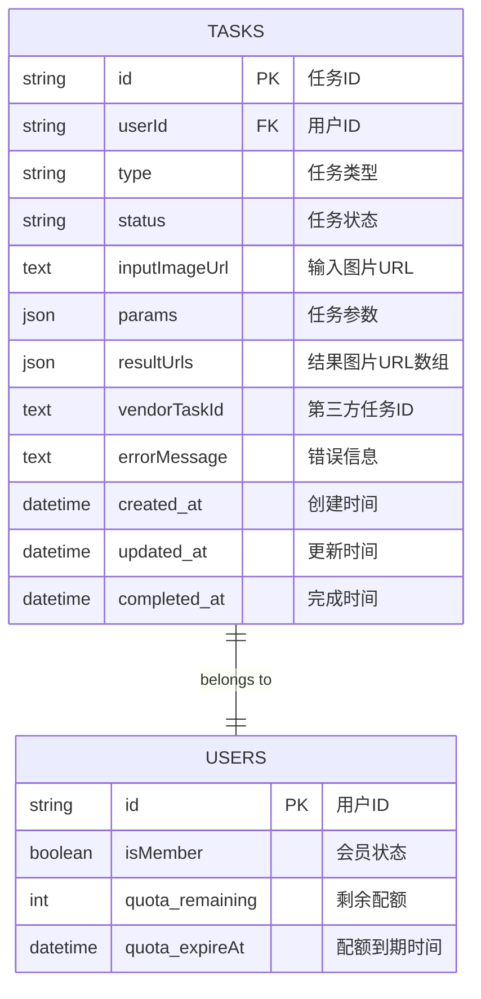
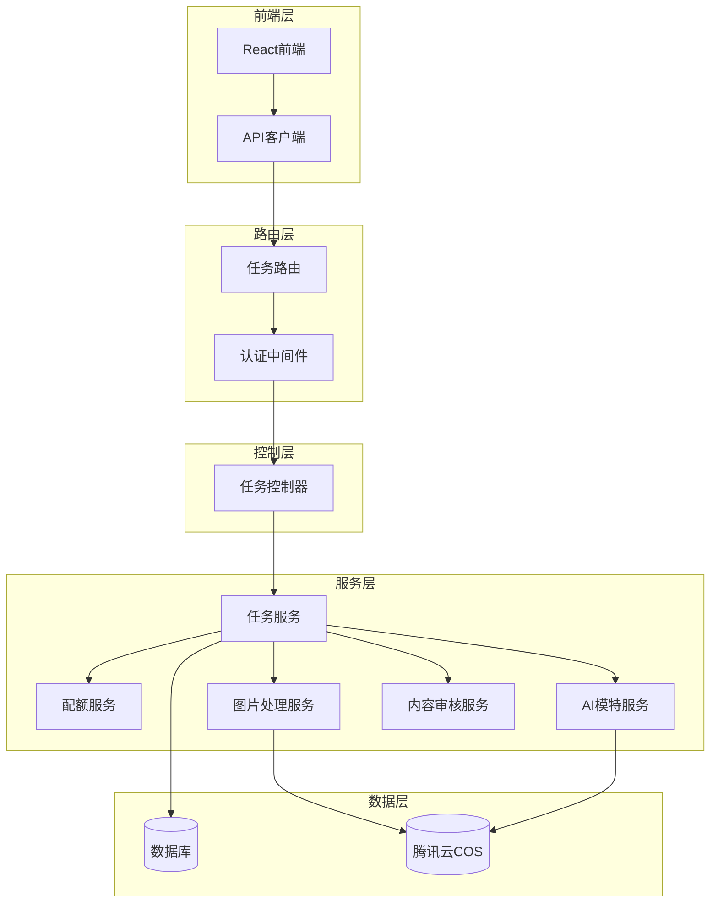
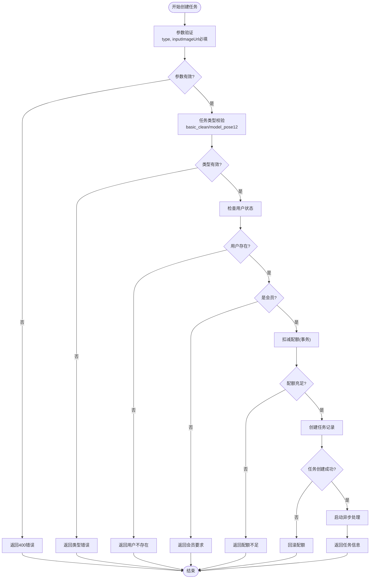
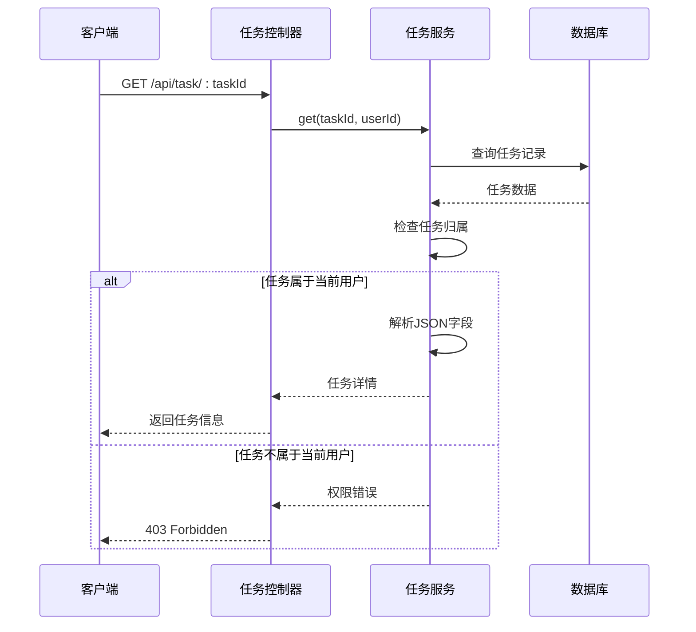
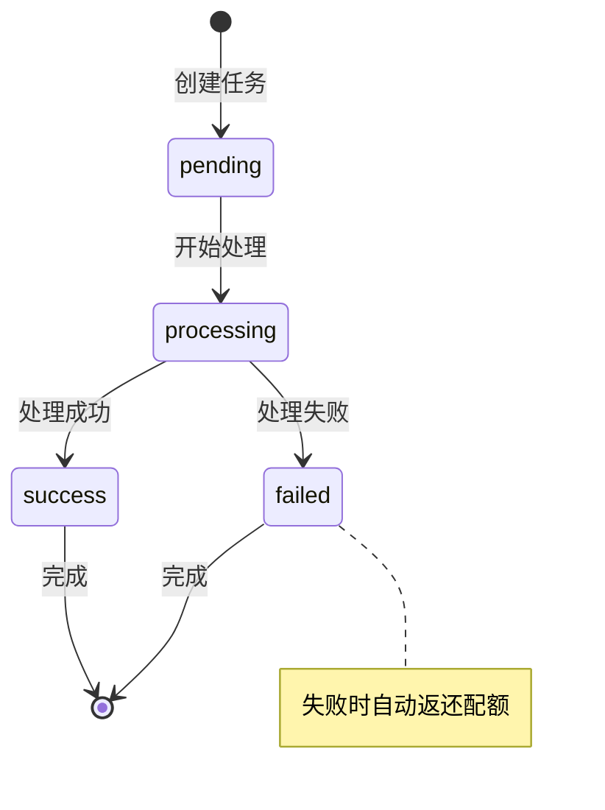
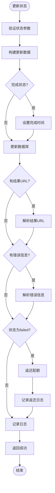
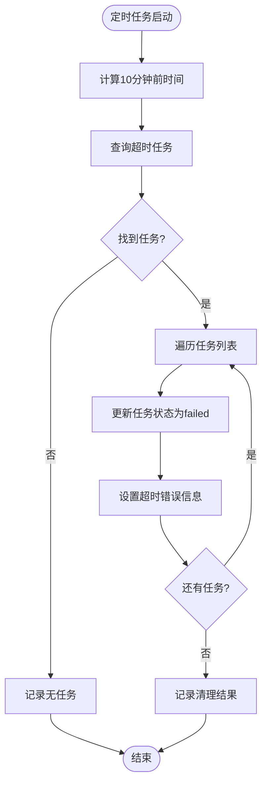
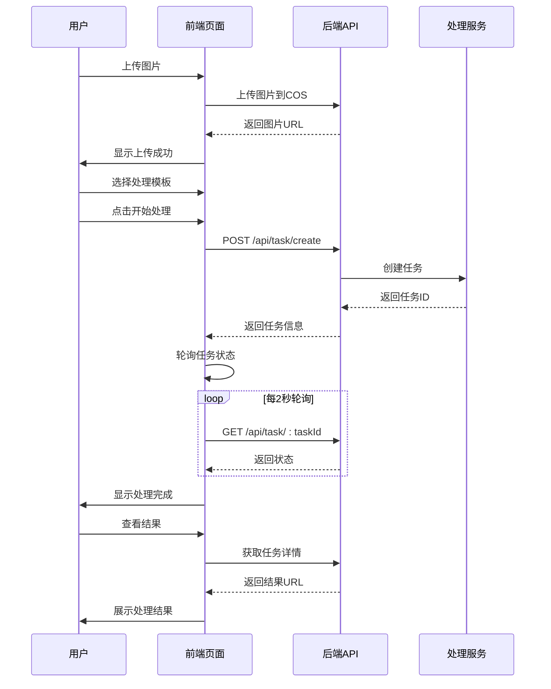
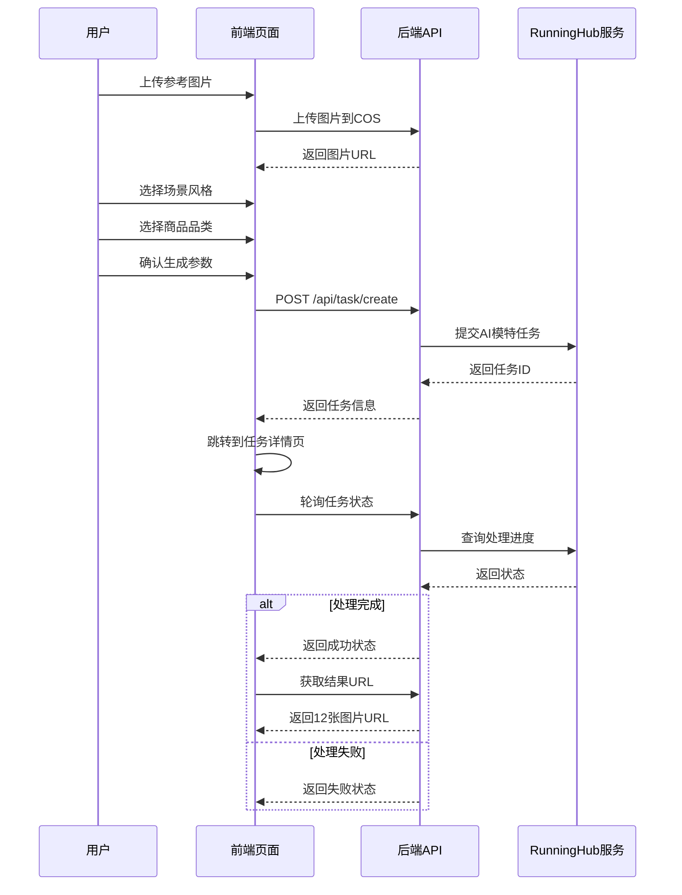

# 任务模块全生命周期管理文档

<cite>
**本文档引用的文件**
- [task.controller.js](file://backend/src/controllers/task.controller.js)
- [task.service.js](file://backend/src/services/task.service.js)
- [task.routes.js](file://backend/src/routes/task.routes.js)
- [quota.service.js](file://backend/src/services/quota.service.js)
- [imageProcess.service.js](file://backend/src/services/imageProcess.service.js)
- [aiModel.service.js](file://backend/src/services/aiModel.service.js)
- [contentAudit.service.js](file://backend/src/services/contentAudit.service.js)
- [auth.middleware.js](file://backend/src/middlewares/auth.middleware.js)
- [create_tasks_table.js](file://backend/src/db/migrations/20251028000003_create_tasks_table.js)
- [basic.page.tsx](file://frontend/src/app/task/basic/page.tsx)
- [model.page.tsx](file://frontend/src/app/task/model/page.tsx)
</cite>

## 目录
1. [系统概述](#系统概述)
2. [数据库设计](#数据库设计)
3. [核心功能架构](#核心功能架构)
4. [任务创建流程](#任务创建流程)
5. [任务查询与列表](#任务查询与列表)
6. [任务状态管理](#任务状态管理)
7. [超时清理机制](#超时清理机制)
8. [前端交互流程](#前端交互流程)
9. [性能优化策略](#性能优化策略)
10. [故障处理机制](#故障处理机制)

## 系统概述

任务模块是AI图片处理系统的核心组件，负责管理用户创建的各种AI处理任务，包括基础修图(basic_clean)和AI模特(model_pose12)两大类型。系统采用前后端分离架构，后端提供RESTful API接口，前端通过React组件实现用户交互。

### 主要特性

- **双类型任务支持**: 基础修图和AI模特生成
- **配额管理系统**: 基于会员制度的资源控制
- **状态机流转**: 完整的任务生命周期管理
- **内容审核**: 集成腾讯云内容审核服务
- **定时清理**: 自动清理超时任务
- **权限控制**: 严格的用户权限验证

## 数据库设计

任务模块的数据存储在`tasks`表中，采用JSON字段存储复杂参数，支持灵活的任务配置。



**图表来源**
- [create_tasks_table.js](file://backend/src/db/migrations/20251028000003_create_tasks_table.js#L1-L34)

**章节来源**
- [create_tasks_table.js](file://backend/src/db/migrations/20251028000003_create_tasks_table.js#L1-L34)

## 核心功能架构

任务模块采用分层架构设计，包含控制器(Controller)、服务(Service)和中间件(Middleware)三层。



**图表来源**
- [task.controller.js](file://backend/src/controllers/task.controller.js#L1-L173)
- [task.service.js](file://backend/src/services/task.service.js#L1-L259)
- [task.routes.js](file://backend/src/routes/task.routes.js#L1-L24)

## 任务创建流程

任务创建是用户使用AI功能的第一步，涉及参数验证、会员检查、配额扣减和任务启动等多个环节。

### create方法详解

create方法实现了完整的任务创建流程，包含以下关键步骤：



**图表来源**
- [task.controller.js](file://backend/src/controllers/task.controller.js#L10-L60)
- [task.service.js](file://backend/src/services/task.service.js#L12-L60)

### 任务类型校验

系统严格验证任务类型，只允许两种类型：
- **basic_clean**: 基础修图任务，包含AI抠图、白底处理和图片增强
- **model_pose12**: AI模特生成任务，生成12张不同分镜的模特图片

### 会员状态检查

系统通过事务保证配额扣减的原子性，确保只有会员用户才能创建任务。

### 配额扣减机制

配额扣减采用行锁机制，防止并发竞争导致配额不足：

**章节来源**
- [task.controller.js](file://backend/src/controllers/task.controller.js#L10-L60)
- [task.service.js](file://backend/src/services/task.service.js#L12-L60)
- [quota.service.js](file://backend/src/services/quota.service.js#L15-L50)

## 任务查询与列表

### get方法权限控制

get方法实现了严格的权限控制机制，确保用户只能查看自己的任务：



**图表来源**
- [task.controller.js](file://backend/src/controllers/task.controller.js#L62-L85)
- [task.service.js](file://backend/src/services/task.service.js#L62-L95)

### list方法分页筛选

list方法支持灵活的分页和筛选功能：

| 参数 | 类型 | 描述 | 默认值 |
|------|------|------|--------|
| limit | number | 每页数量 | 10 |
| offset | number | 偏移量 | 0 |
| status | string | 任务状态 | null |
| type | string | 任务类型 | null |

**章节来源**
- [task.controller.js](file://backend/src/controllers/task.controller.js#L87-L105)
- [task.service.js](file://backend/src/services/task.service.js#L140-L190)

## 任务状态管理

### 状态机流转

任务状态遵循严格的流转规则：



**图表来源**
- [task.service.js](file://backend/src/services/task.service.js#L97-L140)

### updateStatus方法

updateStatus方法负责更新任务状态，支持多种状态转换：



**图表来源**
- [task.service.js](file://backend/src/services/task.service.js#L97-L140)

### 失败自动返还配额

当任务状态变为failed时，系统会自动返还相应的配额：

**章节来源**
- [task.service.js](file://backend/src/services/task.service.js#L97-L140)
- [quota.service.js](file://backend/src/services/quota.service.js#L55-L75)

## 超时清理机制

### 定时任务设计

系统每10分钟运行一次超时清理任务，自动处理长时间未处理的pending任务：



**图表来源**
- [task.service.js](file://backend/src/services/task.service.js#L210-L259)

### 清理策略

- **触发条件**: 每10分钟执行一次
- **清理范围**: status='pending'且创建时间超过10分钟的任务
- **处理方式**: 自动标记为failed，设置超时错误信息
- **日志记录**: 记录清理的任务数量和详细信息

**章节来源**
- [task.service.js](file://backend/src/services/task.service.js#L210-L259)

## 前端交互流程

### 基础修图流程

基础修图页面展示了完整的任务创建和处理流程：



**图表来源**
- [basic.page.tsx](file://frontend/src/app/task/basic/page.tsx#L1-L324)

### AI模特生成流程

AI模特生成页面提供了更复杂的交互流程：



**图表来源**
- [model.page.tsx](file://frontend/src/app/task/model/page.tsx#L1-L277)

### 接口调用示例

#### 创建任务
```javascript
// 基础修图任务
await api.task.create({
  type: 'basic_clean',
  inputImageUrl: 'https://cos.example.com/input/abc123.jpg',
  params: {
    template: 'all' // all/matting/white-bg
  }
});

// AI模特任务
await api.task.create({
  type: 'model_pose12',
  inputImageUrl: 'https://cos.example.com/input/abc123.jpg',
  params: {
    scene: 'street',    // street/studio/indoor
    category: 'shoes'   // shoes/dress/hoodie
  }
});
```

#### 获取任务详情
```javascript
// 获取单个任务
const task = await api.task.get(taskId);

// 获取任务列表
const tasks = await api.task.list({
  limit: 10,
  offset: 0,
  status: 'success',
  type: 'basic_clean'
});
```

**章节来源**
- [basic.page.tsx](file://frontend/src/app/task/basic/page.tsx#L40-L80)
- [model.page.tsx](file://frontend/src/app/task/model/page.tsx#L120-L160)

## 性能优化策略

### 数据库查询优化

1. **索引设计**: 在`userId`、`status`、`created_at`等字段建立复合索引
2. **查询优化**: 使用LIMIT和OFFSET实现高效分页
3. **连接优化**: 通过外键关联减少JOIN操作

### 缓存策略

1. **配额缓存**: 用户配额信息可在内存中缓存
2. **任务状态缓存**: 频繁查询的任务状态可使用Redis缓存
3. **图片URL缓存**: 处理后的图片URL可缓存30天

### 异步处理

1. **图片处理异步化**: 基础修图和AI模特任务采用异步处理
2. **内容审核异步化**: 图片内容审核在处理完成后异步执行
3. **轮询机制**: 前端采用2秒间隔轮询，避免频繁请求

## 故障处理机制

### 错误分类处理

系统对不同类型错误采用不同的处理策略：

| 错误类型 | 处理策略 | 用户体验 |
|----------|----------|----------|
| 参数错误 | 立即返回400 | 明确错误提示 |
| 权限错误 | 返回403 | 提示需要登录/会员 |
| 系统错误 | 返回500 | 显示通用错误信息 |
| 业务错误 | 记录日志，返回具体错误码 | 显示具体错误原因 |

### 重试机制

1. **网络重试**: 对外API调用采用指数退避重试
2. **任务重试**: 处理失败的任务可重新提交
3. **配额重试**: 配额不足时提示用户续费

### 监控告警

1. **任务成功率监控**: 监控各类任务的成功率
2. **处理时间监控**: 监控任务处理时间分布
3. **错误率监控**: 监控系统错误率和业务错误率
4. **配额使用监控**: 监控用户配额使用情况

**章节来源**
- [task.service.js](file://backend/src/services/task.service.js#L210-L259)
- [imageProcess.service.js](file://backend/src/services/imageProcess.service.js#L450-L482)
- [aiModel.service.js](file://backend/src/services/aiModel.service.js#L280-L344)

## 总结

任务模块通过完善的生命周期管理，为用户提供稳定可靠的AI图片处理服务。系统具备以下核心优势：

1. **完整的功能覆盖**: 支持基础修图和AI模特两大核心功能
2. **严格的权限控制**: 确保用户只能访问自己的任务数据
3. **智能的配额管理**: 基于会员制度的资源控制机制
4. **可靠的状态管理**: 完整的任务状态机流转和错误恢复
5. **高效的性能表现**: 通过异步处理和缓存优化提升用户体验
6. **完善的监控体系**: 全面的错误处理和故障恢复机制

通过前端与后端的紧密配合，系统为用户提供了流畅、直观的操作体验，同时确保了系统的稳定性和可扩展性。