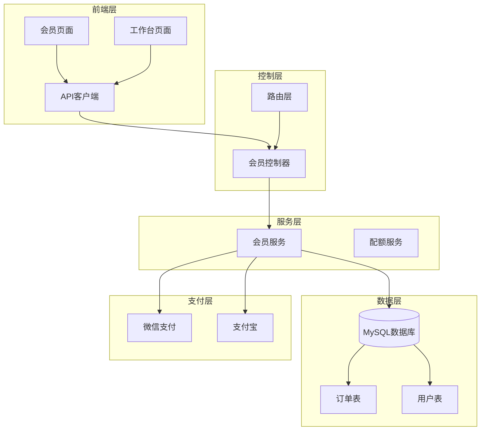
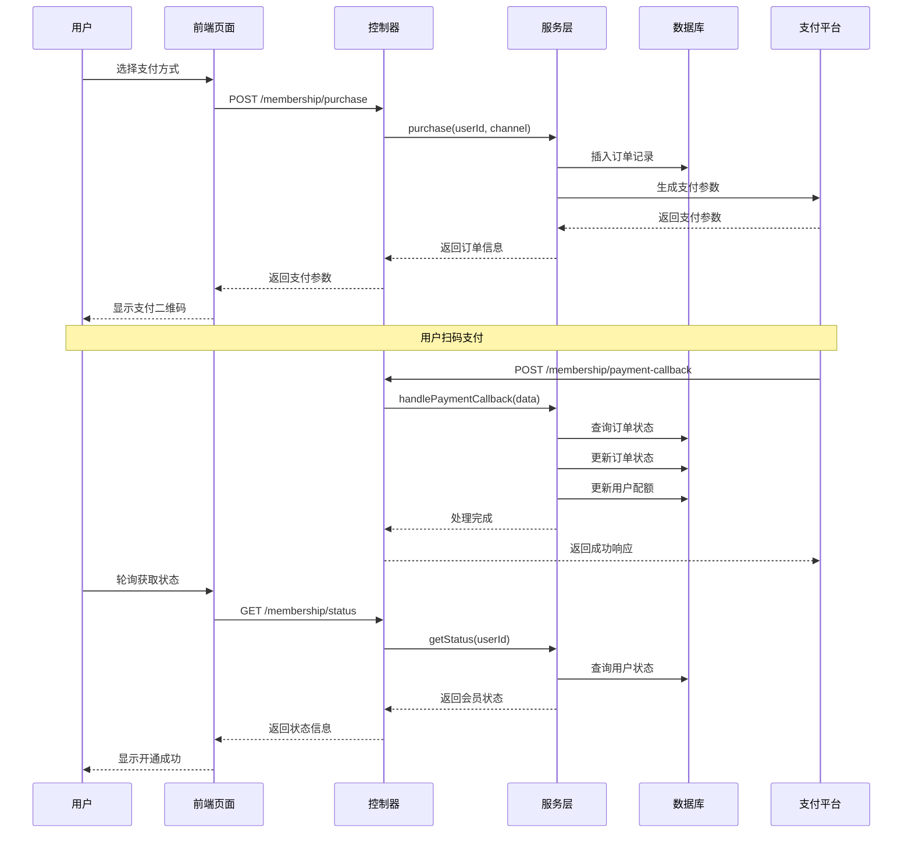
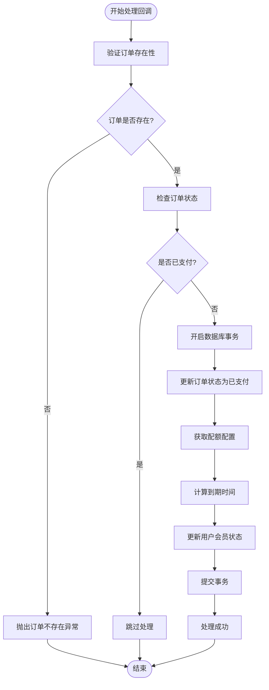
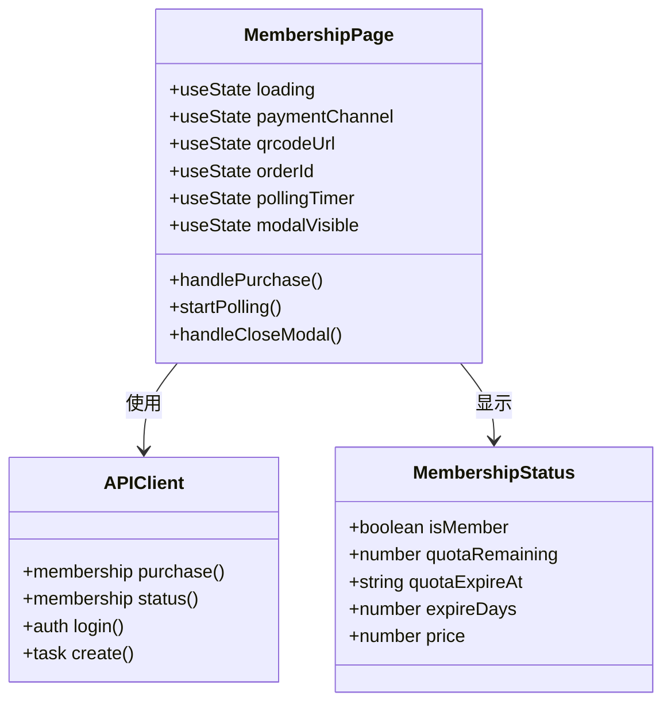
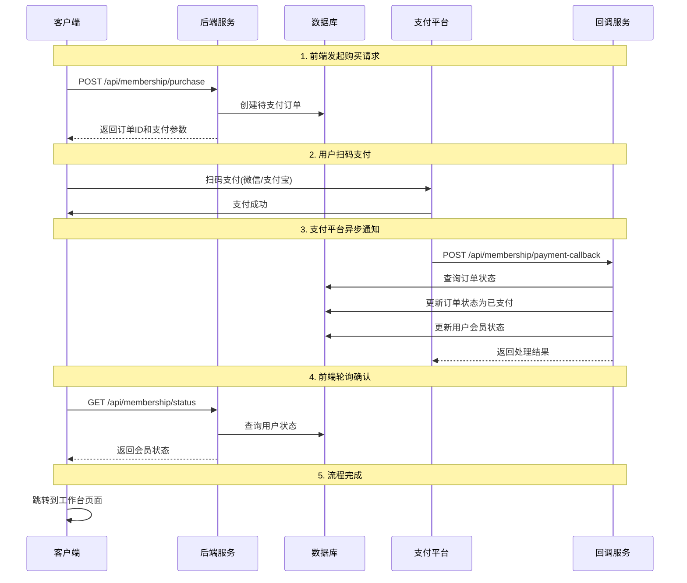
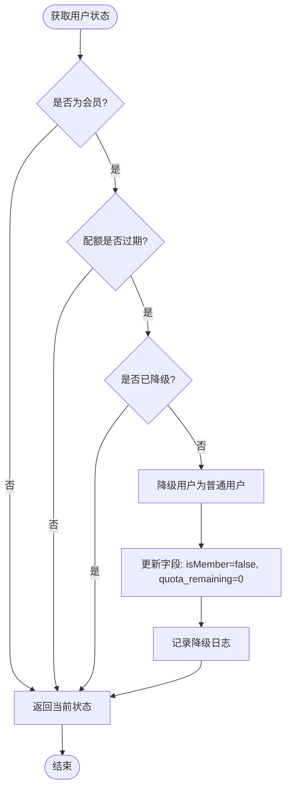

# 会员模块

<cite>
**本文档引用的文件**
- [membership.controller.js](file://backend/src/controllers/membership.controller.js)
- [membership.service.js](file://backend/src/services/membership.service.js)
- [membership.routes.js](file://backend/src/routes/membership.routes.js)
- [create_orders_table.js](file://backend/src/db/migrations/20251028000002_create_orders_table.js)
- [create_users_table.js](file://backend/src/db/migrations/20251028000001_create_users_table.js)
- [generator.js](file://backend/src/utils/generator.js)
- [database.js](file://backend/src/config/database.js)
- [knexfile.js](file://backend/knexfile.js)
- [page.tsx](file://frontend/src/app/membership/page.tsx)
- [api.ts](file://frontend/src/lib/api.ts)
- [workspace.tsx](file://frontend/src/app/workspace/page.tsx)
</cite>

## 目录
1. [项目概述](#项目概述)
2. [系统架构](#系统架构)
3. [核心组件分析](#核心组件分析)
4. [业务流程详解](#业务流程详解)
5. [数据库设计](#数据库设计)
6. [环境配置](#环境配置)
7. [前端实现](#前端实现)
8. [支付流程时序](#支付流程时序)
9. [自动降级机制](#自动降级机制)
10. [性能考虑](#性能考虑)
11. [故障排除指南](#故障排除指南)
12. [总结](#总结)

## 项目概述

会员模块是AI服装处理平台的核心付费功能，为用户提供AI图像处理能力的月度配额服务。该模块实现了完整的会员购买流程，包括订单创建、支付处理、状态管理和自动降级等功能。

### 主要特性

- **双渠道支付支持**：兼容微信支付和支付宝支付
- **原子性事务处理**：确保订单状态更新与用户配额初始化的一致性
- **自动降级机制**：过期会员自动降级为普通用户
- **实时状态查询**：提供会员状态的实时更新
- **幂等性保证**：防止重复处理支付回调

## 系统架构

**图表来源**
- [membership.controller.js](file://backend/src/controllers/membership.controller.js#L1-L78)
- [membership.service.js](file://backend/src/services/membership.service.js#L1-L191)
- [membership.routes.js](file://backend/src/routes/membership.routes.js#L1-L28)

## 核心组件分析

### 控制器层

会员控制器负责处理HTTP请求和响应，提供了三个核心接口：

#### purchase方法 - 订单创建
负责接收支付渠道参数，验证用户身份，并调用服务层创建订单。

#### paymentCallback方法 - 支付回调处理
处理支付平台的异步回调通知，验证订单状态并执行会员开通操作。

#### getStatus方法 - 状态查询
查询用户的会员状态，包括配额剩余量、到期时间和会员标识。

**章节来源**
- [membership.controller.js](file://backend/src/controllers/membership.controller.js#L10-L77)

### 服务层

会员服务是业务逻辑的核心，实现了复杂的会员管理功能：

#### purchase方法实现
1. **配置读取**：从环境变量获取会员价格和配额配置
2. **订单创建**：生成唯一订单ID并插入订单表
3. **支付参数生成**：根据支付渠道生成相应的支付参数

#### handlePaymentCallback方法实现
采用事务性操作确保数据一致性：
1. **订单验证**：检查订单是否存在且未被处理
2. **幂等性检查**：防止重复处理同一订单
3. **事务处理**：原子性更新订单状态和用户配额

#### getStatus方法实现
提供会员状态的综合查询，包括：
- 会员有效性判断
- 配额剩余量计算
- 到期时间检查
- 自动降级处理

**章节来源**
- [membership.service.js](file://backend/src/services/membership.service.js#L10-L190)

## 业务流程详解

### 会员购买流程

**图表来源**
- [membership.controller.js](file://backend/src/controllers/membership.controller.js#L10-L40)
- [membership.service.js](file://backend/src/services/membership.service.js#L10-L85)

### 支付回调处理机制

支付回调处理是会员模块的核心环节，采用了严格的事务性保证：

#### 事务性会员开通

**图表来源**
- [membership.service.js](file://backend/src/services/membership.service.js#L86-L133)

**章节来源**
- [membership.service.js](file://backend/src/services/membership.service.js#L86-L133)

## 数据库设计

### 用户表结构

用户表包含了会员状态和配额管理的所有必要字段：

| 字段名 | 类型 | 默认值 | 说明 |
|--------|------|--------|------|
| id | string(32) | - | 用户唯一标识符 |
| phone | string(11) | - | 手机号码(唯一) |
| isMember | boolean | false | 是否为会员 |
| quota_remaining | integer | 0 | 剩余配额数量 |
| quota_expireAt | datetime | null | 配额到期时间 |
| created_at | datetime | CURRENT_TIMESTAMP | 创建时间 |
| updated_at | datetime | CURRENT_TIMESTAMP | 更新时间 |

### 订单表结构

订单表记录了完整的支付流程信息：

| 字段名 | 类型 | 默认值 | 说明 |
|--------|------|--------|------|
| id | string(32) | - | 订单唯一标识符 |
| userId | string(32) | - | 关联用户ID |
| status | string(20) | - | 订单状态(pending/paid) |
| amount | decimal(10,2) | - | 订单金额(分) |
| channel | string(20) | - | 支付渠道(wx/alipay) |
| transactionId | string(64) | null | 第三方交易号 |
| createdAt | datetime | - | 创建时间 |
| paidAt | datetime | null | 支付时间 |

**章节来源**
- [create_users_table.js](file://backend/src/db/migrations/20251028000001_create_users_table.js#L4-L18)
- [create_orders_table.js](file://backend/src/db/migrations/20251028000002_create_orders_table.js#L4-L18)

## 环境配置

会员模块依赖以下关键环境变量：

| 变量名 | 默认值 | 说明 |
|--------|--------|------|
| MEMBERSHIP_PRICE | 9900 | 会员价格(分)，默认99元 |
| PLAN_MONTHLY_QUOTA | 100 | 月度配额数量，默认100次 |
| MEMBERSHIP_DURATION_DAYS | 30 | 会员有效期(天)，默认30天 |
| WECHAT_APPID | - | 微信支付应用ID |
| ALIPAY_APP_ID | - | 支付宝应用ID |

### 配置作用说明

- **MEMBERSHIP_PRICE**：定义会员价格，用于订单创建和状态显示
- **PLAN_MONTHLY_QUOTA**：决定会员的月度使用配额数量
- **MEMBERSHIP_DURATION_DAYS**：控制会员的有效期长度

**章节来源**
- [membership.service.js](file://backend/src/services/membership.service.js#L15-L16)

## 前端实现

### 会员页面设计

前端会员页面提供了完整的购买体验，包括：

#### 支付方式选择
- **微信支付**：支持微信内置浏览器和小程序
- **支付宝支付**：支持支付宝APP和网页支付

#### 实时状态监控
- **轮询机制**：每3秒查询一次支付状态
- **超时处理**：5分钟内未支付自动停止轮询
- **状态反馈**：实时显示支付进度和结果

#### 用户界面组件

**图表来源**
- [page.tsx](file://frontend/src/app/membership/page.tsx#L20-L351)
- [api.ts](file://frontend/src/lib/api.ts#L50-L55)

**章节来源**
- [page.tsx](file://frontend/src/app/membership/page.tsx#L20-L351)
- [api.ts](file://frontend/src/lib/api.ts#L50-L55)

## 支付流程时序

### 完整支付流程

**图表来源**
- [membership.controller.js](file://backend/src/controllers/membership.controller.js#L10-L40)
- [membership.service.js](file://backend/src/services/membership.service.js#L86-L133)

### 支付参数生成

当前系统使用模拟支付参数，实际部署时需要集成真实的支付SDK：

#### 微信支付参数结构
- **appId**: 应用ID
- **timeStamp**: 时间戳
- **nonceStr**: 随机字符串
- **package**: 统一下单参数
- **signType**: 签名类型
- **paySign**: 支付签名

#### 支付宝参数结构
- **orderString**: 支付宝订单字符串

**章节来源**
- [membership.service.js](file://backend/src/services/membership.service.js#L50-L75)

## 自动降级机制

### 到期检查逻辑

会员模块实现了智能的自动降级机制，确保过期会员不会继续享受会员权益：

**图表来源**
- [membership.service.js](file://backend/src/services/membership.service.js#L135-L165)

### 降级触发条件

自动降级会在以下情况下触发：
1. **配额到期时间检查**：比较当前时间和配额到期时间
2. **会员状态验证**：确认用户当前为会员状态
3. **幂等性保护**：避免重复降级操作

**章节来源**
- [membership.service.js](file://backend/src/services/membership.service.js#L135-L165)

## 性能考虑

### 数据库优化策略

1. **索引设计**：
   - 用户表：对phone字段建立唯一索引
   - 订单表：对userId和status组合索引
   - 订单表：对createdAt字段建立索引

2. **连接池配置**：
   - 开发环境：最小2个，最大10个连接
   - 生产环境：最小5个，最大20个连接

3. **事务边界控制**：
   - 支付回调中的事务仅包含必要的数据库操作
   - 避免长时间持有数据库连接

### 缓存策略

虽然当前实现没有使用缓存，但可以考虑以下优化：
- **用户状态缓存**：缓存会员状态以减少数据库查询
- **配额信息缓存**：缓存用户配额信息
- **支付状态缓存**：缓存支付处理状态

## 故障排除指南

### 常见问题及解决方案

#### 支付回调失败
**症状**：用户支付成功但会员状态未更新
**原因**：支付回调处理异常或事务回滚
**解决方案**：
1. 检查支付平台的回调地址配置
2. 查看服务器日志中的错误信息
3. 验证数据库事务的完整性

#### 订单状态不一致
**症状**：订单显示已支付但用户无会员权限
**原因**：支付回调处理中断或异常
**解决方案**：
1. 手动检查订单状态
2. 验证用户表的会员状态
3. 执行手动会员开通操作

#### 自动降级延迟
**症状**：会员过期后仍显示为会员状态
**原因**：状态查询频率不足或降级逻辑延迟
**解决方案**：
1. 增加状态查询频率
2. 优化降级检查逻辑
3. 添加定时任务进行批量检查

**章节来源**
- [membership.service.js](file://backend/src/services/membership.service.js#L86-L133)

## 总结

会员模块是一个设计完善的付费功能系统，具有以下特点：

### 技术优势
- **事务性保证**：确保订单状态和用户状态的一致性
- **幂等性处理**：防止重复支付和重复处理
- **自动降级机制**：智能化的过期处理
- **双渠道支持**：灵活的支付方式选择

### 架构特点
- **清晰的分层设计**：控制器、服务、数据层职责分明
- **良好的扩展性**：易于添加新的支付渠道
- **完善的错误处理**：全面的异常捕获和处理机制

### 业务价值
- **用户体验优化**：流畅的购买流程和实时状态反馈
- **商业价值体现**：明确的定价策略和配额管理
- **系统稳定性**：可靠的事务处理和故障恢复机制

该模块为AI服装处理平台提供了坚实的付费功能基础，支持平台的商业化运营和用户增长战略。