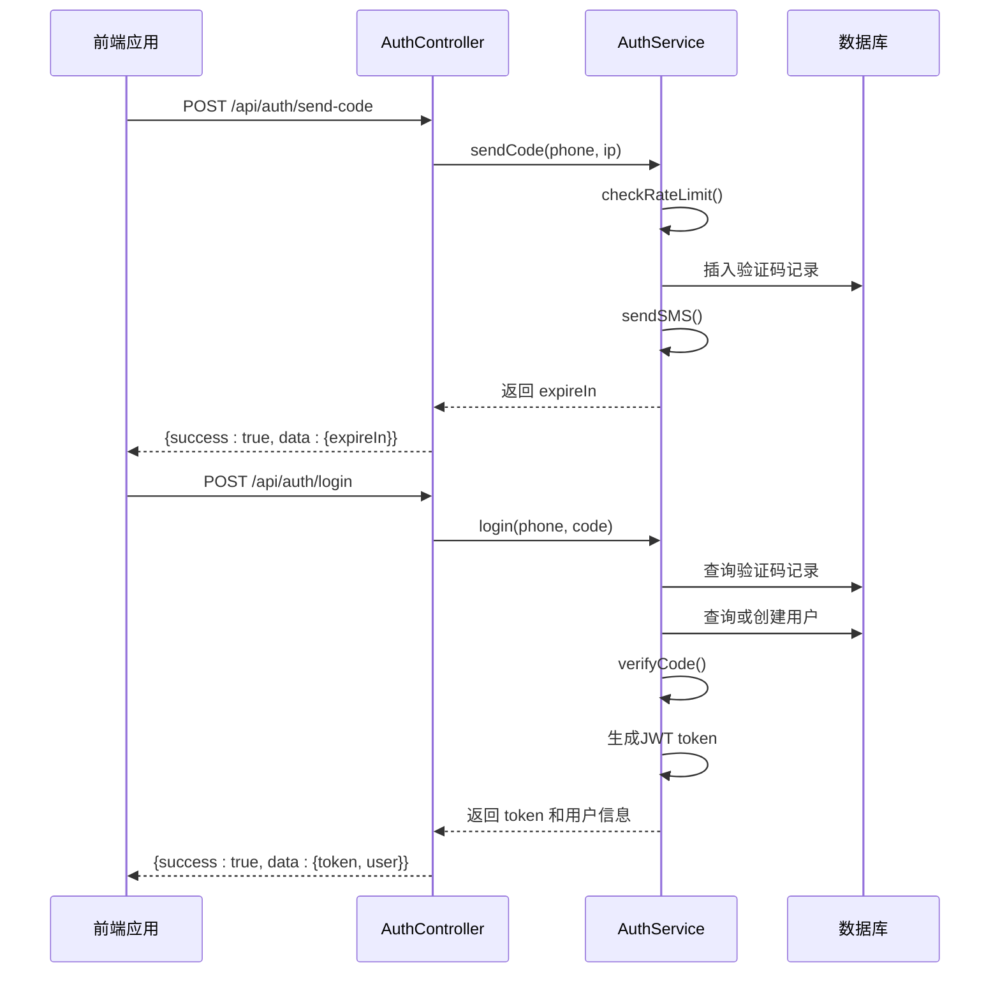
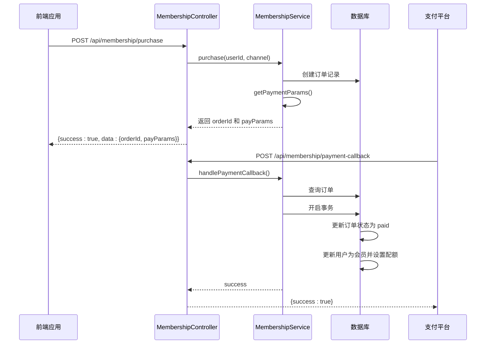
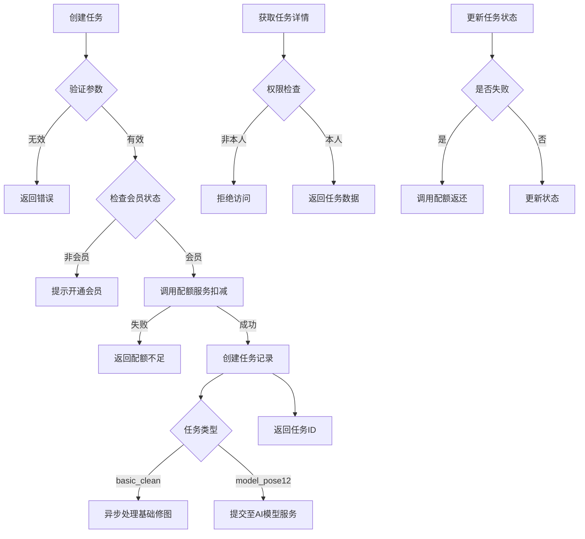
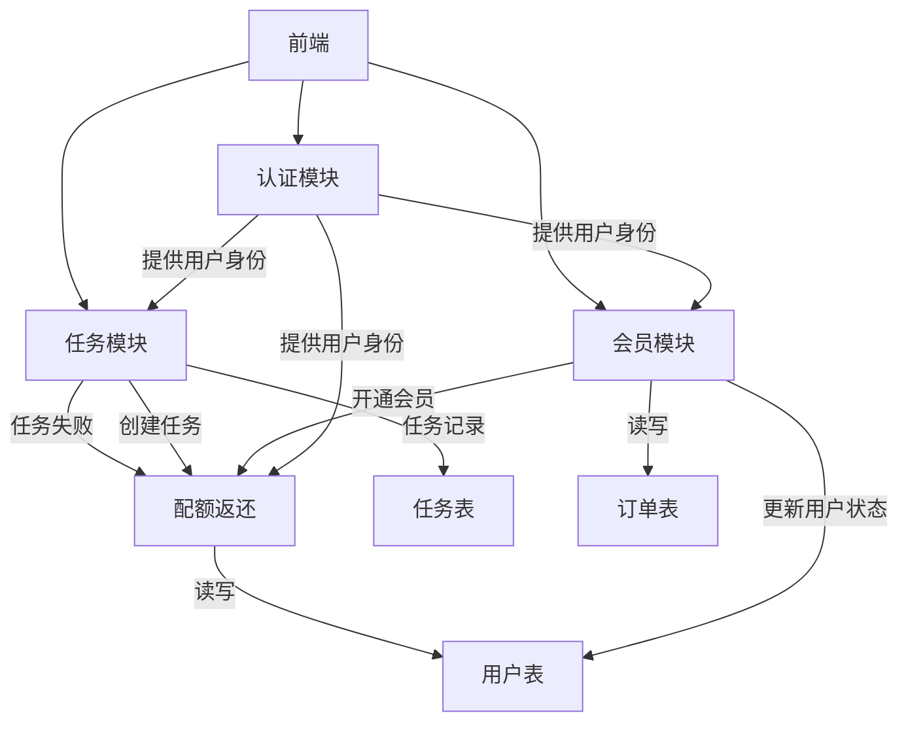

# 核心功能模块

<cite>
**本文档引用的文件**  
- [auth.service.js](file://backend/src/services/auth.service.js)
- [membership.service.js](file://backend/src/services/membership.service.js)
- [task.service.js](file://backend/src/services/task.service.js)
- [quota.service.js](file://backend/src/services/quota.service.js)
- [auth.controller.js](file://backend/src/controllers/auth.controller.js)
- [membership.controller.js](file://backend/src/controllers/membership.controller.js)
- [task.controller.js](file://backend/src/controllers/task.controller.js)
- [auth.routes.js](file://backend/src/routes/auth.routes.js)
- [membership.routes.js](file://backend/src/routes/membership.routes.js)
- [task.routes.js](file://backend/src/routes/task.routes.js)
- [auth.middleware.js](file://backend/src/middlewares/auth.middleware.js)
- [20251028000001_create_users_table.js](file://backend/src/db/migrations/20251028000001_create_users_table.js)
- [20251028000002_create_orders_table.js](file://backend/src/db/migrations/20251028000002_create_orders_table.js)
- [20251028000003_create_tasks_table.js](file://backend/src/db/migrations/20251028000003_create_tasks_table.js)
</cite>

## 目录
1. [认证模块](#认证模块)
2. [会员模块](#会员模块)
3. [任务模块](#任务模块)
4. [配额模块](#配额模块)
5. [模块依赖关系](#模块依赖关系)

## 认证模块

认证模块负责用户的身份验证与登录流程，采用手机号+验证码的无密码登录机制，并通过JWT实现会话管理。该模块确保用户安全访问系统资源。



**图示来源**  
- [auth.service.js](file://backend/src/services/auth.service.js#L1-L220)
- [auth.controller.js](file://backend/src/controllers/auth.controller.js#L1-L100)
- [auth.routes.js](file://backend/src/routes/auth.routes.js#L1-L28)

**本节来源**  
- [auth.service.js](file://backend/src/services/auth.service.js#L1-L220)
- [auth.controller.js](file://backend/src/controllers/auth.controller.js#L1-L100)

## 会员模块

会员模块处理用户的支付购买流程、会员状态管理和自动续期逻辑。通过订单系统与支付渠道对接，确保会员服务的开通与到期管理。



**图示来源**  
- [membership.service.js](file://backend/src/services/membership.service.js#L1-L191)
- [membership.controller.js](file://backend/src/controllers/membership.controller.js#L1-L78)
- [membership.routes.js](file://backend/src/routes/membership.routes.js#L1-L28)

**本节来源**  
- [membership.service.js](file://backend/src/services/membership.service.js#L1-L191)
- [membership.controller.js](file://backend/src/controllers/membership.controller.js#L1-L78)

## 任务模块

任务模块管理AI处理任务的全生命周期，包括创建、查询、状态更新和清理。支持不同类型的任务（如基础修图、AI模特），并与配额系统紧密集成。



**图示来源**  
- [task.service.js](file://backend/src/services/task.service.js#L1-L259)
- [task.controller.js](file://backend/src/controllers/task.controller.js#L1-L173)
- [task.routes.js](file://backend/src/routes/task.routes.js#L1-L24)

**本节来源**  
- [task.service.js](file://backend/src/services/task.service.js#L1-L259)
- [task.controller.js](file://backend/src/controllers/task.controller.js#L1-L173)

## 配额模块

配额模块确保用户在使用AI服务时的资源消耗受控，通过事务性操作保证配额扣减的原子性和非负性约束。支持任务失败时的自动返还机制。

```mermaid
classDiagram
class QuotaService {
+deduct(userId, amount)
+refund(userId, amount, reason)
+getQuota(userId)
+checkQuota(userId, amount)
}
class TaskService {
+create()
+get()
+updateStatus()
+list()
}
class MembershipService {
+handlePaymentCallback()
}
QuotaService <|-- TaskService : 使用
QuotaService <|-- MembershipService : 使用
note right of QuotaService
关键特性：
- 扣减使用事务+行锁
- 确保 quota_remaining ≥ 0
- 支持失败返还
end note
```

**图示来源**  
- [quota.service.js](file://backend/src/services/quota.service.js#L1-L130)
- [task.service.js](file://backend/src/services/task.service.js#L1-L259)
- [membership.service.js](file://backend/src/services/membership.service.js#L1-L191)

**本节来源**  
- [quota.service.js](file://backend/src/services/quota.service.js#L1-L130)

## 模块依赖关系

各核心模块之间存在明确的依赖关系，形成完整的业务闭环。认证模块为其他模块提供身份基础，会员模块驱动配额发放，任务模块消费配额资源。



**图示来源**  
- [auth.service.js](file://backend/src/services/auth.service.js#L1-L220)
- [membership.service.js](file://backend/src/services/membership.service.js#L1-L191)
- [task.service.js](file://backend/src/services/task.service.js#L1-L259)
- [quota.service.js](file://backend/src/services/quota.service.js#L1-L130)
- [20251028000001_create_users_table.js](file://backend/src/db/migrations/20251028000001_create_users_table.js#L1-L24)
- [20251028000002_create_orders_table.js](file://backend/src/db/migrations/20251028000002_create_orders_table.js#L1-L31)
- [20251028000003_create_tasks_table.js](file://backend/src/db/migrations/20251028000003_create_tasks_table.js#L1-L34)

**本节来源**  
- [auth.service.js](file://backend/src/services/auth.service.js#L1-L220)
- [membership.service.js](file://backend/src/services/membership.service.js#L1-L191)
- [task.service.js](file://backend/src/services/task.service.js#L1-L259)
- [quota.service.js](file://backend/src/services/quota.service.js#L1-L130)