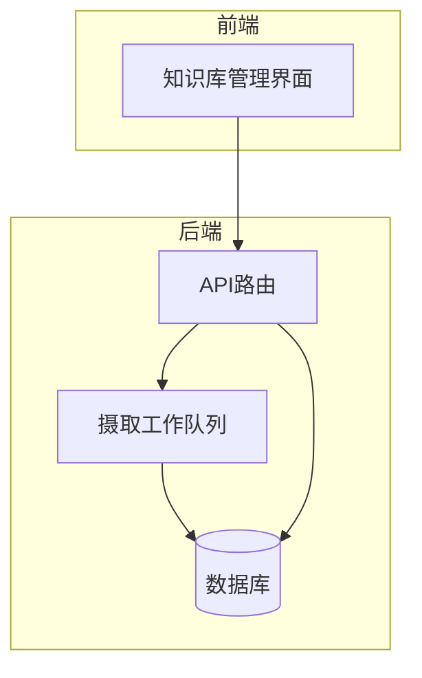
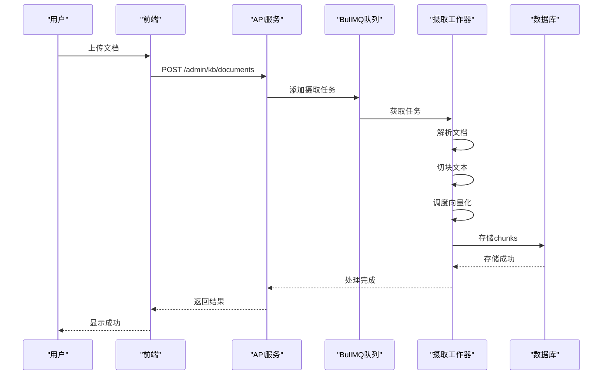
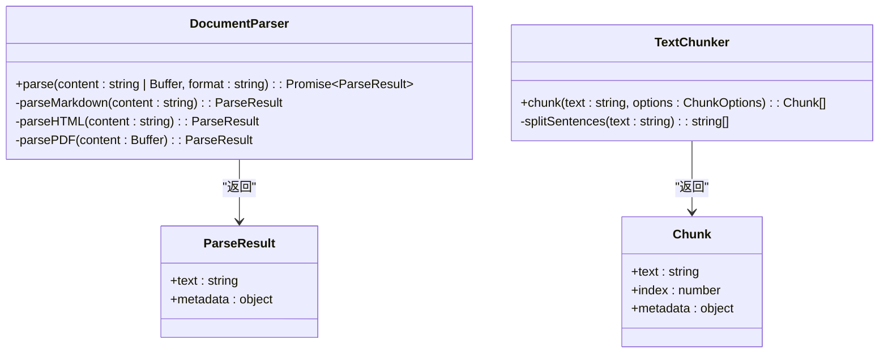
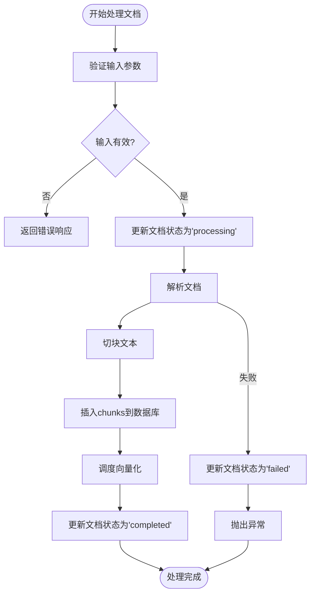
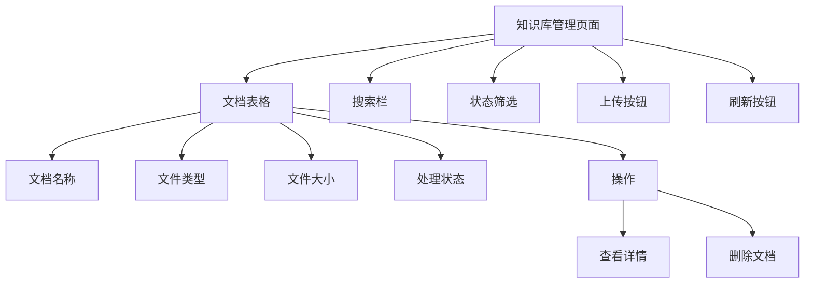

# 知识库系统

<cite>
**本文档引用的文件**  
- [README.md](file://README.md)
- [backend/src/rag/ingest/worker.ts](file://backend/src/rag/ingest/worker.ts)
- [backend/src/rag/ingest/parser.ts](file://backend/src/rag/ingest/parser.ts)
- [backend/src/rag/ingest/chunker.ts](file://backend/src/rag/ingest/chunker.ts)
- [backend/src/routes/admin/kb.route.ts](file://backend/src/routes/admin/kb.route.ts)
- [backend/src/db/migrations/20241203000010_create_kb_tables.js](file://backend/src/db/migrations/20241203000010_create_kb_tables.js)
- [backend/tests/integration/kb-api.integration.test.ts](file://backend/tests/integration/kb-api.integration.test.ts)
- [frontend/src/app/admin/kb/page.tsx](file://frontend/src/app/admin/kb/page.tsx)
- [frontend/src/lib/services/kbService.ts](file://frontend/src/lib/services/kbService.ts)
- [frontend/src/lib/vec/client.ts](file://frontend/src/lib/vec/client.ts)
- [frontend/src/msw/handlers.ts](file://frontend/src/msw/handlers.ts)
</cite>

## 目录
1. [简介](#简介)
2. [项目结构](#项目结构)
3. [核心组件](#核心组件)
4. [架构概述](#架构概述)
5. [详细组件分析](#详细组件分析)
6. [依赖分析](#依赖分析)
7. [性能考虑](#性能考虑)
8. [故障排除指南](#故障排除指南)
9. [结论](#结论)

## 简介
知识库系统是服装AI处理SaaS平台的核心功能模块，旨在为用户提供文档管理和智能检索能力。该系统支持多种文档格式（Markdown、HTML、PDF）的上传、解析、切块和向量化处理，最终实现基于语义的高效检索。系统采用RAG（检索增强生成）架构，结合异步任务队列和向量数据库，确保处理效率和检索准确性。

## 项目结构
知识库系统主要分布在后端和前端两个部分。后端位于`backend/src/rag`目录下，包含摄取（ingest）管线的核心逻辑，包括解析器（parser）、切块器（chunker）和工作队列（worker）。前端位于`frontend/src/app/admin/kb`目录下，提供文档管理的用户界面。数据库表结构由迁移脚本`backend/src/db/migrations/20241203000010_create_kb_tables.js`定义，主要包括`kb_documents`和`kb_chunks`两张表。



**图源**
- [backend/src/routes/admin/kb.route.ts](file://backend/src/routes/admin/kb.route.ts)
- [backend/src/rag/ingest/worker.ts](file://backend/src/rag/ingest/worker.ts)
- [backend/src/db/migrations/20241203000010_create_kb_tables.js](file://backend/src/db/migrations/20241203000010_create_kb_tables.js)

**本节来源**
- [README.md](file://README.md)

## 核心组件
知识库系统的核心组件包括文档解析器、文本切块器、摄取工作队列和向量检索客户端。这些组件协同工作，完成从文档上传到智能检索的完整流程。

**本节来源**
- [backend/src/rag/ingest/parser.ts](file://backend/src/rag/ingest/parser.ts)
- [backend/src/rag/ingest/chunker.ts](file://backend/src/rag/ingest/chunker.ts)
- [backend/src/rag/ingest/worker.ts](file://backend/src/rag/ingest/worker.ts)
- [frontend/src/lib/vec/client.ts](file://frontend/src/lib/vec/client.ts)

## 架构概述
知识库系统采用分层架构，从前端界面到后端服务，再到数据存储，形成清晰的处理流程。用户通过前端界面上传文档，后端API接收请求并将其加入BullMQ队列。摄取工作队列从队列中取出任务，依次执行文档解析、文本切块和向量化处理，最终将结果存入数据库。



**图源**
- [backend/src/rag/ingest/worker.ts](file://backend/src/rag/ingest/worker.ts)
- [backend/src/routes/admin/kb.route.ts](file://backend/src/routes/admin/kb.route.ts)

## 详细组件分析

### 文档解析与切块组件
文档解析与切块是知识库系统的基础功能。解析器负责将不同格式的文档（Markdown、HTML、PDF）转换为纯文本，并提取元数据。切块器则将长文本按指定大小和重叠度切分为多个chunk，以便后续处理。

#### 类图


**图源**
- [backend/src/rag/ingest/parser.ts](file://backend/src/rag/ingest/parser.ts)
- [backend/src/rag/ingest/chunker.ts](file://backend/src/rag/ingest/chunker.ts)

**本节来源**
- [backend/src/rag/ingest/parser.ts](file://backend/src/rag/ingest/parser.ts)
- [backend/src/rag/ingest/chunker.ts](file://backend/src/rag/ingest/chunker.ts)

### 摄取工作队列组件
摄取工作队列是知识库系统的核心处理引擎。它基于BullMQ构建，负责异步处理文档摄取任务。工作队列接收来自API的文档上传请求，执行解析、切块和向量化调度等操作，并更新任务状态。

#### 流程图


**图源**
- [backend/src/rag/ingest/worker.ts](file://backend/src/rag/ingest/worker.ts)

**本节来源**
- [backend/src/rag/ingest/worker.ts](file://backend/src/rag/ingest/worker.ts)

### 前端管理界面组件
前端管理界面为用户提供了一个直观的知识库文档管理平台。用户可以通过该界面上传文档、查看文档列表、筛选状态和执行检索操作。

#### 组件结构


**图源**
- [frontend/src/app/admin/kb/page.tsx](file://frontend/src/app/admin/kb/page.tsx)

**本节来源**
- [frontend/src/app/admin/kb/page.tsx](file://frontend/src/app/admin/kb/page.tsx)

## 依赖分析
知识库系统依赖于多个外部服务和库。后端主要依赖BullMQ进行任务队列管理，ioredis作为Redis客户端，knex作为数据库查询构建器。前端依赖Ant Design作为UI组件库，@tanstack/react-query进行数据获取和状态管理。向量检索功能依赖于一个抽象的`VectorStore`接口，具体实现可配置为LanceDB、Qdrant、Redis Vector或SQLite-VSS。

```mermaid
graph LR
A[知识库系统] --> B[BullMQ]
A --> C[ioredis]
A --> D[knex]
A --> E[Ant Design]
A --> F[@tanstack/react-query]
A --> G[VectorStore]
G --> H[LanceDB]
G --> I[Qdrant]
G --> J[Redis Vector]
G --> K[SQLite-VSS]
```

**图源**
- [package.json](file://package.json)

**本节来源**
- [package.json](file://package.json)

## 性能考虑
知识库系统的性能主要体现在文档处理速度和检索响应时间上。为优化性能，系统采用了异步处理模式，将耗时的解析和切块操作放入队列中执行，避免阻塞API响应。向量化处理被设计为可批量执行，以提高效率。前端采用分页和缓存策略，减少不必要的网络请求。数据库层面，对关键字段建立了索引，如`kb_documents`表的`user_id`、`kb_id`和`status`字段，以及`kb_chunks`表的`document_id`字段。

**本节来源**
- [backend/src/rag/ingest/worker.ts](file://backend/src/rag/ingest/worker.ts)
- [backend/src/db/migrations/20241203000010_create_kb_tables.js](file://backend/src/db/migrations/20241203000010_create_kb_tables.js)
- [frontend/src/app/admin/kb/page.tsx](file://frontend/src/app/admin/kb/page.tsx)

## 故障排除指南
当知识库系统出现问题时，可以按照以下步骤进行排查：

1. **检查API响应**：首先确认API是否返回了正确的状态码和错误信息。
2. **查看日志**：检查后端日志，特别是`[IngestWorker]`前缀的日志，以确定任务处理的具体阶段。
3. **验证队列状态**：使用`GET /admin/kb/queue-stats`接口检查队列的等待、活动、完成和失败任务数量。
4. **检查数据库**：查询`kb_documents`和`kb_chunks`表，确认文档和chunks的状态是否正确。
5. **测试向量检索**：直接调用向量检索接口，确认向量数据库是否正常工作。

**本节来源**
- [backend/src/rag/ingest/worker.ts](file://backend/src/rag/ingest/worker.ts)
- [backend/src/routes/admin/kb.route.ts](file://backend/src/routes/admin/kb.route.ts)

## 结论
知识库系统是一个功能完整、架构清晰的文档管理和检索解决方案。它通过模块化设计，将复杂的RAG流程分解为可管理的组件，确保了系统的可维护性和扩展性。未来的工作可以集中在优化向量化处理性能、增强前端用户体验和增加更多文档格式支持上。