# 认证模块

<cite>
**本文档引用的文件**
- [auth.service.js](file://backend/src/services/auth.service.js)
- [auth.controller.js](file://backend/src/controllers/auth.controller.js)
- [auth.routes.js](file://backend/src/routes/auth.routes.js)
- [auth.middleware.js](file://backend/src/middlewares/auth.middleware.js)
- [authStore.ts](file://frontend/src/store/authStore.ts)
- [api.ts](file://frontend/src/lib/api.ts)
- [page.tsx](file://frontend/src/app/login/page.tsx)
- [create_verification_codes_table.js](file://backend/src/db/migrations/20251028000004_create_verification_codes_table.js)
- [create_users_table.js](file://backend/src/db/migrations/20251028000001_create_users_table.js)
- [generator.js](file://backend/src/utils/generator.js)
- [database.js](file://backend/src/config/database.js)
- [errorHandler.middleware.js](file://backend/src/middlewares/errorHandler.middleware.js)
</cite>

## 目录
1. [简介](#简介)
2. [系统架构](#系统架构)
3. [核心组件分析](#核心组件分析)
4. [防刷机制详解](#防刷机制详解)
5. [JWT Token机制](#jwt-token机制)
6. [数据库设计](#数据库设计)
7. [前端集成](#前端集成)
8. [错误处理机制](#错误处理机制)
9. [使用示例](#使用示例)
10. [总结](#总结)

## 简介

认证模块是AI服装处理平台的核心安全组件，负责用户身份验证、授权管理和会话控制。该模块采用手机号+验证码的方式进行用户认证，结合JWT Token实现无状态认证，并通过完善的防刷机制确保系统安全。

主要功能包括：
- 手机号验证码发送与验证
- 用户注册与登录
- JWT Token生成与验证
- 防刷机制（IP+手机号频率限制）
- 用户信息管理

## 系统架构

认证模块采用分层架构设计，包含表现层、控制层、服务层和数据层：

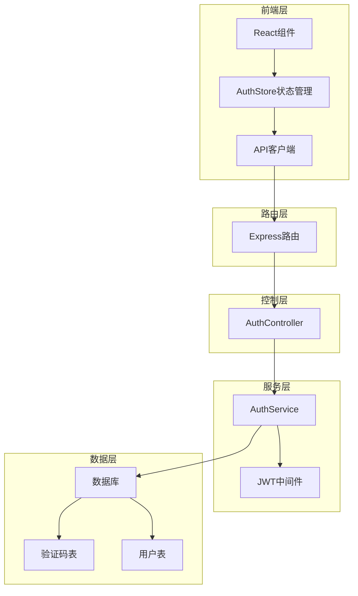

**图表来源**
- [auth.routes.js](file://backend/src/routes/auth.routes.js#L1-L28)
- [auth.controller.js](file://backend/src/controllers/auth.controller.js#L1-L100)
- [auth.service.js](file://backend/src/services/auth.service.js#L1-L220)

## 核心组件分析

### AuthService - 认证服务类

AuthService是认证模块的核心服务类，实现了所有认证相关的业务逻辑：

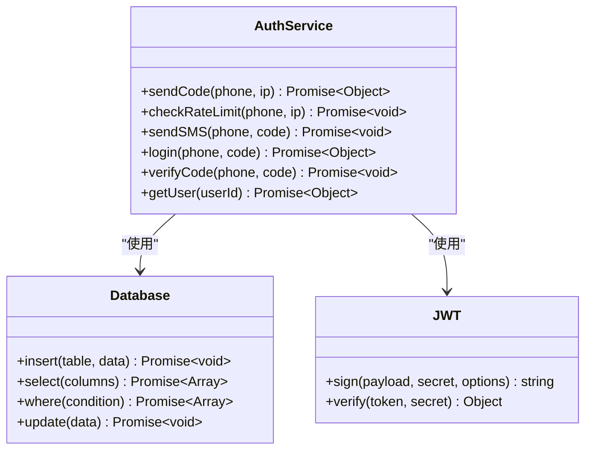

**图表来源**
- [auth.service.js](file://backend/src/services/auth.service.js#L7-L220)

#### 核心方法详解

**1. 验证码发送方法 (`sendCode`)**
- 防刷限制检查
- 验证码生成（6位数字）
- 数据库存储
- 短信服务调用

**2. 登录注册方法 (`login`)**
- 验证码验证
- 用户查询/创建
- Token生成
- 用户信息返回

**3. 用户信息获取方法 (`getUser`)**
- 用户ID查询
- 用户信息封装

**节来源**
- [auth.service.js](file://backend/src/services/auth.service.js#L12-L220)

### AuthController - 认证控制器

AuthController负责处理HTTP请求和响应，作为前端与后端服务的桥梁：

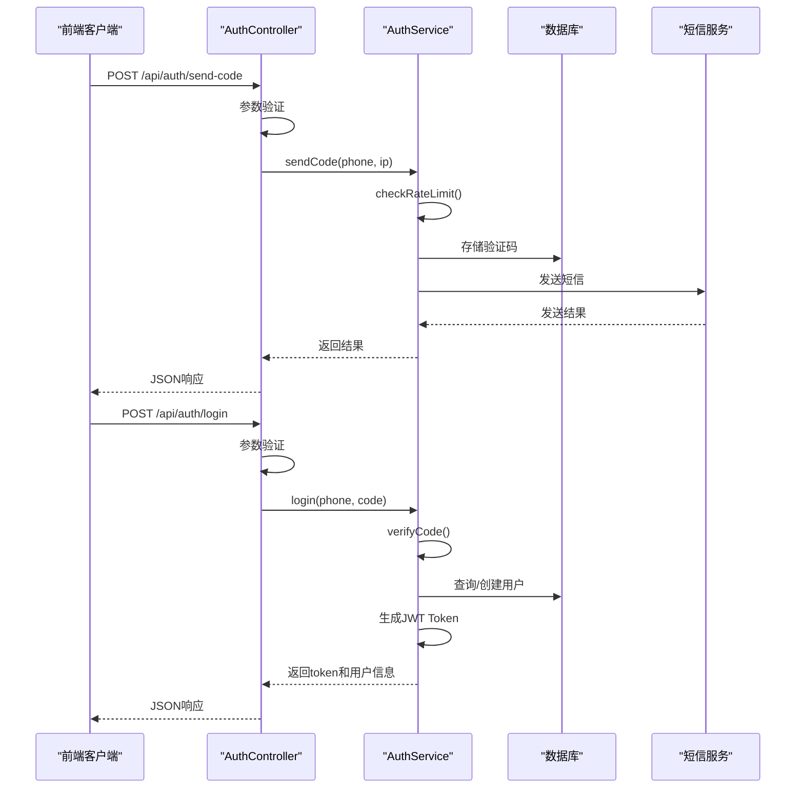

**图表来源**
- [auth.controller.js](file://backend/src/controllers/auth.controller.js#L8-L100)
- [auth.service.js](file://backend/src/services/auth.service.js#L12-L150)

**节来源**
- [auth.controller.js](file://backend/src/controllers/auth.controller.js#L1-L100)

## 防刷机制详解

防刷机制是认证模块的重要安全特性，通过双重限制防止恶意攻击：

### 限制策略

| 限制类型 | 时间范围 | 最大次数 | 触发条件 |
|---------|---------|---------|----------|
| 手机号频率限制 | 1分钟 | 5次 | 同一手机号在1分钟内发送验证码超过5次 |
| IP频率限制 | 1小时 | 20次 | 同一IP地址在1小时内发送验证码超过20次 |

### 实现逻辑

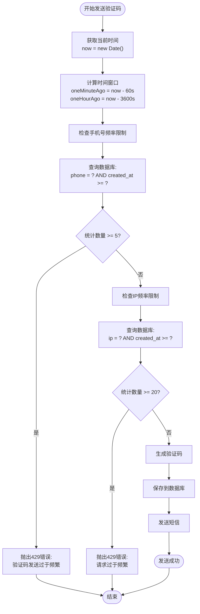

**图表来源**
- [auth.service.js](file://backend/src/services/auth.service.js#L45-L75)

### 数据库查询优化

防刷机制通过索引优化查询性能：

```sql
-- 验证码表索引设计
CREATE INDEX idx_verification_codes_phone ON verification_codes(phone);
CREATE INDEX idx_verification_codes_phone_created_at ON verification_codes(phone, created_at);
CREATE INDEX idx_verification_codes_ip ON verification_codes(ip);
```

**节来源**
- [auth.service.js](file://backend/src/services/auth.service.js#L45-L75)

## JWT Token机制

JWT（JSON Web Token）是认证模块的会话管理核心，实现无状态认证：

### Token结构

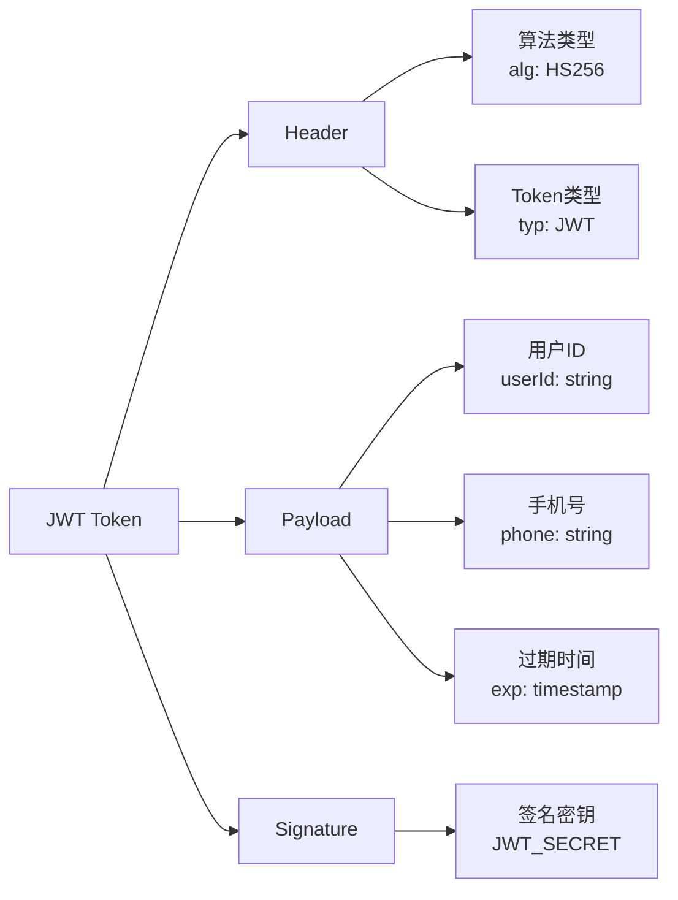

**图表来源**
- [auth.service.js](file://backend/src/services/auth.service.js#L130-L145)

### Token生成与验证流程

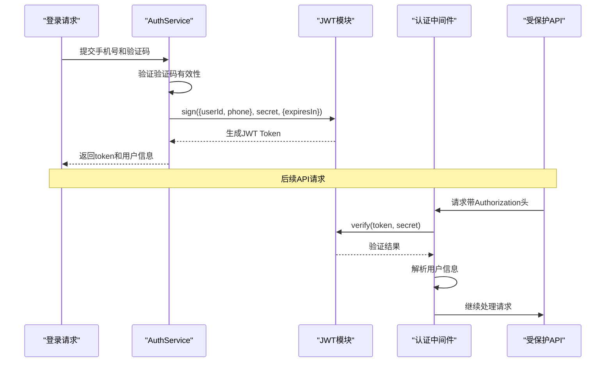

**图表来源**
- [auth.service.js](file://backend/src/services/auth.service.js#L130-L145)
- [auth.middleware.js](file://backend/src/middlewares/auth.middleware.js#L6-L51)

### 认证中间件实现

认证中间件负责验证每个请求的JWT Token：

**节来源**
- [auth.service.js](file://backend/src/services/auth.service.js#L130-L145)
- [auth.middleware.js](file://backend/src/middlewares/auth.middleware.js#L1-L77)

## 数据库设计

认证模块涉及两个核心数据表：用户表和验证码表。

### 用户表 (users)

| 字段名 | 类型 | 约束 | 描述 |
|--------|------|------|------|
| id | string(32) | PRIMARY KEY | 用户唯一标识符 |
| phone | string(11) | UNIQUE, NOT NULL | 手机号（唯一） |
| isMember | boolean | DEFAULT false | 是否为会员 |
| quota_remaining | integer | DEFAULT 0 | 剩余配额 |
| quota_expireAt | datetime | NULLABLE | 配额到期时间 |
| created_at | timestamp | DEFAULT CURRENT_TIMESTAMP | 创建时间 |
| updated_at | timestamp | DEFAULT CURRENT_TIMESTAMP | 更新时间 |

### 验证码表 (verification_codes)

| 字段名 | 类型 | 约束 | 描述 |
|--------|------|------|------|
| id | integer | PRIMARY KEY, AUTO_INCREMENT | 验证码记录ID |
| phone | string(11) | NOT NULL | 接收手机号 |
| code | string(6) | NOT NULL | 验证码内容 |
| ip | string(45) | NULLABLE | 请求IP地址 |
| expireAt | datetime | NOT NULL | 验证码过期时间 |
| used | boolean | DEFAULT false | 是否已使用 |
| created_at | timestamp | DEFAULT CURRENT_TIMESTAMP | 创建时间 |
| updated_at | timestamp | DEFAULT CURRENT_TIMESTAMP | 更新时间 |

### 表关系图

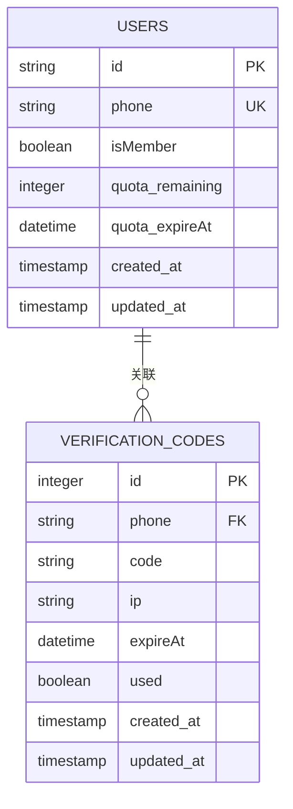

**图表来源**
- [create_users_table.js](file://backend/src/db/migrations/20251028000001_create_users_table.js#L5-L23)
- [create_verification_codes_table.js](file://backend/src/db/migrations/20251028000004_create_verification_codes_table.js#L5-L26)

### 验证码生命周期管理

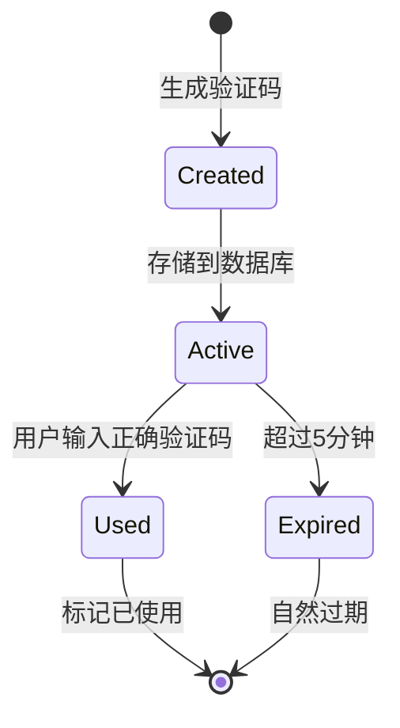

**节来源**
- [create_users_table.js](file://backend/src/db/migrations/20251028000001_create_users_table.js#L1-L24)
- [create_verification_codes_table.js](file://backend/src/db/migrations/20251028000004_create_verification_codes_table.js#L1-L27)

## 前端集成

### 状态管理 (AuthStore)

前端使用Zustand进行状态管理，实现认证状态的持久化：

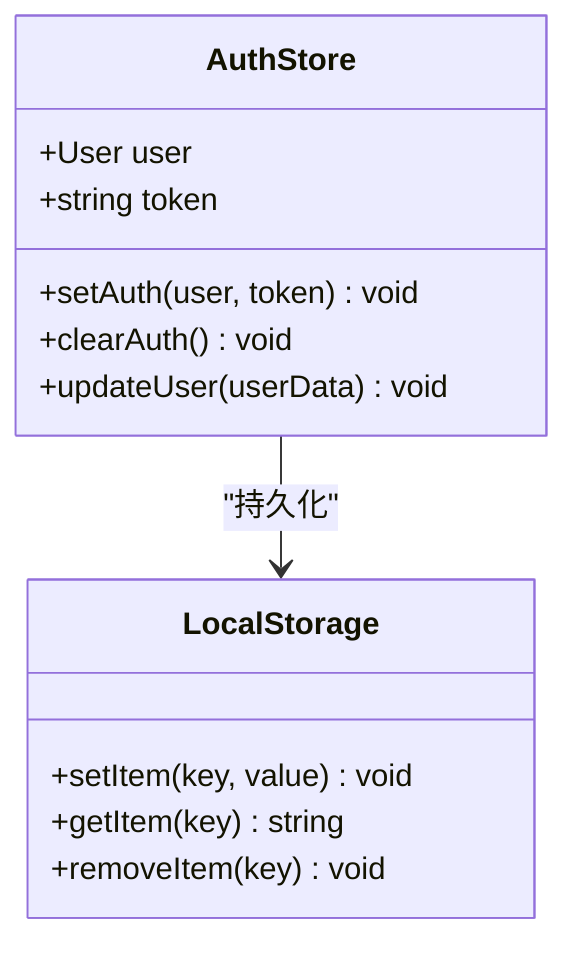

**图表来源**
- [authStore.ts](file://frontend/src/store/authStore.ts#L1-L43)

### API客户端集成

API客户端自动处理认证相关的请求和响应：

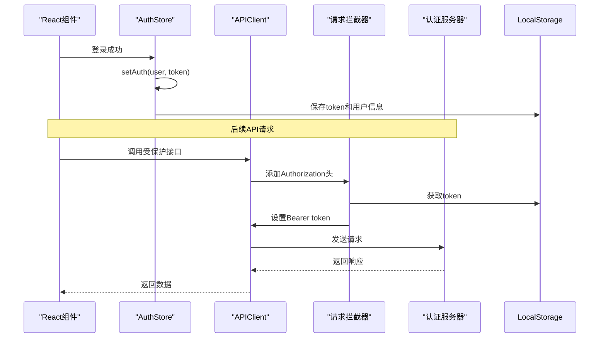

**图表来源**
- [api.ts](file://frontend/src/lib/api.ts#L20-L50)
- [authStore.ts](file://frontend/src/store/authStore.ts#L15-L35)

### 登录页面实现

登录页面提供了完整的用户交互流程：

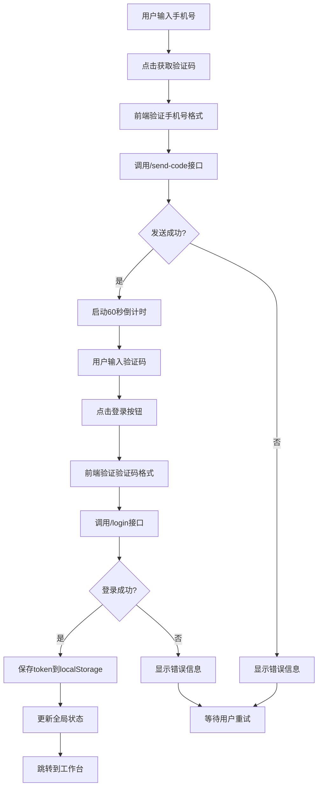

**图表来源**
- [page.tsx](file://frontend/src/app/login/page.tsx#L30-L120)

**节来源**
- [authStore.ts](file://frontend/src/store/authStore.ts#L1-L43)
- [api.ts](file://frontend/src/lib/api.ts#L1-L118)
- [page.tsx](file://frontend/src/app/login/page.tsx#L1-L210)

## 错误处理机制

认证模块实现了完善的错误处理机制，涵盖各种异常情况：

### 错误类型分类

| 错误代码 | HTTP状态码 | 错误描述 | 处理方式 |
|---------|-----------|----------|----------|
| 2000 | 400 | 手机号格式错误 | 前端提示用户输入正确格式 |
| 2001 | 400 | 验证码错误或已过期 | 提示用户重新获取验证码 |
| 2002 | 400 | 验证码格式错误 | 前端验证验证码格式 |
| 2004 | 429 | 验证码发送过于频繁 | 提示用户等待1分钟 |
| 2005 | 429 | 请求过于频繁 | 提示用户等待1小时 |
| 1001 | 401 | 未登录/Token无效 | 清除本地token并跳转登录页 |
| 1004 | 404 | 用户不存在 | 重新注册或联系管理员 |

### 错误处理流程

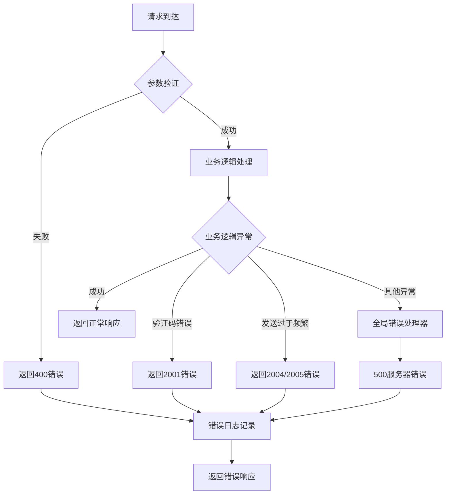

**图表来源**
- [auth.controller.js](file://backend/src/controllers/auth.controller.js#L15-L40)
- [errorHandler.middleware.js](file://backend/src/middlewares/errorHandler.middleware.js#L6-L25)

### 前端错误处理

前端API客户端实现了智能的错误处理机制：

**节来源**
- [auth.controller.js](file://backend/src/controllers/auth.controller.js#L1-L100)
- [errorHandler.middleware.js](file://backend/src/middlewares/errorHandler.middleware.js#L1-L46)

## 使用示例

### 前端调用示例

#### 1. 发送验证码

```typescript
// React组件中的调用
const handleSendCode = async () => {
  try {
    const phone = form.getFieldValue('phone');
    const response = await api.auth.sendCode(phone);
    
    if (response.success) {
      message.success('验证码已发送');
      // 启动倒计时
      setCountdown(60);
    } else {
      message.error(response.error?.message || '发送失败');
    }
  } catch (error) {
    message.error('发送验证码失败');
  }
};
```

#### 2. 登录流程

```typescript
const handleLogin = async (values: { phone: string; code: string }) => {
  try {
    const response = await api.auth.login(values.phone, values.code);
    
    if (response.success && response.data) {
      const { token, user } = response.data;
      
      // 保存到localStorage
      localStorage.setItem('token', token);
      localStorage.setItem('user', JSON.stringify(user));
      
      // 更新全局状态
      setUser(user);
      
      message.success('登录成功');
      router.push('/workspace');
    }
  } catch (error) {
    message.error('登录失败');
  }
};
```

### 后端接口调用示例

#### 1. 发送验证码接口

```javascript
// 请求格式
POST /api/auth/send-code
Content-Type: application/json

{
  "phone": "13800138000"
}

// 响应格式
{
  "success": true,
  "data": {
    "expireIn": 300
  },
  "message": "验证码已发送"
}
```

#### 2. 登录接口

```javascript
// 请求格式
POST /api/auth/login
Content-Type: application/json

{
  "phone": "13800138000",
  "code": "123456"
}

// 响应格式
{
  "success": true,
  "data": {
    "token": "eyJhbGciOiJIUzI1NiIsInR5cCI6IkpXVCJ9...",
    "user": {
      "id": "abc123def456",
      "phone": "13800138000",
      "isMember": false,
      "quota_remaining": 0,
      "quota_expireAt": null
    }
  }
}
```

### 错误处理示例

#### 1. 验证码发送过于频繁

```javascript
// 前端错误处理
try {
  await api.auth.sendCode('13800138000');
} catch (error) {
  if (error.code === 2004) {
    message.error('验证码发送过于频繁，请1分钟后再试');
  } else if (error.code === 2005) {
    message.error('请求过于频繁，请稍后再试');
  }
}
```

#### 2. Token过期处理

```javascript
// API客户端拦截器
this.client.interceptors.response.use(
  (response) => response.data,
  (error) => {
    if (error.response?.status === 401) {
      // 清除本地存储的token
      localStorage.removeItem('token');
      localStorage.removeItem('user');
      // 跳转到登录页
      window.location.href = '/login';
    }
    return Promise.reject(error);
  }
);
```

## 总结

认证模块通过以下核心特性确保了系统的安全性、可靠性和用户体验：

### 安全特性
- **防刷机制**：双重频率限制（手机号+IP），有效防止暴力破解
- **验证码有效期**：5分钟自动过期，增强安全性
- **JWT Token**：无状态认证，支持分布式部署
- **HTTPS传输**：敏感信息加密传输

### 性能优化
- **数据库索引**：优化查询性能，支持高频并发
- **异步处理**：验证码发送与业务逻辑分离
- **缓存机制**：用户信息本地缓存

### 用户体验
- **实时反馈**：验证码发送状态及时通知
- **智能验证**：前端+后端双重验证机制
- **状态同步**：前后端状态保持一致

### 可维护性
- **模块化设计**：清晰的分层架构
- **统一错误处理**：标准化的错误响应格式
- **完善的日志**：详细的操作日志记录

该认证模块为AI服装处理平台提供了坚实的安全基础，支持高并发用户访问，同时保证了良好的用户体验。通过合理的架构设计和安全措施，能够有效抵御常见的安全威胁，为平台的稳定运行提供保障。