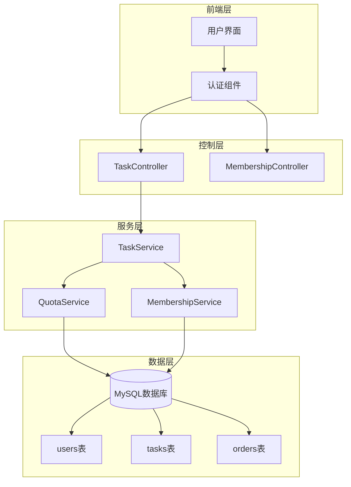
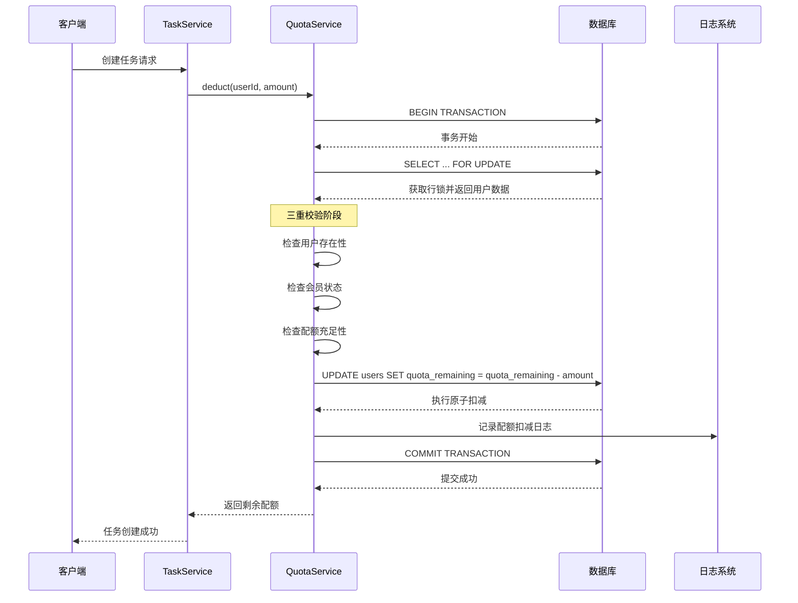
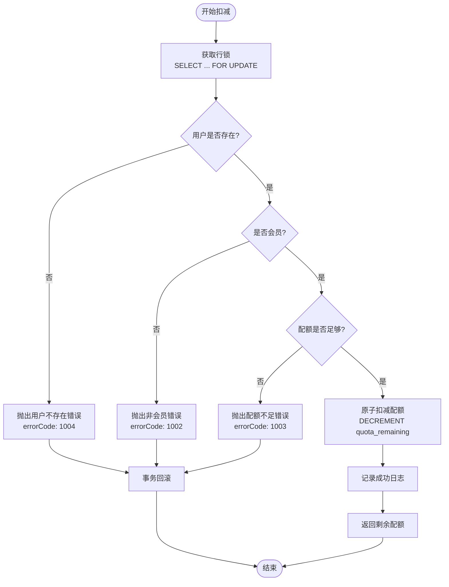
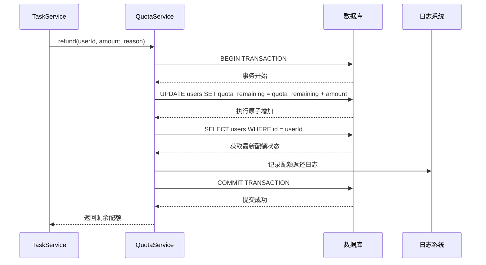
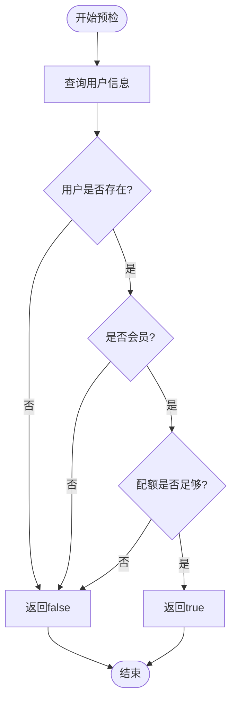
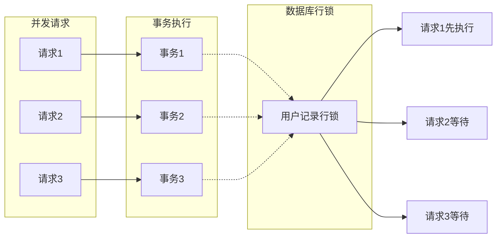
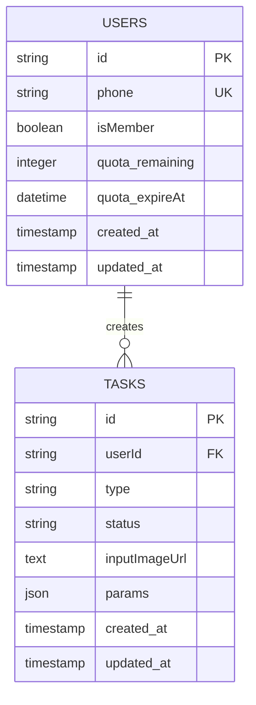
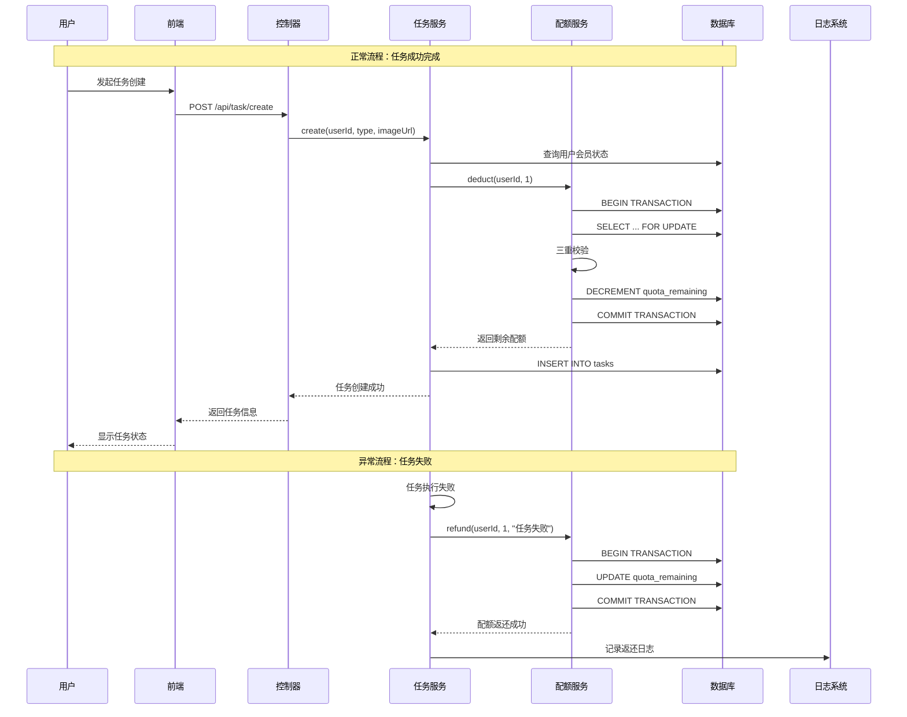
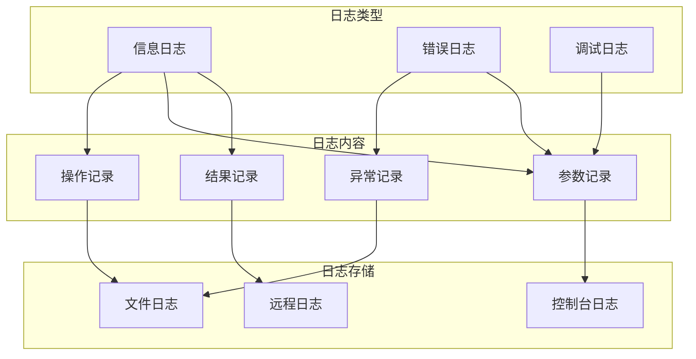

# 配额模块深度分析文档

<cite>
**本文档引用的文件**
- [quota.service.js](file://backend/src/services/quota.service.js)
- [task.service.js](file://backend/src/services/task.service.js)
- [membership.service.js](file://backend/src/services/membership.service.js)
- [task.controller.js](file://backend/src/controllers/task.controller.js)
- [database.js](file://backend/src/config/database.js)
- [knexfile.js](file://backend/knexfile.js)
- [auth.middleware.js](file://backend/src/middlewares/auth.middleware.js)
- [logger.js](file://backend/src/utils/logger.js)
- [create_users_table.js](file://backend/src/db/migrations/20251028000001_create_users_table.js)
- [create_tasks_table.js](file://backend/src/db/migrations/20251028000003_create_tasks_table.js)
</cite>

## 目录
1. [系统概述](#系统概述)
2. [核心架构设计](#核心架构设计)
3. [事务安全机制详解](#事务安全机制详解)
4. [配额扣减流程分析](#配额扣减流程分析)
5. [配额返还机制](#配额返还机制)
6. [预检机制与校验](#预检机制与校验)
7. [并发控制与防超卖](#并发控制与防超卖)
8. [会员状态绑定机制](#会员状态绑定机制)
9. [完整业务流程](#完整业务流程)
10. [压力测试建议](#压力测试建议)
11. [异常处理与监控](#异常处理与监控)
12. [总结与最佳实践](#总结与最佳实践)

## 系统概述

配额系统是AI图像处理服务平台的核心计费模块，采用会员订阅制模式，用户通过购买会员获得每月固定次数的AI图像处理配额。系统通过严格的事务安全机制确保配额扣减的原子性，防止超卖问题，并提供完整的配额返还机制。

### 核心特性
- **原子性操作**：使用数据库事务和行锁确保配额操作的原子性
- **并发安全**：通过FOR UPDATE行锁防止并发竞争导致的超卖
- **会员绑定**：非会员用户无法使用服务，配额仅对会员开放
- **实时监控**：提供配额状态查询和到期提醒功能
- **异常恢复**：任务失败时自动返还配额，确保用户权益

## 核心架构设计



**图表来源**
- [task.controller.js](file://backend/src/controllers/task.controller.js#L1-L173)
- [task.service.js](file://backend/src/services/task.service.js#L1-L259)
- [quota.service.js](file://backend/src/services/quota.service.js#L1-L130)
- [membership.service.js](file://backend/src/services/membership.service.js#L1-L191)

**章节来源**
- [task.controller.js](file://backend/src/controllers/task.controller.js#L1-L50)
- [task.service.js](file://backend/src/services/task.service.js#L1-L50)
- [quota.service.js](file://backend/src/services/quota.service.js#L1-L50)

## 事务安全机制详解

### Knex事务与行锁协同工作原理

配额系统的事务安全机制是整个系统的核心保障，通过Knex事务和FOR UPDATE行锁的协同工作，确保在高并发环境下配额扣减的原子性。



**图表来源**
- [quota.service.js](file://backend/src/services/quota.service.js#L13-L60)
- [task.service.js](file://backend/src/services/task.service.js#L30-L50)

### 事务隔离级别的选择

系统采用MySQL的默认隔离级别（REPEATABLE READ），配合FOR UPDATE行锁实现强一致性：

1. **事务边界**：整个配额扣减过程在一个事务中完成
2. **行级锁定**：使用FOR UPDATE锁定目标用户记录
3. **原子性保证**：要么全部成功，要么全部回滚
4. **死锁预防**：通过统一的锁定顺序避免死锁

**章节来源**
- [quota.service.js](file://backend/src/services/quota.service.js#L13-L60)
- [database.js](file://backend/src/config/database.js#L1-L10)

## 配额扣减流程分析

### deduct方法的四重安全检查

`deduct`方法实现了严格的四重安全检查机制，确保配额扣减的安全性和准确性：



**图表来源**
- [quota.service.js](file://backend/src/services/quota.service.js#L13-L60)

### 三重校验机制详解

#### 1. 用户存在性校验
```javascript
// 用户存在性检查
const user = await trx('users')
    .where('id', userId)
    .forUpdate()
    .first();

if (!user) {
    throw {
        statusCode: 404,
        errorCode: 1004,
        message: '用户不存在'
    };
}
```

#### 2. 会员状态校验
```javascript
// 会员状态检查
if (!user.isMember) {
    throw {
        statusCode: 403,
        errorCode: 1002,
        message: '请先购买会员'
    };
}
```

#### 3. 配额充足性校验
```javascript
// 配额充足性检查
if (user.quota_remaining < amount) {
    throw {
        statusCode: 403,
        errorCode: 1003,
        message: '配额不足,请续费'
    };
}
```

**章节来源**
- [quota.service.js](file://backend/src/services/quota.service.js#L20-L50)

## 配额返还机制

### refund方法的原子性返还

当任务执行失败时，系统会自动调用`refund`方法返还配额，确保用户权益不受损失。



**图表来源**
- [quota.service.js](file://backend/src/services/quota.service.js#L62-L85)
- [task.service.js](file://backend/src/services/task.service.js#L130-L145)

### 任务失败时的自动返还逻辑

在任务状态更新过程中，如果检测到任务失败状态，系统会自动触发配额返还：

```javascript
// 任务失败时的返还逻辑
if (status === 'failed') {
    const task = await db('tasks').where('id', taskId).first();
    if (task) {
        await quotaService.refund(task.userId, 1, `任务失败返还:${taskId}`);
        logger.info(`[TaskService] 任务失败,配额已返还 taskId=${taskId} userId=${task.userId}`);
    }
}
```

**章节来源**
- [quota.service.js](file://backend/src/services/quota.service.js#L62-L85)
- [task.service.js](file://backend/src/services/task.service.js#L130-L145)

## 预检机制与校验

### checkQuota方法的预检作用

`checkQuota`方法提供了任务创建前的预检功能，避免无效请求进入系统：



**图表来源**
- [quota.service.js](file://backend/src/services/quota.service.js#L107-L120)

### TaskService中的双重校验

TaskService在任务创建时也实施了双重校验机制：

1. **任务类型验证**：确保任务类型在允许范围内
2. **会员状态验证**：确认用户具有会员资格

**章节来源**
- [quota.service.js](file://backend/src/services/quota.service.js#L107-L120)
- [task.service.js](file://backend/src/services/task.service.js#L15-L35)

## 并发控制与防超卖

### FOR UPDATE行锁的工作原理

FOR UPDATE行锁是防止超卖问题的关键技术：



**图表来源**
- [quota.service.js](file://backend/src/services/quota.service.js#L25-L30)

### 防超卖机制的实现细节

1. **行级锁定**：只有当前事务可以读取和修改被锁定的行
2. **串行化执行**：多个并发请求按顺序执行，避免竞争
3. **原子性保证**：整个扣减过程不可分割，确保数据一致性
4. **死锁检测**：数据库自动检测并回滚其中一个事务

**章节来源**
- [quota.service.js](file://backend/src/services/quota.service.js#L25-L30)

## 会员状态绑定机制

### 非会员无法使用服务的设计理念

系统通过严格的会员状态绑定，确保只有付费用户才能使用AI图像处理服务：



**图表来源**
- [create_users_table.js](file://backend/src/db/migrations/20251028000001_create_users_table.js#L1-L24)
- [create_tasks_table.js](file://backend/src/db/migrations/20251028000003_create_tasks_table.js#L1-L34)

### 会员状态的生命周期管理

会员状态的管理包括以下几个关键环节：

1. **会员购买**：用户完成支付后成为会员
2. **配额发放**：开通会员时发放初始配额
3. **有效期管理**：设置配额的有效期限
4. **自动降级**：到期后自动降级为非会员
5. **状态同步**：前端和后端保持会员状态同步

**章节来源**
- [membership.service.js](file://backend/src/services/membership.service.js#L120-L150)

## 完整业务流程

### 从任务创建到配额返还的完整闭环



**图表来源**
- [task.controller.js](file://backend/src/controllers/task.controller.js#L15-L60)
- [task.service.js](file://backend/src/services/task.service.js#L30-L50)
- [quota.service.js](file://backend/src/services/quota.service.js#L13-L60)

### 关键业务节点的异常处理

系统在每个关键节点都实现了完善的异常处理机制：

1. **认证失败**：JWT验证失败时拒绝访问
2. **权限不足**：非会员用户无法创建任务
3. **资源不足**：配额不足时拒绝扣减
4. **系统异常**：数据库连接失败时提供友好提示

**章节来源**
- [task.controller.js](file://backend/src/controllers/task.controller.js#L15-L60)
- [task.service.js](file://backend/src/services/task.service.js#L30-L50)
- [auth.middleware.js](file://backend/src/middlewares/auth.middleware.js#L1-L77)

## 压力测试建议

### 高并发场景测试方案

为了验证配额系统的并发安全性，建议进行以下压力测试：

#### 测试场景设计

1. **峰值并发测试**
   - 模拟1000个用户同时创建任务
   - 观察系统响应时间和错误率
   - 验证配额扣减的准确性

2. **长时间运行测试**
   - 持续运行24小时，观察系统稳定性
   - 检查内存泄漏和连接池耗尽问题
   - 验证自动降级机制的正确性

3. **异常场景测试**
   - 模拟数据库连接失败
   - 模拟网络超时情况
   - 验证事务回滚的完整性

#### 性能指标监控

- **TPS（每秒事务数）**：目标值≥100 TPS
- **响应时间**：95%请求响应时间<100ms
- **错误率**：系统错误率<0.01%
- **并发用户数**：支持≥1000并发用户

### 测试工具推荐

1. **JMeter**：用于模拟大量并发请求
2. **LoadRunner**：专业的性能测试工具
3. **自定义压力测试脚本**：针对特定业务场景的测试

## 异常处理与监控

### 日志记录策略

系统实现了完善的日志记录机制，确保每个关键操作都有迹可循：



**图表来源**
- [logger.js](file://backend/src/utils/logger.js#L1-L42)

### 异常分类与处理策略

系统根据异常类型采用不同的处理策略：

1. **业务异常**（如配额不足、用户不存在）
   - 返回明确的错误码和错误信息
   - 记录详细的操作日志
   - 不中断系统正常运行

2. **系统异常**（如数据库连接失败）
   - 返回通用错误信息
   - 记录详细的错误堆栈
   - 触发告警机制

3. **安全异常**（如非法访问）
   - 记录安全事件
   - 拒绝服务请求
   - 发送安全告警

**章节来源**
- [logger.js](file://backend/src/utils/logger.js#L1-L42)
- [task.service.js](file://backend/src/services/task.service.js#L40-L50)

## 总结与最佳实践

### 核心设计原则

1. **原子性优先**：所有配额操作必须保证原子性
2. **并发安全**：使用行锁防止并发竞争
3. **会员绑定**：非会员用户无法使用付费功能
4. **异常处理**：完善的错误处理和日志记录
5. **监控告警**：实时监控系统状态和异常

### 技术亮点

1. **事务级配额管理**：使用数据库事务确保数据一致性
2. **行级锁定**：通过FOR UPDATE防止超卖问题
3. **双重校验机制**：任务创建前和执行前的双重验证
4. **自动返还机制**：任务失败时自动返还配额
5. **实时状态同步**：前端和后端保持会员状态同步

### 生产环境部署建议

1. **数据库配置优化**
   - 设置合适的连接池大小
   - 配置慢查询日志监控
   - 定期进行数据库维护

2. **应用服务器配置**
   - 合理设置进程数量
   - 配置健康检查机制
   - 实施负载均衡策略

3. **监控告警体系**
   - 监控关键指标（TPS、响应时间、错误率）
   - 设置阈值告警机制
   - 建立故障响应流程

### 未来优化方向

1. **缓存优化**：引入Redis缓存提升查询性能
2. **分布式锁**：在微服务架构下使用分布式锁
3. **异步处理**：将配额返还等操作异步化
4. **智能预测**：基于用户行为预测配额使用趋势

通过以上设计和实现，配额系统能够在高并发环境下稳定运行，确保用户权益得到充分保障，为AI图像处理服务平台提供可靠的计费基础设施。