# 测试策略

<cite>
**本文档引用的文件**
- [backend/src/services/auth.service.js](file://backend/src/services/auth.service.js)
- [backend/src/services/quota.service.js](file://backend/src/services/quota.service.js)
- [backend/src/services/task.service.js](file://backend/src/services/task.service.js)
- [backend/src/controllers/auth.controller.js](file://backend/src/controllers/auth.controller.js)
- [backend/src/controllers/task.controller.js](file://backend/src/controllers/task.controller.js)
- [backend/src/middlewares/auth.middleware.js](file://backend/src/middlewares/auth.middleware.js)
- [backend/src/routes/auth.routes.js](file://backend/src/routes/auth.routes.js)
- [backend/src/app.js](file://backend/src/app.js)
- [backend/package.json](file://backend/package.json)
- [frontend/src/lib/api.ts](file://frontend/src/lib/api.ts)
- [frontend/src/store/authStore.ts](file://frontend/src/store/authStore.ts)
- [frontend/src/components/ImageUploader.tsx](file://frontend/src/components/ImageUploader.tsx)
- [frontend/src/app/login/page.tsx](file://frontend/src/app/login/page.tsx)
- [frontend/package.json](file://frontend/package.json)
- [tests/README.md](file://tests/README.md)
</cite>

## 目录
1. [概述](#概述)
2. [测试架构设计](#测试架构设计)
3. [单元测试策略](#单元测试策略)
4. [集成测试策略](#集成测试策略)
5. [端到端测试策略](#端到端测试策略)
6. [Mock测试实施方案](#mock测试实施方案)
7. [API接口测试方案](#api接口测试方案)
8. [前端组件测试方案](#前端组件测试方案)
9. [测试覆盖率目标](#测试覆盖率目标)
10. [CI/CD集成路径](#cicd集成路径)
11. [测试工具选型建议](#测试工具选型建议)
12. [测试执行流程](#测试执行流程)

## 概述

本测试策略框架旨在为AI服装处理SaaS平台建立全面的质量保证体系，涵盖后端服务、前端应用和API接口的完整测试生命周期。通过分层测试方法，确保系统的可靠性、性能和用户体验。

### 测试目标

- **质量保证**：确保核心业务逻辑的正确性和稳定性
- **风险控制**：预防和及时发现潜在的系统缺陷
- **性能保障**：验证系统在高负载下的表现
- **用户体验**：确保前端交互的流畅性和一致性

## 测试架构设计

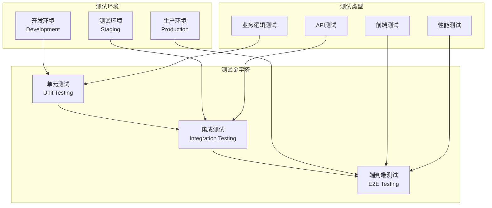

**图表来源**
- [tests/README.md](file://tests/README.md#L0-L50)

## 单元测试策略

### 核心服务测试范围

#### AuthService单元测试
- **验证码发送功能**：测试sendCode方法的完整流程
- **登录认证功能**：测试login方法的业务逻辑
- **用户信息获取**：测试getUser方法的数据查询
- **防刷限制**：测试checkRateLimit的并发控制
- **验证码验证**：测试verifyCode的有效性检查

#### QuotaService单元测试
- **配额扣减**：测试deduct方法的事务处理
- **配额返还**：测试refund方法的补偿机制
- **配额查询**：测试getQuota方法的数据获取
- **配额检查**：测试checkQuota方法的权限验证

#### TaskService单元测试
- **任务创建**：测试create方法的业务流程
- **任务查询**：测试get方法的权限控制
- **状态更新**：测试updateStatus方法的状态转换
- **任务列表**：测试list方法的分页查询
- **超时清理**：测试cleanupTimeoutTasks的定时任务

### 单元测试实施要点

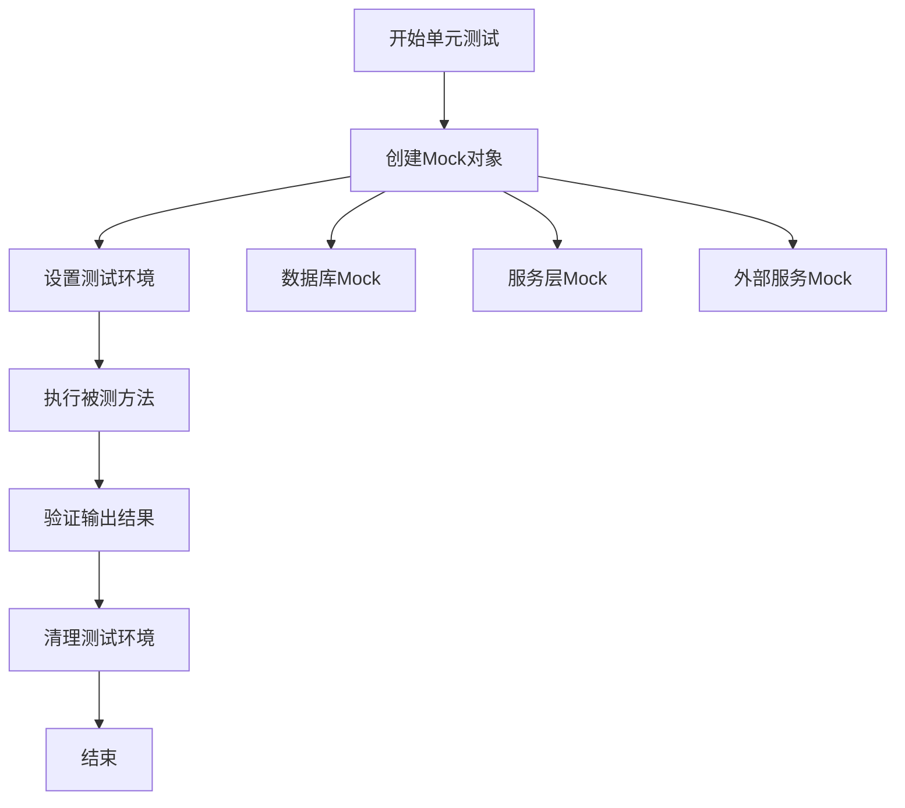

**章节来源**
- [backend/src/services/auth.service.js](file://backend/src/services/auth.service.js#L1-L220)
- [backend/src/services/quota.service.js](file://backend/src/services/quota.service.js#L1-L130)
- [backend/src/services/task.service.js](file://backend/src/services/task.service.js#L1-L259)

## 集成测试策略

### 服务间集成测试

#### 认证流程集成测试
- **完整认证链路**：从验证码发送到用户登录的端到端验证
- **JWT令牌验证**：测试中间件的认证和授权功能
- **用户状态同步**：验证用户信息在各服务间的同步

#### 业务流程集成测试
- **任务处理流程**：从任务创建到完成的完整业务链路
- **配额管理集成**：验证配额扣减、使用和返还的协调
- **支付流程集成**：测试会员购买和支付回调的集成

### 数据库集成测试

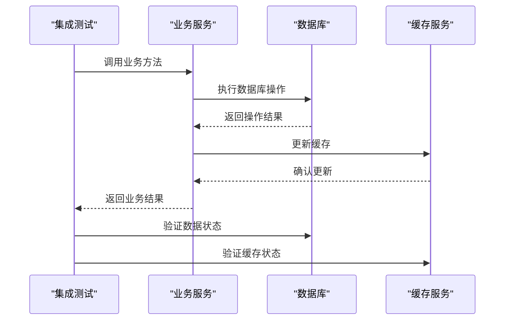

**图表来源**
- [backend/src/services/task.service.js](file://backend/src/services/task.service.js#L15-L50)
- [backend/src/middlewares/auth.middleware.js](file://backend/src/middlewares/auth.middleware.js#L1-L77)

## 端到端测试策略

### 用户场景测试

#### 登录注册流程
- **手机号验证**：测试手机号格式和唯一性验证
- **验证码流程**：验证验证码的发送、接收和验证
- **用户状态管理**：测试用户的创建、更新和状态同步

#### 图片处理流程
- **文件上传**：测试ImageUploader组件的功能
- **任务创建**：验证任务的创建和状态跟踪
- **结果获取**：测试处理结果的下载和展示

### 性能基准测试

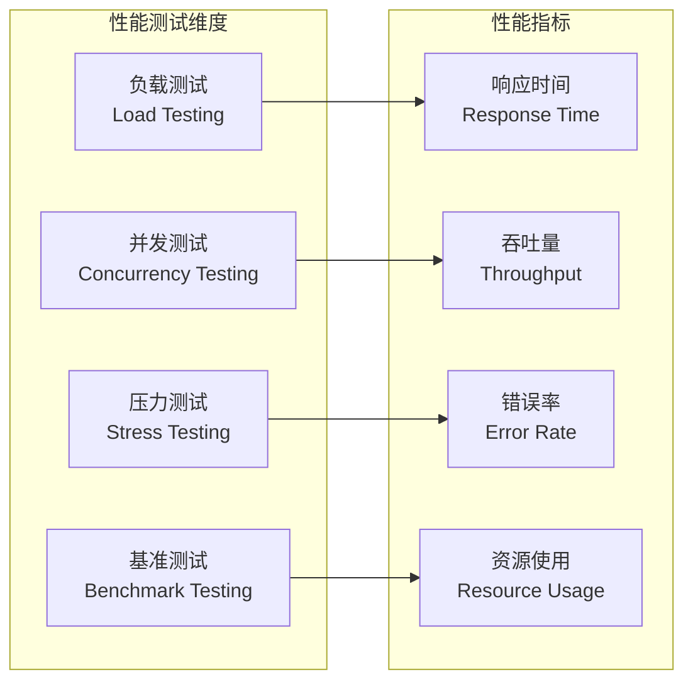

**章节来源**
- [frontend/src/components/ImageUploader.tsx](file://frontend/src/components/ImageUploader.tsx#L1-L198)
- [frontend/src/app/login/page.tsx](file://frontend/src/app/login/page.tsx#L1-L210)

## Mock测试实施方案

### Mock策略设计

#### 后端服务Mock
- **数据库Mock**：使用in-memory数据库模拟数据持久化
- **外部服务Mock**：模拟第三方API调用（短信服务、支付网关）
- **认证服务Mock**：模拟JWT令牌生成和验证

#### 前端组件Mock
- **API客户端Mock**：模拟HTTP请求和响应
- **状态管理Mock**：模拟Zustand store的行为
- **第三方SDK Mock**：模拟COS SDK和Ant Design组件

### Mock测试实现模式

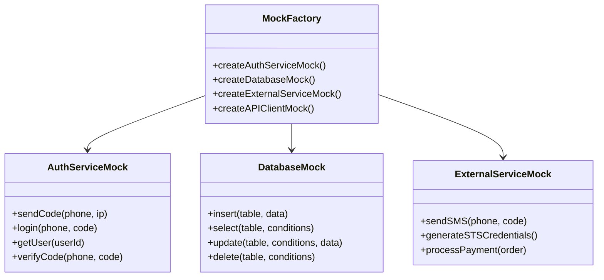

**图表来源**
- [backend/src/services/auth.service.js](file://backend/src/services/auth.service.js#L10-L50)
- [frontend/src/lib/api.ts](file://frontend/src/lib/api.ts#L1-L118)

## API接口测试方案

### 接口测试矩阵

| 接口类别 | 测试重点 | Mock需求 | 验证内容 |
|---------|---------|---------|---------|
| 认证接口 | 参数验证、业务逻辑 | 是 | 响应格式、状态码、业务数据 |
| 任务接口 | 任务状态流转 | 是 | 状态转换、权限控制 |
| 会员接口 | 支付流程 | 是 | 支付回调、状态更新 |
| 媒体接口 | 文件上传下载 | 否 | 文件完整性、权限验证 |

### API测试执行流程

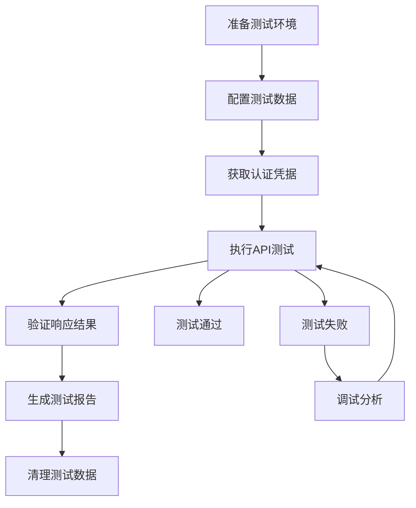

**章节来源**
- [backend/src/controllers/auth.controller.js](file://backend/src/controllers/auth.controller.js#L1-L100)
- [backend/src/controllers/task.controller.js](file://backend/src/controllers/task.controller.js#L1-L173)
- [backend/src/routes/auth.routes.js](file://backend/src/routes/auth.routes.js#L1-L28)

## 前端组件测试方案

### 组件测试策略

#### ImageUploader组件测试
- **文件验证**：测试文件类型和大小验证
- **上传流程**：测试完整的上传过程
- **错误处理**：测试各种异常情况的处理
- **UI交互**：测试用户界面的响应性

#### 登录页面组件测试
- **表单验证**：测试手机号和验证码的验证逻辑
- **异步操作**：测试验证码发送和登录的异步流程
- **状态管理**：测试与authStore的集成
- **用户体验**：测试加载状态和错误提示

### 前端测试工具配置

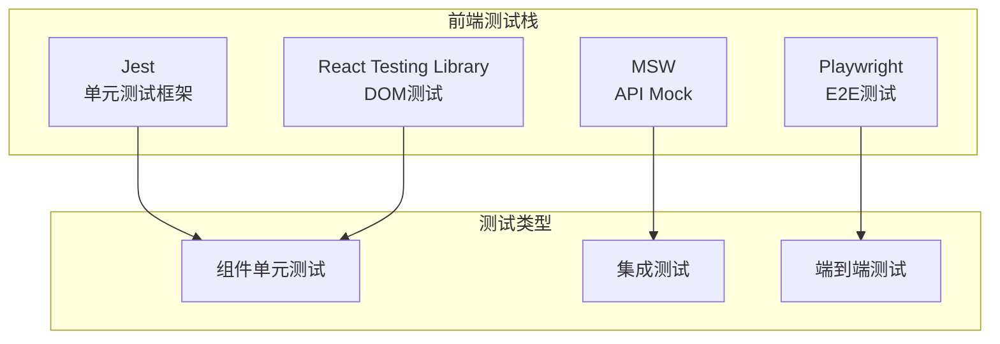

**图表来源**
- [frontend/src/components/ImageUploader.tsx](file://frontend/src/components/ImageUploader.tsx#L20-L80)
- [frontend/src/store/authStore.ts](file://frontend/src/store/authStore.ts#L1-L43)

## 测试覆盖率目标

### 覆盖率指标定义

| 覆盖率类型 | 目标值 | 说明 |
|-----------|--------|------|
| 代码覆盖率 | ≥ 80% | 执行过的代码行比例 |
| 分支覆盖率 | ≥ 75% | 执行过的代码分支比例 |
| 函数覆盖率 | ≥ 90% | 调用过的函数比例 |
| 类覆盖率 | ≥ 85% | 实例化的类比例 |

### 覆盖率监控流程

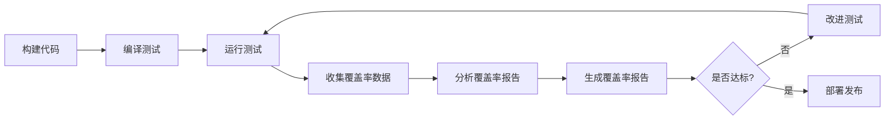

**章节来源**
- [tests/README.md](file://tests/README.md#L150-L186)

## CI/CD集成路径

### 自动化测试流水线

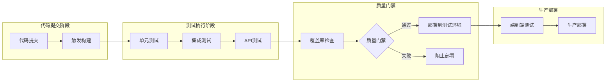

### CI/CD配置示例

```yaml
# .github/workflows/test.yml
name: 自动化测试
on: [push, pull_request]

jobs:
  test:
    runs-on: ubuntu-latest
    strategy:
      matrix:
        node-version: [18.x, 20.x]
    
    steps:
      - uses: actions/checkout@v4
      
      - name: 设置Node.js
        uses: actions/setup-node@v4
        with:
          node-version: ${{ matrix.node-version }}
          cache: 'npm'
          
      - name: 安装依赖
        run: npm install
        
      - name: 运行单元测试
        run: npm test -- --coverage
        
      - name: 运行集成测试
        run: npm run test:integration
        
      - name: 上传覆盖率报告
        uses: codecov/codecov-action@v3
        with:
          file: ./coverage/lcov.info
```

**章节来源**
- [backend/package.json](file://backend/package.json#L5-L15)
- [frontend/package.json](file://frontend/package.json#L3-L10)

## 测试工具选型建议

### 后端测试工具

| 工具类别 | 推荐工具 | 版本要求 | 用途 |
|---------|---------|---------|------|
| 单元测试 | Jest | ^29.0.0 | JavaScript测试框架 |
| API测试 | Supertest | ^6.3.0 | HTTP API测试 |
| Mock框架 | MSW | ^2.0.0 | API Mock服务 |
| 代码覆盖率 | Istanbul | ^2.0.0 | 覆盖率统计 |
| 性能测试 | Artillery | ^2.0.0 | 负载测试工具 |

### 前端测试工具

| 工具类别 | 推荐工具 | 版本要求 | 用途 |
|---------|---------|---------|------|
| 单元测试 | Vitest | ^1.0.0 | React组件测试 |
| E2E测试 | Playwright | ^1.30.0 | 端到端测试 |
| 组件测试 | React Testing Library | ^14.0.0 | DOM测试 |
| Mock框架 | MSW | ^2.0.0 | API Mock |
| 性能测试 | Lighthouse | ^10.0.0 | 性能审计 |

### 工具配置最佳实践

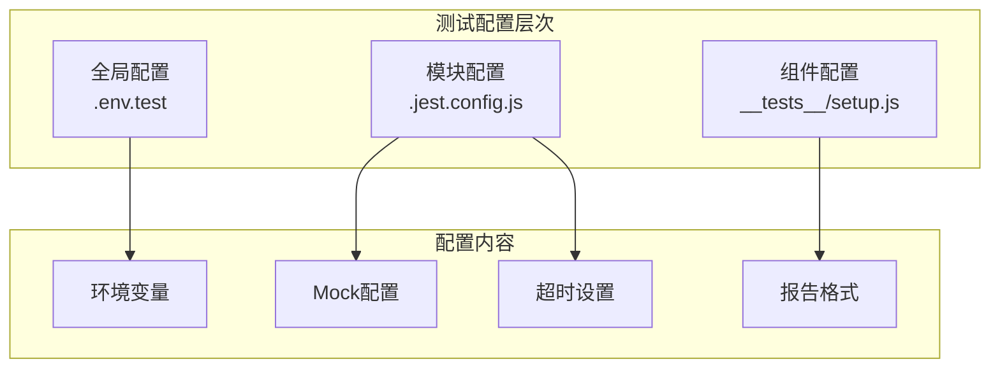

## 测试执行流程

### 测试计划制定

#### 测试阶段划分

1. **开发阶段测试**
   - 单元测试：新功能开发时编写
   - 本地测试：开发者自测
   - 提交前检查：代码质量门禁

2. **集成阶段测试**
   - 集成测试：服务间协作验证
   - 接口测试：API功能验证
   - 数据库测试：数据一致性和完整性

3. **预发布阶段测试**
   - 端到端测试：完整业务流程验证
   - 性能测试：系统负载能力评估
   - 安全测试：安全漏洞扫描

4. **生产阶段测试**
   - 监控测试：实时性能监控
   - A/B测试：新功能效果验证
   - 回归测试：变更影响评估

### 测试执行模板

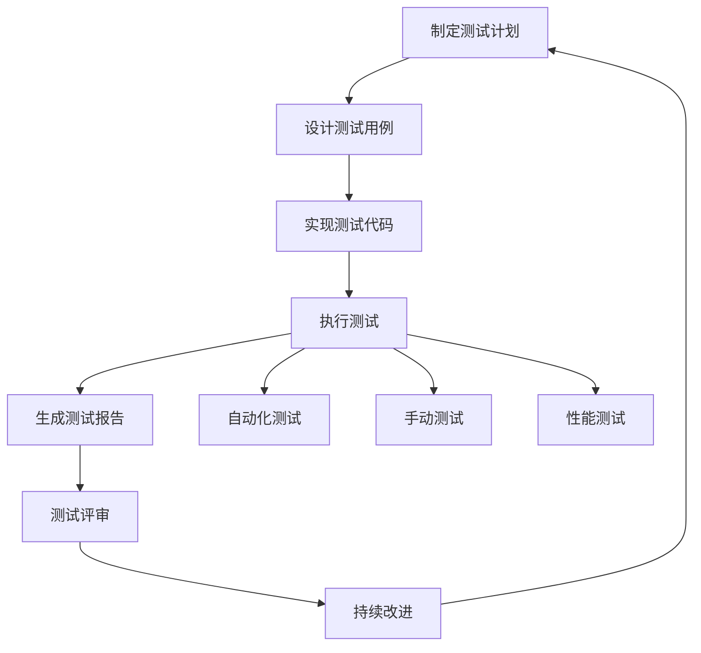

### 测试维护策略

- **测试用例维护**：定期审查和更新测试用例
- **测试环境管理**：保持测试环境的一致性
- **测试数据管理**：建立测试数据的生命周期管理
- **测试工具升级**：跟进测试工具的版本更新

**章节来源**
- [tests/README.md](file://tests/README.md#L100-L186)

## 结论

本测试策略框架为AI服装处理SaaS平台提供了全面的质量保证方案。通过分层测试方法，结合单元测试、集成测试和端到端测试，确保系统的各个层面都能得到充分验证。同时，通过合理的Mock策略和CI/CD集成，提高了测试效率和质量。

关键成功因素：
- 明确的测试目标和覆盖率要求
- 适合项目特点的测试工具选型
- 完善的CI/CD测试流水线
- 持续的测试优化和改进

通过严格执行本测试策略，能够有效提升产品质量，降低生产环境风险，为用户提供稳定可靠的AI服装处理服务。