# 系统概述

<cite>
**本文档引用文件**  
- [README.md](file://README.md)
- [backend/src/app.js](file://backend/src/app.js)
- [backend/src/server.js](file://backend/src/server.js)
- [backend/src/controllers/auth.controller.js](file://backend/src/controllers/auth.controller.js)
- [backend/src/controllers/membership.controller.js](file://backend/src/controllers/membership.controller.js)
- [backend/src/controllers/task.controller.js](file://backend/src/controllers/task.controller.js)
- [backend/src/routes/auth.routes.js](file://backend/src/routes/auth.routes.js)
- [backend/src/routes/membership.routes.js](file://backend/src/routes/membership.routes.js)
- [backend/src/routes/task.routes.js](file://backend/src/routes/task.routes.js)
- [backend/src/services/auth.service.js](file://backend/src/services/auth.service.js)
- [backend/src/services/membership.service.js](file://backend/src/services/membership.service.js)
- [backend/src/services/quota.service.js](file://backend/src/services/quota.service.js)
- [backend/src/db/migrations/20251028000001_create_users_table.js](file://backend/src/db/migrations/20251028000001_create_users_table.js)
- [backend/src/db/migrations/20251028000002_create_orders_table.js](file://backend/src/db/migrations/20251028000002_create_orders_table.js)
- [backend/src/db/migrations/20251028000003_create_tasks_table.js](file://backend/src/db/migrations/20251028000003_create_tasks_table.js)
- [frontend/src/app/login/page.tsx](file://frontend/src/app/login/page.tsx)
- [frontend/src/app/membership/page.tsx](file://frontend/src/app/membership/page.tsx)
- [frontend/src/app/task/basic/page.tsx](file://frontend/src/app/task/basic/page.tsx)
- [frontend/src/app/task/model/page.tsx](file://frontend/src/app/task/model/page.tsx)
- [frontend/src/app/task/history/page.tsx](file://frontend/src/app/task/history/page.tsx)
- [frontend/src/app/workspace/page.tsx](file://frontend/src/app/workspace/page.tsx)
</cite>

## 目录
1. [简介](#简介)
2. [项目结构](#项目结构)
3. [核心功能模块](#核心功能模块)
4. [系统架构概览](#系统架构概览)
5. [用户工作流分析](#用户工作流分析)
6. [模块协作关系](#模块协作关系)
7. [管理员监控流程](#管理员监控流程)
8. [技术栈说明](#技术栈说明)
9. [结论](#结论)

## 简介

本系统是一个专为服装电商行业设计的AI驱动SaaS图像处理平台，旨在通过自动化AI技术提升服装商品图片的处理效率和质量。平台采用会员订阅制商业模式，用户支付99元/月即可获得100次AI图像处理配额。

系统提供两大核心AI功能：服装清理增强（基础修图）和AI模特12分镜生成。前者用于生成高质量白底主图，后者利用AI生成模特多角度展示图，显著降低传统摄影成本。

平台采用前后端分离架构，前端基于Next.js构建现代化Web界面，后端使用Node.js + Express + MySQL技术栈提供稳定可靠的API服务。系统设计注重安全性、可扩展性和用户体验，为服装电商企业提供一站式AI图像解决方案。

**Section sources**
- [README.md](file://README.md)

## 项目结构

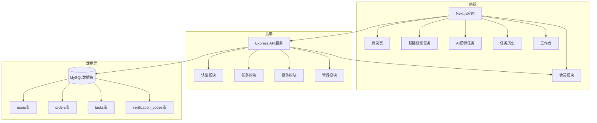

**Diagram sources**
- [README.md](file://README.md)
- [backend/src/db/migrations/20251028000001_create_users_table.js](file://backend/src/db/migrations/20251028000001_create_users_table.js)
- [backend/src/db/migrations/20251028000002_create_orders_table.js](file://backend/src/db/migrations/20251028000002_create_orders_table.js)
- [backend/src/db/migrations/20251028000003_create_tasks_table.js](file://backend/src/db/migrations/20251028000003_create_tasks_table.js)

**Section sources**
- [README.md](file://README.md)

## 核心功能模块

### 认证模块

系统采用手机号验证码登录机制，用户通过输入手机号获取6位数字验证码完成注册或登录。该模块包含防刷机制，限制同一手机号1分钟内最多发送5次验证码，同一IP地址1小时内最多20次，有效防止恶意请求。

认证成功后，系统生成JWT令牌用于后续API调用的身份验证，令牌有效期为7天。用户信息存储在users表中，包含ID、手机号、会员状态、剩余配额等关键字段。

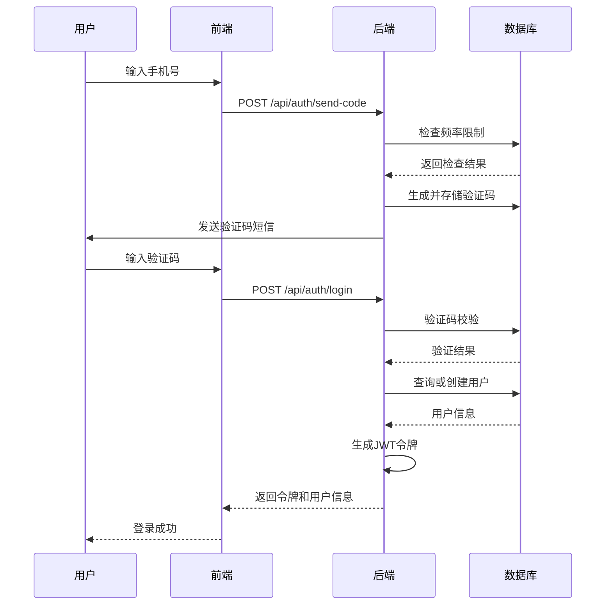

**Diagram sources**
- [backend/src/controllers/auth.controller.js](file://backend/src/controllers/auth.controller.js)
- [backend/src/services/auth.service.js](file://backend/src/services/auth.service.js)
- [backend/src/routes/auth.routes.js](file://backend/src/routes/auth.routes.js)

**Section sources**
- [backend/src/controllers/auth.controller.js](file://backend/src/controllers/auth.controller.js)
- [backend/src/services/auth.service.js](file://backend/src/services/auth.service.js)

### 会员模块

会员模块实现订阅制商业模式，用户支付99元/月获得100次AI处理配额。系统支持微信和支付宝两种支付渠道，通过标准支付流程完成交易。

会员状态与配额管理紧密关联，用户购买会员后，系统在数据库中更新其会员状态、配额数量和到期时间。配额具有时效性，到期后自动清零并降级为非会员状态。

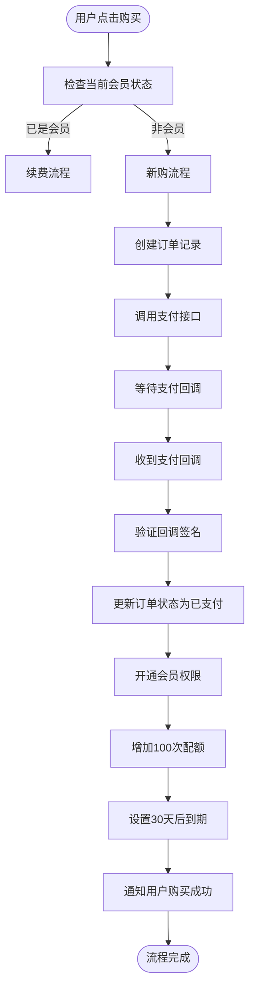

**Diagram sources**
- [backend/src/controllers/membership.controller.js](file://backend/src/controllers/membership.controller.js)
- [backend/src/services/membership.service.js](file://backend/src/services/membership.service.js)
- [backend/src/routes/membership.routes.js](file://backend/src/routes/membership.routes.js)

**Section sources**
- [backend/src/controllers/membership.controller.js](file://backend/src/controllers/membership.controller.js)
- [backend/src/services/membership.service.js](file://backend/src/services/membership.service.js)

### 任务模块

任务模块是系统的核心处理引擎，支持两种AI图像处理任务：基础修图（basic_clean）和AI模特12分镜（model_pose12）。用户创建任务时需提供图片URL和任务类型。

基础修图任务采用同步处理模式，立即执行并返回结果；AI模特任务为异步处理，提交到第三方AI服务后通过轮询获取结果。所有任务操作均受配额系统约束，确保只有会员且配额充足的用户才能执行任务。

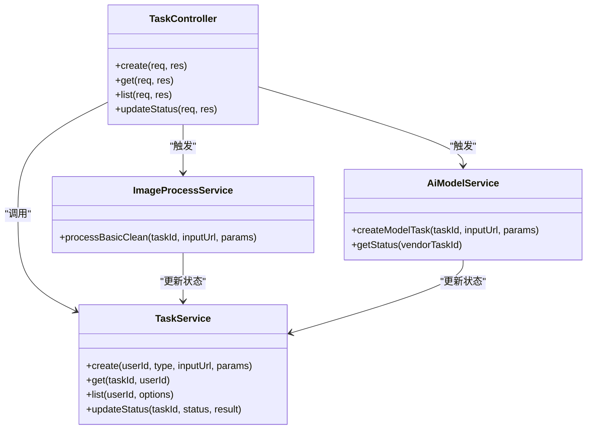

**Diagram sources**
- [backend/src/controllers/task.controller.js](file://backend/src/controllers/task.controller.js)
- [backend/src/services/task.service.js](file://backend/src/services/task.service.js)
- [backend/src/services/imageProcess.service.js](file://backend/src/services/imageProcess.service.js)
- [backend/src/services/aiModel.service.js](file://backend/src/services/aiModel.service.js)

**Section sources**
- [backend/src/controllers/task.controller.js](file://backend/src/controllers/task.controller.js)
- [backend/src/services/task.service.js](file://backend/src/services/task.service.js)

### 配额模块

配额模块是系统的计费核心，确保所有AI处理服务的使用都受控于会员订阅体系。系统采用事务级配额管理，使用数据库行锁防止并发竞争，保证配额扣减的原子性和准确性。

配额操作遵循"预扣-确认"模式：任务创建时预扣配额，处理成功则确认扣减，失败则自动返还。这种设计既防止了资源滥用，又保障了用户体验，避免因处理失败而损失配额。

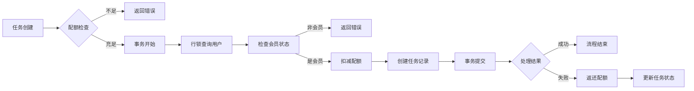

**Diagram sources**
- [backend/src/services/quota.service.js](file://backend/src/services/quota.service.js)
- [backend/src/controllers/task.controller.js](file://backend/src/controllers/task.controller.js)

**Section sources**
- [backend/src/services/quota.service.js](file://backend/src/services/quota.service.js)

## 系统架构概览

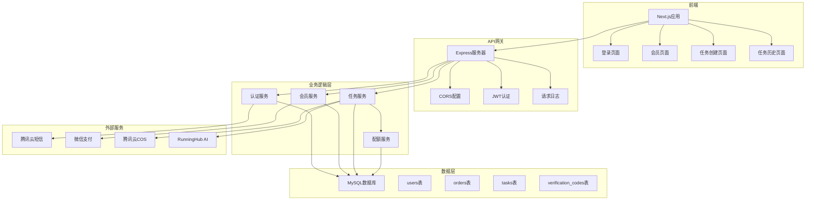

**Diagram sources**
- [backend/src/app.js](file://backend/src/app.js)
- [backend/src/server.js](file://backend/src/server.js)
- [README.md](file://README.md)

**Section sources**
- [backend/src/app.js](file://backend/src/app.js)
- [backend/src/server.js](file://backend/src/server.js)

## 用户工作流分析

### 新用户注册流程

新用户首次使用系统时，需完成注册、购买会员和创建任务的完整流程。系统通过简洁的引导界面帮助用户快速上手，从手机号登录开始，逐步完成会员购买和首次任务创建。

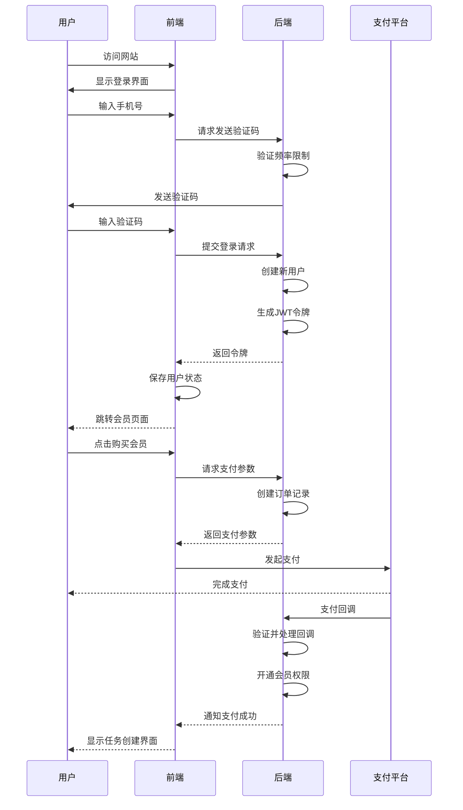

**Diagram sources**
- [frontend/src/app/login/page.tsx](file://frontend/src/app/login/page.tsx)
- [frontend/src/app/membership/page.tsx](file://frontend/src/app/membership/page.tsx)
- [backend/src/controllers/auth.controller.js](file://backend/src/controllers/auth.controller.js)
- [backend/src/controllers/membership.controller.js](file://backend/src/controllers/membership.controller.js)

**Section sources**
- [frontend/src/app/login/page.tsx](file://frontend/src/app/login/page.tsx)
- [frontend/src/app/membership/page.tsx](file://frontend/src/app/membership/page.tsx)

### 会员日常使用流程

会员用户的日常使用流程简洁高效，主要包含任务创建、状态查看和结果管理三个环节。系统提供直观的界面设计，用户可轻松上传图片、选择处理类型并提交任务。

任务提交后，系统实时显示处理进度，用户可在任务历史页面查看所有处理记录和结果图片。对于AI模特等异步任务，系统自动轮询状态更新，确保用户及时获取处理结果。

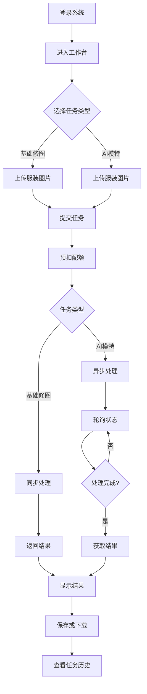

**Diagram sources**
- [frontend/src/app/task/basic/page.tsx](file://frontend/src/app/task/basic/page.tsx)
- [frontend/src/app/task/model/page.tsx](file://frontend/src/app/task/model/page.tsx)
- [frontend/src/app/task/history/page.tsx](file://frontend/src/app/task/history/page.tsx)
- [backend/src/controllers/task.controller.js](file://backend/src/controllers/task.controller.js)

**Section sources**
- [frontend/src/app/task/basic/page.tsx](file://frontend/src/app/task/basic/page.tsx)
- [frontend/src/app/task/model/page.tsx](file://frontend/src/app/task/model/page.tsx)
- [frontend/src/app/task/history/page.tsx](file://frontend/src/app/task/history/page.tsx)

## 模块协作关系

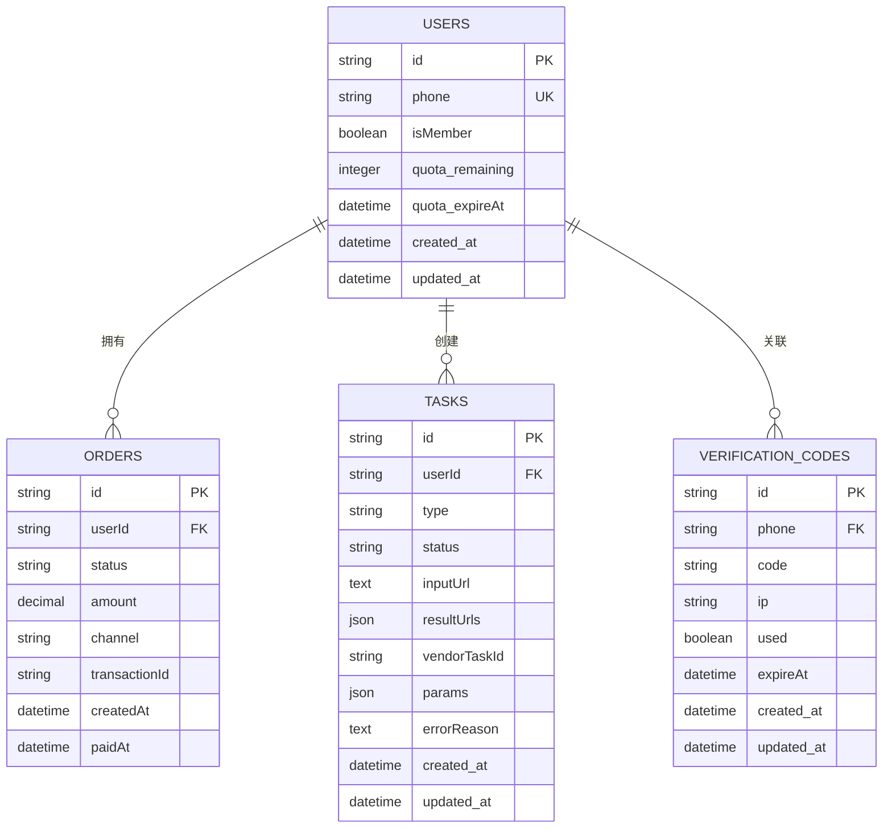

**Diagram sources**
- [backend/src/db/migrations/20251028000001_create_users_table.js](file://backend/src/db/migrations/20251028000001_create_users_table.js)
- [backend/src/db/migrations/20251028000002_create_orders_table.js](file://backend/src/db/migrations/20251028000002_create_orders_table.js)
- [backend/src/db/migrations/20251028000003_create_tasks_table.js](file://backend/src/db/migrations/20251028000003_create_tasks_table.js)

**Section sources**
- [backend/src/db/migrations/20251028000001_create_users_table.js](file://backend/src/db/migrations/20251028000001_create_users_table.js)
- [backend/src/db/migrations/20251028000002_create_orders_table.js](file://backend/src/db/migrations/20251028000002_create_orders_table.js)
- [backend/src/db/migrations/20251028000003_create_tasks_table.js](file://backend/src/db/migrations/20251028000003_create_tasks_table.js)

## 管理员监控流程

管理员通过专用接口监控系统运行状态，可查询用户列表、任务统计和系统健康状况。这些功能主要通过admin路由提供，包含用户管理、任务审核和系统监控等能力。

管理员权限独立于普通用户，拥有更广泛的查询和管理权限，但不直接干预配额系统的核心逻辑，确保计费系统的安全性和完整性。

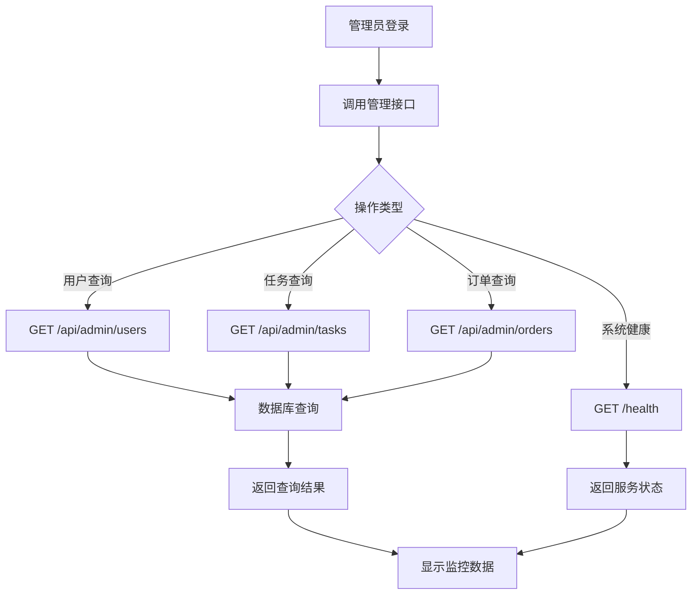

**Diagram sources**
- [backend/src/routes/admin.routes.js](file://backend/src/routes/admin.routes.js)
- [backend/src/controllers/admin.controller.js](file://backend/src/controllers/admin.controller.js)

**Section sources**
- [backend/src/routes/admin.routes.js](file://backend/src/routes/admin.routes.js)
- [backend/src/controllers/admin.controller.js](file://backend/src/controllers/admin.controller.js)

## 技术栈说明

本系统采用现代化的技术栈组合，前后端分离架构确保了系统的可维护性和扩展性。前端使用Next.js框架，结合React组件和Zustand状态管理，提供流畅的用户体验。

后端基于Node.js + Express构建RESTful API服务，使用Knex.js作为数据库查询构建器，连接MySQL 8.0数据库。系统通过JWT实现安全的身份验证，使用Winston进行日志记录，确保系统的可观测性。

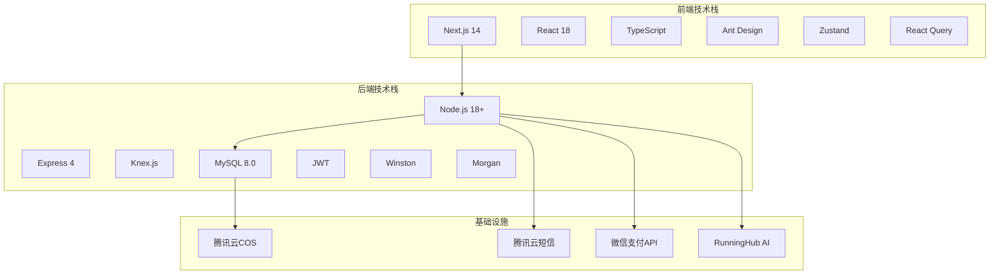

**Diagram sources**
- [backend/package.json](file://backend/package.json)
- [frontend/package.json](file://frontend/package.json)
- [README.md](file://README.md)

**Section sources**
- [backend/package.json](file://backend/package.json)
- [frontend/package.json](file://frontend/package.json)

## 结论

本AI驱动的服装行业SaaS图像处理平台通过精心设计的前后端分离架构，实现了高效、安全和可扩展的AI图像处理服务。系统以手机号验证码登录为基础，构建了完整的会员订阅制商业模式，用户支付99元/月即可获得100次AI处理配额。

核心功能模块包括认证、会员、任务和配额管理，各模块通过清晰的接口定义和数据契约紧密协作。配额系统作为计费核心，采用事务级操作和行锁机制，确保了资源使用的准确性和安全性。

用户工作流设计简洁直观，新用户可快速完成注册、购买和首次任务创建，会员用户则能高效地进行日常图像处理。管理员通过专用接口监控系统运行，确保服务的稳定性和可靠性。

技术上，系统采用Next.js + Node.js + Express + MySQL的现代化技术栈，结合腾讯云和第三方AI服务，构建了一个完整的云原生SaaS解决方案。这种架构不仅满足了当前业务需求，也为未来的功能扩展和性能优化提供了坚实基础。