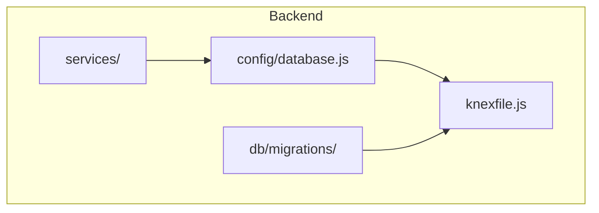
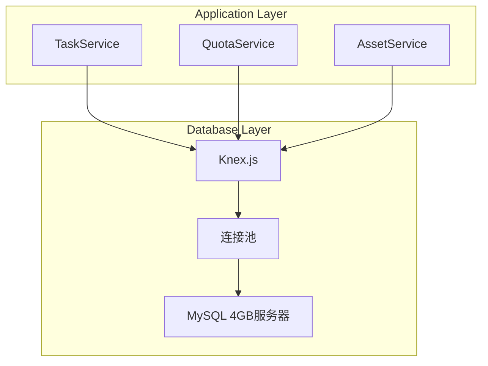
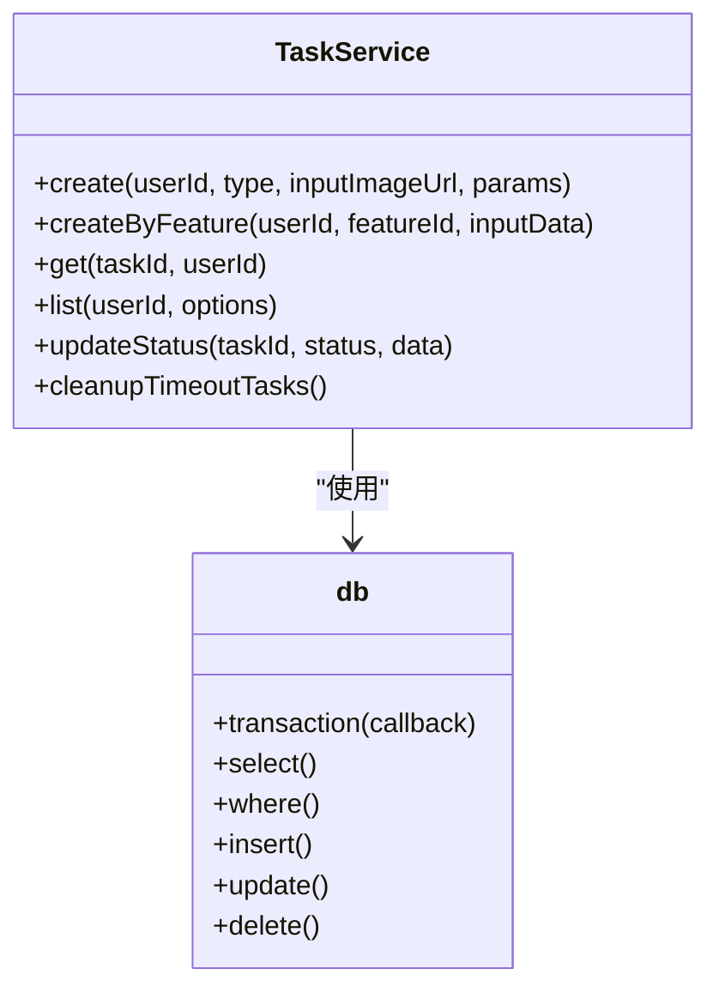
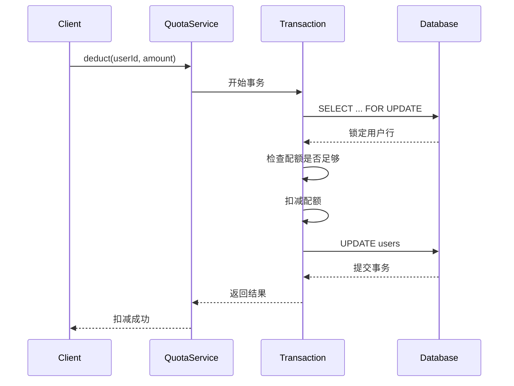
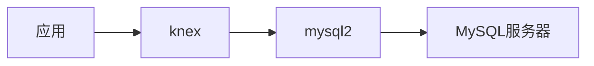

# Mysql 优化 4gb 服务器

<cite>
**本文档引用的文件**   
- [database.js](file://backend/src/config/database.js)
- [knexfile.js](file://backend/knexfile.js)
- [task.service.js](file://backend/src/services/task.service.js)
- [asset.service.js](file://backend/src/services/asset.service.js)
- [quota.service.js](file://backend/src/services/quota.service.js)
- [pipelineEngine.service.js](file://backend/src/services/pipelineEngine.service.js)
- [rateLimiter.middleware.js](file://backend/src/middlewares/rateLimiter.middleware.js)
- [performance-test.js](file://backend/performance-test.js)
- [create_users_table.js](file://backend/src/db/migrations/20251028000001_create_users_table.js)
- [create_orders_table.js](file://backend/src/db/migrations/20251028000002_create_orders_table.js)
- [create_tasks_table.js](file://backend/src/db/migrations/20251028000003_create_tasks_table.js)
- [create_system_configs_table.js](file://backend/src/db/migrations/20251028000006_create_system_configs_table.js)
</cite>

## 目录
1. [简介](#简介)
2. [项目结构](#项目结构)
3. [核心组件](#核心组件)
4. [架构概述](#架构概述)
5. [详细组件分析](#详细组件分析)
6. [依赖分析](#依赖分析)
7. [性能考虑](#性能考虑)
8. [故障排除指南](#故障排除指南)
9. [结论](#结论)

## 简介
本文档旨在为4GB内存服务器上的MySQL数据库提供优化建议，基于AI照片处理SaaS平台后端服务的代码库分析。该系统使用Knex.js作为SQL查询构建器，MySQL2作为数据库驱动，通过连接池管理数据库连接。文档将深入分析数据库配置、表结构设计、查询性能以及连接池设置，提供针对性的优化策略。

## 项目结构
该项目是一个典型的Node.js后端服务，采用分层架构设计。核心数据库相关文件位于`backend/src/config/`和`backend/src/db/`目录下。配置文件`knexfile.js`定义了数据库连接参数和连接池设置，而`src/db/migrations/`目录下的迁移文件定义了数据库表结构。

**图源**
- [knexfile.js](file://backend/knexfile.js#L1-L45)
- [database.js](file://backend/src/config/database.js#L1-L9)

**本节来源**
- [knexfile.js](file://backend/knexfile.js#L1-L45)
- [database.js](file://backend/src/config/database.js#L1-L9)
- [migrations](file://backend/src/db/migrations/)

## 核心组件
系统的核心数据库组件包括数据库配置、连接池管理、以及基于Knex.js的查询接口。`database.js`文件通过`knex`函数创建数据库实例，使用`knexfile.js`中定义的配置。连接池的最小和最大连接数通过环境变量`DATABASE_POOL_MIN`和`DATABASE_POOL_MAX`控制，在生产环境中默认为5-20个连接。

**本节来源**
- [database.js](file://backend/src/config/database.js#L1-L9)
- [knexfile.js](file://backend/knexfile.js#L1-L45)

## 架构概述
系统采用基于MySQL的关系型数据库架构，通过Knex.js进行数据库操作。应用层通过服务类（如`task.service.js`、`quota.service.js`）封装业务逻辑，这些服务类使用数据库连接执行CRUD操作。数据库连接通过连接池管理，以提高性能和资源利用率。

**图源**
- [database.js](file://backend/src/config/database.js#L1-L9)
- [knexfile.js](file://backend/knexfile.js#L1-L45)

## 详细组件分析

### 任务服务分析
`TaskService`是系统中最复杂的数据库交互组件之一，负责创建、查询和更新任务记录。它在创建任务时使用数据库事务确保配额扣减和任务创建的原子性。服务中定义了多个查询方法，包括按用户ID查询任务列表，支持状态和类型过滤。

**图源**
- [task.service.js](file://backend/src/services/task.service.js#L1-L473)
- [database.js](file://backend/src/config/database.js#L1-L9)

**本节来源**
- [task.service.js](file://backend/src/services/task.service.js#L1-L473)

### 配额服务分析
`QuotaService`实现了关键的配额管理功能，特别强调了非负配额保证。在扣减配额时，服务使用`forUpdate()`行级锁来防止并发问题，确保用户的剩余配额不会变为负数。这是典型的悲观锁应用，适用于高并发场景下的库存或配额管理。

**图源**
- [quota.service.js](file://backend/src/services/quota.service.js#L1-L118)
- [database.js](file://backend/src/config/database.js#L1-L9)

**本节来源**
- [quota.service.js](file://backend/src/services/quota.service.js#L1-L118)

### 资产服务分析
`AssetService`提供了用户素材库的管理功能，支持按类型、功能ID和时间范围进行过滤查询。查询中使用了LEFT JOIN来关联`feature_definitions`表，以获取功能名称。服务实现了分页功能，使用`limit`和`offset`来控制返回结果的数量。

**本节来源**
- [asset.service.js](file://backend/src/services/asset.service.js#L1-L216)

## 依赖分析
系统的主要数据库依赖是`mysql2`和`knex`。`mysql2`是MySQL的Node.js驱动，提供了异步查询支持和连接池功能。`knex`是SQL查询构建器，提供了链式API来构建查询，并支持迁移和种子数据管理。连接池配置在`knexfile.js`中定义，开发环境默认为2-10个连接，生产环境为5-20个连接。

**图源**
- [package.json](file://backend/package.json#L1-L64)
- [knexfile.js](file://backend/knexfile.js#L1-L45)

**本节来源**
- [package.json](file://backend/package.json#L1-L64)
- [knexfile.js](file://backend/knexfile.js#L1-L45)

## 性能考虑
根据`performance-test.js`中的测试代码，系统对数据库性能有明确要求。主键查询应在10ms内完成，JOIN查询在50ms内完成。连接池的最大连接数不应小于10，否则会影响评分。测试代码还检测了N+1查询问题，这是一个常见的性能反模式，应通过预加载或批量查询来避免。

**本节来源**
- [performance-test.js](file://backend/performance-test.js#L31-L81)

## 故障排除指南
当遇到数据库性能问题时，应首先检查连接池状态。通过`db.client.pool`可以获取当前使用的连接数、空闲连接数以及等待获取连接的请求数。如果等待获取连接的请求数持续较高，应考虑增加连接池的最大连接数。此外，应定期检查慢查询日志，优化没有使用索引的查询。

**本节来源**
- [performance-test.js](file://backend/performance-test.js#L58-L81)

## 结论
对于4GB内存的MySQL服务器，建议将连接池的最大连接数设置为20-50之间，以平衡并发性能和内存使用。应确保所有频繁查询的字段都有适当的索引，特别是外键和过滤条件字段。在高并发场景下，使用行级锁（如`forUpdate()`）可以有效防止数据不一致问题。定期运行性能测试，监控查询响应时间和连接池状态，是保持系统稳定的关键。