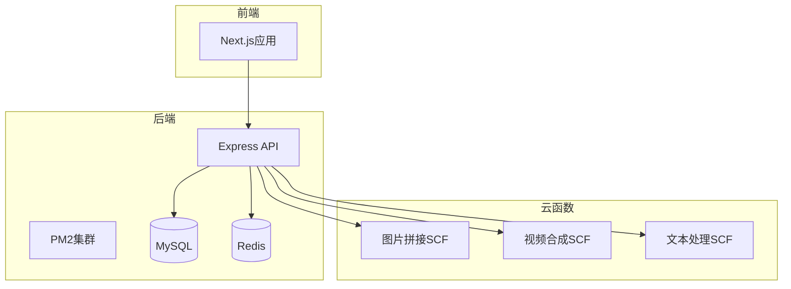
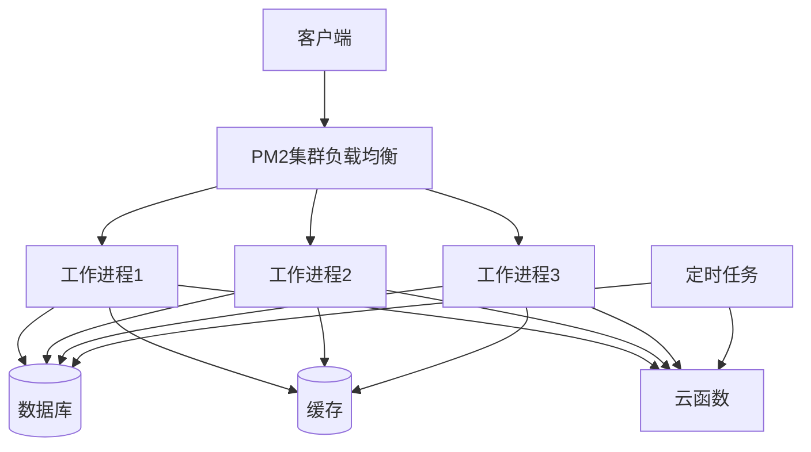
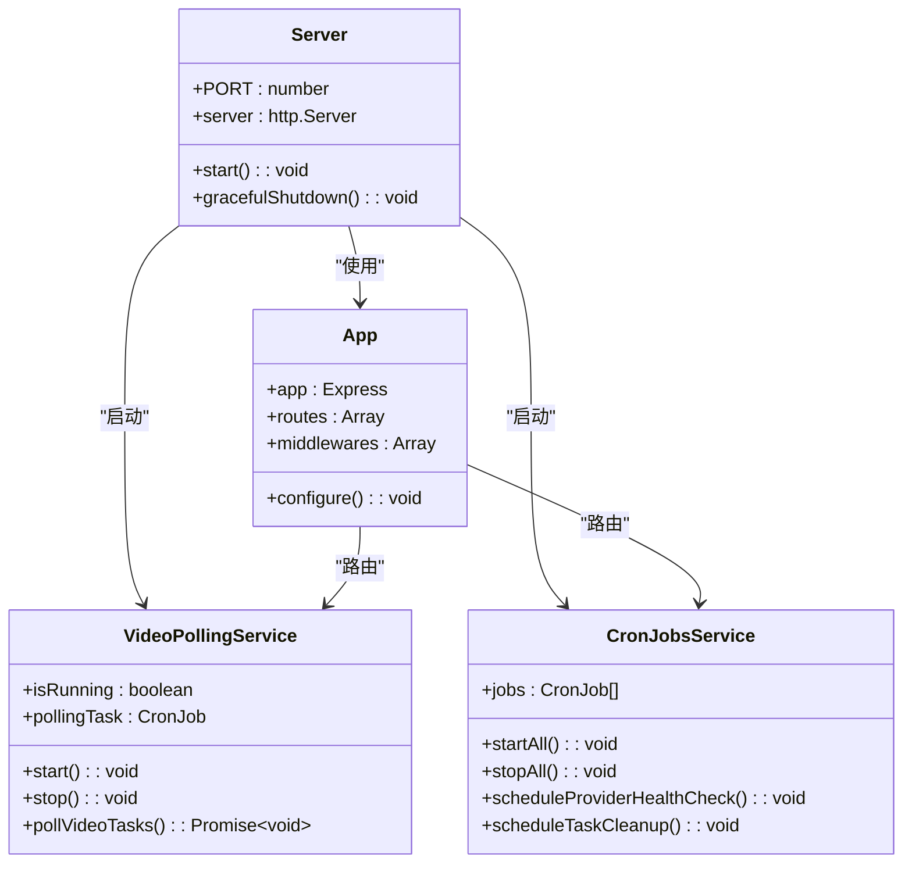
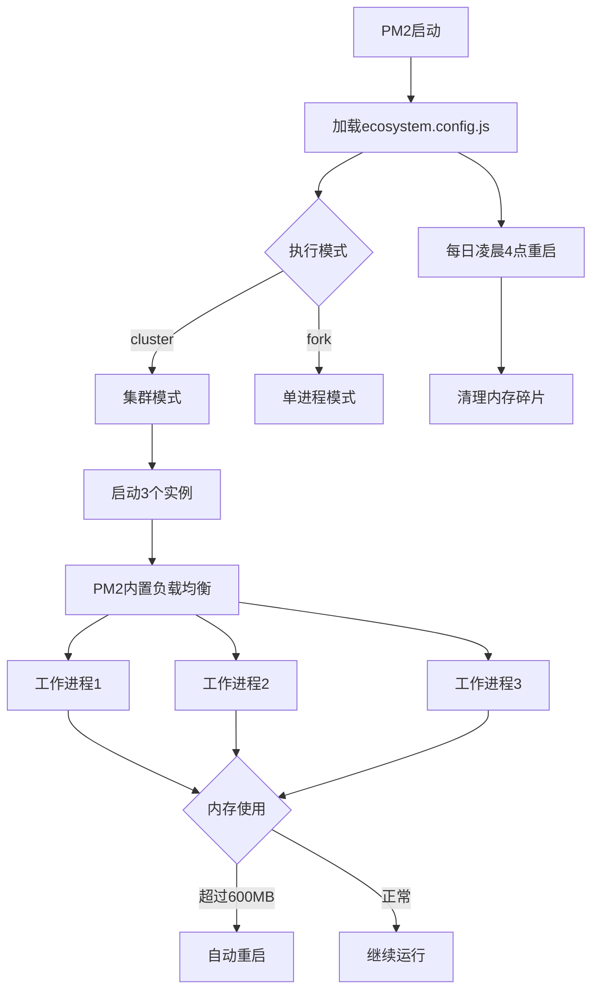
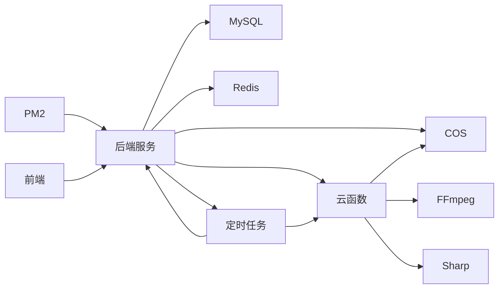

# Pm2 集群优化

<cite>
**本文档引用文件**   
- [ecosystem.config.js](file://backend/ecosystem.config.js)
- [server.js](file://backend/src/server.js)
- [app.js](file://backend/src/app.js)
- [frontend/ecosystem.config.js](file://frontend/ecosystem.config.js)
- [videoPolling.service.js](file://backend/src/services/videoPolling.service.js)
- [cronJobs.service.js](file://backend/src/services/cronJobs.service.js)
- [performance-test.js](file://backend/performance-test.js)
- [load-test.js](file://backend/load-test.js)
</cite>

## 目录
1. [简介](#简介)
2. [项目结构](#项目结构)
3. [核心组件](#核心组件)
4. [架构概述](#架构概述)
5. [详细组件分析](#详细组件分析)
6. [依赖分析](#依赖分析)
7. [性能考量](#性能考量)
8. [故障排除指南](#故障排除指南)
9. [结论](#结论)

## 简介
本文档详细分析了基于PM2集群模式的后端服务优化方案，重点针对4核4G服务器环境进行了配置调优。系统采用Node.js + Express架构，结合腾讯云SCF无服务架构，实现了AI图像和视频处理的SaaS平台。通过PM2集群模式充分利用多核CPU，同时对内存、日志、自动重启等关键参数进行了生产环境优化。

## 项目结构
项目采用前后端分离架构，后端服务通过PM2集群模式运行，前端使用Next.js框架。后端包含API服务、数据库操作、定时任务和云函数集成，前端提供管理界面和用户交互。云函数（SCF）处理计算密集型任务如视频合成、图片拼接和文本处理。

**图表来源**
- [ecosystem.config.js](file://backend/ecosystem.config.js#L1-L66)
- [frontend/ecosystem.config.js](file://frontend/ecosystem.config.js#L1-L26)

**本节来源**
- [ecosystem.config.js](file://backend/ecosystem.config.js#L1-L66)
- [frontend/ecosystem.config.js](file://frontend/ecosystem.config.js#L1-L26)

## 核心组件
后端核心组件包括Express应用服务器、PM2进程管理、数据库操作服务和定时任务调度。通过PM2集群模式启动3个实例，充分利用4核CPU资源，同时为系统和MySQL预留1个核心。每个实例内存限制为600MB，3个实例共占用1.8GB内存，为系统和其他服务预留2.2GB内存。

**本节来源**
- [ecosystem.config.js](file://backend/ecosystem.config.js#L1-L66)
- [server.js](file://backend/src/server.js#L1-L106)

## 架构概述
系统采用微服务架构，主API服务处理用户请求和业务逻辑，云函数处理计算密集型任务。PM2集群模式确保API服务高可用和高性能，通过负载均衡将请求分发到多个工作进程。定时任务服务负责轮询视频生成状态和清理过期任务，确保系统状态一致性。

**图表来源**
- [ecosystem.config.js](file://backend/ecosystem.config.js#L1-L66)
- [server.js](file://backend/src/server.js#L1-L106)

## 详细组件分析

### 后端服务分析
后端服务通过PM2集群模式运行，配置了3个实例以充分利用4核CPU。每个实例独立处理请求，通过内置的负载均衡机制分发流量。服务启动时会验证环境变量，确保所有必需配置都已设置。同时启动视频轮询服务和定时任务服务，监控异步任务状态。

**图表来源**
- [server.js](file://backend/src/server.js#L1-L106)
- [app.js](file://backend/src/app.js#L1-L125)

**本节来源**
- [server.js](file://backend/src/server.js#L1-L106)
- [app.js](file://backend/src/app.js#L1-L125)

### PM2配置分析
PM2配置针对4核4G服务器进行了专门优化，采用集群模式运行3个实例，为系统和MySQL预留资源。配置了每日凌晨4点的定时重启，以清理内存碎片。设置了600MB的内存重启阈值，防止内存泄漏导致服务不稳定。生产环境禁用了文件监听，减少CPU占用。

**图表来源**
- [ecosystem.config.js](file://backend/ecosystem.config.js#L1-L66)

**本节来源**
- [ecosystem.config.js](file://backend/ecosystem.config.js#L1-L66)

## 依赖分析
系统依赖关系清晰，后端服务依赖数据库、缓存和云函数。PM2作为进程管理工具，管理后端服务的生命周期。云函数之间共享部分工具库，如日志记录、错误处理和COS上传功能，减少代码重复。前端通过API与后端通信，不直接依赖其他服务。

**图表来源**
- [package.json](file://backend/package.json#L1-L64)
- [ecosystem.config.js](file://backend/ecosystem.config.js#L1-L66)

**本节来源**
- [package.json](file://backend/package.json#L1-L64)
- [ecosystem.config.js](file://backend/ecosystem.config.js#L1-L66)

## 性能考量
系统经过全面的性能测试和优化，包括数据库查询优化、连接池配置和压力测试。数据库连接池配置为最小5个、最大20个连接，确保高并发下的数据库访问性能。通过JOIN查询替代N+1查询，性能提升显著。压力测试显示系统在100并发下表现稳定，QPS达到100以上，P99响应时间低于500ms。

**本节来源**
- [performance-test.js](file://backend/performance-test.js#L1-L181)
- [load-test.js](file://backend/load-test.js#L1-L404)

## 故障排除指南
当系统出现性能问题时，首先检查PM2进程状态和日志。使用`pm2 list`查看所有进程状态，`pm2 logs`查看实时日志。检查内存使用情况，确认是否达到600MB的重启阈值。对于数据库性能问题，检查慢查询日志和索引使用情况。定时任务失败时，检查cron表达式和依赖服务状态。

**本节来源**
- [ecosystem.config.js](file://backend/ecosystem.config.js#L1-L66)
- [server.js](file://backend/src/server.js#L1-L106)
- [cronJobs.service.js](file://backend/src/services/cronJobs.service.js#L1-L154)

## 结论
通过PM2集群模式优化，系统充分利用了4核CPU的计算能力，同时合理分配内存资源，确保系统稳定运行。配置的定时重启机制有效预防内存泄漏问题。结合全面的性能测试和监控，系统能够在高并发场景下保持良好性能。建议定期审查PM2配置，根据实际负载情况调整实例数量和内存限制。