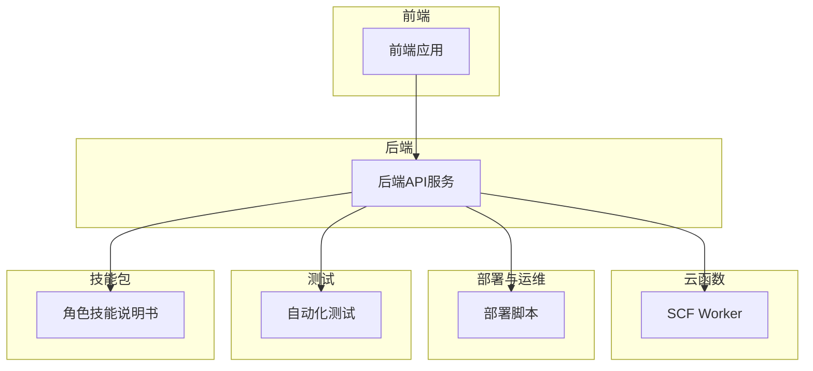
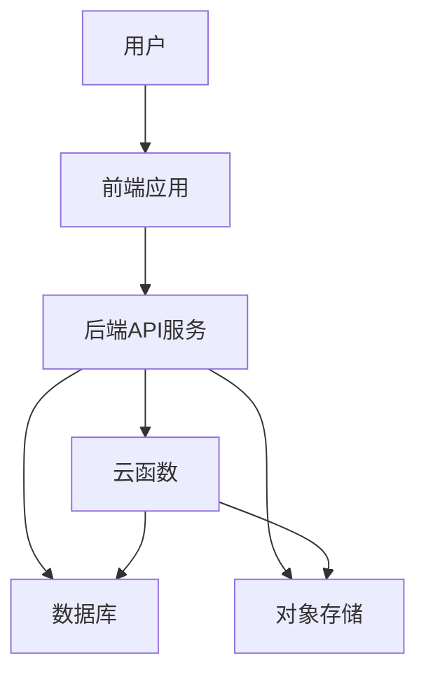
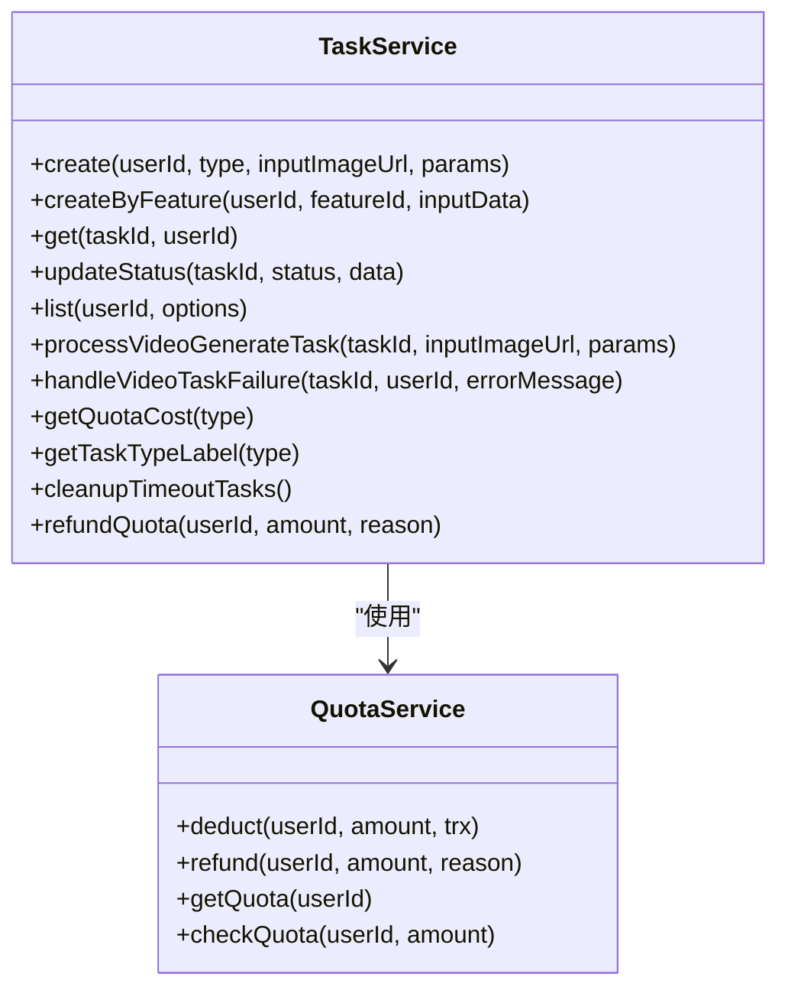
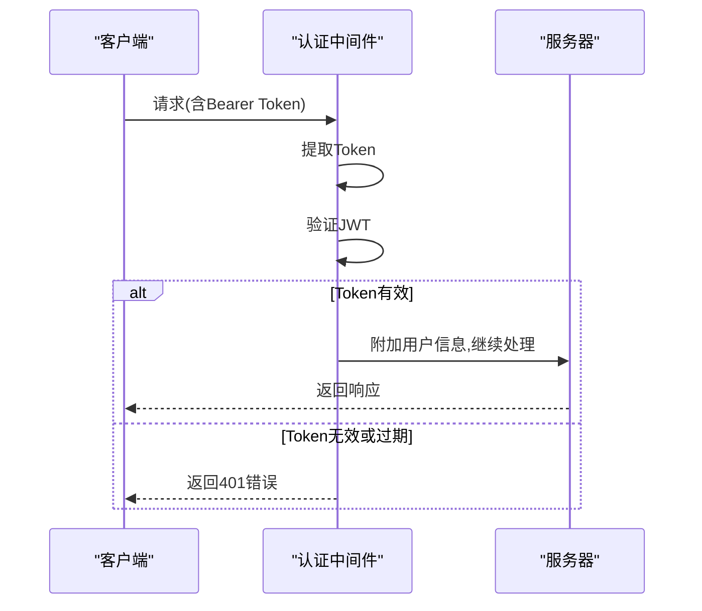
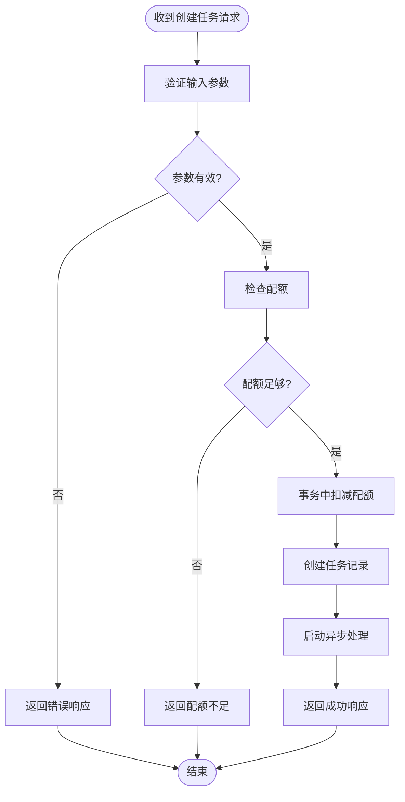
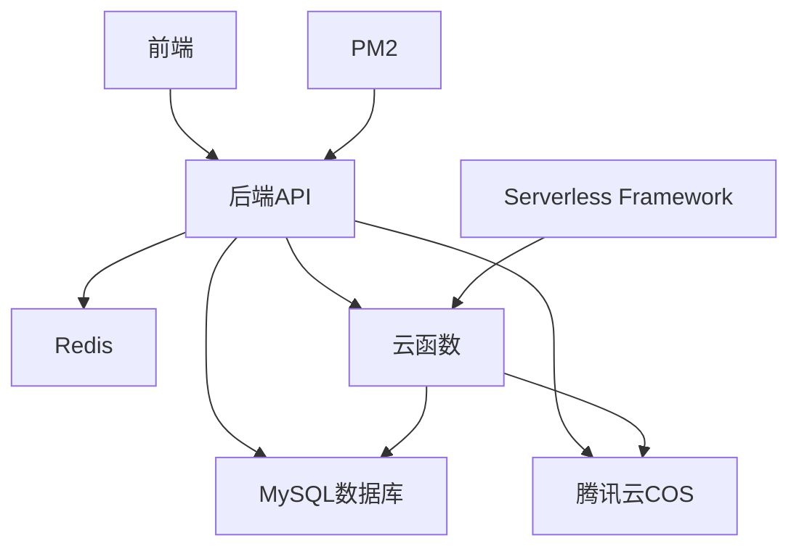
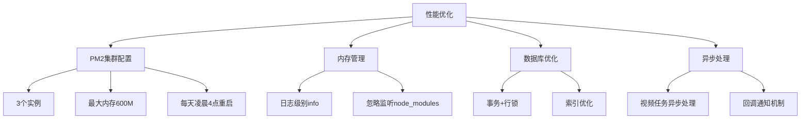

# 生产环境控制台清理

<cite>
**本文档引用文件**   
- [README.md](file://README.md)
- [DEPLOY_PRODUCTION.md](file://DEPLOY_PRODUCTION.md)
- [backend/README.md](file://backend/README.md)
- [frontend/README.md](file://frontend/README.md)
- [scf/README.md](file://scf/README.md)
- [backend/src/app.js](file://backend/src/app.js)
- [backend/src/server.js](file://backend/src/server.js)
- [backend/ecosystem.config.js](file://backend/ecosystem.config.js)
- [backend/package.json](file://backend/package.json)
- [frontend/package.json](file://frontend/package.json)
- [backend/src/services/task.service.js](file://backend/src/services/task.service.js)
- [backend/src/controllers/task.controller.js](file://backend/src/controllers/task.controller.js)
- [backend/src/services/quota.service.js](file://backend/src/services/quota.service.js)
- [backend/src/middlewares/auth.middleware.js](file://backend/src/middlewares/auth.middleware.js)
- [backend/src/routes/task.routes.js](file://backend/src/routes/task.routes.js)
</cite>

## 目录

1. [简介](#简介)
2. [项目结构](#项目结构)
3. [核心组件](#核心组件)
4. [架构概述](#架构概述)
5. [详细组件分析](#详细组件分析)
6. [依赖分析](#依赖分析)
7. [性能考虑](#性能考虑)
8. [故障排除指南](#故障排除指南)
9. [结论](#结论)

## 简介

本项目是一个为服装电商提供AI图片处理服务的SaaS平台，采用前后端分离、微服务和云原生技术架构。平台核心业务是会员制订阅服务，用户支付99元/月可获得100次处理配额。系统包含认证、会员管理、任务处理、配额管理、媒体服务和支付集成等核心功能。

**Section sources**
- [README.md](file://README.md#L1-L335)

## 项目结构

该项目采用模块化设计，主要分为后端API服务、前端工作台、微信小程序、云函数、部署脚本、测试和技能包等部分。后端使用Express.js框架，前端使用Next.js框架，云函数处理大文件异步任务，整个系统采用微服务架构。

**Diagram sources**
- [README.md](file://README.md#L10-L335)

**Section sources**
- [README.md](file://README.md#L10-L335)

## 核心组件

系统核心组件包括任务服务、配额服务、认证中间件和任务控制器。任务服务负责创建和管理AI处理任务，配额服务确保配额扣减和返还的原子性，认证中间件处理JWT验证，任务控制器协调前后端交互。

**Section sources**
- [backend/src/services/task.service.js](file://backend/src/services/task.service.js#L1-L474)
- [backend/src/services/quota.service.js](file://backend/src/services/quota.service.js#L1-L119)
- [backend/src/middlewares/auth.middleware.js](file://backend/src/middlewares/auth.middleware.js#L1-L77)
- [backend/src/controllers/task.controller.js](file://backend/src/controllers/task.controller.js#L1-L246)

## 架构概述

系统采用分层架构，从前端到后端再到云函数，形成完整的处理链条。前端通过API与后端通信，后端处理业务逻辑并调用云函数处理重任务，所有操作都受到配额系统的严格控制。

**Diagram sources**
- [README.md](file://README.md#L10-L335)
- [backend/src/app.js](file://backend/src/app.js#L1-L126)

**Section sources**
- [README.md](file://README.md#L10-L335)
- [backend/src/app.js](file://backend/src/app.js#L1-L126)

## 详细组件分析

### 任务服务分析

任务服务是系统的核心业务逻辑组件，负责处理AI处理任务的创建、查询和状态管理。它与配额服务紧密协作，确保每次任务创建都伴随着配额的扣减。

**Diagram sources**
- [backend/src/services/task.service.js](file://backend/src/services/task.service.js#L1-L474)
- [backend/src/services/quota.service.js](file://backend/src/services/quota.service.js#L1-L119)

**Section sources**
- [backend/src/services/task.service.js](file://backend/src/services/task.service.js#L1-L474)

### 认证机制分析

系统采用JWT进行用户认证，通过中间件实现请求级别的身份验证。认证信息存储在请求对象中，供后续业务逻辑使用。

**Diagram sources**
- [backend/src/middlewares/auth.middleware.js](file://backend/src/middlewares/auth.middleware.js#L1-L77)

**Section sources**
- [backend/src/middlewares/auth.middleware.js](file://backend/src/middlewares/auth.middleware.js#L1-L77)

### 任务创建流程分析

任务创建流程涉及多个服务的协作，从接收请求到创建任务记录，再到扣减配额和启动异步处理，形成一个完整的业务闭环。

**Diagram sources**
- [backend/src/controllers/task.controller.js](file://backend/src/controllers/task.controller.js#L1-L246)
- [backend/src/services/task.service.js](file://backend/src/services/task.service.js#L1-L474)

**Section sources**
- [backend/src/controllers/task.controller.js](file://backend/src/controllers/task.controller.js#L1-L246)
- [backend/src/services/task.service.js](file://backend/src/services/task.service.js#L1-L474)

## 依赖分析

系统依赖关系清晰，各组件职责分明。后端服务依赖数据库、对象存储和云函数，前端依赖后端API，云函数作为独立的重任务处理单元。

**Diagram sources**
- [backend/package.json](file://backend/package.json#L1-L65)
- [frontend/package.json](file://frontend/package.json#L1-L62)
- [scf/README.md](file://scf/README.md#L1-L196)

**Section sources**
- [backend/package.json](file://backend/package.json#L1-L65)
- [frontend/package.json](file://frontend/package.json#L1-L62)
- [scf/README.md](file://scf/README.md#L1-L196)

## 性能考虑

系统在性能方面做了多项优化，包括使用PM2集群模式充分利用多核CPU，配置合理的内存限制和自动重启策略，以及通过事务和行锁确保配额操作的原子性。

**Diagram sources**
- [backend/ecosystem.config.js](file://backend/ecosystem.config.js#L1-L67)
- [backend/src/services/task.service.js](file://backend/src/services/task.service.js#L1-L474)

**Section sources**
- [backend/ecosystem.config.js](file://backend/ecosystem.config.js#L1-L67)

## 故障排除指南

当系统出现问题时，应按照以下步骤进行排查：检查服务状态、查看日志、验证数据库连接、确认配置正确性。生产环境的任何配置错误都可能导致严重后果，如数据泄露或服务中断。

**Section sources**
- [DEPLOY_PRODUCTION.md](file://DEPLOY_PRODUCTION.md#L1-L259)
- [backend/README.md](file://backend/README.md#L1-L132)

## 结论

该SaaS平台架构设计合理，功能完整，安全机制健全。通过严格的配额管理系统和微服务架构，能够有效支持服装电商的AI图片处理需求。系统的部署和运维文档齐全，为生产环境的稳定运行提供了保障。