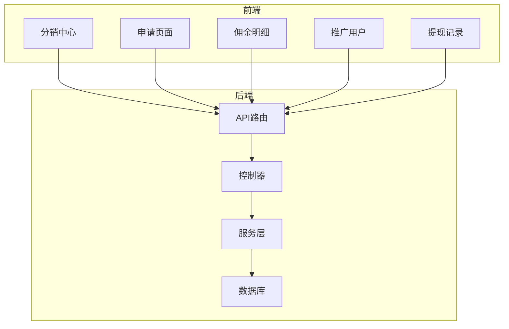
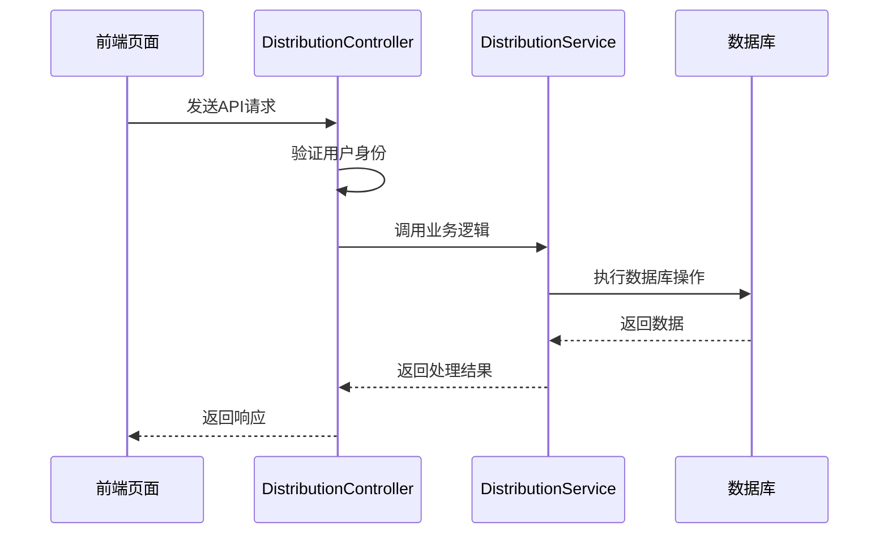
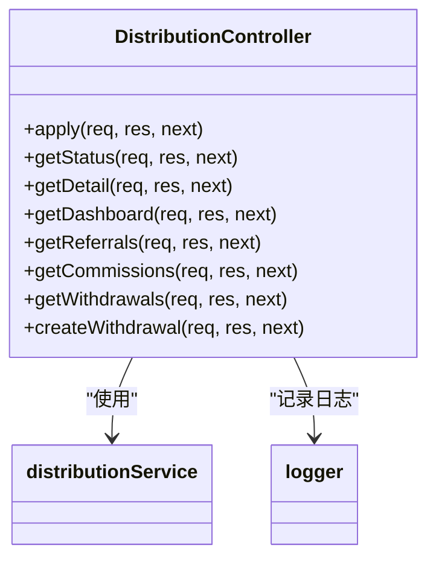
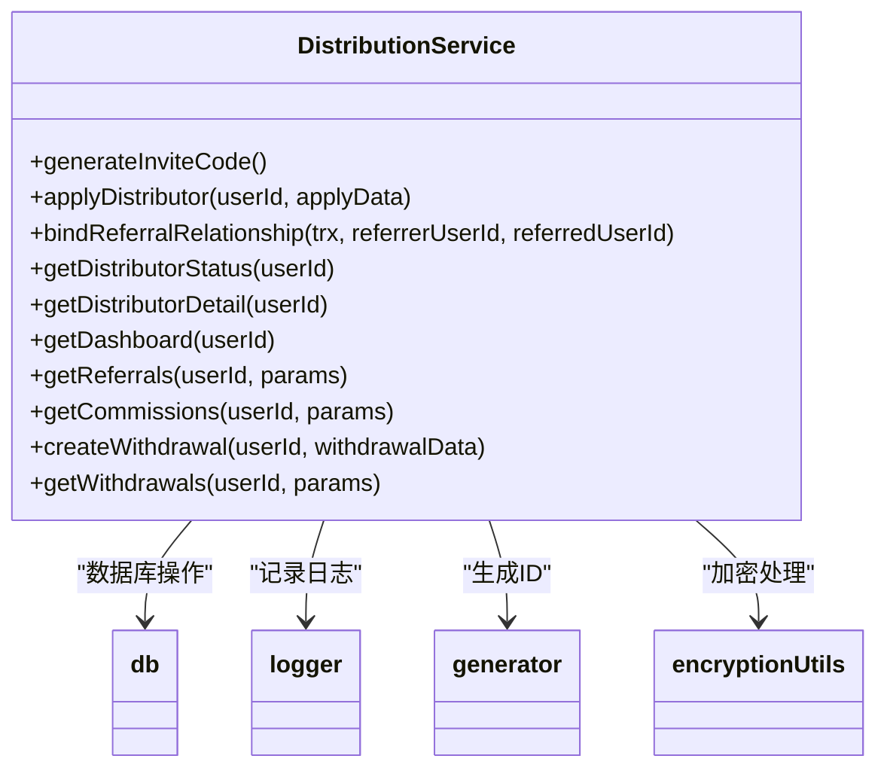
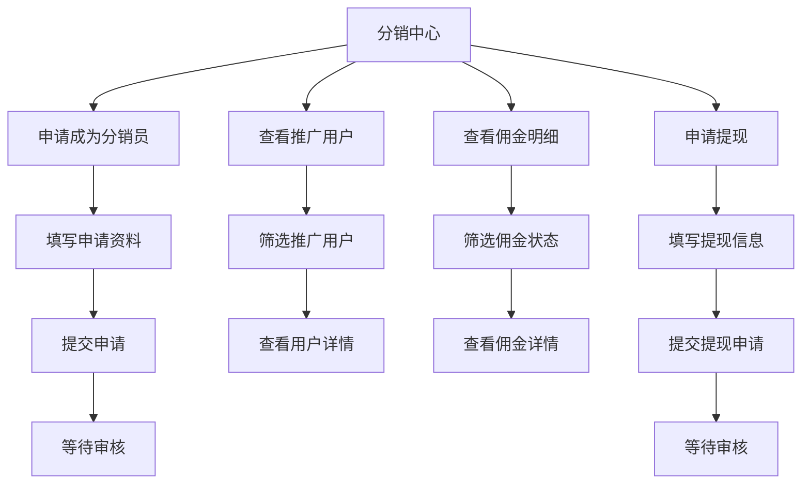
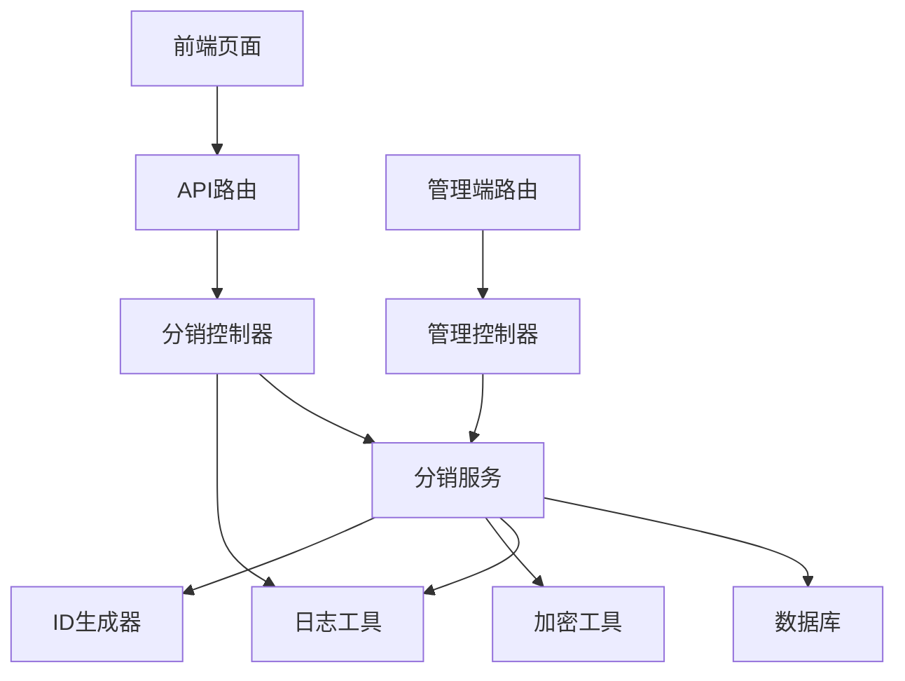

# 分销系统文档

<cite>
**本文档引用文件**  
- [distribution.controller.js](file://backend/src/controllers/distribution.controller.js)
- [distribution.service.js](file://backend/src/services/distribution.service.js)
- [distribution.routes.js](file://backend/src/routes/distribution.routes.js)
- [DISTRIBUTION_API.md](file://backend/docs/DISTRIBUTION_API.md)
- [create_distributors_table.js](file://backend/src/db/migrations/20251029110001_create_distributors_table.js)
- [create_referral_relationships_table.js](file://backend/src/db/migrations/20251029110002_create_referral_relationships_table.js)
- [create_commissions_table.js](file://backend/src/db/migrations/20251029110003_create_commissions_table.js)
- [create_withdrawals_table.js](file://backend/src/db/migrations/20251029110004_create_withdrawals_table.js)
- [create_distribution_settings_table.js](file://backend/src/db/migrations/20251029110005_create_distribution_settings_table.js)
- [distribution.dashboard\page.tsx](file://frontend/src/app/distribution/dashboard/page.tsx)
- [apply\page.tsx](file://frontend/src/app/distribution/apply/page.tsx)
- [commissions\page.tsx](file://frontend/src/app/distribution/commissions/page.tsx)
- [referrals\page.tsx](file://frontend/src/app/distribution/referrals/page.tsx)
- [withdrawals\page.tsx](file://frontend/src/app/distribution/withdrawals/page.tsx)
- [admin.routes.js](file://backend/src/routes/admin.routes.js)
</cite>

## 目录
1. [简介](#简介)
2. [项目结构](#项目结构)
3. [核心组件](#核心组件)
4. [架构概述](#架构概述)
5. [详细组件分析](#详细组件分析)
6. [依赖分析](#依赖分析)
7. [性能考虑](#性能考虑)
8. [故障排除指南](#故障排除指南)
9. [结论](#结论)

## 简介
分销系统是一个完整的多端解决方案，包含用户端分销中心、管理端审核功能和完整的前后端架构。系统实现了分销员申请、推广关系绑定、佣金计算、提现管理等核心功能，并通过完善的API接口和数据库设计确保数据一致性和业务完整性。

## 项目结构
分销系统主要由后端API服务、前端应用和数据库迁移脚本组成，形成了完整的MVC架构。



**图示来源**  
- [distribution.dashboard\page.tsx](file://frontend/src/app/distribution/dashboard/page.tsx)
- [distribution.controller.js](file://backend/src/controllers/distribution.controller.js)
- [distribution.service.js](file://backend/src/services/distribution.service.js)

## 核心组件
分销系统的核心组件包括分销控制器、分销服务、数据库表结构和前端页面，共同实现了完整的分销业务流程。

**组件来源**  
- [distribution.controller.js](file://backend/src/controllers/distribution.controller.js#L1-L220)
- [distribution.service.js](file://backend/src/services/distribution.service.js#L1-L569)
- [distribution.routes.js](file://backend/src/routes/distribution.routes.js#L1-L21)

## 架构概述
分销系统采用分层架构设计，从前端页面到后端服务再到数据库，形成了清晰的调用链路。



**图示来源**  
- [distribution.controller.js](file://backend/src/controllers/distribution.controller.js)
- [distribution.service.js](file://backend/src/services/distribution.service.js)

## 详细组件分析

### 分销控制器分析
分销控制器处理所有与分销相关的HTTP请求，包括申请、状态查询、提现等操作。



**图示来源**  
- [distribution.controller.js](file://backend/src/controllers/distribution.controller.js#L1-L220)

**组件来源**  
- [distribution.controller.js](file://backend/src/controllers/distribution.controller.js#L1-L220)

### 分销服务分析
分销服务层实现了核心业务逻辑，包括分销员管理、推荐关系绑定、佣金计算和提现处理。



**图示来源**  
- [distribution.service.js](file://backend/src/services/distribution.service.js#L1-L569)

**组件来源**  
- [distribution.service.js](file://backend/src/services/distribution.service.js#L1-L569)

### 数据库表结构分析
分销系统包含多个核心数据库表，通过外键关系确保数据完整性。

```mermaid
erDiagram
DISTRIBUTORS {
string id PK
string user_id FK
string real_name
string id_card
string contact
string channel
string status
datetime approval_time
string invite_code UK
decimal total_commission
decimal available_commission
decimal withdrawn_commission
datetime created_at
datetime updated_at
}
REFERRAL_RELATIONSHIPS {
string id PK
string referrer_user_id FK
string referred_user_id FK UK
string referrer_distributor_id FK
datetime created_at
}
COMMISSIONS {
string id PK
string distributor_id FK
string order_id FK
string referred_user_id FK
decimal order_amount
decimal commission_rate
decimal commission_amount
string status
datetime freeze_until
datetime created_at
datetime settled_at
}
WITHDRAWALS {
string id PK
string distributor_id FK
decimal amount
string method
text account_info
string status
string reject_reason
datetime created_at
datetime approved_at
}
DISTRIBUTION_SETTINGS {
int id PK
decimal commission_rate
int freeze_days
decimal min_withdrawal_amount
boolean auto_approve
datetime created_at
datetime updated_at
}
DISTRIBUTORS ||--o{ REFERRAL_RELATIONSHIPS : "分销员-推荐关系"
DISTRIBUTORS ||--o{ COMMISSIONS : "分销员-佣金"
DISTRIBUTORS ||--o{ WITHDRAWALS : "分销员-提现"
DISTRIBUTORS }|--|| USERS : "用户-分销员"
REFERRAL_RELATIONSHIPS }|--|| USERS : "被推荐人"
COMMISSIONS }|--|| ORDERS : "订单-佣金"
```

**图示来源**  
- [create_distributors_table.js](file://backend/src/db/migrations/20251029110001_create_distributors_table.js)
- [create_referral_relationships_table.js](file://backend/src/db/migrations/20251029110002_create_referral_relationships_table.js)
- [create_commissions_table.js](file://backend/src/db/migrations/20251029110003_create_commissions_table.js)
- [create_withdrawals_table.js](file://backend/src/db/migrations/20251029110004_create_withdrawals_table.js)
- [create_distribution_settings_table.js](file://backend/src/db/migrations/20251029110005_create_distribution_settings_table.js)

**组件来源**  
- [create_distributors_table.js](file://backend/src/db/migrations/20251029110001_create_distributors_table.js#L1-L36)
- [create_referral_relationships_table.js](file://backend/src/db/migrations/20251029110002_create_referral_relationships_table.js#L1-L32)
- [create_commissions_table.js](file://backend/src/db/migrations/20251029110003_create_commissions_table.js#L1-L39)
- [create_withdrawals_table.js](file://backend/src/db/migrations/20251029110004_create_withdrawals_table.js#L1-L32)
- [create_distribution_settings_table.js](file://backend/src/db/migrations/20251029110005_create_distribution_settings_table.js#L1-L33)

### 前端页面分析
前端页面提供了完整的用户界面，包括分销中心、申请页面、佣金明细等。



**图示来源**  
- [distribution.dashboard\page.tsx](file://frontend/src/app/distribution/dashboard/page.tsx)
- [apply\page.tsx](file://frontend/src/app/distribution/apply/page.tsx)
- [commissions\page.tsx](file://frontend/src/app/distribution/commissions/page.tsx)
- [referrals\page.tsx](file://frontend/src/app/distribution/referrals/page.tsx)
- [withdrawals\page.tsx](file://frontend/src/app/distribution/withdrawals/page.tsx)

**组件来源**  
- [distribution.dashboard\page.tsx](file://frontend/src/app/distribution/dashboard/page.tsx#L1-L361)
- [apply\page.tsx](file://frontend/src/app/distribution/apply/page.tsx#L1-L230)
- [commissions\page.tsx](file://frontend/src/app/distribution/commissions/page.tsx#L1-L159)
- [referrals\page.tsx](file://frontend/src/app/distribution/referrals/page.tsx#L1-L139)
- [withdrawals\page.tsx](file://frontend/src/app/distribution/withdrawals/page.tsx#L1-L105)

## 依赖分析
分销系统各组件之间存在明确的依赖关系，确保了系统的模块化和可维护性。



**图示来源**  
- [distribution.routes.js](file://backend/src/routes/distribution.routes.js)
- [distribution.controller.js](file://backend/src/controllers/distribution.controller.js)
- [distribution.service.js](file://backend/src/services/distribution.service.js)
- [admin.routes.js](file://backend/src/routes/admin.routes.js)

**组件来源**  
- [distribution.routes.js](file://backend/src/routes/distribution.routes.js#L1-L21)
- [distribution.controller.js](file://backend/src/controllers/distribution.controller.js#L1-L220)
- [distribution.service.js](file://backend/src/services/distribution.service.js#L1-L569)

## 性能考虑
分销系统在设计时考虑了多个性能优化点，包括数据库索引、事务处理和并发控制。

1. **数据库索引**: 所有核心表都建立了适当的索引，如用户ID、状态、邀请码等字段的索引，确保查询效率。
2. **事务处理**: 关键操作如提现申请使用数据库事务，确保数据一致性。
3. **行级锁**: 提现申请时使用行锁，防止并发操作导致的数据不一致。
4. **分页查询**: 所有列表接口都支持分页，避免一次性加载大量数据。
5. **唯一约束**: 通过唯一索引防止重复计佣和重复推荐。

## 故障排除指南
当分销系统出现问题时，可以按照以下步骤进行排查：

1. **检查API响应**: 查看HTTP状态码和错误码，根据[DISTRIBUTION_API.md](file://backend/docs/DISTRIBUTION_API.md)中的错误码说明定位问题。
2. **查看日志**: 检查后端日志，特别是`distribution.service.js`中的日志输出，了解具体错误信息。
3. **验证数据库**: 检查相关数据库表的数据是否正确，特别是`distributors`、`referral_relationships`和`commissions`表。
4. **测试流程**: 按照正常业务流程逐步测试，从申请分销员开始，到推广、产生佣金、提现等环节。
5. **检查配置**: 确认`distribution_settings`表中的系统配置是否正确，如佣金比例、冻结天数、最低提现金额等。

**组件来源**  
- [DISTRIBUTION_API.md](file://backend/docs/DISTRIBUTION_API.md#L1-L678)
- [distribution.service.js](file://backend/src/services/distribution.service.js#L1-L569)

## 结论
分销系统是一个功能完整、架构清晰的多端解决方案。系统通过前后端分离的设计，实现了分销业务的全流程管理。核心功能包括分销员管理、推广关系绑定、佣金计算和提现处理，通过完善的数据库设计和API接口确保了数据一致性和业务完整性。系统还考虑了性能优化和安全措施，如数据库索引、事务处理、行级锁和敏感信息加密，确保了系统的稳定性和安全性。