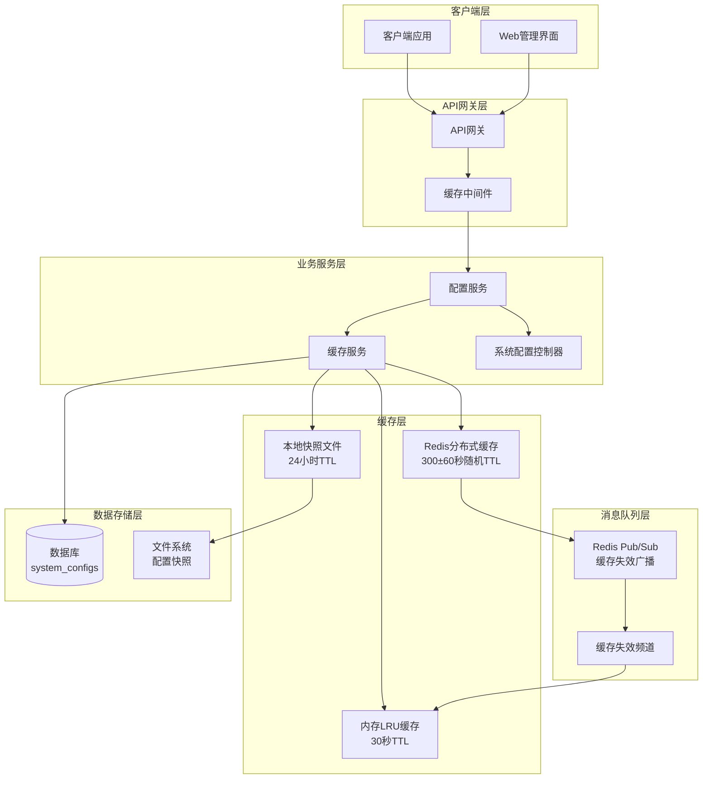
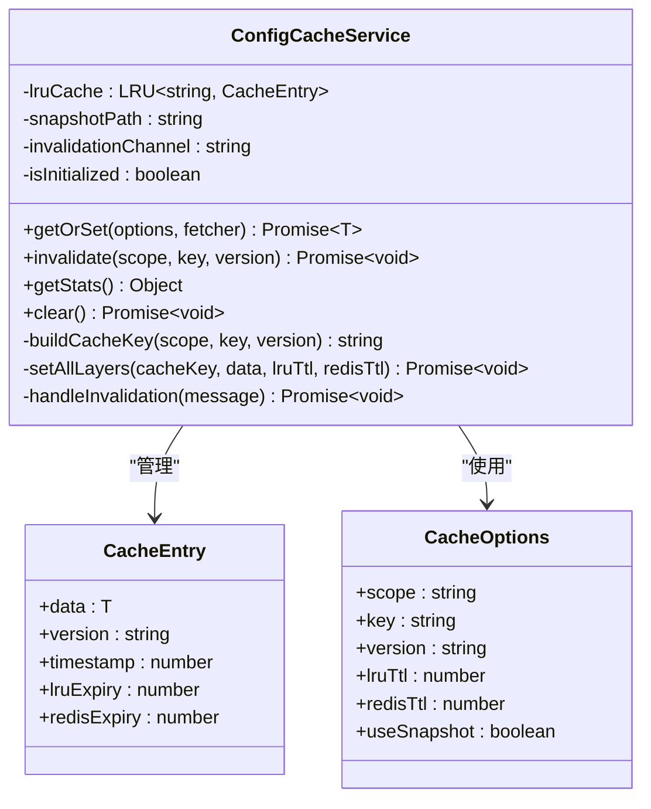
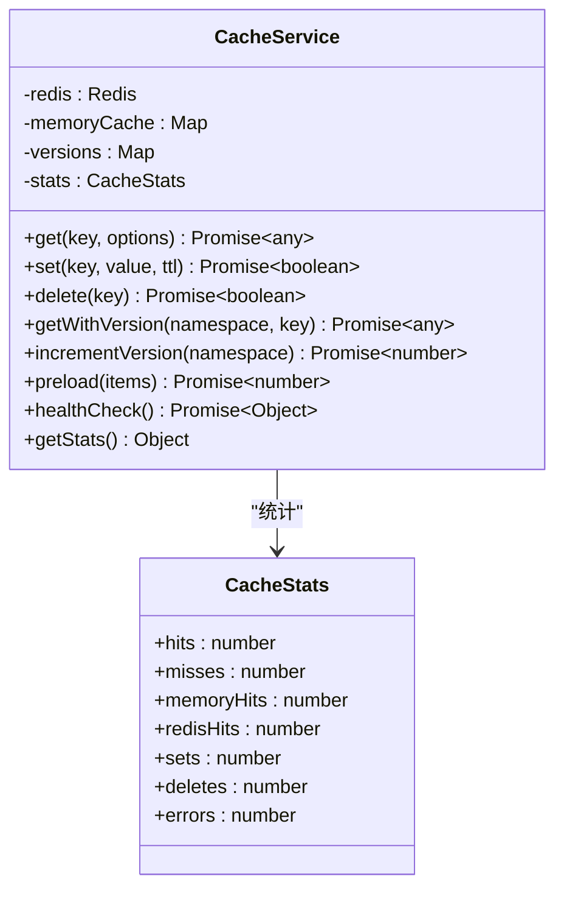
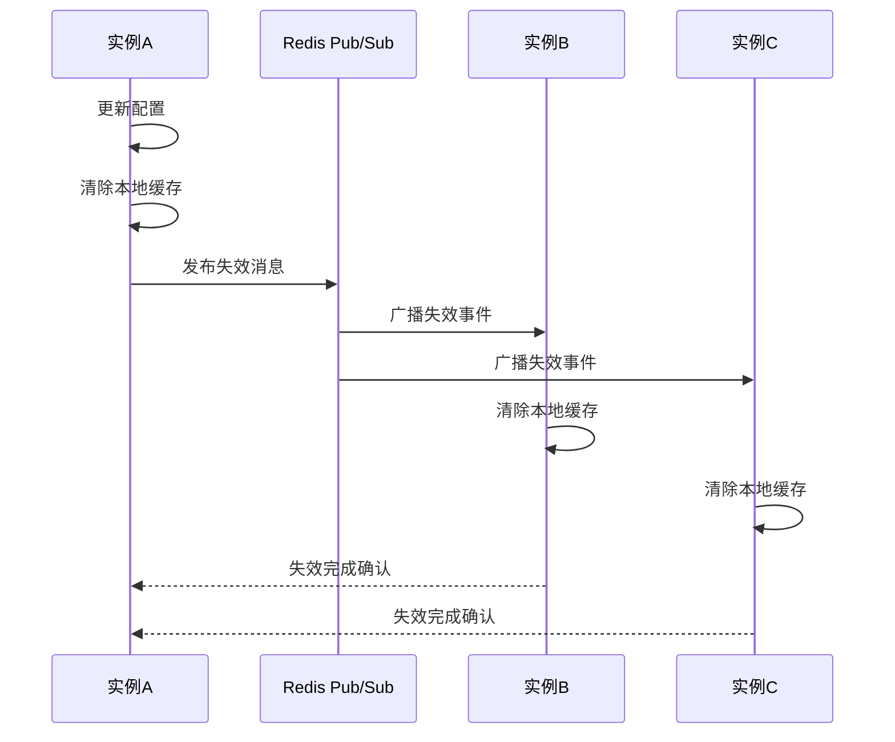
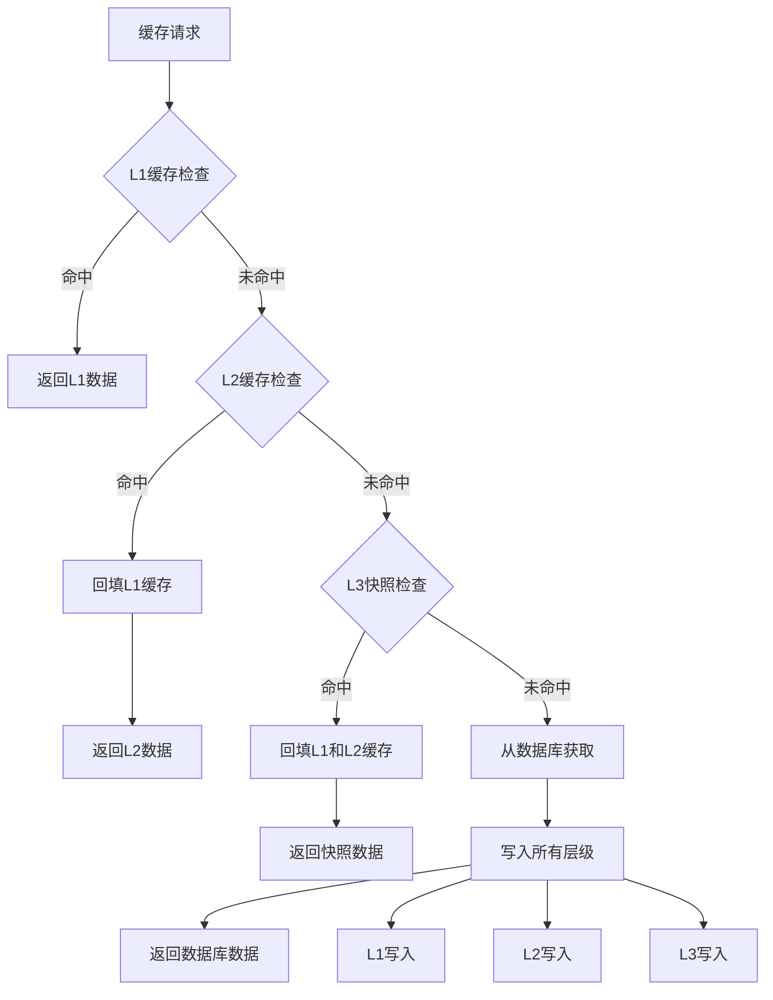
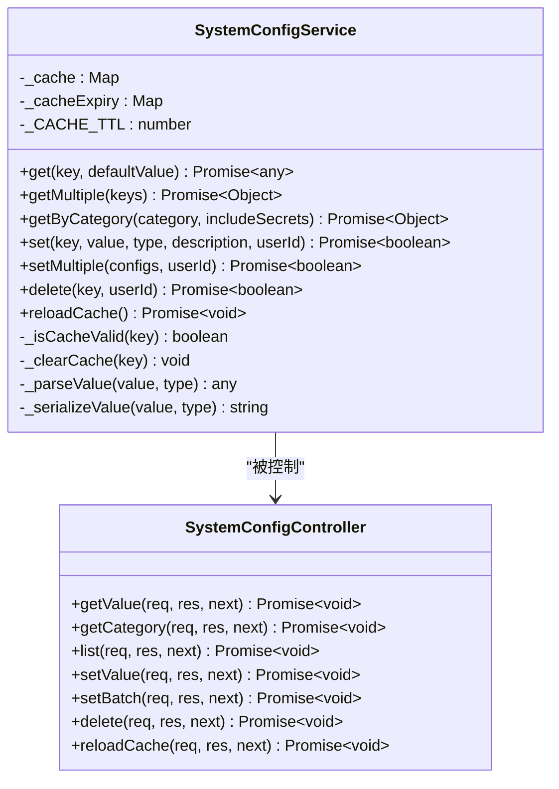
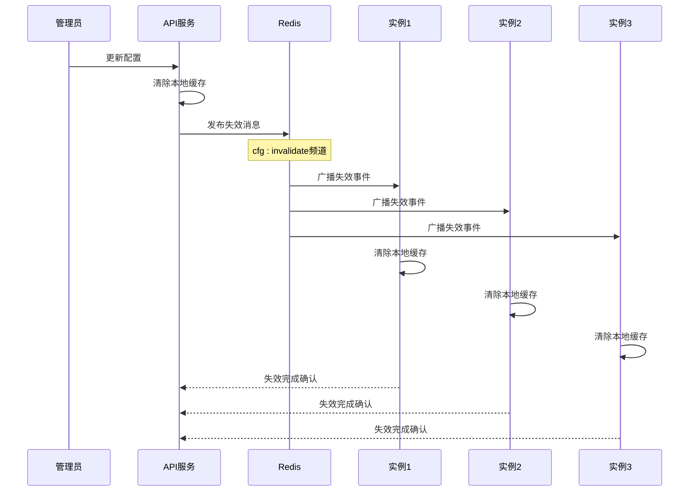
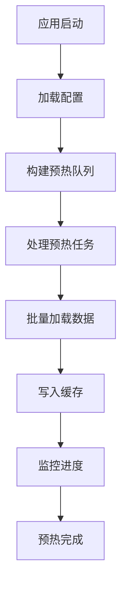
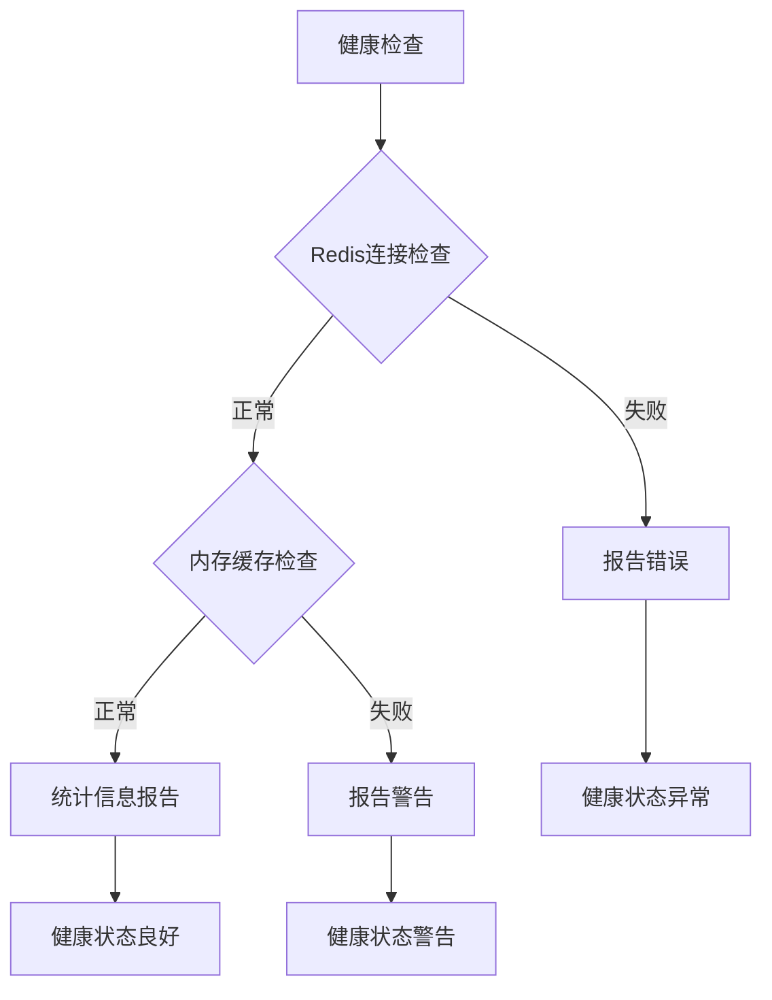

# 配置缓存系统

<cite>
**本文档引用的文件**
- [config-cache.js](file://backend/src/cache/config-cache.js)
- [config-cache.ts](file://backend/src/cache/config-cache.ts)
- [configCache.service.js](file://backend/src/services/configCache.service.js)
- [cache.service.js](file://backend/src/services/cache.service.js)
- [cache-subscriber.service.js](file://backend/src/services/cache-subscriber.service.js)
- [cache.middleware.js](file://backend/src/middlewares/cache.middleware.js)
- [cache.routes.js](file://backend/src/routes/cache.routes.js)
- [redis.js](file://backend/src/utils/redis.js)
- [cache.ts](file://backend/src/utils/cache.ts)
- [cacheInvalidation.ts](file://backend/src/utils/cacheInvalidation.ts)
- [systemConfig.service.js](file://backend/src/services/systemConfig.service.js)
- [systemConfig.controller.js](file://backend/src/controllers/systemConfig.controller.js)
- [env.validator.js](file://backend/src/config/env.validator.js)
- [database.js](file://backend/src/config/database.js)
</cite>

## 目录
1. [简介](#简介)
2. [系统架构](#系统架构)
3. [核心组件](#核心组件)
4. [多层缓存架构](#多层缓存架构)
5. [缓存中间件](#缓存中间件)
6. [配置管理系统](#配置管理系统)
7. [缓存失效机制](#缓存失效机制)
8. [性能优化](#性能优化)
9. [监控与运维](#监控与运维)
10. [故障排除](#故障排除)

## 简介

配置缓存系统是一个高度优化的多层缓存解决方案，专为动态配置管理和高并发场景设计。该系统采用分层架构，结合内存缓存、分布式缓存和持久化存储，提供高性能、高可用的配置管理能力。

### 主要特性

- **多层缓存架构**：LRU内存缓存 → Redis分布式缓存 → 本地快照 → 数据库
- **全局一致性**：基于Redis Pub/Sub的缓存失效广播机制
- **版本化管理**：支持配置版本控制和回滚
- **智能降级**：多级降级策略确保系统稳定性
- **实时监控**：全面的缓存统计和健康检查
- **高可用性**：自动重连和故障转移机制

## 系统架构

**图表来源**
- [config-cache.ts](file://backend/src/cache/config-cache.ts#L1-L50)
- [cache.service.js](file://backend/src/services/cache.service.js#L1-L50)
- [redis.js](file://backend/src/utils/redis.js#L1-L50)

## 核心组件

### 1. 配置缓存服务 (ConfigCacheService)

配置缓存服务是系统的核心组件，负责管理多层缓存的协调和数据流。

**图表来源**
- [config-cache.ts](file://backend/src/cache/config-cache.ts#L25-L50)
- [config-cache.ts](file://backend/src/cache/config-cache.ts#L10-L25)

**章节来源**
- [config-cache.ts](file://backend/src/cache/config-cache.ts#L1-L430)

### 2. 缓存服务 (CacheService)

通用缓存服务提供基础的缓存操作功能，支持版本化缓存和分布式缓存管理。

**图表来源**
- [cache.service.js](file://backend/src/services/cache.service.js#L10-L50)

**章节来源**
- [cache.service.js](file://backend/src/services/cache.service.js#L1-L601)

### 3. 缓存订阅服务 (CacheSubscriberService)

负责处理缓存失效事件和分布式缓存同步。

**图表来源**
- [cache-subscriber.service.js](file://backend/src/services/cache-subscriber.service.js#L1-L50)

**章节来源**
- [cache-subscriber.service.js](file://backend/src/services/cache-subscriber.service.js#L1-L450)

## 多层缓存架构

系统采用四层缓存架构，每层都有特定的职责和优化策略：

### L1: 内存LRU缓存

- **容量**：最多1000条记录
- **TTL**：30秒（可配置）
- **特点**：最快的访问速度，进程级缓存
- **用途**：热点数据的即时访问

### L2: Redis分布式缓存

- **容量**：无限制（受Redis内存限制）
- **TTL**：300±60秒随机分布（防雪崩）
- **特点**：分布式共享，跨实例一致性
- **用途**：跨实例缓存共享

### L3: 本地快照文件

- **容量**：基于磁盘空间
- **TTL**：24小时
- **特点**：持久化存储，降级保障
- **用途**：数据库不可用时的备用方案

### L4: 数据库

- **容量**：关系型数据库
- **特点**：最终数据源，ACID保证
- **用途**：配置数据的持久化存储

**图表来源**
- [config-cache.ts](file://backend/src/cache/config-cache.ts#L80-L150)

**章节来源**
- [config-cache.ts](file://backend/src/cache/config-cache.ts#L80-L200)

## 缓存中间件

缓存中间件提供了灵活的API响应缓存功能，支持多种缓存策略。

### 中间件类型

1. **响应缓存中间件**：通用API响应缓存
2. **用户数据缓存中间件**：用户相关数据缓存
3. **管理员数据缓存中间件**：管理后台数据缓存
4. **功能配置缓存中间件**：功能配置相关缓存
5. **统计数据缓存中间件**：统计分析数据缓存

### 缓存策略配置

| 中间件类型 | TTL | 命名空间 | 缓存条件 |
|------------|-----|----------|----------|
| 响应缓存 | 5分钟 | api_response | 无限制 |
| 用户数据 | 10分钟 | user_data | 已认证用户 |
| 管理员数据 | 3分钟 | admin_data | 管理员用户 |
| 功能配置 | 1小时 | feature_config | 功能相关URL |
| 统计数据 | 15分钟 | stats_data | 统计相关URL |

**章节来源**
- [cache.middleware.js](file://backend/src/middlewares/cache.middleware.js#L1-L415)

## 配置管理系统

### 系统配置服务

系统配置服务提供了完整的配置管理功能，包括配置的增删改查和版本控制。

**图表来源**
- [systemConfig.service.js](file://backend/src/services/systemConfig.service.js#L10-L50)
- [systemConfig.controller.js](file://backend/src/controllers/systemConfig.controller.js#L10-L50)

### 配置管理API

| 接口 | 方法 | 描述 | 缓存策略 |
|------|------|------|----------|
| `/api/system-config/:key` | GET | 获取单个配置 | 5分钟缓存 |
| `/api/system-config/category/:category` | GET | 获取分类配置 | 5分钟缓存 |
| `/api/system-config` | GET | 获取配置列表 | 5分钟缓存 |
| `/api/system-config/:key` | PUT | 设置配置 | 立即失效 |
| `/api/system-config/batch` | POST | 批量设置配置 | 立即失效 |
| `/api/system-config/:key` | DELETE | 删除配置 | 立即失效 |
| `/api/system-config/reload-cache` | POST | 重新加载缓存 | 立即失效 |

**章节来源**
- [systemConfig.service.js](file://backend/src/services/systemConfig.service.js#L1-L403)
- [systemConfig.controller.js](file://backend/src/controllers/systemConfig.controller.js#L1-L370)

## 缓存失效机制

### Pub/Sub失效广播

系统使用Redis Pub/Sub实现全局缓存失效，确保多实例间的一致性。

**图表来源**
- [config-cache.ts](file://backend/src/cache/config-cache.ts#L350-L400)

### 失效策略

1. **精准失效**：针对特定key进行失效
2. **范围失效**：针对特定作用域进行失效
3. **全量失效**：清除所有相关缓存

**章节来源**
- [config-cache.ts](file://backend/src/cache/config-cache.ts#L350-L430)

## 性能优化

### 缓存预热

系统支持缓存预热功能，可以在应用启动时预先加载热点数据。

**图表来源**
- [configCache.service.js](file://backend/src/services/configCache.service.js#L250-L300)

### TTL优化

- **Redis TTL随机化**：基础时间±20%随机分布，防止缓存雪崩
- **智能TTL调整**：根据访问频率动态调整TTL
- **过期清理**：定期清理过期缓存项

### 内存管理

- **LRU淘汰策略**：基于访问频率和时间的智能淘汰
- **内存限制**：防止内存溢出
- **垃圾回收**：定期清理无效缓存

**章节来源**
- [config-cache.ts](file://backend/src/cache/config-cache.ts#L200-L300)

## 监控与运维

### 缓存统计

系统提供详细的缓存统计信息：

| 指标 | 描述 | 计算方式 |
|------|------|----------|
| 命中率 | 缓存命中百分比 | (命中数 / 总请求数) × 100% |
| 内存命中率 | 内存缓存命中百分比 | (内存命中数 / 总命中数) × 100% |
| 缓存大小 | 当前缓存条目数 | LRU缓存当前大小 |
| 请求延迟 | 平均缓存查询延迟 | 总查询时间 / 查询次数 |

### 健康检查

**图表来源**
- [cache.service.js](file://backend/src/services/cache.service.js#L500-L550)

### 运维接口

| 接口 | 方法 | 功能 | 权限要求 |
|------|------|------|----------|
| `/cache/stats` | GET | 获取缓存统计 | 管理员 |
| `/cache/health` | GET | 缓存健康检查 | 管理员 |
| `/cache/invalidate` | POST | 手动失效缓存 | 管理员 |
| `/cache/preload` | POST | 缓存预热 | 管理员 |
| `/cache/stats/reset` | POST | 重置统计 | 管理员 |

**章节来源**
- [cache.routes.js](file://backend/src/routes/cache.routes.js#L1-L290)

## 故障排除

### 常见问题及解决方案

#### 1. 缓存雪崩

**症状**：大量缓存同时过期，导致数据库压力剧增

**解决方案**：
- Redis TTL随机化（300±60秒）
- 设置合理的缓存过期时间
- 实施缓存预热策略

#### 2. 缓存穿透

**症状**：查询不存在的数据导致每次都访问数据库

**解决方案**：
- 空值缓存（null cache）
- 布隆过滤器
- 参数校验和限流

#### 3. 缓存击穿

**症状**：热点数据过期瞬间大量并发访问

**解决方案**：
- 设置随机TTL
- 使用互斥锁
- 异步更新缓存

#### 4. 分布式缓存一致性

**症状**：多实例间缓存数据不一致

**解决方案**：
- Redis Pub/Sub失效广播
- 版本号控制
- 强一致性要求的场景使用数据库锁

### 监控告警

建议监控以下指标：

- **缓存命中率**：< 80% 告警
- **缓存响应时间**：> 100ms 告警  
- **Redis连接状态**：断开 告警
- **内存使用率**：> 85% 告警
- **错误率**：> 5% 告警

### 故障恢复

1. **缓存服务重启**：优雅重启，保留现有缓存
2. **缓存预热**：启动时自动预热热点数据
3. **降级策略**：缓存不可用时直接访问数据库
4. **数据同步**：缓存恢复后的数据同步机制

**章节来源**
- [config-cache.ts](file://backend/src/cache/config-cache.ts#L300-L350)
- [cache.service.js](file://backend/src/services/cache.service.js#L450-L550)

## 总结

配置缓存系统通过多层缓存架构、智能失效机制和完善的监控体系，为现代应用提供了高性能、高可用的配置管理解决方案。系统具备良好的扩展性和稳定性，能够满足大规模并发访问的需求，同时提供了丰富的运维工具和故障处理机制。

通过合理的配置和监控，该系统能够在保证数据一致性的同时，最大化缓存效果，显著提升应用性能和用户体验。