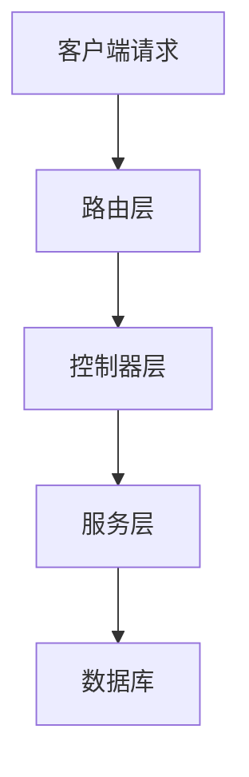
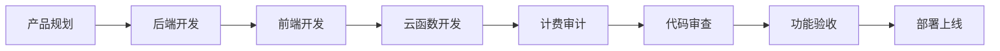

# 项目目录结构

<cite>
**本文档引用的文件**   
- [README.md](file://README.md)
- [backend/README.md](file://backend/README.md)
- [frontend/README.md](file://frontend/README.md)
- [deploy/README.md](file://deploy/README.md)
- [tests/README.md](file://tests/README.md)
- [miniapp/README.md](file://miniapp/README.md)
- [scf/README.md](file://scf/README.md)
- [skills/README.md](file://skills/README.md)
- [backend/src/db/migrations/20251028000001_create_users_table.js](file://backend/src/db/migrations/20251028000001_create_users_table.js)
- [backend/src/routes/auth.routes.js](file://backend/src/routes/auth.routes.js)
- [backend/src/controllers/auth.controller.js](file://backend/src/controllers/auth.controller.js)
- [backend/src/services/auth.service.js](file://backend/src/services/auth.service.js)
- [frontend/src/app/page.tsx](file://frontend/src/app/page.tsx)
- [frontend/src/components/ImageUploader.tsx](file://frontend/src/components/ImageUploader.tsx)
</cite>

## 目录

1. [简介](#简介)
2. [后端MVC分层设计](#后端mvc分层设计)
3. [前端Next.js App Router组织方式](#前端nextjs-app-router组织方式)
4. [小程序入口](#小程序入口)
5. [云函数异步任务处理](#云函数异步任务处理)
6. [部署脚本位置](#部署脚本位置)
7. [测试用例规划区](#测试用例规划区)
8. [AI Agent能力说明书](#ai-agent能力说明书)
9. [全栈协同开发支持](#全栈协同开发支持)

## 简介

本项目是一个为服装电商提供AI图片处理服务的SaaS平台，采用前后端分离、微服务和云原生的技术架构。项目通过清晰的目录结构支持全栈协同开发与未来扩展，各模块职责明确，形成了完整的开发、测试、部署和运维闭环。

**本文档引用的文件**   
- [README.md](file://README.md)

## 后端MVC分层设计

后端采用标准的MVC（Model-View-Controller）架构模式，但在本项目中，由于后端主要提供API服务，因此"View"层被省略，专注于数据处理和业务逻辑。`backend/src`目录下的分层设计体现了清晰的关注点分离原则。

### 路由层 (routes)

路由层定义了API的访问路径和HTTP方法，是系统的入口点。每个路由文件对应一个业务模块，如`auth.routes.js`负责认证相关的API路由。路由层通过调用控制器层的方法来处理请求，实现了请求分发的功能。



**图示来源**
- [backend/src/routes/auth.routes.js](file://backend/src/routes/auth.routes.js)

### 控制器层 (controllers)

控制器层负责处理HTTP请求和响应，是路由和业务逻辑之间的桥梁。控制器方法通常包含输入验证、调用服务层方法和构建响应。例如，`AuthController`中的`login`方法验证手机号和验证码格式，然后调用`authService`进行登录处理。

**本文档引用的文件**   
- [backend/src/controllers/auth.controller.js](file://backend/src/controllers/auth.controller.js)

### 服务层 (services)

服务层封装了核心业务逻辑，是系统中最关键的部分。服务层与数据库交互，执行业务规则，并确保数据的一致性和完整性。例如，`auth.service.js`包含用户认证、会话管理和用户信息查询等业务逻辑。

**本文档引用的文件**   
- [backend/src/services/auth.service.js](file://backend/src/services/auth.service.js)

### 数据库迁移 (db/migrations)

数据库迁移文件使用Knex.js框架管理数据库模式的变更，确保数据库结构的版本控制和团队协作。每个迁移文件包含`up`和`down`两个方法，分别用于应用和回滚数据库变更。例如，`20251028000001_create_users_table.js`创建了用户表，定义了用户ID、手机号、会员状态和配额等字段。

```javascript
exports.up = function(knex) {
  return knex.schema.createTable('users', function(table) {
    table.string('id', 32).primary().comment('用户ID');
    table.string('phone', 11).unique().notNullable().comment('手机号');
    table.boolean('isMember').defaultTo(false).comment('是否会员');
    table.integer('quota_remaining').unsigned().defaultTo(0).comment('剩余配额');
    table.datetime('quota_expireAt').nullable().comment('配额到期时间');
    table.timestamps(true, true);
  });
};
```

**本文档引用的文件**   
- [backend/src/db/migrations/20251028000001_create_users_table.js](file://backend/src/db/migrations/20251028000001_create_users_table.js)

## 前端Next.js App Router组织方式

前端采用Next.js 14的App Router架构，这种基于文件系统的路由方式提供了更直观和灵活的页面组织方式。`frontend/src/app`目录下的文件结构直接映射到应用的URL路径。

### 页面路由

每个`.tsx`文件代表一个页面，文件路径决定了其访问路径。例如，`login/page.tsx`对应`/login`路径，`task/[taskId]/page.tsx`对应动态路由`/task/123`。根布局文件`layout.tsx`定义了整个应用的共享布局，而`page.tsx`是应用的首页。

### 组件组织

组件存储在`frontend/src/components`目录下，采用模块化设计。例如，`ImageUploader.tsx`是一个可复用的图片上传组件，可以在多个页面中使用。组件设计遵循原子设计原则，从基础组件构建复杂的页面。

```mermaid
graph TD
A[app/] --> B[layout.tsx]
A --> C[page.tsx]
A --> D[login/]
A --> E[task/]
D --> F[page.tsx]
E --> G[basic/]
E --> H[model/]
E --> I[[taskId]/]
G --> J[page.tsx]
H --> K[page.tsx]
I --> L[page.tsx]
```

**图示来源**
- [frontend/src/app/page.tsx](file://frontend/src/app/page.tsx)
- [frontend/src/components/ImageUploader.tsx](file://frontend/src/components/ImageUploader.tsx)

**本文档引用的文件**   
- [frontend/README.md](file://frontend/README.md)

## 小程序入口

`miniapp`目录是为微信小程序预留的入口，目前处于开发中状态。该目录遵循微信小程序的开发规范，包含页面开发、组件开发、云调用适配层和用户界面等模块。小程序将提供与Web应用一致的功能，包括用户认证、任务管理、会员管理和图片处理。

**本文档引用的文件**   
- [miniapp/README.md](file://miniapp/README.md)

## 云函数异步任务处理

`scf`目录用于存放腾讯云函数代码和异步任务处理逻辑，处理需要长时间运行或资源密集型的任务。该模块是系统架构中的重要组成部分，实现了计算密集型任务与主应用的解耦。

### 功能模块

- **视频处理任务**：处理视频格式转换、压缩优化和多清晰度输出
- **AI任务编排**：管理RunningHub AI生成任务的长耗时处理
- **文件处理服务**：响应COS对象存储事件，进行批量图片处理
- **通知服务**：发送任务完成通知和系统状态监控告警

**本文档引用的文件**   
- [scf/README.md](file://scf/README.md)

## 部署脚本位置

`deploy`目录存放部署和运维相关脚本，是实现CI/CD流程的关键。该目录包含部署脚本、环境配置、上线步骤和监控配置等子目录，确保部署过程的自动化和标准化。

### 目录结构

- `scripts/`：主部署、回滚、备份等Shell脚本
- `configs/`：环境变量模板、Nginx配置、PM2配置和Docker编排
- `procedures/`：部署前、中、后的检查清单文档
- `monitoring/`：Prometheus监控配置、Grafana仪表板和告警规则

**本文档引用的文件**   
- [deploy/README.md](file://deploy/README.md)

## 测试用例规划区

`tests`目录是质量保证和自动化验收测试的中心，确保系统的功能正确性和稳定性。该目录规划了全面的测试覆盖，包括API回归测试、核心业务逻辑测试、性能测试和前端集成测试。

### 测试覆盖

- **API接口测试**：验证认证、用户管理、任务管理和文件上传等接口
- **核心业务逻辑测试**：重点测试配额管理、计费逻辑和支付流程
- **性能测试**：进行负载测试、压力测试和并发测试
- **前端集成测试**：端到端测试用户交互流程

**本文档引用的文件**   
- [tests/README.md](file://tests/README.md)

## AI Agent能力说明书

`skills`目录包含各个AI角色的技能说明书，定义了自动化协作流程和职责边界。每个技能包都包含完整的文档，确保AI助手能够按照标准流程执行任务。

### 核心技能包

- **backend_dev_skill**：后端开发工程师技能包，负责API开发和数据库设计
- **frontend_dev_skill**：前端开发工程师技能包，负责界面开发和用户体验
- **scf_worker_skill**：云函数处理工程师技能包，负责异步任务处理
- **billing_guard_skill**：计费守卫员技能包，负责配额和计费管理
- **reviewer_skill**：代码审查专家技能包，负责代码质量和安全性审查
- **qa_acceptance_skill**：QA验收工程师技能包，负责功能验收测试
- **codebuddy_deploy_skill**：部署专家技能包，负责部署和运维

每个技能包都包含`FLOW.md`定义标准工作流程和`CHECKLIST.md`提供自检清单，形成了完整的自动化协作体系。



**图示来源**
- [skills/README.md](file://skills/README.md)

**本文档引用的文件**   
- [skills/README.md](file://skills/README.md)
- [skills/backend_dev_skill/FLOW.md](file://skills/backend_dev_skill/FLOW.md)
- [skills/reviewer_skill/FLOW.md](file://skills/reviewer_skill/FLOW.md)
- [skills/frontend_dev_skill/FLOW.md](file://skills/frontend_dev_skill/FLOW.md)

## 全栈协同开发支持

本项目的目录结构设计充分支持全栈协同开发与未来扩展。通过清晰的模块划分和职责定义，不同角色的开发者可以并行工作而不会相互干扰。MVC分层设计确保了后端代码的可维护性，Next.js App Router提供了直观的前端路由，而AI Agent能力说明书则实现了开发流程的自动化和标准化。

这种结构不仅支持当前的功能开发，还为未来的功能扩展预留了空间。例如，`miniapp`和`scf`目录的预留设计，使得小程序和云函数功能可以无缝集成。同时，`deploy`和`tests`目录的完善规划，确保了系统的可部署性和质量可控性，为项目的长期发展奠定了坚实的基础。