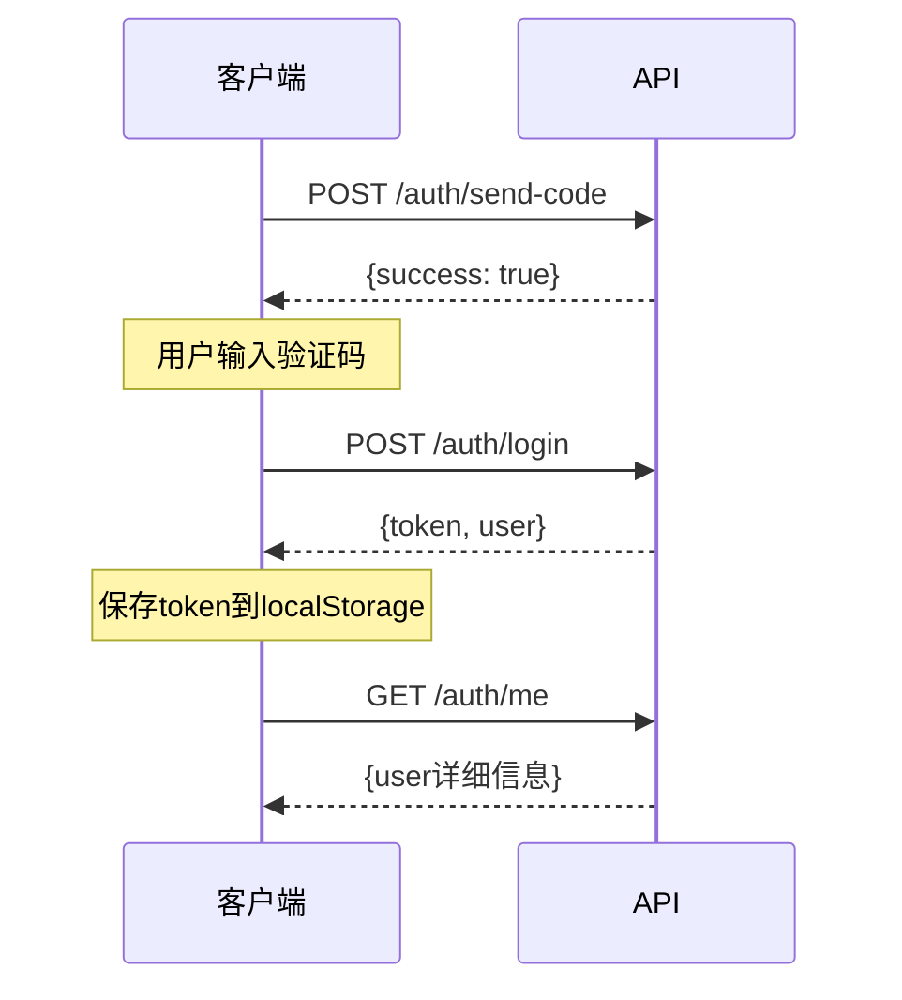
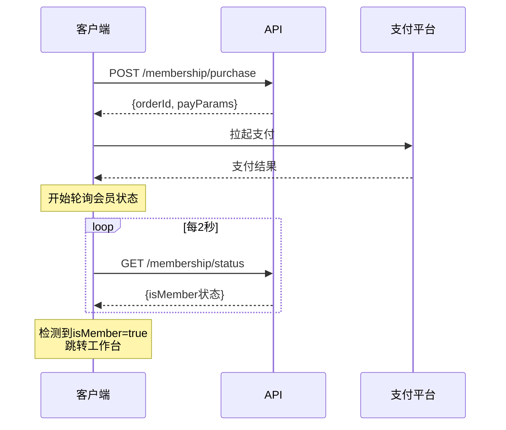
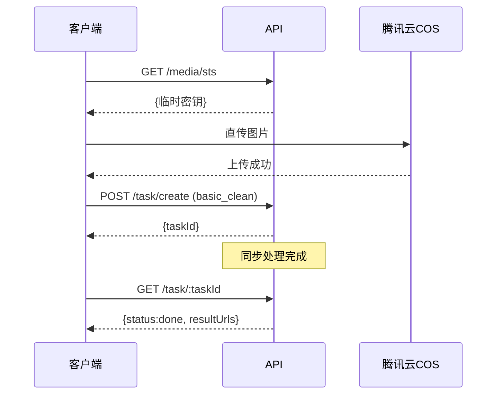
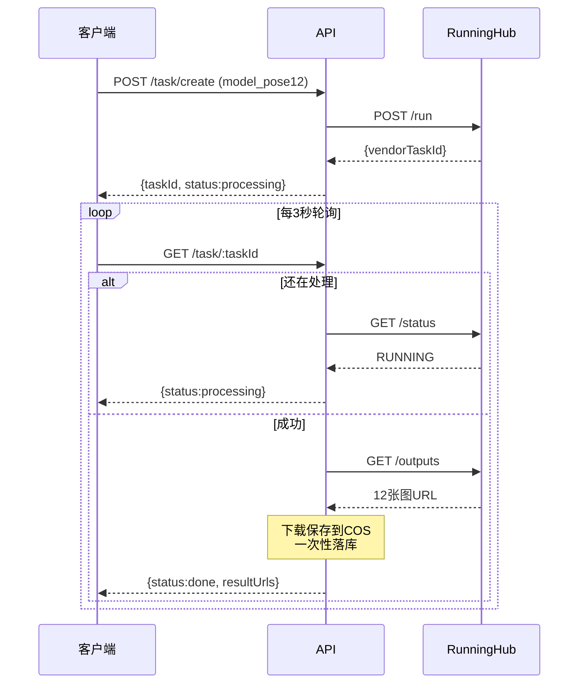

# API 接口文档

**版本**: v1.0  
**Base URL**: `https://api.aizhao.icu/api`  
**认证方式**: Bearer Token (JWT)

---

## 📋 通用说明

### 请求头

```http
Content-Type: application/json
Authorization: Bearer {token}  # 需要认证的接口
```

### 响应格式

**成功响应**:

```json
{
  "success": true,
  "data": { ... },
  "message": "操作成功"
}
```

**错误响应**:

```json
{
  "success": false,
  "error": {
    "code": 1001,
    "message": "未登录"
  }
}
```

### 错误码

| 错误码 | 说明 | 用户提示 |
|--------|------|---------|
| 1001 | 未登录 | 请先登录 |
| 1002 | 非会员 | 请购买会员后使用 |
| 1003 | 配额不足 | 剩余次数不足,请续费 |
| 2001 | 图片格式错误 | 请上传 JPG/PNG 格式图片 |
| 2002 | 图片过大 | 图片不能超过 10MB |
| 2003 | 无法识别服装 | 未检测到服装,请更换图片 |
| 3001 | 数据万象处理失败 | 图像处理失败,请重试 |
| 3002 | RunningHub 超时 | 生成超时,请稍后重试 |
| 3003 | RunningHub 失败 | AI服务暂时不可用,请重试 |
| 4001 | 图片审核不通过 | 内容不符合使用规范,已返还本次次数 |
| 5001 | 支付失败 | 支付失败,请重试 |
| 5002 | 订单不存在 | 订单不存在 |

---

## 🔐 认证服务 (Authentication)

### 1. 发送验证码

**POST** `/auth/send-code`

**说明**: 发送手机验证码,用于登录/注册

**请求参数**:

| 参数 | 类型 | 必填 | 说明 |
|------|------|------|------|
| phone | string | 是 | 手机号(11位) |

**请求示例**:

```json
{
  "phone": "13800138000"
}
```

**响应示例**:

```json
{
  "success": true,
  "data": {
    "expireIn": 300
  },
  "message": "验证码已发送"
}
```

**防刷限制**:
- 同一手机号 1分钟内最多5次
- 同一IP 1小时内最多20次

---

### 2. 登录/注册

**POST** `/auth/login`

**说明**: 手机号+验证码登录,不存在则自动注册

**请求参数**:

| 参数 | 类型 | 必填 | 说明 |
|------|------|------|------|
| phone | string | 是 | 手机号 |
| code | string | 是 | 验证码(6位) |

**请求示例**:

```json
{
  "phone": "13800138000",
  "code": "123456"
}
```

**响应示例**:

```json
{
  "success": true,
  "data": {
    "token": "eyJhbGciOiJIUzI1NiIsInR5cCI6IkpXVCJ9...",
    "user": {
      "id": "a1b2c3d4e5f6",
      "phone": "13800138000",
      "isMember": false,
      "quota_remaining": 0,
      "quota_expireAt": null
    }
  }
}
```

---

### 3. 获取当前用户信息

**GET** `/auth/me`

**说明**: 获取当前登录用户的详细信息

**请求头**:

```http
Authorization: Bearer {token}
```

**响应示例**:

```json
{
  "success": true,
  "data": {
    "id": "a1b2c3d4e5f6",
    "phone": "13800138000",
    "isMember": true,
    "quota_remaining": 92,
    "quota_expireAt": "2025-11-28T14:22:00.000Z",
    "createdAt": "2025-10-28T14:22:00.000Z"
  }
}
```

---

## 💳 会员服务 (Membership)

### 4. 购买会员

**POST** `/membership/purchase`

**说明**: 创建会员购买订单,返回支付参数

**请求头**:

```http
Authorization: Bearer {token}
```

**请求参数**:

| 参数 | 类型 | 必填 | 说明 |
|------|------|------|------|
| channel | string | 是 | 支付渠道(wx/alipay) |

**请求示例**:

```json
{
  "channel": "wx"
}
```

**响应示例**:

```json
{
  "success": true,
  "data": {
    "orderId": "order_abc123",
    "payParams": {
      "appId": "wx1ed34a87abfaa643",
      "timeStamp": "1698765432",
      "nonceStr": "xyz789",
      "package": "prepay_id=wx28140842...",
      "signType": "RSA",
      "paySign": "..."
    }
  }
}
```

**前端使用**:

```javascript
// 微信H5支付
WeixinJSBridge.invoke('getBrandWCPayRequest', payParams, function(res) {
  if (res.err_msg === "get_brand_wcpay_request:ok") {
    // 支付成功,开始轮询订单状态
  }
});
```

---

### 5. 查询会员状态

**GET** `/membership/status`

**说明**: 查询当前用户的会员状态,包含到期检查

**请求头**:

```http
Authorization: Bearer {token}
```

**响应示例**:

```json
{
  "success": true,
  "data": {
    "isMember": true,
    "quota_remaining": 92,
    "quota_expireAt": "2025-11-28T14:22:00.000Z",
    "expireDays": 31,
    "price": 9900
  }
}
```

**说明**:
- `expireDays`: 距离到期天数
- 如果已到期,后端会自动降级会员状态(`isMember=false`)

---

### 6. 支付回调 (内部接口)

**POST** `/membership/payment-callback`

**说明**: 支付渠道回调接口,仅供支付平台调用

**请求参数**: 根据支付渠道而定(微信/支付宝格式不同)

**响应**: 返回支付平台要求的格式

---

## 📸 媒体服务 (Media)

### 7. 获取STS临时密钥

**GET** `/media/sts`

**说明**: 获取腾讯云COS临时密钥,用于前端直传图片

**请求头**:

```http
Authorization: Bearer {token}
```

**请求参数**:

| 参数 | 类型 | 必填 | 说明 |
|------|------|------|------|
| taskId | string | 是 | 任务ID(用于限定路径) |

**请求示例**:

```http
GET /media/sts?taskId=task_abc123
```

**响应示例**:

```json
{
  "success": true,
  "data": {
    "credentials": {
      "tmpSecretId": "AKIDxxx...",
      "tmpSecretKey": "xxx...",
      "sessionToken": "xxx..."
    },
    "expiredTime": 1698766332,
    "bucket": "ai-photo-prod-1379020062",
    "region": "ap-guangzhou",
    "allowPrefix": "input/a1b2c3d4e5f6/task_abc123/"
  }
}
```

**权限说明**:
- 允许操作: `PutObject` (仅上传)
- 允许路径: `/input/{userId}/{taskId}/*`
- 有效期: 15分钟

**前端使用**:

```javascript
const cos = new COS({
  getAuthorization: (options, callback) => {
    callback({
      TmpSecretId: credentials.tmpSecretId,
      TmpSecretKey: credentials.tmpSecretKey,
      SecurityToken: credentials.sessionToken,
      ExpiredTime: credentials.expiredTime
    });
  }
});

await cos.putObject({
  Bucket: bucket,
  Region: region,
  Key: `${allowPrefix}original.jpg`,
  Body: file
});
```

---

## 🎨 任务服务 (Task)

### 8. 创建任务

**POST** `/task/create`

**说明**: 创建图片处理任务(基础修图或AI模特生成)

**请求头**:

```http
Authorization: Bearer {token}
```

**请求参数**:

| 参数 | 类型 | 必填 | 说明 |
|------|------|------|------|
| type | string | 是 | 任务类型(basic_clean/model_pose12) |
| inputImageUrl | string | 是 | 输入图片COS路径 |
| params | object | 否 | 任务参数 |

**任务类型: basic_clean (基础修图)**

```json
{
  "type": "basic_clean",
  "inputImageUrl": "input/a1b2c3d4e5f6/task_abc123/original.jpg",
  "params": {
    "template": "white_bg"  // white_bg/studio/live
  }
}
```

**任务类型: model_pose12 (AI模特12分镜)**

```json
{
  "type": "model_pose12",
  "inputImageUrl": "input/a1b2c3d4e5f6/task_abc123/original.jpg",
  "params": {
    "scene": "street",    // street/studio/indoor
    "category": "dress"   // shoes/dress/hoodie/coat
  }
}
```

**响应示例**:

```json
{
  "success": true,
  "data": {
    "taskId": "task_abc123",
    "status": "processing",
    "createdAt": "2025-10-28T14:22:00.000Z"
  }
}
```

**业务逻辑**:
1. 检查会员状态和配额
2. 预扣1次配额
3. 创建任务记录(status=processing)
4. 调用第三方服务(腾讯数据万象/RunningHub)
5. 返回taskId

---

### 9. 查询任务状态

**GET** `/task/:taskId`

**说明**: 查询任务的当前状态和结果

**请求头**:

```http
Authorization: Bearer {token}
```

**请求示例**:

```http
GET /task/task_abc123
```

**响应示例 - 处理中**:

```json
{
  "success": true,
  "data": {
    "id": "task_abc123",
    "type": "model_pose12",
    "status": "processing",
    "inputUrl": "input/.../original.jpg",
    "resultUrls": null,
    "params": {
      "scene": "street",
      "category": "dress"
    },
    "createdAt": "2025-10-28T14:22:00.000Z",
    "updatedAt": "2025-10-28T14:22:10.000Z"
  }
}
```

**响应示例 - 成功完成**:

```json
{
  "success": true,
  "data": {
    "id": "task_abc123",
    "type": "model_pose12",
    "status": "done",
    "inputUrl": "input/.../original.jpg",
    "resultUrls": [
      "https://ai-photo-prod-1379020062.picgz.myqcloud.com/output/.../frame_01.jpg",
      "https://ai-photo-prod-1379020062.picgz.myqcloud.com/output/.../frame_02.jpg",
      // ... 共12张图
    ],
    "params": { ... },
    "createdAt": "2025-10-28T14:22:00.000Z",
    "updatedAt": "2025-10-28T14:24:30.000Z"
  }
}
```

**响应示例 - 失败**:

```json
{
  "success": true,
  "data": {
    "id": "task_abc123",
    "type": "model_pose12",
    "status": "failed",
    "errorReason": "生成超时,已返还配额",
    "createdAt": "2025-10-28T14:22:00.000Z",
    "updatedAt": "2025-10-28T14:32:00.000Z"
  }
}
```

**状态说明**:
- `processing`: 处理中
- `done`: 成功完成
- `failed`: 失败(配额已返还)

**轮询建议**:
- 前端每3秒查询一次
- `status=done`或`failed`后停止轮询

---

### 10. 获取任务列表

**GET** `/task/list`

**说明**: 获取当前用户的任务列表

**请求头**:

```http
Authorization: Bearer {token}
```

**请求参数**:

| 参数 | 类型 | 必填 | 说明 | 默认值 |
|------|------|------|------|--------|
| limit | number | 否 | 返回数量 | 10 |
| offset | number | 否 | 偏移量(分页) | 0 |
| status | string | 否 | 状态筛选 | all |

**请求示例**:

```http
GET /task/list?limit=10&offset=0&status=done
```

**响应示例**:

```json
{
  "success": true,
  "data": {
    "tasks": [
      {
        "id": "task_abc123",
        "type": "model_pose12",
        "status": "done",
        "thumbnail": "https://.../frame_01.jpg",
        "createdAt": "2025-10-28T14:22:00.000Z"
      },
      {
        "id": "task_def456",
        "type": "basic_clean",
        "status": "done",
        "thumbnail": "https://.../result.jpg",
        "createdAt": "2025-10-27T10:15:00.000Z"
      }
    ],
    "total": 25,
    "limit": 10,
    "offset": 0
  }
}
```

---

## 🛡️ 管理服务 (Admin)

### 11. 获取用户列表

**GET** `/admin/users`

**说明**: 获取所有用户列表(仅管理员)

**请求头**:

```http
Authorization: Bearer {admin_token}
```

**请求参数**:

| 参数 | 类型 | 必填 | 说明 | 默认值 |
|------|------|------|------|--------|
| limit | number | 否 | 返回数量 | 20 |
| offset | number | 否 | 偏移量 | 0 |
| isMember | boolean | 否 | 筛选会员 | - |

**响应示例**:

```json
{
  "success": true,
  "data": {
    "users": [
      {
        "id": "user_001",
        "phone": "138****8000",
        "isMember": true,
        "quota_remaining": 92,
        "quota_expireAt": "2025-11-28T14:22:00.000Z",
        "createdAt": "2025-10-28T14:22:00.000Z"
      }
    ],
    "total": 156,
    "limit": 20,
    "offset": 0
  }
}
```

---

### 12. 获取任务列表 (管理员)

**GET** `/admin/tasks`

**说明**: 获取所有任务记录(仅管理员)

**请求参数**:

| 参数 | 类型 | 必填 | 说明 |
|------|------|------|------|
| limit | number | 否 | 返回数量 |
| offset | number | 否 | 偏移量 |
| status | string | 否 | 状态筛选 |
| userId | string | 否 | 用户ID筛选 |

**响应示例**:

```json
{
  "success": true,
  "data": {
    "tasks": [
      {
        "id": "task_abc123",
        "userId": "user_001",
        "type": "model_pose12",
        "status": "done",
        "createdAt": "2025-10-28T14:22:00.000Z"
      }
    ],
    "total": 2341,
    "limit": 20,
    "offset": 0
  }
}
```

---

### 13. 获取失败任务列表

**GET** `/admin/failed-tasks`

**说明**: 获取最近失败的任务(用于客服处理)

**请求参数**:

| 参数 | 类型 | 必填 | 说明 |
|------|------|------|------|
| limit | number | 否 | 返回数量 |
| days | number | 否 | 最近天数 |

**响应示例**:

```json
{
  "success": true,
  "data": {
    "tasks": [
      {
        "id": "task_xyz789",
        "userId": "user_002",
        "type": "model_pose12",
        "status": "failed",
        "errorReason": "生成超时",
        "createdAt": "2025-10-28T12:00:00.000Z"
      }
    ],
    "total": 12
  }
}
```

---

## 📊 状态码说明

### HTTP状态码

| 状态码 | 说明 |
|--------|------|
| 200 | 成功 |
| 201 | 创建成功 |
| 400 | 请求参数错误 |
| 401 | 未登录或token无效 |
| 403 | 权限不足 |
| 404 | 资源不存在 |
| 429 | 请求过于频繁 |
| 500 | 服务器内部错误 |

### 任务状态

| 状态 | 说明 |
|------|------|
| processing | 处理中 |
| done | 成功完成 |
| failed | 失败(配额已返还) |

### 订单状态

| 状态 | 说明 |
|------|------|
| pending | 待支付 |
| paid | 已支付 |
| failed | 支付失败 |

---

## 🔄 典型业务流程

### 流程1: 用户注册登录



### 流程2: 购买会员



### 流程3: 创建基础修图任务



### 流程4: 创建AI模特任务



---

## 🧪 接口测试示例

### 使用curl测试

**1. 发送验证码**:

```bash
curl -X POST https://api.aizhao.icu/api/auth/send-code \
  -H "Content-Type: application/json" \
  -d '{"phone":"13800138000"}'
```

**2. 登录**:

```bash
curl -X POST https://api.aizhao.icu/api/auth/login \
  -H "Content-Type: application/json" \
  -d '{"phone":"13800138000","code":"123456"}'
```

**3. 获取用户信息**:

```bash
curl -X GET https://api.aizhao.icu/api/auth/me \
  -H "Authorization: Bearer YOUR_TOKEN"
```

**4. 创建任务**:

```bash
curl -X POST https://api.aizhao.icu/api/task/create \
  -H "Authorization: Bearer YOUR_TOKEN" \
  -H "Content-Type: application/json" \
  -d '{
    "type": "basic_clean",
    "inputImageUrl": "input/user123/task456/original.jpg",
    "params": {"template": "white_bg"}
  }'
```

---

## 📝 版本历史

| 版本 | 日期 | 更新内容 |
|------|------|---------|
| v1.0 | 2025-10-28 | 初始版本,MVP功能完整 |

---

## 📞 技术支持

遇到API问题请联系:
- 技术负责人: [待填写]
- 邮箱: [待填写]
- 文档仓库: [待填写]

---

**END OF API DOCUMENTATION**
